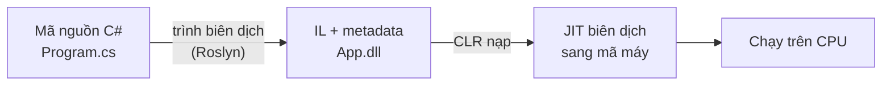

# Chương 1 — Giới thiệu C# và .NET

## Mục tiêu học

Sau chương này, bạn sẽ:

- Phân biệt được **C#** (ngôn ngữ) và **.NET** (nền tảng chạy và thư viện).
- Hiểu SDK, runtime, CLR, BCL là gì và chúng đóng vai trò gì khi bạn viết và chạy chương trình.
- Biết vì sao sách này dùng **.NET hiện đại** (đa nền tảng) và chọn bản LTS.
- Hình dung được lộ trình cả bộ sách: từ console đến web với ASP.NET Core.

## C# là gì, .NET là gì?

- **C#** (đọc "xi-sharp") là một **ngôn ngữ lập trình** hướng đối tượng, kiểu tĩnh, do Microsoft
  thiết kế, hiện là chuẩn mở. Bạn viết code C# trong các file `.cs`.
- **.NET** là **nền tảng** để biên dịch, chạy chương trình và cung cấp sẵn kho thư viện khổng lồ
  (đọc file, gọi mạng, làm web, truy cập CSDL...). Ngoài C#, .NET còn chạy F# và Visual Basic, nhưng
  C# là ngôn ngữ phổ biến nhất.

Hình dung đơn giản: C# là *tiếng bạn nói*, .NET là *môi trường và bộ công cụ* giúp lời bạn nói được
máy tính thực thi.

## Những thuật ngữ bạn sẽ gặp mãi

| Thuật ngữ | Ý nghĩa |
|-----------|---------|
| **SDK** (Software Development Kit) | Bộ công cụ cho người **viết** code: trình biên dịch, lệnh `dotnet`, template project. Cài SDK là đủ để vừa viết vừa chạy. |
| **Runtime** | Phần tối thiểu để **chạy** chương trình đã biên dịch (máy người dùng chỉ cần runtime). |
| **CLR** (Common Language Runtime) | "Động cơ" bên trong runtime: nạp code, quản lý bộ nhớ (garbage collector), biên dịch JIT, kiểm tra an toàn. |
| **BCL** (Base Class Library) | Thư viện chuẩn có sẵn: `System.Console`, `System.IO`, `System.Collections`, `System.Linq`... |
| **NuGet** | Kho thư viện bên thứ ba (như `npm` của JavaScript). Sẽ dùng ở Chương 4. |

## Từ file `.cs` đến chương trình chạy được

1. Trình biên dịch **Roslyn** dịch C# thành **IL** (Intermediate Language) lưu trong file `.dll`.
   IL không phụ thuộc hệ điều hành hay CPU.
2. Khi chạy, **CLR** nạp file `.dll`, và bộ **JIT** (Just-In-Time) dịch IL sang mã máy của đúng
   máy đang chạy.

Nhờ vậy cùng một chương trình `.dll` chạy được trên Windows, macOS và Linux — miễn là máy có
.NET runtime tương ứng.

## .NET hiện đại: một nền tảng duy nhất

Trước đây có nhiều "nhánh" .NET tách rời. Từ **.NET 5** trở đi, Microsoft hợp nhất thành một
nền tảng duy nhất, gọi đơn giản là **.NET**, mã nguồn mở, đa nền tảng, phát hành mỗi năm một bản
lớn vào tháng 11:

- Năm **chẵn**: bản **LTS** (Long-Term Support) — hỗ trợ dài hạn (3 năm), phù hợp học tập và sản
  xuất. Ví dụ .NET 8, **.NET 10**.
- Năm **lẻ**: bản STS — hỗ trợ ngắn hơn.

**Sách này dùng .NET 10 (LTS)** cho toàn bộ code mẫu, và chỉ dạy công nghệ hiện đại. Kiến thức
C# bạn học vẫn đúng với các bản sau; tính năng chỉ có ở phiên bản mới sẽ được ghi chú rõ.

> **Ghi chú phiên bản**: mỗi bản .NET đi kèm một phiên bản C# (.NET 10 ↔ C# 14). Bạn không cần nhớ
> số hiệu — dự án mặc định dùng phiên bản C# phù hợp với `TargetFramework`.

## C# dùng để làm gì?

- **Web & API** với **ASP.NET Core** — trọng tâm Tập 2 và Tập 3 của bộ sách.
- **Dịch vụ nền, công cụ dòng lệnh** (console app, worker service).
- **Ứng dụng đám mây** (Azure, container), **game** (Unity), **AI/ML** với các thư viện .NET...

## Lộ trình bộ sách

| Tập | Nội dung |
|-----|----------|
| **Tập 1** (sách này) | Ngôn ngữ C#, OOP, collection, LINQ, async, I/O, test — viết được ứng dụng console hoàn chỉnh |
| **Tập 2** | ASP.NET Core: Web API, MVC, Razor Pages, Blazor, Entity Framework Core |
| **Tập 3** | Web nâng cao: kiến trúc phân lớp, design pattern, bảo mật, deploy |

## Lỗi thường gặp

- **Nhầm C# với .NET**: khi tìm tài liệu, "C# tutorial" nói về ngôn ngữ, "ASP.NET Core tutorial" nói
  về framework web. Hai thứ bổ trợ nhau, không thay thế nhau.
- **Nhầm SDK với Runtime**: lỗi "You must install .NET to run this application" nghĩa là máy thiếu
  runtime; lỗi "No .NET SDKs were found" nghĩa là thiếu SDK — nếu bạn muốn viết code, hãy cài SDK.
- **Đọc tài liệu cũ**: nhiều bài viết cũ nói về .NET Framework với cách làm khác. Ưu tiên tài liệu
  từ [learn.microsoft.com](https://learn.microsoft.com/dotnet/) và kiểm tra phiên bản.

## Bài tập

1. Tự giải thích bằng lời của bạn: SDK khác runtime ở chỗ nào?
2. Vẽ lại sơ đồ từ file `.cs` đến lúc chương trình chạy, không nhìn sách.
3. Vào trang [dotnet.microsoft.com/download](https://dotnet.microsoft.com/download), tìm phiên bản LTS mới
   nhất và ngày hết hỗ trợ của nó.
