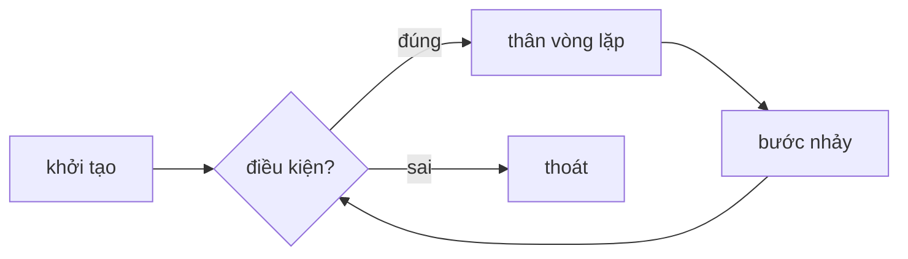

# Chương 8 — Vòng lặp

## Mục tiêu học

Sau chương này, bạn sẽ:

- Dùng `for`, `while`, `do-while`, `foreach` đúng chỗ.
- Điều khiển vòng lặp bằng `break`, `continue`.
- Viết vòng lặp lồng nhau và tránh **vòng lặp vô hạn**.
- Giải được các bài toán kinh điển: tổng chữ số, số nguyên tố, bảng cửu chương.

Code mẫu: [`code/ch08-vong-lap/`](../../code/ch08-vong-lap/).

## `for` — khi biết trước số lần lặp

```csharp
for (int i = 1; i <= 5; i++)
    Console.Write($"{i} ");
// 1 2 3 4 5
```

Ba phần trong ngoặc: **khởi tạo** (chạy một lần) `;` **điều kiện** (kiểm trước mỗi vòng) `;` **bước
nhảy** (chạy sau mỗi vòng). Biến `i` chỉ sống bên trong vòng lặp.



## `while` — lặp khi điều kiện còn đúng

Khi không biết trước số lần lặp:

```csharp
int n = 12345, tong = 0;
while (n > 0)
{
    tong += n % 10;   // lấy chữ số cuối
    n /= 10;          // bỏ chữ số cuối
}
Console.WriteLine(tong);   // 15
```

Điều kiện được kiểm **trước** — có thể thân vòng lặp không chạy lần nào.

## `do-while` — chạy ít nhất một lần

```csharp
int dem = 0;
do
{
    dem++;
} while (dem < 3);
```

Điều kiện kiểm **sau** thân vòng. Hợp với việc "nhập cho đến khi hợp lệ": luôn phải nhập ít nhất một lần.

## `foreach` — duyệt qua tập hợp

```csharp
string[] trai = ["tao", "cam", "xoai"];
foreach (string t in trai)
    Console.WriteLine(t);
```

Gọn nhất khi chỉ cần **đọc** từng phần tử. Không được gán lại biến lặp `t`, và không được thêm/xoá
phần tử của tập đang duyệt (sẽ ném `InvalidOperationException` với `List<T>` — Chương 24). Cần chỉ số
hoặc cần sửa mảng → dùng `for`.

## `break` và `continue`

- `break`: **thoát hẳn** vòng lặp gần nhất.
- `continue`: **bỏ qua** phần còn lại của vòng hiện tại, sang vòng kế.

```csharp
for (int i = 1; i <= 10; i++)
{
    if (i % 2 == 0) continue;   // bỏ số chẵn
    if (i > 7) break;           // dừng khi vượt 7
    Console.Write($"{i} ");     // 1 3 5 7
}
```

## Vòng lặp lồng nhau

```csharp
for (int a = 2; a <= 4; a++)
{
    for (int b = 1; b <= 5; b++)
        Console.Write($"{a}x{b}={a * b,-4}");
    Console.WriteLine();
}
```

Vòng ngoài chạy `m` lần, vòng trong `n` lần → thân chạy `m × n` lần. `break` chỉ thoát vòng **trong
cùng**; muốn thoát nhiều tầng, gói vào một phương thức rồi `return`, hoặc dùng cờ `bool`.

Ví dụ điển hình — in số nguyên tố nhỏ hơn 30:

```csharp
for (int so = 2; so < 30; so++)
{
    bool nguyenTo = true;
    for (int u = 2; u * u <= so; u++)
    {
        if (so % u == 0) { nguyenTo = false; break; }
    }
    if (nguyenTo) Console.Write($"{so} ");
}
```

Điều kiện `u * u <= so` là tối ưu quen thuộc: chỉ cần thử ước đến căn bậc hai.

## Chọn vòng lặp nào?

| Tình huống | Dùng |
|------------|------|
| Biết số lần / cần chỉ số | `for` |
| Duyệt toàn bộ tập hợp, chỉ đọc | `foreach` |
| Lặp đến khi điều kiện sai, số lần chưa biết | `while` |
| Phải chạy ít nhất một lần | `do-while` |

## Lỗi thường gặp

- **Vòng lặp vô hạn**: quên cập nhật biến (`while (n > 0)` mà không giảm `n`). Dừng bằng `Ctrl+C`.
- **Lệch một** (off-by-one): `i <= mang.Length` truy cập ngoài mảng — phải là `i < mang.Length`.
- Sửa tập hợp trong lúc `foreach` → `InvalidOperationException`.
- Khai báo lại biến trùng tên với biến ngoài vòng lặp (`CS0136`).
- Dùng `break` mong thoát cả hai vòng lồng nhau.

## Bài tập

1. In tổng các số từ 1 đến 100; tổng các số chẵn trong đó.
2. Tìm số Fibonacci thứ `n` (không đệ quy).
3. In tam giác sao `*` gồm `n` dòng bằng hai vòng `for` lồng nhau.
4. Yêu cầu người dùng nhập số dương bằng `do-while` + `int.TryParse`, lặp đến khi hợp lệ.
5. Đoán số: máy chọn ngẫu nhiên 1–100 (`Random.Shared.Next(1, 101)`), người chơi đoán và nhận gợi ý cao/thấp.
