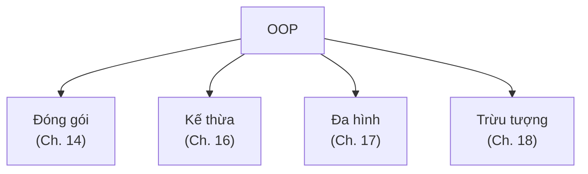

# Chương 12 — Vì sao cần OOP

## Mục tiêu học

Sau chương này, bạn sẽ:

- Thấy được **vấn đề** mà lập trình thủ tục gặp khi chương trình lớn dần.
- Hiểu tư duy hướng đối tượng: **đối tượng = dữ liệu + hành vi**.
- Nắm tổng quan bốn trụ cột: **đóng gói, kế thừa, đa hình, trừu tượng**.
- Biết vài khái niệm nền: class, object, thành viên, thông điệp.

Code mẫu: [`code/ch12-vi-sao-can-oop/`](../../code/ch12-vi-sao-can-oop/).

## Bắt đầu bằng một vấn đề

Ta cần quản lý sinh viên. Cách tự nhiên nhất với những gì đã học:

```csharp
string[] tenSv = ["An", "Binh"];
double[] diemSv = [8.5, 6.0];
```

Chạy được với 2 dữ liệu. Nhưng thử để chương trình lớn lên:

- Thêm *ngày sinh*, *lớp*, *email* → thêm ba mảng, phải sửa **mọi nơi** đang dùng chúng.
- Sắp xếp theo điểm → phải hoán đổi phần tử ở **tất cả** các mảng song song; sót một mảng là dữ liệu lệch.
- Truyền một sinh viên vào phương thức → phải truyền cả đống tham số rời.
- Không có gì ngăn ai đó gán điểm `-5` hay `1000`.

Gốc rễ: **dữ liệu** nằm một nơi, **các hàm xử lý nó** nằm nơi khác, không có ràng buộc giữa chúng.
Đây là *lập trình thủ tục*: chương trình là chuỗi hàm thao tác trên dữ liệu rời rạc.

## Tư duy hướng đối tượng

**Lập trình hướng đối tượng (OOP)** gom **dữ liệu** và **hành vi** liên quan vào cùng một đơn vị gọi là
**đối tượng**:

```csharp
class SinhVien
{
    public string Ten { get; }
    public double Diem { get; }
    public string XepLoai() => Diem switch { >= 8 => "Gioi", >= 5 => "Trung binh", _ => "Yeu" };
}
```

Bây giờ *một sinh viên* là *một thứ*. Danh sách sinh viên là `List<SinhVien>`; sắp xếp một danh sách duy
nhất; thêm thuộc tính chỉ sửa trong class; và class tự bảo vệ dữ liệu của mình (Chương 14).

### Class và Object

- **Class** (lớp) là *bản thiết kế/khuôn*: mô tả một loại đối tượng có dữ liệu gì, làm được gì.
- **Object** (đối tượng, còn gọi *instance*) là *sản phẩm cụ thể* tạo từ khuôn: sinh viên "An", sinh viên "Binh".

Khuôn bánh (class) và những chiếc bánh (object): một khuôn, nhiều bánh, mỗi bánh có nhân riêng (dữ liệu riêng)
nhưng cùng hình dạng và cùng cách ăn (hành vi).

### Thành viên của class

| Thành viên | Vai trò | Ví dụ |
|-----------|---------|-------|
| **Field / Property** | dữ liệu (trạng thái) | `Ten`, `Diem` |
| **Method** | hành vi | `XepLoai()` |
| **Constructor** | khởi tạo đối tượng | `new SinhVien("An", 8.5)` |

Chương trình OOP là tập các đối tượng **gửi thông điệp** cho nhau (gọi phương thức) để cùng hoàn thành công việc.

## Bốn trụ cột của OOP

Sẽ học chi tiết ở các chương sau; đây là bức tranh tổng quan:



1. **Đóng gói (Encapsulation)** — giấu chi tiết bên trong, chỉ để lộ giao diện cần thiết; đối tượng tự
   bảo vệ tính hợp lệ của dữ liệu. *Ví dụ:* tài khoản ngân hàng không cho ai gán thẳng `SoDu = 1 tỷ`, chỉ cho
   `NapTien()`, `RutTien()` có kiểm tra.
2. **Kế thừa (Inheritance)** — class con nhận lại mọi thứ của class cha rồi bổ sung/chỉnh sửa; tái sử dụng
   code và mô hình quan hệ "là một" (`SinhVien` là một `Nguoi`).
3. **Đa hình (Polymorphism)** — cùng một lời gọi, đối tượng khác nhau phản ứng khác nhau. `hinh.DienTich()` đúng
   cho cả hình tròn, hình chữ nhật, tam giác.
4. **Trừu tượng (Abstraction)** — tập trung vào *cái gì* thay vì *làm thế nào*: dùng `interface`/`abstract` để
   mô tả hợp đồng mà không quan tâm cài đặt.

## OOP giúp ích gì? Và khi nào không?

**Lợi ích:** mô hình hoá thế giới thực tự nhiên; code dễ **bảo trì**, **tái sử dụng**, **mở rộng**; nhiều người
cùng làm trên các class khác nhau; kiểm thử từng đối tượng riêng lẻ.

**Lưu ý:** OOP không phải viên đạn bạc. Thiết kế class dở (quá nhiều tầng kế thừa, class "thần thánh" ôm mọi
việc) còn tệ hơn code thủ tục. C# hỗ trợ nhiều phong cách — thủ tục, hướng đối tượng, hàm (LINQ, lambda). Ta sẽ
dùng chúng phối hợp: OOP để tổ chức chương trình, hàm để xử lý dữ liệu gọn gàng.

## Cách nghĩ khi thiết kế class

1. Xác định **danh từ** trong bài toán → ứng viên class (sinh viên, tài khoản, đơn hàng).
2. Xác định **thuộc tính** của mỗi danh từ → field/property.
3. Xác định **động từ** → phương thức thuộc về đối tượng nào sở hữu dữ liệu tương ứng.
4. Xác định **quan hệ**: "có một" (đơn hàng *có* nhiều dòng hàng) hay "là một" (xe hơi *là một* phương tiện).

## Lỗi tư duy thường gặp

- Coi class như "túi đựng hàm" — không có dữ liệu, chỉ có hàm tĩnh (đó vẫn là lập trình thủ tục).
- Public mọi thứ, để bên ngoài tuỳ ý sửa dữ liệu.
- Nhầm class và object ("tạo class" ≠ "tạo object").
- Lạm dụng kế thừa khi chỉ cần "có một" (composition) — Chương 16 sẽ nói kỹ.

## Bài tập

1. Với bài toán *quản lý thư viện*, liệt kê ít nhất 4 class, mỗi class 3 thuộc tính và 2 hành vi.
2. Vẽ (giấy hoặc Mermaid) quan hệ giữa `DocGia`, `Sach`, `PhieuMuon`.
3. Mở code mẫu, thêm thuộc tính `Lop` cho `SinhVien`: đếm số chỗ phải sửa ở cách thủ tục và cách OOP.
4. Tìm ba vật quanh bạn (điện thoại, xe máy, cốc nước) và mô tả bằng class: dữ liệu + hành vi.
