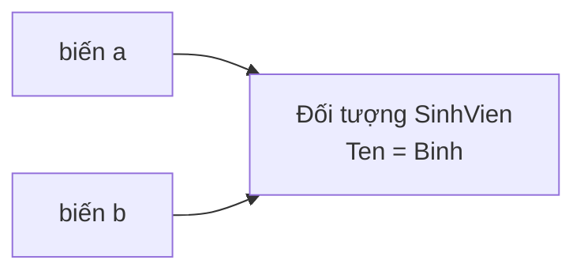

# Chương 13 — Class và Object

## Mục tiêu học

Sau chương này, bạn sẽ:

- Định nghĩa class với **field**, **constructor**, **phương thức** và tạo object bằng `new`.
- Hiểu `this`, thành viên `static`, và object initializer.
- Phân biệt **kiểu tham chiếu** (class) với **kiểu giá trị**; hiểu vì sao `b = a` không sao chép đối tượng.
- Hiểu `null`, và so sánh hai đối tượng.

Code mẫu: [`code/ch13-class-object/`](../../code/ch13-class-object/).

## Định nghĩa class

```csharp
public class HinhChuNhat
{
    public double Rong;      // field
    public double Cao;

    public HinhChuNhat(double rong, double cao)   // constructor
    {
        Rong = rong;
        Cao = cao;
    }

    public double DienTich() => Rong * Cao;      // phương thức
    public double ChuVi() => 2 * (Rong + Cao);
}
```

- **Field**: biến khai báo trong class, mỗi đối tượng có bản riêng.
- **Constructor**: phương thức đặc biệt — cùng tên class, không có kiểu trả về, chạy khi `new`.
- **Phương thức** thuộc class truy cập trực tiếp field của đối tượng đang gọi nó.

Quy ước: mỗi class một file `.cs` cùng tên (`HinhChuNhat.cs`).

## Tạo và dùng object

```csharp
var h1 = new HinhChuNhat(3, 4);
Console.WriteLine(h1.DienTich());   // 12
h1.Rong = 10;                        // truy cập field bằng dấu chấm
```

`new` cấp phát bộ nhớ, gọi constructor và trả về **tham chiếu** tới đối tượng. Mỗi `new` tạo một đối tượng
mới, độc lập.

### Nhiều constructor

```csharp
public HinhChuNhat() : this(1, 1) { }   // gọi constructor kia, tránh lặp code
```

Nếu không viết constructor nào, C# cung cấp constructor mặc định (không tham số). **Khi bạn tự viết bất kỳ
constructor nào**, constructor mặc định *không* còn được tạo tự động.

### Object initializer

```csharp
var h3 = new HinhChuNhat { Rong = 5, Cao = 2 };
```

Gán field/property ngay sau `new` (yêu cầu class có constructor không tham số và field/property truy cập được).

## Từ khoá `this`

`this` là tham chiếu tới **đối tượng hiện tại**. Dùng khi tên tham số trùng tên field:

```csharp
public void DoiTen(string ten) => this.Ten = ten;   // this.Ten là field, ten là tham số
```

hoặc để truyền chính đối tượng đi nơi khác (`danhSach.Add(this)`), hoặc gọi constructor khác (`: this(...)`).

## Thành viên `static`

Thành viên `static` thuộc về **class**, không thuộc đối tượng nào; gọi qua tên class.

```csharp
public class SinhVien
{
    private static int demSo = 0;                    // chung cho mọi đối tượng
    public static int TongSoSinhVien => demSo;

    public int Ma;
    public SinhVien() { demSo++; Ma = demSo; }
}

Console.WriteLine(SinhVien.TongSoSinhVien);
```

Phương thức `static` **không** có `this` nên không truy cập được thành viên thường. Dùng `static` cho tiện ích
không phụ thuộc trạng thái (`Math.Max`, `int.Parse`) và bộ đếm dùng chung; đừng lạm dụng như biến toàn cục.

## Class là kiểu tham chiếu

Đây là ý quan trọng nhất của chương:

```csharp
var a = new SinhVien("An", 8);
var b = a;                 // b trỏ CÙNG đối tượng, không có bản sao nào
b.DoiTen("Binh");
Console.WriteLine(a.Ten);  // "Binh"
```



Biến kiểu class chứa **địa chỉ** của đối tượng nằm trên heap. Gán `b = a` chỉ sao chép địa chỉ. Muốn bản sao
thật phải tự tạo đối tượng mới (`new SinhVien(a.Ten, a.Diem)`).

Ngược lại `int`, `double`, `bool`, `struct` là **kiểu giá trị**: gán là sao chép dữ liệu.

Hệ quả khi truyền đối tượng vào phương thức: phương thức nhận bản sao của *tham chiếu* → sửa được **nội dung**
đối tượng của người gọi.

## `null` và `NullReferenceException`

Biến tham chiếu có thể chưa trỏ đâu cả: `null`.

```csharp
SinhVien? khongCo = null;
Console.WriteLine(khongCo.Ten);       // NullReferenceException!
Console.WriteLine(khongCo?.Ten);      // an toàn: in rỗng
```

`NullReferenceException` là lỗi phổ biến nhất của người mới. Dấu `?` sau kiểu (`SinhVien?`) báo "có thể null"
để trình biên dịch giúp bạn kiểm tra (Chương 23).

## So sánh đối tượng

```csharp
var d1 = new SinhVien("Dung", 7);
var d2 = new SinhVien("Dung", 7);
Console.WriteLine(d1 == d2);   // False: mặc định so sánh THAM CHIẾU (có phải cùng một đối tượng?)
```

Muốn hai đối tượng "bằng nhau" khi cùng nội dung, phải tự định nghĩa (`Equals`, hoặc dùng `record` — Chương 20).

## `ToString()`

Mọi đối tượng đều có `ToString()`. Mặc định trả về tên kiểu; override để in đẹp:

```csharp
public override string ToString() => $"HCN {Rong} x {Cao}";
Console.WriteLine(h1);   // WriteLine tự gọi ToString()
```

(`override` sẽ giải thích ở Chương 16.)

## Lỗi thường gặp

- `NullReferenceException`: dùng đối tượng chưa `new` hoặc đang `null`.
- `CS7036: There is no argument given that corresponds to the required parameter` — gọi `new X()` nhưng class chỉ có
  constructor có tham số.
- Nhầm rằng `b = a` là sao chép.
- Gọi phương thức thường từ `static` mà không có đối tượng (`CS0120`).
- Quên `new` khi tạo mảng đối tượng: `new SinhVien[3]` tạo 3 ô `null`, chưa có đối tượng nào.
- So sánh hai đối tượng bằng `==` mong so sánh nội dung.

## Bài tập

1. Viết class `HinhTron` (bán kính) với `DienTich()`, `ChuVi()`, và `ToString()`.
2. Viết class `PhanSo` (tử, mẫu) với `Cong(PhanSo other)` trả `PhanSo` mới (chưa cần rút gọn).
3. Thêm bộ đếm `static` vào `HinhTron` để biết đã tạo bao nhiêu hình.
4. Tạo mảng 3 `SinhVien`, sửa một phần tử qua tham chiếu thứ hai, quan sát mảng.
5. Viết phương thức `SinhVien Sao()` tạo bản sao độc lập của một sinh viên.
