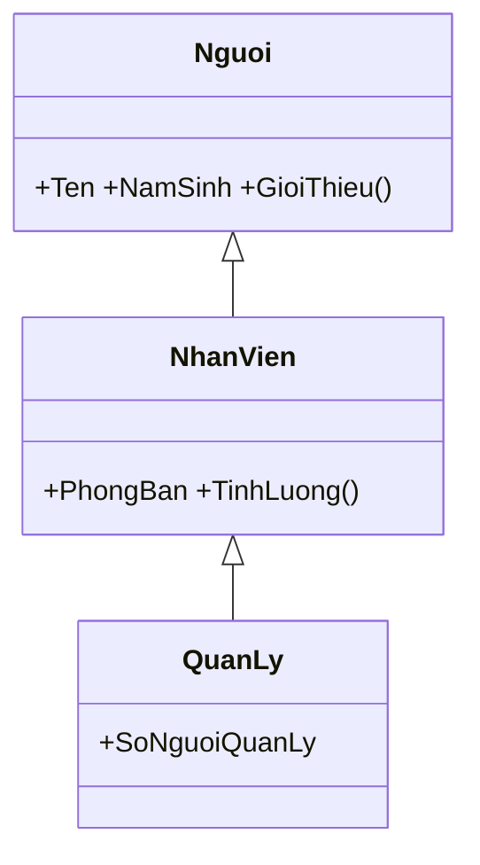

# Chương 16 — Kế thừa

## Mục tiêu học

Sau chương này, bạn sẽ:

- Dùng kế thừa (`:`) để tái sử dụng code và mô hình quan hệ **"là một"** (is-a).
- Gọi constructor lớp cha bằng `base`, hiểu **thứ tự khởi tạo**.
- Phân biệt `virtual`/`override`, `new` (che giấu), `sealed`, `protected`.
- Biết khi nào nên dùng **composition** ("có một") thay vì kế thừa.

Code mẫu: [`code/ch16-ke-thua/`](../../code/ch16-ke-thua/).

## Kế thừa là gì?

Lớp con **nhận lại** mọi thành viên (không `private`) của lớp cha rồi thêm hoặc điều chỉnh. Cú pháp `class Con : Cha`.

```csharp
class Nguoi
{
    public string Ten { get; }
    public int NamSinh { get; }
    public Nguoi(string ten, int namSinh) { Ten = ten; NamSinh = namSinh; }
    public virtual string GioiThieu() => $"Toi la {Ten}, sinh nam {NamSinh}";
}

class NhanVien : Nguoi
{
    public string PhongBan { get; }
    public NhanVien(string ten, int namSinh, string phongBan) : base(ten, namSinh)
        => PhongBan = phongBan;
}
```



`NhanVien` có sẵn `Ten`, `NamSinh`, `GioiThieu()` mà không viết lại. Mỗi lớp chỉ **một lớp cha trực tiếp**
(C# không đa kế thừa lớp), nhưng chuỗi cha–con–cháu tuỳ ý. Mọi class cuối cùng đều kế thừa `object`.

**Kiểm tra bằng câu "là một":** "Nhân viên *là một* người" ✔ → kế thừa hợp lý. "Xe hơi *là một* động cơ" ✘ → sai.

## `base` và thứ tự constructor

Constructor của lớp con **bắt buộc gọi** constructor lớp cha (trước tiên) để cha khởi tạo phần của nó:

```csharp
public NhanVien(string ten, int namSinh, string phongBan) : base(ten, namSinh)
```

Thứ tự thực thi khi `new QuanLy(...)`: `Nguoi` → `NhanVien` → `QuanLy` (cha trước, con sau). Chạy code mẫu để thấy
dòng in theo đúng thứ tự đó. Nếu lớp cha chỉ có constructor có tham số mà con không viết `: base(...)` → `CS7036`.

`base.TenPhuongThuc()` gọi phiên bản của cha từ trong con:

```csharp
public override string GioiThieu() => $"{base.GioiThieu()}, phong {PhongBan}";
```

## `virtual` và `override`

Để lớp con **thay đổi hành vi** của phương thức cha:

- Cha đánh dấu `virtual` (cho phép ghi đè).
- Con dùng `override` (ghi đè).

```csharp
public virtual decimal TinhLuong() => LuongCoBan;                            // NhanVien
public override decimal TinhLuong() => LuongCoBan + SoNguoiQuanLy * 2_000_000m;   // QuanLy
```

Phương thức không `virtual` thì không ghi đè được. Property cũng có thể `virtual/override`.
`abstract` (Chương 18) là dạng `virtual` bắt buộc con phải ghi đè.

**Override khác overload:** *overload* = cùng tên khác tham số trong một class (Chương 10);
*override* = con viết lại phương thức cùng chữ ký của cha.

## `new` — che giấu, không phải ghi đè

```csharp
class Cha { public virtual string Ma() => "Cha.Ma"; public string Ten() => "Cha.Ten"; }
class Con : Cha
{
    public override string Ma() => "Con.Ma";
    public new string Ten() => "Con.Ten";
}

Cha cha = new Con();
cha.Ma();    // "Con.Ma"  — override: quyết định theo đối tượng THẬT
cha.Ten();   // "Cha.Ten" — new: quyết định theo KIỂU KHAI BÁO
```

`new` tạo ra một phương thức mới *che* phương thức cha; gọi qua biến kiểu cha vẫn ra bản cha. Đây hầu như luôn là
bẫy — nếu muốn thay đổi hành vi, hãy dùng `virtual/override`. Nếu quên `new`, trình biên dịch cảnh báo `CS0108`.

## `protected` và `sealed`

- `protected`: thành viên lớp con truy cập được nhưng bên ngoài thì không. Ví dụ `LuongCoBan` trong `NhanVien`.
  Đừng lạm dụng — mọi `protected` là một phần giao diện với lớp con, khó đổi về sau.
- `sealed class X` cấm kế thừa `X`; `sealed override` cấm con của con ghi đè tiếp. Nên `sealed` các class không
  được thiết kế để kế thừa (giúp an toàn và tối ưu).

## Composition thay vì kế thừa

Kế thừa gắn chặt con với cha: đổi cha là ảnh hưởng mọi con; cây kế thừa sâu rất khó hiểu. Lời khuyên nổi tiếng:
**"ưu tiên composition hơn kế thừa"** — quan hệ **"có một"**:

```csharp
class XeHoi
{
    private readonly DongCo _dongCo = new();
    public void Chay() { _dongCo.Khoi(); Console.WriteLine("Xe dang chay"); }
}
```

`XeHoi` *có một* `DongCo` và giao việc cho nó; đổi loại động cơ không ảnh hưởng cây kế thừa của xe. Dùng kế thừa
khi thật sự là quan hệ "là một" *và* muốn đa hình; còn để tái sử dụng code thì composition (và interface, Chương 18)
thường linh hoạt hơn.

## Lỗi thường gặp

- `CS7036` — quên gọi `: base(...)` khi lớp cha không có constructor mặc định.
- Quên `virtual` ở cha rồi thắc mắc vì sao `override` báo lỗi `CS0506`.
- Dùng `new` (che giấu) mà tưởng đã override: kết quả khác nhau tuỳ kiểu khai báo.
- Cây kế thừa quá sâu (> 3 tầng) hoặc kế thừa chỉ để lấy vài hàm tiện ích.
- Kế thừa sai quan hệ (`Hinh vuong : HinhChuNhat` có vấn đề khi lớp con cho phép sửa riêng chiều rộng — vi phạm
  nguyên lý Liskov, Chương 42).

## Bài tập

1. Tạo `PhuongTien` → `XeMay`, `OTo`; mỗi loại có `TinhPhiDangKy()` khác nhau (`virtual/override`).
2. Trong code mẫu, thêm `class GiamDoc : QuanLy`. Đoán thứ tự dòng in khi tạo `GiamDoc` rồi chạy kiểm tra.
3. Đổi `Ma()` thành không `virtual` (bỏ `override`, dùng `new`), quan sát kết quả `cha.Ma()`.
4. Đánh dấu `QuanLy` là `sealed` rồi thử tạo lớp kế thừa nó — đọc thông báo lỗi.
5. Viết lại ví dụ `XeHoi` bằng kế thừa sai (`XeHoi : DongCo`) và nêu vì sao thiết kế đó tệ.
