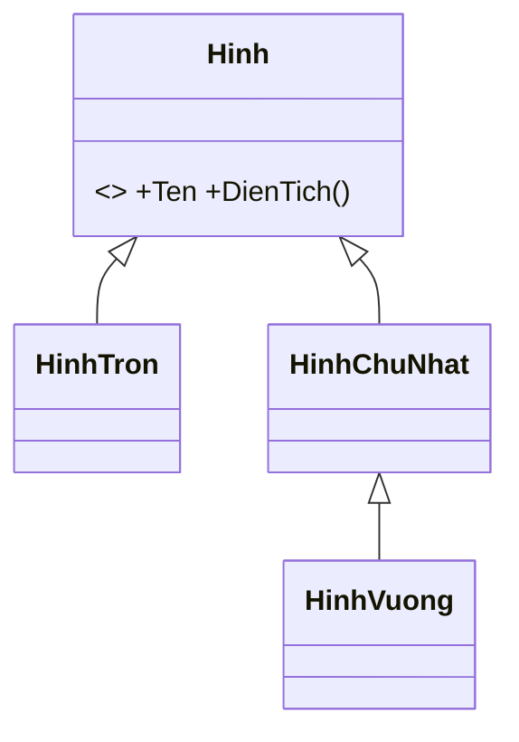

# Chương 17 — Đa hình

## Mục tiêu học

Sau chương này, bạn sẽ:

- Hiểu **đa hình (polymorphism)**: một lời gọi, nhiều hành vi tuỳ đối tượng thật.
- Dùng **upcasting/downcasting**, `is`, `as` và pattern matching để làm việc với kiểu con.
- Hiểu cơ chế **liên kết động** (dynamic dispatch) ở mức khái niệm.
- Viết code "mở" cho mở rộng: thêm kiểu mới không phải sửa code cũ.

Code mẫu: [`code/ch17-da-hinh/`](../../code/ch17-da-hinh/).

## Đa hình là gì?

**Đa hình** = "nhiều hình dạng". Khi đã có kế thừa, ta có thể dùng biến **kiểu cha** để trỏ tới đối tượng **kiểu con**,
và phương thức `virtual` sẽ chạy phiên bản **của đối tượng thật**:

```csharp
Hinh[] cacHinh = [new HinhTron(2), new HinhChuNhat(3, 4), new HinhVuong(5)];

foreach (Hinh h in cacHinh)
    Console.WriteLine($"{h.Ten}: {h.DienTich():F2}");
```

Vòng lặp chỉ biết `Hinh`, không biết hình cụ thể là gì, nhưng `h.DienTich()` vẫn tính đúng theo từng loại.



### Vì sao đây là sức mạnh lớn?

Giả sử thêm `HinhTamGiac`: chỉ cần viết class mới kế thừa `Hinh`. Vòng lặp, hàm `Sum`, mọi nơi nhận `Hinh` **không
phải sửa dòng nào**. Nếu dùng chuỗi `if (h is HinhTron) ... else if ...` ở khắp nơi, mỗi lần thêm hình phải sửa hết mọi chỗ.
Đây là nguyên lý **mở để mở rộng, đóng để sửa đổi** (Open/Closed, Chương 42).

## Upcasting và downcasting

```csharp
Hinh hinh = new HinhVuong(2);   // upcasting: con -> cha. Luôn an toàn, ngầm định
```

- **Upcasting** (con → cha): tự động, an toàn (mọi hình vuông đều là hình).
- **Downcasting** (cha → con): phải tường minh và **có thể thất bại** (một `Hinh` chưa chắc là `HinhTron`).

```csharp
HinhTron t = (HinhTron)hinh;       // InvalidCastException nếu sai!
```

Ba cách kiểm tra an toàn:

```csharp
// 1. as: trả về null nếu không ép được
HinhTron? tron = hinh as HinhTron;
if (tron != null) { ... }

// 2. is + biến mẫu: kiểm tra và ép trong một bước (nên dùng)
if (hinh is HinhChuNhat hcn)
    Console.WriteLine($"{hcn.Rong} x {hcn.Cao}");

// 3. switch pattern
string mota = h switch
{
    HinhVuong v => $"vuong canh {v.Rong}",
    HinhChuNhat r => $"chu nhat {r.Rong}x{r.Cao}",
    HinhTron t => $"tron ban kinh {t.BanKinh}",
    _ => "khac",
};
```

**Thứ tự nhánh quan trọng:** `HinhVuong` kế thừa `HinhChuNhat`, nên phải đặt nhánh `HinhVuong` **trước**; nếu không,
nhánh `HinhChuNhat` sẽ "nuốt" luôn hình vuông (trình biên dịch thường báo lỗi vì nhánh sau không bao giờ đạt tới).

`hinh.GetType()` cho kiểu **thật** lúc chạy; kiểu **khai báo** là kiểu của biến (`Hinh`).

## Liên kết động — chuyện gì xảy ra bên dưới?

Khi gọi phương thức `virtual` qua biến kiểu cha, CLR không quyết định lúc biên dịch mà **lúc chạy**, dựa vào kiểu thật
của đối tượng (thông qua bảng phương thức ảo — *vtable* — mỗi kiểu giữ). Đó là **liên kết động** (dynamic dispatch / late
binding). Ngược lại phương thức không `virtual` (và `new`) được quyết định theo **kiểu khai báo** (Chương 16).

Chi phí của `virtual` rất nhỏ; đừng tránh nó vì lý do hiệu năng trừ khi đã đo được vấn đề.

## Đa hình không chỉ có kế thừa

Các dạng thường gặp trong C#:

1. **Đa hình lớp con** (chương này): kế thừa + `virtual/override`.
2. **Đa hình qua interface** (Chương 18): nhiều class không liên quan cùng cài đặt một interface.
3. **Đa hình tham số** (generics, Chương 22): cùng một code cho nhiều kiểu.
4. (Overloading là "đa hình lúc biên dịch" — quyết định theo kiểu khai báo.)

## Cách viết code đa hình tốt

- Nhận tham số và trả về bằng kiểu **trừu tượng** (`Hinh`, `IThanhToan`) thay vì kiểu cụ thể.
- Tránh chuỗi `if (x is A) ... else if (x is B)` lặp lại ở nhiều nơi — dấu hiệu nên chuyển hành vi vào phương thức
  ảo của chính lớp đó.
- Dùng pattern matching khi *không sở hữu* các lớp (thư viện ngoài) hoặc hành vi thuộc về nơi xử lý, không thuộc lớp.

## Lỗi thường gặp

- `InvalidCastException` do downcasting sai — dùng `is`/`as`.
- `NullReferenceException` khi dùng kết quả `as` mà quên kiểm tra `null`.
- Nhánh `switch`/`is` tổng quát đặt trước nhánh cụ thể hơn.
- Quên `virtual` ở lớp cha nên `override` không có tác dụng như mong đợi (hoặc dùng `new` nhầm).
- Gọi phương thức chỉ có ở lớp con qua biến kiểu cha mà không ép kiểu (`CS1061`).

## Bài tập

1. Thêm `HinhTamGiac` (đáy, cao) vào code mẫu. Có phải sửa vòng lặp `foreach` không?
2. Tạo `DongVat` (abstract, `KeuLen()`), `Cho`, `Meo`, `Vit`; đặt vào `List<DongVat>` và gọi `KeuLen()` cho tất cả.
3. Với danh sách `object` chứa số, chuỗi, mảng, null — dùng `switch` pattern để mô tả từng phần tử.
4. Giải thích vì sao đoạn sau ném lỗi, sửa bằng `is`: `Hinh h = new HinhVuong(1); var t = (HinhTron)h;`.
5. Đổi vị trí hai nhánh `HinhVuong` và `HinhChuNhat` trong `switch` và đọc thông báo của trình biên dịch.
