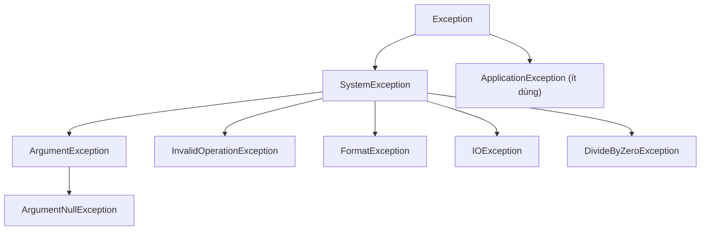

# Chương 21 — Xử lý ngoại lệ

## Mục tiêu học

Sau chương này, bạn sẽ:

- Hiểu **exception** là gì và vì sao dùng nó thay cho mã lỗi trả về.
- Dùng `try / catch / finally`, nhiều `catch`, **exception filter** (`when`).
- Biết `throw` và `throw;` khác nhau thế nào; tạo **custom exception**.
- Dùng `using` để giải phóng tài nguyên; kiểm tra tham số bằng `ThrowIfNull`...
- Nắm nguyên tắc: khi nào bắt, khi nào để lỗi nổi lên.

Code mẫu: [`code/ch21-exception/`](../../code/ch21-exception/).

## Exception là gì?

Khi có sự cố lúc chạy (chia cho 0, file không tồn tại, mạng đứt), .NET **ném (throw)** một đối tượng ngoại lệ.
Nếu không ai bắt, ngoại lệ "nổi" ngược lên chuỗi lời gọi (call stack) và cuối cùng **làm chương trình sập**.

```csharp
int so = int.Parse("abc");   // FormatException — chương trình dừng nếu không xử lý
```

Ưu điểm so với trả mã lỗi: lỗi không thể bị **lặng lẽ bỏ qua**, và code xử lý lỗi tách khỏi luồng chạy bình thường.

Mọi ngoại lệ kế thừa `System.Exception`. Các thuộc tính quan trọng: `Message`, `StackTrace`, `InnerException`.



## `try / catch / finally`

```csharp
try
{
    // code có thể ném lỗi
}
catch (FormatException e)
{
    // xử lý riêng cho FormatException
}
finally
{
    // luôn chạy: dù có lỗi hay không, kể cả khi return
}
```

- Có thể có **nhiều `catch`**; CLR chọn cái **đầu tiên khớp**, nên đặt kiểu **cụ thể trước, tổng quát sau**
  (`catch (Exception)` phải đứng cuối; sai thứ tự là lỗi biên dịch).
- `finally` dùng để dọn dẹp (đóng file, giải phóng kết nối). Nhưng thường `using` (bên dưới) gọn hơn.
- `try` phải đi kèm ít nhất một `catch` hoặc `finally`.

## Ném ngoại lệ và custom exception

```csharp
if (soLuong > tonKho) throw new KhongDuHangException(soLuong, tonKho);
```

Tự định nghĩa ngoại lệ khi cần **mang thêm thông tin nghiệp vụ** và cho phép bên gọi bắt chính xác:

```csharp
class KhongDuHangException(int soCan, int soCon)
    : Exception($"Khong du hang: can {soCan}, con {soCon}")
{
    public int SoCan { get; } = soCan;
    public int SoCon { get; } = soCon;
}
```

Quy ước: tên kết thúc bằng `Exception`, kế thừa `Exception` (không phải `ApplicationException`).

## Exception filter — `when`

```csharp
catch (HttpLoi e) when (e.MaLoi is >= 400 and < 500)
{
    Console.WriteLine($"Loi client {e.MaLoi}");
}
```

Chỉ bắt khi điều kiện đúng; nếu sai, ngoại lệ đi tiếp như chưa từng gặp `catch` này (và **giữ nguyên stack trace**).
Tốt hơn việc bắt rồi `if ... else throw`.

## Ném lại: `throw;` và `throw e;`

```csharp
catch (Exception)
{
    GhiLog(...);
    throw;        // ĐÚNG: giữ nguyên stack trace gốc
    // throw e;   // SAI: reset stack trace, mất dấu nơi lỗi thật sự xảy ra
}
```

Muốn thêm ngữ cảnh, bọc ngoại lệ gốc vào `InnerException`:

```csharp
catch (FormatException ex)
{
    throw new ApplicationException("Doc cau hinh that bai", ex);   // giữ nguyên nhân gốc
}
```

## `using` — giải phóng tài nguyên

Đối tượng giữ tài nguyên ngoài (file, kết nối, socket) cài đặt `IDisposable`. `using` bảo đảm gọi `Dispose()`
ngay cả khi có lỗi:

```csharp
using var tn = new TaiNguyen("ket noi DB");   // Dispose() chạy khi ra khỏi phạm vi
// hoặc dạng khối:
using (var tn2 = new TaiNguyen("x")) { ... }
```

`using` chính là `try/finally` viết gọn. Với tài nguyên bất đồng bộ dùng `await using` (Chương 33).
Tự viết class quản lý tài nguyên thì cài `IDisposable`.

## Kiểm tra tham số đầu vào (guard clause)

```csharp
static void ChaoHoi(string ten)
{
    ArgumentNullException.ThrowIfNull(ten);
    ArgumentException.ThrowIfNullOrWhiteSpace(ten);
    ArgumentOutOfRangeException.ThrowIfNegative(tuoi);
    ...
}
```

Kiểm tra ở **đầu** phương thức, ném lỗi ngay khi tham số sai — lỗi lộ ra sớm, gần nguyên nhân.

## Nguyên tắc dùng exception

1. **Chỉ dùng cho tình huống bất thường**, không dùng để điều khiển luồng thường: kiểm tra trước (`TryParse`,
   `ContainsKey`) hơn là bắt `FormatException`/`KeyNotFoundException`. Ném/bắt exception chậm hơn nhiều.
2. **Chỉ bắt khi biết cách xử lý**. Nếu không xử lý được, để nó nổi lên tới nơi có thể (ở web: middleware xử lý lỗi toàn cục).
3. **Không bắt rồi nuốt lặng lẽ** (`catch { }`): lỗi biến mất mà không ai biết.
4. **Bắt kiểu cụ thể**, tránh `catch (Exception)` trừ ở "ranh giới" chương trình (ghi log, trả lỗi 500).
5. Thông báo lỗi nói **cái gì sai và dữ liệu liên quan**, không chỉ "Lỗi".
6. Dùng đúng kiểu có sẵn: `ArgumentException` (tham số sai), `InvalidOperationException` (trạng thái không cho phép),
   `NotSupportedException`, `NotImplementedException` (chưa viết)...

## Lỗi thường gặp

- `CS0160: A previous catch clause already catches all exceptions` — `catch` tổng quát đặt trước `catch` cụ thể.
- `throw e;` làm mất stack trace.
- `catch (Exception) { }` nuốt lỗi.
- Dùng exception cho luồng bình thường (vòng lặp bắt `FormatException` thay vì `TryParse`).
- `return` trong `finally` làm nuốt ngoại lệ — tránh.
- Quên `Dispose` (rò rỉ kết nối/file) — dùng `using`.
- `StackOverflowException`/`OutOfMemoryException` không nên (và thường không thể) bắt.

## Bài tập

1. Viết chương trình đọc số từ bàn phím, chia 100 cho số đó, xử lý riêng `FormatException` và `DivideByZeroException`.
2. Tạo `TaiKhoanKhongDuTienException` mang theo số dư hiện tại và số tiền cần rút; dùng trong `TaiKhoan.RutTien` (Chương 14).
3. Viết class `KetNoi : IDisposable` in ra khi mở/đóng; dùng `using` và cố tình ném lỗi giữa chừng — Dispose có chạy?
4. Thay `throw;` thành `throw e;` trong ví dụ và so sánh stack trace bằng `e.StackTrace`.
5. Viết phương thức `TryChia(int a, int b, out int kq)` trả `bool` thay vì ném lỗi; khi nào nên chọn kiểu này?
