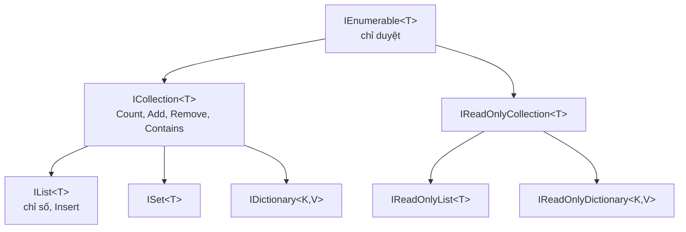

# Chương 24 — Tổng quan collection

## Mục tiêu học

Sau chương này, bạn sẽ:

- Biết các collection chính của .NET và **khi nào chọn cái nào**.
- Nắm khái niệm **độ phức tạp** (Big-O) ở mức đủ dùng để so sánh collection.
- Hiểu hệ thống interface: `IEnumerable<T>`, `ICollection<T>`, `IList<T>`, `IDictionary<K,V>`, `IReadOnly...`.
- Dùng `List<T>`, `Dictionary<K,V>`, `HashSet<T>`, `Queue<T>`, `Stack<T>` cơ bản.

Code mẫu: [`code/ch24-tong-quan-collection/`](../../code/ch24-tong-quan-collection/).

## Vì sao cần collection?

Mảng có kích thước cố định và ít thao tác. Chương trình thật cần cấu trúc **co giãn**, **tra cứu nhanh**, **loại
trùng**, **xếp hàng**... Không gian tên `System.Collections.Generic` cung cấp sẵn các cấu trúc đó dưới dạng **generic**
(Chương 22) — an toàn kiểu, không boxing. (Các collection không generic cũ như `ArrayList`, `Hashtable` đã lỗi thời: đừng dùng.)

## Bản đồ nhanh: chọn collection nào?

| Cần | Dùng | Ghi chú |
|-----|------|---------|
| Danh sách có thứ tự, truy cập theo chỉ số | `List<T>` | lựa chọn mặc định |
| Tra cứu giá trị theo khoá | `Dictionary<K,V>` | O(1) trung bình |
| Tập hợp không trùng, kiểm tra "có chưa?" | `HashSet<T>` | O(1) trung bình |
| Hàng đợi vào trước ra trước (FIFO) | `Queue<T>` | `Enqueue`/`Dequeue` |
| Ngăn xếp vào sau ra trước (LIFO) | `Stack<T>` | `Push`/`Pop` |
| Tự động sắp xếp theo khoá | `SortedDictionary`, `SortedSet`, `SortedList` | O(log n) |
| Chèn/xoá giữa nhiều, đã có node | `LinkedList<T>` | hiếm dùng |
| Chỉ đọc, không cho ai sửa | `IReadOnlyList<T>`, `ImmutableList<T>` | Chương 14 |
| Đa luồng | `ConcurrentDictionary`, `ConcurrentQueue`... | Chương 34 |

**Quy tắc thực dụng:** dùng `List<T>` nếu không có lý do khác; cần "tìm theo khoá" → `Dictionary`; cần "có/không" trên
tập lớn → `HashSet`.

## Độ phức tạp thời gian (Big-O) — đủ dùng

**Big-O** mô tả thời gian chạy tăng thế nào khi số phần tử `n` tăng:

| Ký hiệu | Tên | `n = 1.000.000` cỡ | Ví dụ |
|---------|-----|--------------------|-------|
| O(1) | hằng số | 1 bước | `list[i]`, `dict[key]` |
| O(log n) | logarit | ~20 bước | tìm nhị phân, `SortedSet` |
| O(n) | tuyến tính | 1 triệu bước | duyệt `List`, `list.Contains` |
| O(n log n) | | ~20 triệu | sắp xếp |
| O(n²) | bình phương | 1 nghìn tỷ | hai vòng lặp lồng nhau |

Bảng thao tác điển hình:

| | `List<T>` | `LinkedList<T>` | `Dictionary` | `HashSet` | `SortedSet` |
|---|---|---|---|---|---|
| Truy cập theo chỉ số | O(1) | O(n) | — | — | — |
| Tìm giá trị / `Contains` | O(n) | O(n) | O(1) | O(1) | O(log n) |
| Thêm cuối | O(1)* | O(1) | O(1)* | O(1)* | O(log n) |
| Chèn/xoá giữa | O(n) | O(1)** | — | — | — |

\* trung bình (đôi khi phải cấp phát lại — Chương 25). \*\* khi đã có sẵn node.

Chương trình mẫu đo trực tiếp: 1000 lần `Contains` trên 100.000 phần tử — `List` chậm hơn `HashSet` hàng trăm lần.
Chọn sai collection là lý do phổ biến nhất khiến chương trình "chậm đột ngột khi dữ liệu lớn".

## Hệ thống interface



Nguyên tắc: **tham số nhận interface tối thiểu cần thiết, kiểu trả về đủ cụ thể**.

- Chỉ cần duyệt → `IEnumerable<T>`.
- Cần `Count`/chỉ số nhưng không sửa → `IReadOnlyList<T>`.
- Bên ngoài không được sửa → trả `IReadOnlyList<T>` (Chương 14).

## Các collection cốt lõi — thao tác chính

```csharp
var ds = new List<string> { "An", "Binh" };
ds.Add("Chi"); ds.Insert(0, "Dung"); ds.Remove("Binh");

var tuoi = new Dictionary<string, int> { ["An"] = 20 };
if (tuoi.TryGetValue("An", out int t)) { ... }

var so = new HashSet<int> { 1, 2, 3, 3 };   // chỉ còn 1, 2, 3

var q = new Queue<string>(); q.Enqueue("a"); q.Dequeue();
var st = new Stack<string>(); st.Push("a"); st.Pop();
```

Khởi tạo bằng **collection expression** (C# 12): `List<int> ds = [1, 2, 3];`, `int[] mang = [1, 2, 3];`,
`IReadOnlyList<int> r = [1, 2, 3];`.

## Chọn kích thước và bảo vệ dữ liệu

- Biết trước số lượng → `new List<T>(capacity)` tránh cấp phát lại.
- Đừng trả `List<T>` nội bộ ra ngoài; trả `IReadOnlyList<T>` (Chương 14) hoặc bản sao.
- Không sửa (thêm/xoá) collection **khi đang `foreach`** trên nó → `InvalidOperationException` (Chương 25).

## Lỗi thường gặp

- Dùng `List.Contains` trong vòng lặp lớn (O(n²) ẩn) — chuyển sang `HashSet`/`Dictionary`.
- `KeyNotFoundException` khi `dict[key]` với khoá chưa có — dùng `TryGetValue`.
- `InvalidOperationException: Collection was modified` khi sửa lúc duyệt.
- `InvalidOperationException: Queue/Stack empty` — kiểm tra `Count` hoặc dùng `TryDequeue`/`TryPop`.
- Lưu số lượng lớn vào `List<int>` rồi tra cứu theo giá trị (nên dùng `HashSet<int>`).
- Dùng `ArrayList`/`Hashtable` cũ.

## Bài tập

1. Đọc danh sách từ một chuỗi, in số từ **khác nhau** (dùng `HashSet`).
2. Kiểm tra dấu ngoặc cân bằng trong biểu thức `"(a + [b * {c}])"` bằng `Stack<char>`.
3. Mô phỏng hàng đợi in ấn bằng `Queue<string>`: thêm 5 tài liệu, in từng cái theo thứ tự.
4. Đo thời gian `List.Contains` và `HashSet.Contains` với `n = 10⁴, 10⁵, 10⁶` và vẽ nhận xét về tốc độ tăng.
5. Cho `List<SinhVien>`, dựng `Dictionary<string, SinhVien>` theo mã để tra cứu nhanh.
