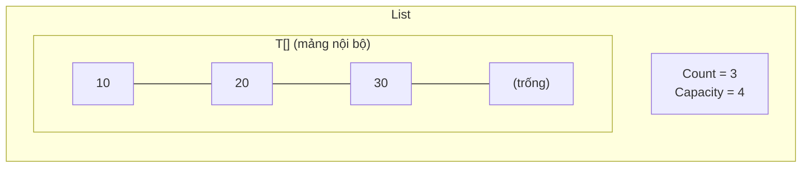
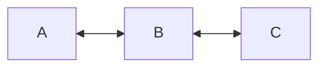

# Chương 25 — `List<T>` và `LinkedList<T>`

## Mục tiêu học

Sau chương này, bạn sẽ:

- Hiểu `List<T>` hoạt động bên trong ra sao (mảng động, `Capacity`, nhân đôi).
- Dùng thành thạo các thao tác của `List<T>` và hiểu chi phí từng thao tác.
- Biết `LinkedList<T>` khác gì và **vì sao hiếm khi nên dùng**.
- Tránh lỗi sửa danh sách trong lúc `foreach`.

Code mẫu: [`code/ch25-list-linkedlist/`](../../code/ch25-list-linkedlist/).

## `List<T>` bên trong: mảng động

`List<T>` bọc một **mảng** `T[]` cùng một số đếm `Count`. Mảng nội bộ dài `Capacity ≥ Count`.



Khi `Add` mà `Count == Capacity`, `List` tạo mảng mới **gấp đôi**, chép phần tử sang rồi bỏ mảng cũ:

```csharp
public void Them(T item)
{
    if (Count == _data.Length)
        Array.Resize(ref _data, _data.Length * 2);   // tốn O(n) nhưng hiếm
    _data[Count++] = item;
}
```

Chạy chương trình mẫu để thấy `Capacity` nhảy 4 → 8 → 16 ... Đây là **chi phí khấu hao O(1)**: thỉnh thoảng một lần
chép tốn O(n), nhưng chia đều thì mỗi `Add` chỉ tốn O(1). Vì thế:

- Truy cập `list[i]` là **O(1)** (tính địa chỉ trực tiếp).
- `Add` cuối là O(1) khấu hao; `Insert`/`RemoveAt` **đầu/giữa** là O(n) (phải dịch các phần tử).
- `Contains`, `IndexOf`, `Remove(giaTri)` là O(n) (duyệt).

Biết trước cỡ → `new List<T>(1000)` để khỏi cấp phát lại nhiều lần.

## Thao tác thường dùng

```csharp
var so = new List<int> { 5, 3, 8, 1, 9, 2 };
so.Add(7);                        // thêm cuối
so.AddRange([4, 6]);              // thêm nhiều
so.Insert(0, 100);                // chèn tại vị trí
so.Remove(8);                     // xoá phần tử đầu tiên bằng 8
so.RemoveAt(0);                   // xoá theo chỉ số
so.RemoveAll(x => x % 2 == 0);    // xoá theo điều kiện
so.Sort();                        // sắp xếp tại chỗ
int vt = so.BinarySearch(8);      // nhị phân — chỉ đúng khi ĐÃ sắp xếp
int? dau = so.Find(x => x > 3);   // phần tử đầu thoả điều kiện (default nếu không có)
so.Contains(9); so.IndexOf(9); so.Count; so.Clear();
so.GetRange(1, 3); so.Reverse();
```

`List<T>` cho phép phần tử trùng và `null` (nếu `T` là kiểu tham chiếu).

## Sửa danh sách khi đang duyệt

```csharp
foreach (var x in t)
    if (x == 2) t.Remove(x);   // InvalidOperationException: Collection was modified
```

`foreach` dùng bộ liệt kê (enumerator) theo dõi một "số phiên bản" của danh sách; sửa cấu trúc giữa chừng làm số phiên
bản đổi → lần `MoveNext` kế tiếp ném lỗi. Cách làm đúng:

```csharp
t.RemoveAll(x => x == 2);                       // gọn nhất
for (int i = t.Count - 1; i >= 0; i--)          // duyệt ngược rồi xoá
    if (t[i] == 2) t.RemoveAt(i);
var ketQua = t.Where(x => x != 2).ToList();     // hoặc tạo danh sách mới
```

(Gán lại giá trị phần tử `t[i] = ...` trong `for` thì được; chỉ thay đổi *cấu trúc* — thêm/xoá — mới bị cấm khi `foreach`.)

## `LinkedList<T>` — danh sách liên kết đôi

Mỗi phần tử là một **node** chứa giá trị và con trỏ tới node trước/sau:



```csharp
var ll = new LinkedList<string>();
ll.AddLast("B"); ll.AddFirst("A");
var nodeB = ll.Find("B")!;
ll.AddAfter(nodeB, "C");
ll.Remove(nodeB);           // O(1) vì đã có node
```

| | `List<T>` | `LinkedList<T>` |
|---|---|---|
| Truy cập chỉ số | O(1) | O(n) (không có chỉ số!) |
| Thêm/xoá đầu | O(n) | O(1) |
| Thêm/xoá giữa **khi có node** | O(n) | O(1) |
| Bộ nhớ | gọn, liền kề | mỗi node tốn thêm 2 con trỏ + đối tượng riêng |
| Cache CPU | rất tốt (liền kề) | kém (rải rác trên heap) |

**Thực tế:** `List<T>` gần như luôn nhanh hơn `LinkedList<T>` kể cả ở những thao tác "lý thuyết" thuộc về danh sách
liên kết, nhờ dữ liệu liền kề hợp với bộ nhớ đệm CPU. Chỉ cân nhắc `LinkedList` khi thật sự cần chèn/xoá liên tục ở giữa
với các node đã nắm giữ (ví dụ cache LRU). Nếu chỉ cần thêm/xoá ở hai đầu, dùng `Queue<T>`/`Stack<T>`/`Deque` dạng `PriorityQueue`... phù hợp hơn.

## Mảng hay `List<T>`?

- Số lượng cố định, hiệu năng tối đa, tham số `params` → **mảng**.
- Số lượng thay đổi → **`List<T>`**.
- Chỉ duyệt một lần, sinh dần dữ liệu → `IEnumerable<T>` với `yield` (Chương 27).

## Lỗi thường gặp

- `InvalidOperationException: Collection was modified` khi thêm/xoá trong `foreach`.
- `ArgumentOutOfRangeException` — chỉ số ngoài `[0, Count)`. Lưu ý `Count` (không phải `Length`) với `List`.
- `BinarySearch` trên danh sách **chưa sắp xếp** cho kết quả sai (không báo lỗi).
- Dùng `Insert(0, x)`/`RemoveAt(0)` trong vòng lặp lớn → O(n²).
- Nhầm `Remove(x)` (theo giá trị, xoá phần tử đầu tiên khớp, trả `bool`) với `RemoveAt(i)`.
- Trả `List<T>` nội bộ ra ngoài cho người khác sửa tuỳ ý.

## Bài tập

1. Mở rộng `MangDong<T>` với `Xoa(int index)` và `Chen(int index, T item)`; kiểm tra độ phức tạp.
2. Xoá mọi số âm khỏi `List<int>` theo ba cách khác nhau (`RemoveAll`, duyệt ngược, `Where`).
3. Đo thời gian thêm 100.000 phần tử vào **đầu** `List<int>` bằng `Insert(0, x)` so với `LinkedList.AddFirst`; giải thích kết quả.
4. Cài đặt lịch sử trình duyệt: `List<string>` với con trỏ "trang hiện tại" và các thao tác Back/Forward.
5. Viết hàm loại phần tử trùng khỏi `List<int>` giữ nguyên thứ tự lần xuất hiện đầu (gợi ý `HashSet`).
