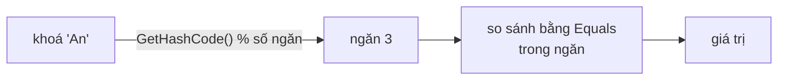

# Chương 26 — `Dictionary`, `HashSet` và họ hàng

## Mục tiêu học

Sau chương này, bạn sẽ:

- Hiểu **bảng băm** (hash table) hoạt động thế nào và vì sao tra cứu O(1).
- Dùng `Dictionary<K,V>` và `HashSet<T>` đúng cách (`TryGetValue`, phép toán tập hợp).
- Hiểu vai trò then chốt của `Equals`/`GetHashCode` với khoá.
- Biết khi nào dùng `SortedDictionary`, `SortedSet`.

Code mẫu: [`code/ch26-dictionary-hashset/`](../../code/ch26-dictionary-hashset/).

## Bảng băm hoạt động ra sao?

`Dictionary<TKey, TValue>` và `HashSet<T>` dùng **bảng băm**. Ý tưởng:

1. Từ khoá `k`, gọi `k.GetHashCode()` được một số nguyên (**mã băm**).
2. Lấy mã băm chia dư cho số "ngăn" (bucket) → biết cần nhìn vào ngăn nào.
3. Trong ngăn chỉ có vài phần tử; so sánh bằng `Equals` để tìm đúng khoá.



Không phải duyệt cả tập, nên tra cứu/thêm/xoá là **O(1) trung bình** — bất kể có 10 hay 10 triệu phần tử. Đổi lại:
thứ tự duyệt **không được đảm bảo**, và tốn bộ nhớ hơn `List`.

## `Dictionary<TKey, TValue>`

```csharp
var diem = new Dictionary<string, double> { ["An"] = 8.5, ["Binh"] = 7.0 };
diem["Chi"] = 9.0;            // thêm, hoặc ghi đè nếu đã có
diem.Add("Dung", 6.5);        // thêm, NÉM lỗi nếu khoá đã tồn tại
diem.TryAdd("An", 1.0);       // thêm nếu chưa có, trả bool

double d = diem["An"];        // NÉM KeyNotFoundException nếu không có
if (diem.TryGetValue("Zzz", out var v)) { ... }   // an toàn
diem.GetValueOrDefault("Zzz", -1);                 // giá trị mặc định nếu không có

diem.ContainsKey("An"); diem.Remove("An"); diem.Count;
foreach (var (ten, d2) in diem) { ... }            // duyệt cặp key/value
diem.Keys; diem.Values;
```

**Mẫu đếm tần suất** (rất hay gặp):

```csharp
var tanSuat = new Dictionary<string, int>();
foreach (var t in tu)
    tanSuat[t] = tanSuat.GetValueOrDefault(t) + 1;
```

**Quy tắc:** khoá là duy nhất và không được `null`; giá trị thì tuỳ. Luôn ưu tiên `TryGetValue` khi không chắc khoá có mặt.

## `HashSet<T>`

Tập hợp **không trùng lặp**, kiểm tra "có chưa?" O(1):

```csharp
var so = new HashSet<int> { 1, 2, 3, 3, 3 };   // {1, 2, 3}
so.Add(2);        // false: đã có
so.Contains(2);   // true, O(1)
```

Có sẵn các phép toán tập hợp (thay đổi tập gọi phương thức):

```csharp
var hop = new HashSet<int>(a); hop.UnionWith(b);        // hợp
var giao = new HashSet<int>(a); giao.IntersectWith(b);  // giao
var hieu = new HashSet<int>(a); hieu.ExceptWith(b);     // hiệu (a \ b)
a.IsSubsetOf(b); a.Overlaps(b);
```

Mẹo: loại trùng nhanh — `var duyNhat = new HashSet<int>(danhSach);` hoặc `danhSach.Distinct()` (LINQ).

## Vai trò của `Equals` và `GetHashCode`

Bảng băm chỉ hoạt động đúng nếu **khoá đồng nhất có cùng mã băm và `Equals` đúng** (Chương 20). Ví dụ:

```csharp
class DiemSai(int x, int y) { public int X { get; } = x; public int Y { get; } = y; }   // không override

var sai = new HashSet<DiemSai> { new(1, 2) };
sai.Contains(new DiemSai(1, 2));   // FALSE! mặc định so sánh tham chiếu, mã băm khác nhau

record DiemDung(int X, int Y);      // record tự sinh Equals/GetHashCode theo giá trị
new HashSet<DiemDung> { new(1, 2) }.Contains(new DiemDung(1, 2));   // TRUE
```

Vì vậy dùng làm khoá: ưu tiên `string`, số, `Guid`, `enum`, `record`, hoặc tự viết đúng cả hai phương thức. Khoá phải
**bất biến**: nếu đổi giá trị khoá sau khi đã bỏ vào tập, mã băm đổi và phần tử "lạc" mất.

Tuỳ chỉnh cách so sánh khoá bằng `IEqualityComparer<T>`:

```csharp
var d = new Dictionary<string, int>(StringComparer.OrdinalIgnoreCase) { ["Abc"] = 1 };
d.ContainsKey("ABC");   // true
```

## Họ "sorted": `SortedDictionary`, `SortedSet`, `SortedList`

Giữ phần tử **luôn theo thứ tự khoá**, cài bằng cây cân bằng nên các thao tác đều **O(log n)**:

```csharp
var sd = new SortedDictionary<string, int> { ["chuoi"] = 3, ["tao"] = 1, ["cam"] = 2 };
// duyệt ra: cam, chuoi, tao
var ss = new SortedSet<int> { 5, 1, 3 };   // Min = 1, Max = 5; GetViewBetween(2, 4)
```

Dùng khi cần **duyệt theo thứ tự** hoặc truy vấn khoảng (nhỏ nhất/lớn nhất, "các khoá giữa a và b"). Nếu chỉ tra cứu
theo khoá thì `Dictionary` nhanh hơn.

## Sửa dictionary khi đang duyệt

Thêm/xoá khoá trong lúc `foreach` gây `InvalidOperationException`. Sao chép danh sách khoá trước:

```csharp
foreach (var k in diem.Keys.ToList())   // ToList() cho phép sửa an toàn
    diem[k + "_moi"] = 0;
```

## Chọn gì?

| Bài toán | Dùng |
|----------|------|
| Tra cứu theo mã/khoá | `Dictionary` |
| Đếm/nhóm theo khoá | `Dictionary<K,int>` hoặc `GroupBy` (Chương 30) |
| Loại trùng, kiểm tra tồn tại | `HashSet` |
| Cần thứ tự khoá | `SortedDictionary`/`SortedSet` |
| Tra cứu theo hai chiều | hai `Dictionary` |

## Lỗi thường gặp

- `KeyNotFoundException` — dùng `dict[key]` thay vì `TryGetValue`.
- `ArgumentException: An item with the same key has already been added` — `Add` khoá trùng (dùng `dict[key] = v`).
- Dùng class **không override** `Equals/GetHashCode` làm khoá.
- Khoá thay đổi sau khi đã thêm.
- Khoá `null` → `ArgumentNullException`.
- Giả định thứ tự duyệt của `Dictionary` (không đảm bảo).

## Bài tập

1. Đếm số lần xuất hiện của từng từ trong một đoạn văn; in 3 từ nhiều nhất (`OrderByDescending`).
2. Tìm hai số trong mảng có tổng bằng `k` trong O(n) bằng `HashSet`/`Dictionary`.
3. Cho hai danh sách email, tìm email chỉ có ở danh sách thứ nhất, và email có ở cả hai (phép toán tập hợp).
4. Sửa `DiemSai` cho đúng (override `Equals` và `GetHashCode`) và kiểm tra `Contains`.
5. Dựng từ điển Anh–Việt không phân biệt hoa/thường bằng `StringComparer.OrdinalIgnoreCase`.
