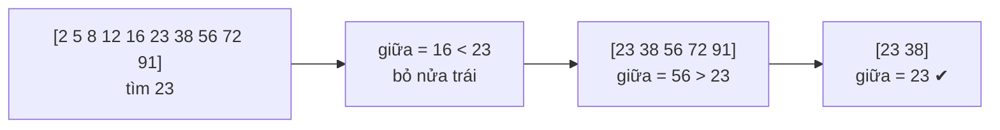

# Chương 28 — Thuật toán tìm kiếm

## Mục tiêu học

Sau chương này, bạn sẽ:

- Cài đặt và so sánh bốn thuật toán tìm kiếm: **Linear**, **Binary**, **Jump**, **Interpolation**.
- Đọc hiểu độ phức tạp thời gian của mỗi thuật toán và điều kiện áp dụng.
- Biết dùng lại hàm có sẵn của .NET (`Array.BinarySearch`, `List.BinarySearch`, `Contains`, `HashSet`).
- Chọn thuật toán/cấu trúc phù hợp với dữ liệu và nhu cầu.

Code mẫu: [`code/ch28-thuat-toan-tim-kiem/`](../../code/ch28-thuat-toan-tim-kiem/).

## Bài toán

Cho một tập giá trị, tìm vị trí của giá trị `x` (hoặc `-1` nếu không có). Câu hỏi thực tế: **nhanh đến đâu, và dữ liệu
cần đáp ứng điều kiện gì?** Code mẫu đếm số "bước" (số lần so sánh) mỗi thuật toán dùng để bạn thấy sự khác biệt.

## 1. Tìm tuần tự (Linear Search) — O(n)

Duyệt từ đầu, so từng phần tử:

```csharp
public static int Tim(int[] a, int x)
{
    for (int i = 0; i < a.Length; i++)
        if (a[i] == x) return i;
    return -1;
}
```

- **Không yêu cầu sắp xếp.** Đơn giản, đúng với mọi loại dữ liệu.
- Trường hợp xấu nhất: `n` phép so sánh (không thấy hoặc ở cuối).
- Tốt cho dữ liệu nhỏ, chỉ tìm vài lần, hoặc chưa sắp xếp.

## 2. Tìm nhị phân (Binary Search) — O(log n)

Điều kiện: mảng **đã sắp xếp**. Mỗi bước so với phần tử **giữa**, loại bỏ một nửa:

```csharp
int lo = 0, hi = a.Length - 1;
while (lo <= hi)
{
    int mid = lo + (hi - lo) / 2;   // không dùng (lo + hi) / 2 vì có thể tràn số
    if (a[mid] == x) return mid;
    if (a[mid] < x) lo = mid + 1;
    else hi = mid - 1;
}
return -1;
```



Với 1.000.000 phần tử chỉ cần khoảng **20** phép so sánh. Đây là thuật toán quan trọng nhất của chương. Trong .NET có sẵn:
`Array.BinarySearch(a, x)`, `list.BinarySearch(x)` (trả số âm — phần bù của vị trí chèn — nếu không thấy).

**Lỗi kinh điển:** `(lo + hi) / 2` có thể tràn `int` khi mảng rất lớn; `lo + (hi - lo) / 2` an toàn.

## 3. Tìm nhảy (Jump Search) — O(√n)

Điều kiện: mảng đã sắp xếp. **Nhảy** từng khối kích thước `√n` cho tới khi vượt quá `x`, rồi tìm **tuần tự** trong khối đó:

```csharp
int buocNhay = (int)Math.Sqrt(n);
int truoc = 0, cur = buocNhay;
while (cur < n && a[cur - 1] < x) { truoc = cur; cur += buocNhay; }
for (int i = truoc; i < Math.Min(cur, n); i++)
{
    if (a[i] == x) return i;
    if (a[i] > x) break;
}
return -1;
```

Chậm hơn nhị phân nhưng chỉ **duyệt tiến** (không nhảy lùi) — hợp với dữ liệu mà "quay lại" tốn kém (băng từ, luồng
đọc tuần tự). Trong thực tế ít dùng hơn nhị phân, nhưng đáng biết như một giải pháp trung gian.

## 4. Tìm nội suy (Interpolation Search) — trung bình O(log log n)

Điều kiện: đã sắp xếp và giá trị **phân bố khá đều**. Thay vì luôn chọn giữa, **ước lượng** vị trí theo tỷ lệ giá trị
(giống tìm tên trong danh bạ: tìm "Zoe" mở gần cuối):

```csharp
int pos = lo + (int)((long)(x - a[lo]) * (hi - lo) / (a[hi] - a[lo]));
```

Với dữ liệu phân bố đều, nhảy gần như thẳng tới đích: cực nhanh (`0, 3, 6, 9, ...`). Nhưng với dữ liệu lệch nhiều
(ví dụ `1, 2, 4, 8, 16, ... 2^30`) có thể suy biến thành **O(n)**. Luôn kiểm tra `a[hi] == a[lo]` để tránh chia cho 0
và giữ `x` trong khoảng `[a[lo], a[hi]]`.

## So sánh tổng hợp

| Thuật toán | Yêu cầu sắp xếp | Thời gian (tệ nhất) | Trung bình / ghi chú |
|-----------|-----------------|---------------------|----------------------|
| Linear | Không | O(n) | đơn giản, mọi kiểu dữ liệu |
| Binary | **Có** | O(log n) | mặc định cho mảng đã sắp xếp |
| Jump | **Có** | O(√n) | chỉ duyệt tiến |
| Interpolation | **Có** + phân bố đều | O(n) | O(log log n) khi dữ liệu đều |

Chạy chương trình mẫu (mảng `0, 3, 6, ..., 2997`, tìm `2001`): tuyến tính cần ~668 bước, nhị phân chỉ ~10, nhảy ~40,
nội suy chỉ 1 bước. Con số chính xác in ra khi bạn chạy.

## Đừng quên: cấu trúc dữ liệu cũng là "thuật toán tìm kiếm"

Nếu tìm kiếm là thao tác thường xuyên, thường **chọn đúng cấu trúc** tốt hơn tối ưu thuật toán trên mảng:

| Tình huống | Chọn |
|-----------|------|
| Tìm theo khoá, dữ liệu đổi liên tục | `Dictionary<K,V>` / `HashSet<T>` — O(1) |
| Cần thứ tự + tìm theo khoảng | `SortedSet<T>` / `SortedDictionary` — O(log n) |
| Mảng tĩnh đã sắp xếp, tìm nhiều lần | `Array.BinarySearch` |
| Dữ liệu ít, tìm vài lần | `Contains` / `Array.IndexOf` (tuần tự) |
| Dữ liệu chưa sắp xếp, tìm **một lần** | tuần tự (sắp xếp O(n log n) sẽ không đáng) |

Sắp xếp một lần rồi tìm nhiều lần thì đáng; sắp xếp để tìm đúng một lần thì lãng phí.

## Lỗi thường gặp

- Tìm nhị phân/nhảy/nội suy trên mảng **chưa sắp xếp** — kết quả sai mà không báo lỗi.
- Lệch một ở biên: `hi = a.Length` thay vì `a.Length - 1`; `while (lo < hi)` thay vì `<=`.
- Tràn số khi tính `mid` bằng `(lo + hi) / 2`.
- Nội suy chia cho 0 khi `a[hi] == a[lo]`; quên kiểm tra `x` nằm trong khoảng.
- Quên rằng `BinarySearch` trả **số âm** khi không thấy (dùng `~kq` để lấy vị trí chèn).
- Nhầm `Array.BinarySearch` với dữ liệu trùng: không đảm bảo trả về vị trí đầu tiên.

## Bài tập

1. Sửa `TimNhiPhan` để trả về vị trí **đầu tiên** của `x` khi có nhiều giá trị trùng.
2. Cài `TimNhiPhan` **đệ quy** và so sánh với bản lặp.
3. Tạo mảng phân bố lệch (`1, 2, 4, 8, ...`) và đếm số bước của nội suy so với nhị phân.
4. Dùng `Array.BinarySearch` để chèn một phần tử vào `List<int>` đã sắp xếp mà vẫn giữ thứ tự (dùng `~kq`).
5. Đo (`Stopwatch`) tìm 1000 giá trị ngẫu nhiên trong 1.000.000 phần tử: `Contains` trên `List`, `BinarySearch`, `HashSet`.
