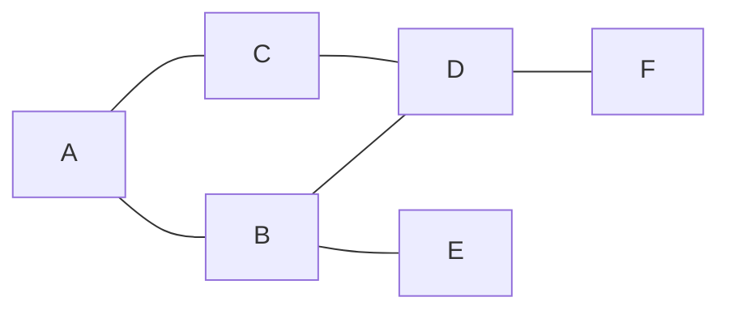

# Chương 29 — Duyệt đồ thị và cây: BFS và DFS

## Mục tiêu học

Sau chương này, bạn sẽ:

- Biểu diễn **đồ thị** bằng danh sách kề và **cây** bằng đối tượng lồng nhau.
- Cài đặt **BFS** (dùng `Queue`) và **DFS** (dùng `Stack` hoặc đệ quy).
- Dùng BFS tìm **đường đi ngắn nhất** trên đồ thị không trọng số.
- Duyệt cây thư mục / cấu trúc phân cấp và biết khi nào chọn BFS hay DFS.

Code mẫu: [`code/ch29-bfs-dfs/`](../../code/ch29-bfs-dfs/).

## Đồ thị và cây

**Đồ thị** = tập **đỉnh** (node) và tập **cạnh** nối các đỉnh. Ví dụ: bản đồ đường phố, mạng bạn bè, các trang web liên kết.
**Cây** là đồ thị đặc biệt: liên thông, không có chu trình, có một **gốc** (thư mục, cây menu, cấu trúc công ty).

Ví dụ đồ thị dùng trong chương:



### Biểu diễn: danh sách kề

Mỗi đỉnh giữ danh sách các đỉnh kề của nó:

```csharp
class DoThi
{
    private readonly Dictionary<string, List<string>> _ke = [];

    public void ThemCanh(string a, string b)
    {
        if (!_ke.ContainsKey(a)) _ke[a] = [];
        if (!_ke.ContainsKey(b)) _ke[b] = [];
        _ke[a].Add(b);
        _ke[b].Add(a);      // đồ thị vô hướng: thêm cả hai chiều
    }
}
```

Tiết kiệm bộ nhớ (O(V+E)) và duyệt các đỉnh kề nhanh — phù hợp đa số bài toán. (Ma trận kề `bool[,]` tốn O(V²) — chỉ hợp
đồ thị dày, nhỏ.)

## BFS — Duyệt theo chiều rộng

Duyệt **theo từng "lớp"** từ gần đến xa: đỉnh cách nguồn 1 cạnh, rồi 2 cạnh, rồi 3 cạnh... Dùng **hàng đợi (Queue)**:

```csharp
public List<string> BFS(string batDau)
{
    var kq = new List<string>();
    var daTham = new HashSet<string> { batDau };
    var hangDoi = new Queue<string>();
    hangDoi.Enqueue(batDau);
    while (hangDoi.Count > 0)
    {
        var u = hangDoi.Dequeue();
        kq.Add(u);
        foreach (var v in _ke[u])
            if (daTham.Add(v)) hangDoi.Enqueue(v);   // Add trả false nếu đã thăm
    }
    return kq;
}
```

Từ `A`: `A → B → C → D → E → F` (A trước, rồi các kề của A là B, C; rồi kề của B, C...).

- **`daTham`** là bắt buộc: đồ thị có chu trình (A–B–D–C–A), thiếu nó sẽ lặp mãi.
- Độ phức tạp **O(V + E)**: mỗi đỉnh vào hàng đợi một lần, mỗi cạnh xét một lần.

### Đường đi ngắn nhất (không trọng số)

Vì BFS đi theo lớp, lần đầu chạm tới một đỉnh chính là bằng **số cạnh ít nhất**. Lưu "đỉnh cha" để dựng lại đường đi:

```csharp
var cha = new Dictionary<string, string?> { [tu] = null };
// ... BFS, mỗi khi phát hiện v từ u: cha[v] = u
// dựng đường: đi ngược từ đích về nguồn qua cha rồi đảo lại
```

`DuongDiNganNhat("A", "F")` → `A → B → D → F`. Đây là cách giải các bài toán "ít bước nhất": mê cung, chuyển đổi từ
này sang từ khác, số lần bấm ít nhất, bậc quan hệ ("bạn của bạn").

> Đồ thị **có trọng số** (mỗi cạnh có chi phí) cần thuật toán khác: **Dijkstra**, dùng `PriorityQueue` — vượt ngoài
> phạm vi chương này.

## DFS — Duyệt theo chiều sâu

Đi **sâu nhất có thể** theo một nhánh, hết đường thì **quay lui**. Dùng **ngăn xếp (Stack)** hoặc **đệ quy** (thực chất dùng
ngăn xếp gọi hàm):

```csharp
// Đệ quy: gọn nhất
public List<string> DFSDeQuy(string batDau)
{
    var kq = new List<string>();
    var daTham = new HashSet<string>();
    void Tham(string u)
    {
        if (!daTham.Add(u)) return;
        kq.Add(u);
        foreach (var v in _ke[u]) Tham(v);
    }
    Tham(batDau);
    return kq;
}
```

Từ `A`: `A → B → D → C → F → E` (đi sâu qua B, D... rồi mới quay lại). Bản khử đệ quy dùng `Stack<string>` cho kết quả
tương tự (đảo thứ tự đẩy vào để giữ thứ tự duyệt). Bản dùng `Stack` tránh được `StackOverflowException` khi đồ thị rất sâu.
Cũng **O(V + E)**.

## BFS hay DFS?

| | BFS (Queue) | DFS (Stack/đệ quy) |
|---|---|---|
| Thứ tự | theo lớp, gần → xa | sâu nhất trước |
| Đường ngắn nhất (không trọng số) | **Có** | Không |
| Bộ nhớ | có thể lớn (cả một "lớp") | nhỏ (chiều sâu) |
| Ứng dụng tiêu biểu | ngắn nhất, "cách nhau bao xa" | phát hiện chu trình, sắp xếp topo, thoát mê cung, đếm thành phần liên thông |

## Duyệt cây (thư mục, menu, tổ chức)

Cây không có chu trình nên **không cần** tập `daTham`:

```csharp
class Nut(string ten, List<Nut> con)
{
    public string Ten { get; } = ten;
    public List<Nut> Con { get; } = con;

    public void In(int thut = 0)
    {
        Console.WriteLine($"{new string(' ', thut * 2)}{Ten}");
        foreach (var c in Con) c.In(thut + 1);       // DFS đệ quy
    }

    public int DemNut() => 1 + Con.Sum(c => c.DemNut());
    public int DoSau() => 1 + (Con.Count == 0 ? 0 : Con.Max(c => c.DoSau()));
}
```

Kết quả in ra dạng cây thụt lề — chính là cách các công cụ hiển thị cây thư mục. Với hệ thống file thật, dùng
`Directory.EnumerateFileSystemEntries(path, "*", SearchOption.AllDirectories)` hoặc đệ quy trên `DirectoryInfo`.
Duyệt cây theo từng tầng (in tất cả nút cấp 1, rồi cấp 2...) chính là BFS.

## Lỗi thường gặp

- **Quên `daTham`** → vòng lặp vô hạn trên đồ thị có chu trình.
- Đánh dấu "đã thăm" **khi lấy ra** thay vì khi **đưa vào** hàng đợi (BFS) → một đỉnh bị đưa vào nhiều lần.
- Dùng DFS để tìm đường ngắn nhất (sai — có thể ra đường dài hơn).
- Đệ quy quá sâu → `StackOverflowException`: chuyển sang bản dùng `Stack<T>`.
- Quên đồ thị **có hướng/vô hướng**: vô hướng phải thêm cạnh hai chiều.
- Không xử lý đồ thị **không liên thông**: duyệt từ một đỉnh chỉ tới được thành phần của nó.

## Bài tập

1. Đếm số **thành phần liên thông** của một đồ thị (lặp qua mọi đỉnh chưa thăm và chạy BFS/DFS).
2. Giải mê cung `char[,]` ("S" bắt đầu, "E" kết thúc, "#" tường) bằng BFS, in độ dài đường đi ngắn nhất.
3. Phát hiện chu trình trong đồ thị vô hướng bằng DFS (nhớ đỉnh cha).
4. Duyệt cây **theo tầng** (BFS) cho `Nut`, in mỗi tầng trên một dòng.
5. Viết hàm liệt kê mọi file `.cs` dưới một thư mục bằng DFS đệ quy trên `DirectoryInfo`.
