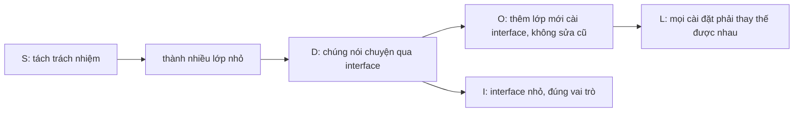

# Chương 42 — Nguyên lý SOLID

## Mục tiêu học

Sau chương này, bạn sẽ:

- Hiểu và áp dụng 5 nguyên lý **SOLID** qua ví dụ tái cấu trúc thực tế.
- Nhận ra "mùi" code vi phạm từng nguyên lý.
- Thấy mối liên hệ giữa SOLID, interface, đa hình, **Dependency Injection** và khả năng **kiểm thử**.
- Biết khi nào áp dụng vừa đủ, không "quá tay".

Code mẫu: [`code/ch42-solid/`](../../code/ch42-solid/) — mỗi nguyên lý có cặp "Xấu" và "Tốt".

## SOLID là gì?

Năm nguyên lý thiết kế hướng đối tượng giúp code **dễ hiểu, dễ sửa, dễ mở rộng, dễ kiểm thử**:

| Chữ | Nguyên lý | Một câu |
|-----|-----------|---------|
| **S** | Single Responsibility | Một lớp chỉ có **một lý do để thay đổi** |
| **O** | Open/Closed | **Mở** để mở rộng, **đóng** để sửa đổi |
| **L** | Liskov Substitution | Lớp con phải **thay thế được** lớp cha mà không phá hành vi |
| **I** | Interface Segregation | Nhiều interface **nhỏ** tốt hơn một interface to |
| **D** | Dependency Inversion | Phụ thuộc vào **trừu tượng**, không vào chi tiết cụ thể |

Đây là *nguyên tắc chỉ đạo*, không phải luật cứng: dùng để đánh giá thiết kế, cân nhắc chi phí/lợi ích.

## S — Single Responsibility (đơn trách nhiệm)

**Vi phạm:** một lớp vừa tính thuế, vừa định dạng, vừa in, vừa lưu CSDL. Đổi cách in cũng phải mở lớp tính thuế → dễ làm hỏng chỗ khác.

```csharp
class HoaDonXau
{
    public void InVaLuu(decimal tien)
    {
        decimal thue = tien * 0.1m;                    // logic thuế
        string s = $"Hoa don: {tien + thue:N0}";       // định dạng
        Console.WriteLine(s);                          // in
        // ... rồi lưu CSDL, gửi email ...
    }
}
```

**Tái cấu trúc:** tách theo **lý do thay đổi** (thuế đổi / mẫu in đổi / nơi lưu đổi):

```csharp
class HoaDonService(ITinhThue thue, IInHoaDon inAn, ILuuTru luu)
{
    public void XuLy(decimal tien)
    {
        string noiDung = $"Hoa don: {tien + thue.Thue(tien):N0}";
        inAn.In(noiDung);
        luu.Luu(noiDung);
    }
}
```

`HoaDonService` chỉ **điều phối**. Dấu hiệu vi phạm: tên lớp có "Manager/Helper/Utils" ôm mọi thứ; lớp dài hàng nghìn dòng; phải mô tả
bằng chữ "và". Đừng cực đoan: một "trách nhiệm" là *một lý do thay đổi*, không phải một phương thức.

## O — Open/Closed (đóng–mở)

**Vi phạm:** mỗi lần thêm loại khách phải **sửa** hàm cũ (đã chạy tốt, đã test):

```csharp
decimal Giam(string loai, decimal tien) => loai switch
{
    "vip" => tien * 0.8m,
    "sinhvien" => tien * 0.9m,
    _ => tien,      // thêm "nhanvien"? phải sửa hàm này (rủi ro hồi quy)
};
```

**Tái cấu trúc:** đa hình — thêm lớp mới thay vì sửa lớp cũ:

```csharp
interface IGiamGia { decimal Giam(decimal tien); }
class GiamVip : IGiamGia { public decimal Giam(decimal t) => t * 0.8m; }
class GiamSinhVien : IGiamGia { public decimal Giam(decimal t) => t * 0.9m; }
// Thêm GiamNhanVien? Chỉ VIẾT lớp mới, code đang chạy không đổi.
```

Nền tảng: đa hình (Chương 17), interface (18), Strategy (41). Không cần "thiết kế mở" cho mọi thứ — chỉ ở những điểm **đã từng/hay đổi**. Lần
đầu cứ viết đơn giản; khi thấy `switch` thứ hai cùng kiểu xuất hiện, hãy tách.

## L — Liskov Substitution (thay thế Liskov)

Nếu `B` kế thừa `A` thì **mọi nơi dùng `A` phải chạy đúng khi truyền `B`**. Ví dụ kinh điển: Hình vuông "là một" hình chữ nhật?

```csharp
class HCNXau { public virtual double Rong { get; set; } public virtual double Cao { get; set; } public double DienTich() => Rong * Cao; }
class VuongXau : HCNXau { /* đặt Rong thì Cao đổi theo, và ngược lại */ }

HCNXau h = new VuongXau();
h.Rong = 2; h.Cao = 3;
h.DienTich();    // mong 6, nhưng ra 9 → phá vỡ hợp đồng của HCNXau
```

Trong toán "vuông là chữ nhật", nhưng với đối tượng **có thể thay đổi**, hành vi khác nhau → kế thừa sai. Sửa: bỏ quan hệ kế thừa; cùng cài một
interface chung nhỏ:

```csharp
interface IHinh { double DienTich(); }
record HCN(double Rong, double Cao) : IHinh { ... }
record HinhVuong(double Canh) : IHinh { ... }
```

Dấu hiệu vi phạm: lớp con `throw new NotImplementedException()`/`NotSupportedException` cho phương thức của cha; lớp con thu hẹp điều kiện đầu vào, nới lỏng
điều kiện đầu ra; code phải `if (x is LopCon)` để xử lý riêng. Quy tắc: kế thừa để **thể hiện "là một" về hành vi**, không chỉ về khái niệm — nghi ngờ thì dùng composition.

## I — Interface Segregation (tách interface)

**Vi phạm:** một interface "béo" ép lớp cài đặt phải có cả phương thức nó không cần:

```csharp
interface IMayXau { void In(string s); void Quet(string s); void Fax(string s); }
class MayInDon : IMayXau { /* phải viết Quet/Fax rỗng hoặc ném NotSupportedException */ }
```

**Tái cấu trúc:** chia theo **vai trò**; lớp nào cần bao nhiêu vai trò thì cài bấy nhiêu:

```csharp
interface IMayIn { void In(string s); }
interface IMayQuet { void Quet(string s); }

class MayInDon : IMayIn { ... }
class MayDaNangLuc : IMayIn, IMayQuet { ... }
```

Bên dùng cũng chỉ phụ thuộc vào phần nó cần (`void Xuat(IMayIn may)`), nên đổi `IMayQuet` không ảnh hưởng nó. Ví dụ .NET: `IReadOnlyList<T>`,
`IEnumerable<T>`, `IDisposable` — mỗi cái một khả năng nhỏ. Đây cũng là nền để kiểm thử: mock interface nhỏ dễ hơn nhiều.

## D — Dependency Inversion (đảo ngược phụ thuộc)

**Vi phạm:** lớp "cấp cao" (nghiệp vụ) tự `new` lớp "cấp thấp" (email, CSDL) → dính chặt vào chi tiết, không test được, không thay được:

```csharp
class DatHangXau
{
    private readonly GuiEmailSmtp _email = new GuiEmailSmtp();   // phụ thuộc lớp cụ thể
    public void DatHang(string sp) { ...; _email.Gui(...); }     // test là gửi email thật!
}
```

**Tái cấu trúc:** cả hai phía cùng phụ thuộc vào **abstraction (interface)**; đối tượng cụ thể được **tiêm vào** từ ngoài:

```csharp
interface IGuiEmail { void Gui(string den, string noiDung); }

class DatHangService(IGuiEmail email)          // Dependency Injection qua constructor
{
    public void DatHang(string sp) { ...; email.Gui("khach@mail.com", $"Da dat {sp}"); }
}

var dichVu = new DatHangService(new GuiEmailGia());   // test: dùng bản giả
```

"Đảo ngược" nghĩa là: thay vì nghiệp vụ *phụ thuộc vào* email, cả hai phụ thuộc vào interface do **nghiệp vụ định nghĩa**. Nơi lắp ráp đối
tượng gọi là **composition root** (thường ở `Program.cs`). Trong ASP.NET Core, **DI container** làm việc lắp ráp đó (Tập 2):

```csharp
builder.Services.AddScoped<IGuiEmail, GuiEmailSmtp>();
```

Phân biệt: **DIP** (nguyên lý thiết kế) ≠ **DI** (kỹ thuật tiêm phụ thuộc) ≠ **IoC container** (công cụ tự động hoá DI).

## SOLID gắn kết với nhau



Kết quả cuối: code **lỏng lẻo (loosely coupled)**, mỗi mảnh có thể thay/kiểm thử độc lập — nền tảng cho kiến trúc phân lớp/Clean
Architecture ở Tập 3.

## Áp dụng vừa đủ

- SOLID **giảm chi phí thay đổi trong tương lai**, nhưng chi phí hiện tại là nhiều lớp/interface hơn. Nếu code nhỏ, đơn giản, ít đổi, **đừng ép**.
- Quy tắc ba lần (Rule of Three): lặp lần thứ ba mới tái cấu trúc/tách trừu tượng.
- **Đo bằng câu hỏi:** Sửa yêu cầu X thì phải đụng bao nhiêu chỗ? Có test được không mà không cần CSDL/mạng thật? Người mới có hiểu được không?
- Tránh interface "một–một" vô nghĩa (`IUserService` chỉ có một cài đặt, không bao giờ đổi, không cần mock). Nhưng ở ranh giới I/O (CSDL, mạng, đồng hồ, file) thì hầu như luôn đáng.
- Tái cấu trúc **cần test làm lưới an toàn** (Chương 38): có test xanh trước, sửa, test xanh sau.

## Các nguyên tắc bổ sung dễ nhớ

- **DRY** (Don't Repeat Yourself): đừng lặp tri thức — nhưng đừng gộp code chỉ vì trông giống nhau tình cờ.
- **KISS**: giữ đơn giản. **YAGNI**: đừng viết thứ chưa cần.
- **Composition over inheritance**, **Law of Demeter** (`a.B.C.D` dài là mùi xấu), **Tell, Don't Ask** (bảo đối tượng làm, đừng hỏi dữ liệu rồi tự quyết).

## Lỗi thường gặp

- Hiểu SRP là "mỗi lớp một phương thức" → phân mảnh vô nghĩa.
- Interface cho mọi lớp "phòng khi", không có lý do thay thế.
- `new` các phụ thuộc bên trong lớp nghiệp vụ → không test được.
- Kế thừa chỉ để tái sử dụng code, sinh lớp con phá hợp đồng lớp cha.
- Interface quá to, cài đặt rỗng/ném `NotImplementedException`.
- Dùng Service Locator (`ServiceProvider.GetService<T>()` gọi rải rác) thay vì tiêm qua constructor.
- Constructor nhận 8–10 phụ thuộc → lớp đang làm quá nhiều (vi phạm SRP).

## Bài tập

1. Tách một lớp `QuanLyDonHang` làm cả tính tiền, lưu file JSON và gửi email thành các lớp theo SRP + DIP.
2. Viết lại hàm `TinhPhiVanChuyen(string loai, double kg)` dùng `switch` thành Strategy để đóng với việc thêm loại mới.
3. Cho `interface IDongVat { void Bay(); void Boi(); void Chay(); }` — chỉ ra vấn đề và tách theo ISP (Chim, Ca, Cho).
4. Tìm ví dụ vi phạm Liskov trong `Stack<T>`/`ReadOnlyCollection` hoặc trong chính code bạn (một lớp con ném `NotSupportedException`).
5. Viết unit test cho `DatHangService` bằng `IGuiEmail` giả (Chương 38) và chứng minh không cần gửi email thật.
