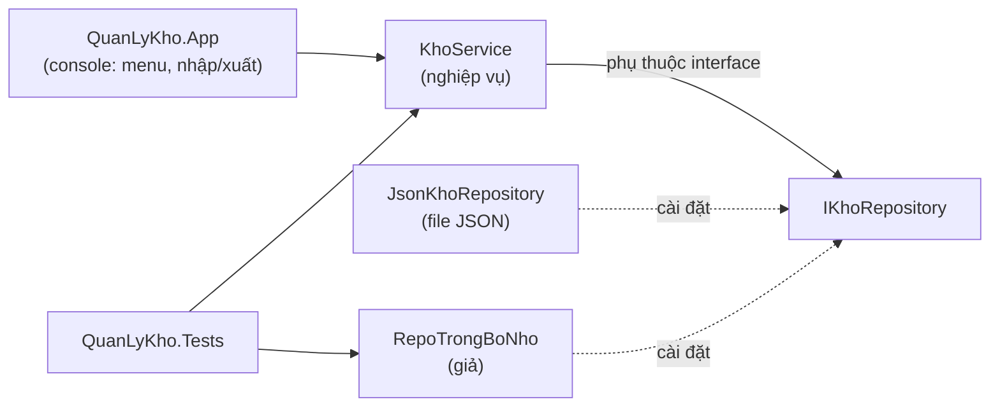

# Chương 43 — Dự án tổng hợp Tập 1: Quản lý kho hàng

## Mục tiêu học

Sau chương này, bạn sẽ:

- Ghép toàn bộ kiến thức Tập 1 thành **một ứng dụng hoàn chỉnh**: OOP, record, collection, LINQ, async, JSON, exception, interface/DI, unit test.
- Biết **quy trình** đi từ yêu cầu đến thiết kế, cài đặt và kiểm thử.
- Tổ chức solution nhiều project theo hướng **tách nghiệp vụ khỏi giao diện và lưu trữ**.
- Có một dự án nền để mở rộng và mang lên web ở Tập 2.

Code đầy đủ: [`code/ch43-du-an-tong-hop/`](../../code/ch43-du-an-tong-hop/).

## Bài toán

Cửa hàng nhỏ cần một chương trình console **quản lý kho hàng**:

| # | Yêu cầu |
|---|---------|
| 1 | Quản lý sản phẩm: mã (duy nhất), tên, nhóm hàng, đơn giá, tồn kho, mức cảnh báo |
| 2 | **Nhập kho** (tăng tồn) và **xuất kho** (giảm tồn; không được xuất quá số đang có) |
| 3 | Ghi **lịch sử giao dịch** (thời điểm, loại, số lượng, ghi chú) |
| 4 | Tìm kiếm theo tên/mã, liệt kê sản phẩm **sắp hết hàng** |
| 5 | **Báo cáo** theo nhóm: số sản phẩm, tổng tồn, tổng giá trị |
| 6 | **Lưu bền** dữ liệu vào file JSON, mở lại vẫn còn |
| 7 | Nhập liệu thân thiện: sai dữ liệu thì báo lỗi rõ ràng, không sập chương trình |

## Bước 1 — Phân tích và thiết kế

Áp dụng cách nghĩ của Chương 12: tìm **danh từ** → class; **động từ** → phương thức.

- Danh từ: **sản phẩm**, **giao dịch**, **kho**, **nhóm hàng**.
- Động từ: thêm, nhập, xuất, tìm, báo cáo, lưu.
- Quy tắc nghiệp vụ (đây là "bất biến" cần bảo vệ): mã không trùng, số lượng nhập/xuất > 0, **tồn không âm**.

### Kiến trúc phân lớp



Ba project trong một solution (Chương 4, 15):

| Project | Vai trò | Phụ thuộc |
|---------|---------|-----------|
| `QuanLyKho.Core` | mô hình + nghiệp vụ + interface lưu trữ + cài đặt JSON | không |
| `QuanLyKho.App` | giao diện console, **composition root** | `Core` |
| `QuanLyKho.Tests` | unit test xUnit | `Core` |

**Nguyên tắc dẫn đường:** `Core` **không biết** console hay file JSON tồn tại — chỉ biết interface `IKhoRepository`
(Dependency Inversion, Chương 42). Nhờ vậy: đổi JSON sang SQL/Web chỉ viết thêm một lớp; test thay bằng repository giả trong bộ nhớ; và
nghiệp vụ dùng lại nguyên vẹn cho ứng dụng web ở Tập 2.

## Bước 2 — Mô hình dữ liệu (record)

```csharp
public record SanPham(string Ma, string Ten, string Nhom, decimal DonGia, int TonKho, int MucCanhBao = 5)
{
    public decimal GiaTriTon => DonGia * TonKho;      // thuộc tính tính toán
}

public enum LoaiGiaoDich { Nhap, Xuat }
public record GiaoDich(DateTime ThoiGian, string MaSanPham, LoaiGiaoDich Loai, int SoLuong, string? GhiChu);
```

Vì sao **`record` bất biến**: (Chương 14, 20) đối tượng không bị sửa tuỳ tiện từ bên ngoài; "thay đổi" là tạo bản mới bằng `with`:
`sp with { TonKho = sp.TonKho + soLuong }`. Dùng `decimal` cho tiền (Chương 5), `enum` cho loại giao dịch (Chương 19),
tham số mặc định cho `MucCanhBao`.

Lỗi nghiệp vụ dùng exception riêng (Chương 21):

```csharp
public class KhoException(string message) : Exception(message);
public class KhongTimThayException(string ma) : KhoException($"Khong tim thay san pham {ma}");
public class KhongDuHangException(string ma, int can, int con) : KhoException(...) { public int Can {...} public int Con {...} }
```

Lớp gốc `KhoException` cho phép giao diện `catch (KhoException)` một lần để hiển thị mọi lỗi nghiệp vụ — còn lỗi hệ thống (file hỏng, hết bộ nhớ)
không bị "nuốt" nhầm.

## Bước 3 — Nghiệp vụ: `KhoService`

```csharp
public class KhoService(IKhoRepository repo, TimeProvider dongHo)   // nhận phụ thuộc qua constructor
{
    private DuLieuKho _du = new();

    public async Task XuatKhoAsync(string ma, int soLuong, string? ghiChu = null, CancellationToken ct = default)
    {
        if (soLuong <= 0) throw new KhoException("So luong xuat phai lon hon 0");
        var sp = LayHoacNem(ma);
        if (sp.TonKho < soLuong) throw new KhongDuHangException(sp.Ma, soLuong, sp.TonKho);   // bảo vệ bất biến

        CapNhat(sp with { TonKho = sp.TonKho - soLuong });
        GhiGiaoDich(sp.Ma, LoaiGiaoDich.Xuat, soLuong, ghiChu);
        await repo.LuuAsync(_du, ct);          // lưu SAU KHI thay đổi hợp lệ
    }
    ...
}
```

Những kiến thức được dùng trong lớp này:

- **Validate trước, thay đổi sau** (guard clauses, Chương 21): dữ liệu sai không bao giờ lọt vào trạng thái.
- **Async** (Chương 33): lưu file là I/O nên `async Task`, nhận `CancellationToken`.
- **`TimeProvider`** (đồng hồ trừu tượng): test có thể "đóng băng" thời gian thay vì phụ thuộc `DateTime.Now`.
- **LINQ** (Chương 30) cho truy vấn:

```csharp
public IEnumerable<SanPham> SapHet()
    => _du.SanPham.Where(s => s.TonKho <= s.MucCanhBao).OrderBy(s => s.TonKho);

public IEnumerable<NhomBaoCao> BaoCaoTheoNhom()
    => _du.SanPham
        .GroupBy(s => s.Nhom)
        .Select(g => new NhomBaoCao(g.Key, g.Count(), g.Sum(s => s.TonKho), g.Sum(s => s.GiaTriTon)))
        .OrderByDescending(x => x.GiaTri);
```

- **So sánh chuỗi** bằng `StringComparison.OrdinalIgnoreCase` (Chương 11): mã `a1` và `A1` là một.
- Trả `IReadOnlyList<SanPham> TatCa` thay vì `List` để bên ngoài không phá dữ liệu (Chương 14).

## Bước 4 — Lưu trữ: interface và cài đặt JSON

```csharp
public interface IKhoRepository
{
    Task<DuLieuKho> TaiAsync(CancellationToken ct = default);
    Task LuuAsync(DuLieuKho duLieu, CancellationToken ct = default);
}
```

`JsonKhoRepository` cài đặt bằng `System.Text.Json` (Chương 36) và **ghi qua file tạm rồi đổi tên** (Chương 35) để không hỏng dữ liệu
nếu chương trình sập giữa lúc ghi:

```csharp
string tam = duongDan + ".tmp";
await using (var fs = File.Create(tam))
    await JsonSerializer.SerializeAsync(fs, duLieu, Options, ct);
File.Move(tam, duongDan, overwrite: true);
```

`JsonSerializerOptions` được tạo **một lần** (`static readonly`) và dùng `JsonStringEnumConverter` để `Nhap/Xuat` hiện thành chữ trong file.

## Bước 5 — Ứng dụng console và composition root

`Program.cs` là **nơi duy nhất** biết lớp cụ thể nào được dùng — nơi lắp ráp (composition root):

```csharp
var dichVuKho = new KhoService(new JsonKhoRepository(duongDan), TimeProvider.System);
await dichVuKho.KhoiTaoAsync();
```

- **Chế độ `--demo`**: chạy kịch bản có sẵn với file tạm rồi xoá — để xem chương trình hoạt động ngay, cũng là "bản chạy thử" của CI.
- **Chế độ menu**: vòng `while (true)`, `switch` trên lựa chọn (Chương 7, 8), đọc số an toàn bằng `TryParse` trong vòng lặp cho đến khi hợp lệ (Chương 5).
- **Xử lý lỗi ở biên giới** (Chương 21): `catch (KhoException e)` ngay trong vòng menu để in thông báo thân thiện và tiếp tục, thay vì sập.

Chạy thử:

```
dotnet run --project QuanLyKho.App -- --demo
```

Dữ liệu tương tác lưu vào `ApplicationData/QuanLyKho/kho.json`; đổi bằng `--file duong-dan.json`.

## Bước 6 — Kiểm thử

`KhoService` phụ thuộc interface, nên test thay lưu trữ thật bằng một repository **trong bộ nhớ** (Chương 38):

```csharp
class RepoTrongBoNho : IKhoRepository
{
    public DuLieuKho DuLieu { get; private set; } = new();
    public int SoLanLuu { get; private set; }
    public Task<DuLieuKho> TaiAsync(CancellationToken ct = default) => Task.FromResult(DuLieu);
    public Task LuuAsync(DuLieuKho duLieu, CancellationToken ct = default) { DuLieu = duLieu; SoLanLuu++; return Task.CompletedTask; }
}

[Fact]
public async Task XuatKho_KhongDuHang_NemLoiVaTonKhongDoi()
{
    await _kho.ThemSanPhamAsync(SanPhamMau("A1", ton: 3));

    var loi = await Assert.ThrowsAsync<KhongDuHangException>(() => _kho.XuatKhoAsync("A1", 10));

    Assert.Equal(3, _kho.Tim("A1")!.TonKho);       // tồn KHÔNG bị thay đổi khi lỗi
}
```

Bộ test phủ: thêm hợp lệ / trùng mã, nhập, xuất đủ/thiếu hàng, số lượng không dương (`[Theory]`), sản phẩm không tồn tại, sắp hết,
báo cáo nhóm, tìm kiếm. Chạy `dotnet test` — mọi thay đổi sau này đều có lưới an toàn.

## Đối chiếu kiến thức Tập 1

| Chương | Ở đâu trong dự án |
|--------|-------------------|
| 5–11 Nền tảng | biến, `decimal`, chuỗi, vòng lặp, `switch`, phương thức trong `Program.cs` |
| 12–15 OOP cơ bản | class, property, namespace/project (`Core`/`App`/`Tests`) |
| 16–20 OOP nâng cao | interface `IKhoRepository`, kế thừa exception, `record`, `enum` |
| 21 Exception | `KhoException` và hai lớp con, guard clause |
| 22–23 Generics, null | `Task<T>`, `IEnumerable<T>`, `string?`, `SanPham?` |
| 24–30 Collection, LINQ | `List`, `GroupBy`, `Where`, `OrderBy`, `Sum` |
| 31–34 Delegate, async | lambda trong LINQ, `async/await`, `CancellationToken` |
| 35–37 I/O, JSON | `JsonKhoRepository`, file tạm, options |
| 38–40 Test, cấu hình | xUnit, repo giả, tham số dòng lệnh/đường dẫn |
| 41–42 Pattern, SOLID | Repository, DI qua constructor, SRP/DIP |

## Mở rộng (bài tập lớn)

Chọn tối thiểu ba việc:

1. **Cấu hình**: đọc đường dẫn file, ngưỡng cảnh báo mặc định từ `appsettings.json` (Chương 40).
2. **Logging**: thay `Console.WriteLine` trong nghiệp vụ bằng `ILogger` (Chương 39).
3. **Xoá/sửa sản phẩm**, đổi tên nhóm; có test cho từng tính năng.
4. **Xuất báo cáo CSV** (Chương 36) cho báo cáo nhóm và lịch sử.
5. **Nhiều kho** (`MaKho`) — thiết kế lại mô hình và migrate file JSON cũ.
6. **Strategy** tính giá bán theo nhóm (Chương 41): giá vốn + lợi nhuận theo quy tắc khác nhau.
7. **Repository SQLite**: viết `SqliteKhoRepository` cài đặt `IKhoRepository` (chuẩn bị cho EF Core ở Tập 2) — không sửa `KhoService`!
8. **Giao dịch song song**: hai người cùng xuất một mặt hàng — dùng `SemaphoreSlim`/khoá để bảo đảm tồn không âm (Chương 34).

## Hướng tới Tập 2

Cùng lớp `QuanLyKho.Core` này sẽ được **dùng lại nguyên vẹn** trong một dự án **ASP.NET Core Web API**: `KhoService` được
đăng ký vào DI container, `IKhoRepository` được cài đặt bằng **Entity Framework Core**, và menu console được thay bằng các endpoint
HTTP. Đó là phần thưởng của thiết kế tách lớp: nghiệp vụ không phụ thuộc giao diện.

**Chúc mừng bạn đã hoàn thành Tập 1!** Bạn đã có nền tảng vững chắc của C# và .NET — sẵn sàng bước vào web với ASP.NET Core.
