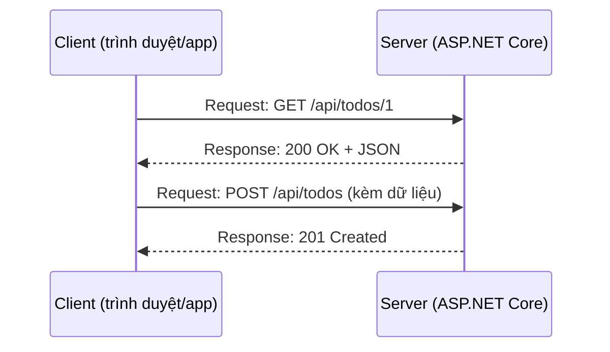

# Chương 1 — Web hoạt động thế nào: HTTP và REST

## Mục tiêu học

Sau chương này, bạn sẽ:

- Hiểu mô hình **client – server** và một **request/response HTTP** gồm những phần nào.
- Đọc hiểu **phương thức**, **mã trạng thái**, **header**, **body** và cấu trúc một **URL**.
- Nắm các nguyên tắc **REST** và cách thiết kế URL cho một API.
- Dùng công cụ (`curl`, trình duyệt, file `.http`) để "nói chuyện" trực tiếp với một server.

Code mẫu: [`code/ch01-http-co-ban/`](../../code/ch01-http-co-ban/) — chương trình console tự dựng một máy chủ HTTP thô để bạn **nhìn thấy** nguyên văn request và response.

> Tập 2 giả định bạn đã đọc Tập 1 (C#, OOP, LINQ, `async/await`, JSON, DI qua constructor, unit test). Khi cần ôn, sách ghi rõ *"Tập 1, Chương N"*.

## Mô hình client – server

Mọi ứng dụng web đều là cuộc **hỏi – đáp** giữa hai bên:

- **Client** (trình duyệt, ứng dụng di động, chương trình khác) **gửi request** để hỏi/nhờ.
- **Server** (ASP.NET Core chạy trên máy chủ) **trả response**.



**HTTP** (HyperText Transfer Protocol) là "ngôn ngữ" quy định cách hai bên viết request và response. Nó chạy trên TCP (và **HTTPS** = HTTP + mã hoá TLS). Đặc điểm cốt lõi: **phi trạng thái (stateless)** — mỗi request độc lập, server không tự nhớ request trước (muốn nhớ phải dùng cookie, token, session).

## Giải phẫu một request

Chạy code mẫu, bạn sẽ thấy đúng nguyên văn văn bản mà `HttpClient` gửi đi:

```
GET /api/chao?ten=An&lang=vi HTTP/1.1
Host: 127.0.0.1:64457
Accept: application/json
X-Yeu-Cau: thu-nghiem

```

| Phần | Ví dụ | Ý nghĩa |
|------|-------|---------|
| **Request line** | `GET /api/chao?ten=An HTTP/1.1` | phương thức + đường dẫn (kèm query) + phiên bản |
| **Headers** | `Host`, `Accept`, `Authorization`, `Content-Type` | siêu dữ liệu về request |
| Dòng trống | | ngăn cách header và body |
| **Body** (tuỳ chọn) | `{"title":"Hoc C#"}` | dữ liệu gửi kèm (POST/PUT/PATCH) |

### URL

```
https://api.cuahang.vn:8443/api/san-pham/42?nhom=phu-kien&sapXep=gia#chi-tiet
└─┬─┘   └──────┬──────┘└┬─┘└──────┬───────┘└────────┬───────────┘└───┬───┘
scheme       host     port      path             query           fragment
```

`fragment` (`#...`) **không** gửi lên server — chỉ dùng phía client. `query` (`?a=1&b=2`) là các cặp tên–giá trị. Ký tự đặc biệt phải được mã hoá phần trăm (`%20` cho dấu cách) — `Uri`/`HttpClient` lo giúp.

## Phương thức HTTP

| Phương thức | Dùng để | An toàn* | Idempotent** |
|-------------|---------|----------|--------------|
| `GET` | **đọc** tài nguyên | ✔ | ✔ |
| `POST` | **tạo** mới / thực hiện hành động | ✘ | ✘ |
| `PUT` | **thay thế** toàn bộ tài nguyên | ✘ | ✔ |
| `PATCH` | **sửa một phần** | ✘ | thường không |
| `DELETE` | **xoá** | ✘ | ✔ |
| `HEAD`/`OPTIONS` | lấy header / hỏi khả năng (CORS) | ✔ | ✔ |

\* *An toàn*: không làm thay đổi dữ liệu trên server. \*\* *Idempotent*: gọi nhiều lần cho kết quả cuối giống gọi một lần (xoá hai lần vẫn là "đã xoá"). Tính chất này quyết định việc có thể **tự động gửi lại** khi mạng lỗi hay không — không bao giờ để `GET` làm thay đổi dữ liệu.

## Mã trạng thái (status code)

Hàng trăm đầu tiên cho biết **nhóm** kết quả:

| Nhóm | Ý nghĩa | Thường gặp |
|------|---------|-----------|
| **1xx** | thông tin | ít gặp |
| **2xx** | thành công | `200 OK`, `201 Created`, `204 No Content` |
| **3xx** | chuyển hướng | `301/302` (redirect), `304 Not Modified` |
| **4xx** | **lỗi do client** | `400 Bad Request`, `401 Unauthorized`, `403 Forbidden`, `404 Not Found`, `409 Conflict`, `422`, `429 Too Many Requests` |
| **5xx** | **lỗi do server** | `500 Internal Server Error`, `502/503/504` |

Phân biệt hay nhầm: **401** = chưa xác thực (chưa đăng nhập / token sai); **403** = đã biết bạn là ai nhưng **không đủ quyền**. Chọn mã đúng là phần quan trọng của thiết kế API: `POST` tạo mới nên trả `201 Created` kèm header `Location`; xoá thành công thường `204`.

## Header và body

Header thường gặp:

| Header | Hướng | Ý nghĩa |
|--------|-------|---------|
| `Content-Type` | cả hai | định dạng body (`application/json`, `text/html`, `multipart/form-data`) |
| `Accept` | request | định dạng client muốn nhận |
| `Authorization` | request | thông tin xác thực (`Bearer <token>`) |
| `Cookie` / `Set-Cookie` | request / response | duy trì trạng thái |
| `Location` | response | URL tài nguyên mới tạo/chuyển hướng |
| `Cache-Control`, `ETag` | response | điều khiển bộ nhớ đệm |

Body JSON (Tập 1, Chương 36) là định dạng chính của API hiện đại. Form HTML gửi `application/x-www-form-urlencoded` hoặc `multipart/form-data` (tải file).

## REST — thiết kế API theo tài nguyên

**REST** là phong cách thiết kế API xoay quanh **tài nguyên** (danh từ) được định danh bằng URL, và thao tác bằng **phương thức HTTP** (động từ):

| Việc cần làm | Request | Kết quả |
|-------------|---------|---------|
| Lấy danh sách | `GET /api/todos` | `200` + mảng |
| Lấy một | `GET /api/todos/5` | `200` hoặc `404` |
| Tạo mới | `POST /api/todos` | `201` + `Location: /api/todos/6` |
| Thay thế | `PUT /api/todos/5` | `204` hoặc `404` |
| Sửa một phần | `PATCH /api/todos/5` | `200`/`204` |
| Xoá | `DELETE /api/todos/5` | `204` |
| Quan hệ | `GET /api/khach-hang/3/don-hang` | các đơn của khách 3 |

Quy tắc đặt URL: dùng **danh từ số nhiều**, chữ thường, phân cách bằng `-`, không đặt động từ vào URL (`/api/todos`, không phải `/api/layDanhSachTodo`); lọc/sắp xếp/phân trang qua query (`?done=true&sort=ten&page=2&pageSize=20`); phiên bản qua đường dẫn hoặc header (`/api/v1/...`).

Một API REST **không** phụ thuộc trạng thái phiên: mỗi request mang đủ thông tin (token) để xử lý. Đó là lý do nó mở rộng ngang dễ dàng (thêm server sau bộ cân bằng tải).

## Công cụ để thử request

- **Trình duyệt**: gõ URL (chỉ `GET`); **DevTools → Network** xem mọi request/response, header, thời gian.
- **`curl`** (có sẵn Windows 10+, macOS, Linux):

  ```
  curl -i http://localhost:5000/api/todos
  curl -i -X POST http://localhost:5000/api/todos -H "Content-Type: application/json" -d '{"title":"Hoc REST"}'
  ```

  `-i` in cả header response; `-X` chọn phương thức; `-H` thêm header; `-d` gửi body.
- **File `.http`** (Visual Studio 2022+ và VS Code với REST Client): request lưu ngay trong repo, chạy được từ IDE:

  ```
  ### Lay danh sach
  GET {{host}}/api/todos
  Accept: application/json

  ### Tao moi
  POST {{host}}/api/todos
  Content-Type: application/json

  { "title": "Hoc HTTP" }
  ```
- **Postman/Insomnia/Bruno**: giao diện đồ hoạ, lưu bộ sưu tập request.
- **Swagger UI / Scalar**: giao diện thử API sinh từ tài liệu OpenAPI (Chương 9).

## Từ code C# nhìn HTTP

Trong code mẫu, `HttpClient.GetAsync(url)` (Tập 1, Chương 33 — async) gửi request; server thô đọc và in ra nguyên văn, rồi trả:

```
HTTP/1.1 200 OK
Content-Type: application/json; charset=utf-8
Content-Length: 58
X-May-Chu: demo
Connection: close

{"loiChao":"Xin chao tu may chu tu viet","thanhCong":true}
```

ASP.NET Core làm đúng việc đó — nhưng lo giúp bạn: phân tích request, định tuyến, chuyển JSON ↔ đối tượng C#, header, mã hoá, đa luồng, keep-alive, HTTP/2... Bạn viết nghiệp vụ, framework lo giao thức.

## Lỗi thường gặp

- Dùng `GET` để **thay đổi** dữ liệu (mất tính an toàn; trình duyệt/crawler có thể gọi lại).
- Trả `200 OK` kèm nội dung lỗi thay vì mã `4xx/5xx` đúng nghĩa.
- Nhầm `401` với `403`.
- Đặt động từ trong URL, dùng danh từ số ít/số nhiều lộn xộn.
- Quên `Content-Type: application/json` khi gửi body JSON → server không đọc được.
- Nhét dữ liệu nhạy cảm (mật khẩu, token) vào **URL/query** — URL bị ghi vào log và lịch sử trình duyệt; đặt vào header/body qua HTTPS.

## Bài tập

1. Chạy code mẫu; giải thích từng dòng của request in ra. Đổi header `Accept` rồi quan sát.
2. Dùng DevTools mở một trang web bất kỳ, tìm request `GET` đầu tiên, ghi lại mã trạng thái và 3 header của response.
3. Thiết kế (chỉ viết ra giấy) bộ URL REST cho hệ thống "thư viện": sách, độc giả, phiếu mượn (kể cả "trả sách").
4. Dùng `curl -i https://example.com` và giải thích mọi dòng header.
5. Viết chương trình dùng `HttpClient` gọi `https://httpbin.org/status/404` và in mã trạng thái (cần Internet); xử lý bằng `response.IsSuccessStatusCode`.
