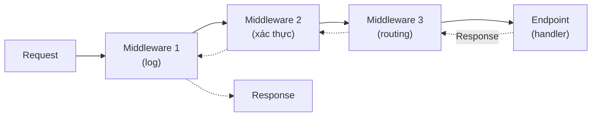
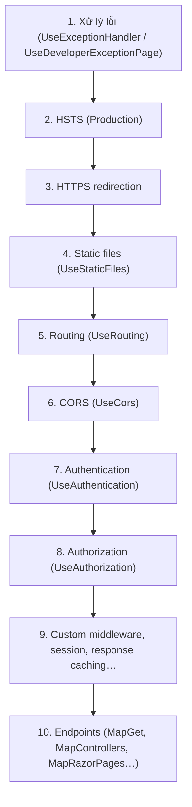

# Chương 3 — Middleware và request pipeline

## Mục tiêu học

Sau chương này, bạn sẽ:

- Hiểu **request pipeline** là chuỗi middleware xử lý request/response theo dạng "củ hành".
- Viết middleware inline (`Use`), dạng class, nhánh (`Map`, `MapWhen`) và middleware **ngắn mạch**.
- Nắm **thứ tự** middleware chuẩn của ASP.NET Core và vì sao nó quan trọng.
- Biết chỗ đặt xử lý lỗi, HTTPS redirection, CORS, xác thực, static files.

Code mẫu: [`code/ch03-middleware/`](../../code/ch03-middleware/).

## Pipeline: chuỗi củ hành

Mỗi request đi **vào** qua một dãy **middleware** (mỗi cái làm một việc), tới endpoint, rồi response đi **ngược ra** qua chính các middleware đó:



Mỗi middleware có thể: (1) làm gì đó **trước** khi gọi cái kế tiếp, (2) gọi **`next`** để chuyển tiếp, (3) làm gì đó **sau** khi các middleware phía sau hoàn tất, hoặc (4) **không** gọi `next` để kết thúc sớm (**ngắn mạch**). Đây là mẫu **Decorator/Chain of Responsibility** (Tập 1, Chương 41). Logging, xác thực, nén, CORS, xử lý lỗi… đều là middleware.

## Middleware inline: `app.Use`

```csharp
app.Use(async (ctx, next) =>
{
    app.Logger.LogInformation("[1] vao  {Method} {Path}", ctx.Request.Method, ctx.Request.Path);
    await next(ctx);                                                     // chuyển sang middleware kế tiếp
    app.Logger.LogInformation("[1] ra   -> {Status}", ctx.Response.StatusCode);
});
```

`ctx` là **`HttpContext`** — gói mọi thứ về request hiện tại: `Request`, `Response`, `User`, `RequestServices` (DI), `Items` (dữ liệu tạm trong request), `RequestAborted`… Mã trước `await next(ctx)` chạy lúc đi vào; mã sau chạy lúc đi ra.

## Middleware dạng class

Khi cần tái sử dụng hoặc có phụ thuộc:

```csharp
class DoThoiGianMiddleware(RequestDelegate next, ILogger<DoThoiGianMiddleware> log)
{
    public async Task InvokeAsync(HttpContext ctx)
    {
        var dong = Stopwatch.StartNew();
        ctx.Response.OnStarting(() =>
        {
            ctx.Response.Headers["X-Thoi-Gian-Ms"] = dong.ElapsedMilliseconds.ToString();
            return Task.CompletedTask;
        });
        try { await next(ctx); }
        catch (Exception e)
        {
            log.LogError(e, "Loi khong xu ly tai {Path}", ctx.Request.Path);
            ctx.Response.StatusCode = 500;
            await ctx.Response.WriteAsync("Da co loi xay ra.");
        }
    }
}

app.UseMiddleware<DoThoiGianMiddleware>();
```

- Constructor nhận `RequestDelegate next` và các dịch vụ **Singleton**; `InvokeAsync(HttpContext, ...)` có thể nhận thêm dịch vụ **Scoped** làm tham số.
- **`Response.OnStarting`**: header chỉ thêm được **trước khi** response bắt đầu gửi; sau khi body đã ghi thì không sửa header/status nữa. Callback này chạy đúng lúc trước khi gửi.
- Middleware ở ngoài bắt được ngoại lệ từ mọi middleware/endpoint **phía trong** — nên xử lý lỗi toàn cục đặt **sớm** trong pipeline.

Thường bọc thành extension method (Tập 1, Chương 19): `app.UseDoThoiGian()`.

## Ngắn mạch (short-circuit)

```csharp
app.Use(async (ctx, next) =>
{
    if (ctx.Request.Path.StartsWithSegments("/bi-chan"))
    {
        ctx.Response.StatusCode = StatusCodes.Status403Forbidden;
        await ctx.Response.WriteAsync("Bi chan boi middleware.");
        return;                      // KHÔNG gọi next → endpoint không bao giờ chạy
    }
    await next(ctx);
});
```

Ứng dụng: từ chối sớm (không xác thực, quá giới hạn tốc độ, IP bị chặn), trả file tĩnh, health check, trả từ bộ nhớ đệm.

## Nhánh: `Map`, `MapWhen`, `Run`

```csharp
app.MapWhen(ctx => ctx.Request.Query.ContainsKey("debug"), nhanh =>
    nhanh.Run(async ctx => await ctx.Response.WriteAsync("Che do debug")));
```

| Phương thức | Ý nghĩa |
|-------------|---------|
| `app.Use(...)` | middleware gọi tiếp `next` |
| `app.Run(...)` | middleware **cuối/terminal** — không có `next` |
| `app.Map("/duong-dan", nhanh => ...)` | rẽ nhánh theo tiền tố đường dẫn |
| `app.MapWhen(predicate, nhanh => ...)` | rẽ nhánh theo điều kiện tuỳ ý |
| `app.UseWhen(predicate, nhanh => ...)` | rẽ nhánh nhưng **quay lại** pipeline chính sau đó |

> **Bẫy quan trọng:** trong ứng dụng dùng `MapGet/MapControllers`, **endpoint chạy ở cuối pipeline**. Nếu bạn đặt `app.Run(async ctx => ...)` *trước* các `MapGet`, middleware terminal đó sẽ chặn mọi request và endpoint **không bao giờ** được gọi (mọi URL đều rơi vào nó). Muốn xử lý "không khớp endpoint nào" hãy dùng **`app.MapFallback(...)`** như trong code mẫu. Chạy code mẫu và thử `/cham`, `/khong-co` để thấy.

## Thứ tự middleware chuẩn

**Thứ tự đăng ký = thứ tự thực thi**, và nó có ý nghĩa. Thứ tự khuyến nghị của Microsoft:



Lý do: xử lý lỗi phải **bọc ngoài cùng** để bắt lỗi của mọi thứ bên trong; **static files** đặt trước xác thực để phục vụ file công khai nhanh, không tốn tài nguyên; **`UseAuthentication` phải đứng trước `UseAuthorization`** (biết bạn là ai rồi mới kiểm tra quyền) và cả hai sau `UseRouting`, trước endpoint (cần biết endpoint nào để đọc `[Authorize]`); CORS phải chạy trước xác thực để phản hồi preflight. Với `WebApplication`, routing và endpoints được thêm tự động, nhưng bạn vẫn phải gọi `UseAuthentication/UseAuthorization/UseCors` đúng vị trí.

Ví dụ pipeline điển hình:

```csharp
var app = builder.Build();

if (app.Environment.IsDevelopment()) app.UseDeveloperExceptionPage();
else { app.UseExceptionHandler("/loi"); app.UseHsts(); }

app.UseHttpsRedirection();
app.UseStaticFiles();
app.UseCors();
app.UseAuthentication();
app.UseAuthorization();

app.MapGet("/", () => "Trang chu");
app.Run();
```

## Middleware có sẵn thường dùng

| Middleware | Việc làm |
|-----------|---------|
| `UseExceptionHandler` | bắt ngoại lệ, trả trang/JSON lỗi (Chương 9) |
| `UseHttpsRedirection`, `UseHsts` | ép dùng HTTPS |
| `UseStaticFiles` | phục vụ file trong `wwwroot` |
| `UseRouting` | chọn endpoint theo URL |
| `UseCors` | cho phép trình duyệt từ origin khác gọi API |
| `UseAuthentication/Authorization` | xác thực/phân quyền (Chương 20) |
| `UseRateLimiter` | giới hạn tốc độ (Chương 21) |
| `UseResponseCompression`, `UseOutputCache` | nén, cache đầu ra |
| `UseRequestLocalization` | đa ngôn ngữ |
| `UseForwardedHeaders` | đọc `X-Forwarded-*` khi sau reverse proxy |

## Endpoint filter và middleware — khác nhau thế nào?

Middleware áp dụng cho **mọi request** (trước khi biết endpoint) — hợp cho vấn đề xuyên suốt (log, lỗi, xác thực). **Filter** (endpoint filter/action filter, Chương 4 và 7) áp dụng cho **từng endpoint/nhóm endpoint** và biết tham số đã bind — hợp cho validation, xử lý kết quả theo endpoint.

## Lỗi thường gặp

- **Sai thứ tự**: `UseAuthorization` trước `UseAuthentication` → luôn bị từ chối; `UseCors` sau xác thực → preflight bị 401.
- Đặt `app.Run(...)` terminal trước các endpoint → endpoint không chạy.
- Quên `await next(ctx)` → request treo; hoặc gọi `next` **hai lần**.
- Sửa header/status **sau khi** response đã bắt đầu: `InvalidOperationException: Headers are read-only, response has already started`. Dùng `OnStarting`.
- Ghi vào `Response` rồi vẫn gọi `next` (endpoint cũng ghi) → nội dung lộn xộn.
- Middleware nuốt ngoại lệ không log.
- Dùng dịch vụ Scoped trong constructor của middleware (Singleton) → lỗi; đưa vào tham số `InvokeAsync`.

## Bài tập

1. Viết middleware `RequestIdMiddleware` thêm header `X-Request-Id` (GUID) vào mọi response và đưa vào `ctx.Items`.
2. Viết middleware chặn mọi request có header `User-Agent` chứa "bot" bằng `403`.
3. Viết middleware chỉ chạy cho đường dẫn `/api` bằng `UseWhen`, tính và log thời gian xử lý.
4. Cố tình đặt `UseAuthorization` trước `UseAuthentication` (ở chương xác thực) rồi giải thích triệu chứng.
5. Vẽ sơ đồ thứ tự thực thi (vào/ra) cho ba middleware A, B, C trong đó B ngắn mạch với một số request.
