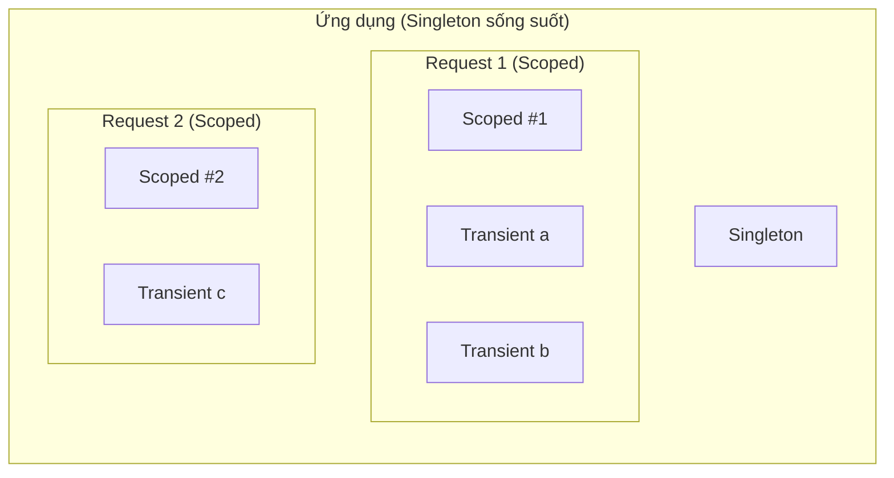

# Chương 5 — Dependency Injection

## Mục tiêu học

Sau chương này, bạn sẽ:

- Hiểu **DI container** của ASP.NET Core và vì sao mọi thứ đều "được tiêm".
- Đăng ký dịch vụ với ba vòng đời: **Transient**, **Scoped**, **Singleton** — và chọn đúng.
- Tránh lỗi kinh điển: **captive dependency**, dùng dịch vụ Scoped trong Singleton.
- Dùng đăng ký nhiều cài đặt, **keyed services**, factory.

Code mẫu: [`code/ch05-dependency-injection/`](../../code/ch05-dependency-injection/).

## Từ nguyên lý đến công cụ

Tập 1, Chương 42 giới thiệu **Dependency Inversion**: lớp nghiệp vụ nhận phụ thuộc qua **constructor dưới dạng interface** thay vì tự `new`. Ai sẽ **lắp ráp** các đối tượng đó? Ở Tập 1 ta làm tay ở *composition root* (`Program.cs`). Khi ứng dụng có hàng trăm lớp phụ thuộc nhau nhiều tầng, việc đó tự động hoá bằng **DI container** (IoC container) có sẵn trong ASP.NET Core: `builder.Services`.

```csharp
// (1) ĐĂNG KÝ (trước Build): "khi ai xin IGuiThongBao, đưa GuiEmail"
builder.Services.AddScoped<IGuiThongBao, GuiEmail>();

// (2) SỬ DỤNG: khai báo cần gì, container tạo và đưa cho
app.MapGet("/gui", (IGuiThongBao gui) => gui.Gui("xin chao"));

class DatHangService(IGuiThongBao gui, IKhoHang kho) { ... }    // tiêm qua constructor
```

Container xây **đồ thị phụ thuộc** tự động: xin `DatHangService` → tự tạo `GuiEmail` và `KhoHang` trước (đệ quy). Bạn viết code gắn kết lỏng (loose coupling); đổi cài đặt (email → SMS, CSDL thật → giả khi test) chỉ sửa **một dòng đăng ký**.

## Ba vòng đời (lifetime)

| Vòng đời | Đăng ký | Đối tượng được tạo… | Dùng cho |
|----------|---------|---------------------|----------|
| **Transient** | `AddTransient` | **mỗi lần** được xin (mỗi lần tiêm là một bản mới) | dịch vụ nhẹ, không giữ trạng thái |
| **Scoped** | `AddScoped` | **một lần cho mỗi scope** — trong web, mỗi **HTTP request** | dịch vụ gắn với request: `DbContext`, unit of work, user hiện tại |
| **Singleton** | `AddSingleton` | **một lần duy nhất** cho cả vòng đời ứng dụng | cấu hình, cache, `HttpClient` factory, dịch vụ không trạng thái/thread-safe |

Chạy code mẫu và gọi `/thoi-gian` hai lần để **thấy tận mắt**:

```json
{
  "transient": { "lan1": "7c8b...", "lan2": "9051...", "giongNhau": false },
  "scoped":    { "lan1": "c7c6...", "lan2": "c7c6...", "giongNhau": true, "dungChungVoiDichVu": true },
  "singleton": { "lan1": "93aa...", "lan2": "93aa...", "giongNhau": true }
}
```

- **Transient**: hai lần xin cùng một request → hai GUID khác nhau.
- **Scoped**: trong *một* request, mọi nơi (endpoint, `DichVuA`, `DichVuB`) thấy **cùng một** đối tượng; sang request mới → GUID khác.
- **Singleton**: mọi request đều cùng một GUID (thấy ở lần gọi thứ hai vẫn `93aa...`).



## Quy tắc chọn vòng đời

1. **Mặc định `Scoped`** cho dịch vụ nghiệp vụ trong web (an toàn, gắn theo request).
2. **`Singleton`** cho thứ tốn kém khi tạo hoặc cần chia sẻ: cache, cấu hình, bộ đếm — **bắt buộc thread-safe** (nhiều request cùng lúc — Tập 1, Chương 34).
3. **`Transient`** cho dịch vụ nhỏ, không trạng thái; nếu cài `IDisposable` thì container sẽ giữ tham chiếu để dispose cuối scope.
4. **`DbContext` luôn Scoped** (Chương 12) — không thread-safe.

### Captive dependency — lỗi kinh điển

Một dịch vụ **sống lâu** không được phụ thuộc dịch vụ **sống ngắn hơn**:

```csharp
builder.Services.AddSingleton<DichVuToanCuc>();   // sống mãi
builder.Services.AddScoped<AppDbContext>();       // sống một request

class DichVuToanCuc(AppDbContext db) { }          // ✘ Singleton "giam" DbContext của request đầu tiên mãi mãi
```

Kết quả: `DbContext` bị dùng lại giữa nhiều request/luồng → lỗi lạ, dữ liệu cũ, đa luồng hỏng. Ở môi trường **Development**, ASP.NET Core bật `ValidateScopes` và ném lỗi ngay:

```
Cannot consume scoped service 'AppDbContext' from singleton 'DichVuToanCuc'.
```

Cách sửa: hạ Singleton xuống Scoped; hoặc Singleton tự tạo scope khi cần bằng **`IServiceScopeFactory`**:

```csharp
class TacVuNen(IServiceScopeFactory factory)
{
    public async Task ChayAsync()
    {
        using var scope = factory.CreateScope();
        var db = scope.ServiceProvider.GetRequiredService<AppDbContext>();   // Scoped lấy trong scope tự tạo
        ...
    }
}
```

Mẫu này bắt buộc khi dùng dịch vụ Scoped trong `BackgroundService` (Tập 3).

## Cách đăng ký

```csharp
services.AddScoped<IX, X>();                     // interface → cài đặt (phổ biến nhất)
services.AddScoped<X>();                          // chỉ lớp cụ thể
services.AddSingleton<IX>(new X("cau-hinh"));     // đối tượng có sẵn
services.AddScoped<IX>(sp => new X(sp.GetRequiredService<Y>()));   // factory tuỳ biến
services.AddSingleton<IX, X>().AddSingleton<IY, Y>();
services.TryAddScoped<IX, X>();                   // chỉ thêm nếu chưa đăng ký (dùng khi viết thư viện)
```

### Nhiều cài đặt cho một interface

```csharp
builder.Services.AddSingleton<IQuyTacGiamGia, GiamCuoiTuan>();
builder.Services.AddSingleton<IQuyTacGiamGia, GiamDonLon>();

app.MapGet("/giam-gia", (decimal tien, IEnumerable<IQuyTacGiamGia> quyTac) => ...);
```

Xin `IEnumerable<IQuyTacGiamGia>` nhận **tất cả** theo thứ tự đăng ký; xin `IQuyTacGiamGia` (một) nhận cái **đăng ký sau cùng**. Đây chính là **Strategy** (Tập 1, Chương 41) do container tổ chức: thêm quy tắc mới = thêm một dòng đăng ký, không sửa nơi dùng (Open/Closed).

### Keyed services (.NET 8+)

Chọn cài đặt theo khoá:

```csharp
builder.Services.AddKeyedSingleton<IGuiThongBao, GuiEmail>("email");
builder.Services.AddKeyedSingleton<IGuiThongBao, GuiSms>("sms");

app.MapGet("/x", ([FromKeyedServices("sms")] IGuiThongBao gui) => gui.Gui("hi"));
class XuLy([FromKeyedServices("email")] IGuiThongBao gui) { }
```

Hoặc dùng factory `Func<string, IGuiThongBao>` (code mẫu) khi khoá chỉ biết lúc chạy.

## Đăng ký gọn bằng extension method

Dự án lớn có hàng chục dịch vụ. Gom theo tính năng:

```csharp
public static class DangKyDichVu
{
    public static IServiceCollection AddDonHang(this IServiceCollection services)
    {
        services.AddScoped<IDonHangService, DonHangService>();
        services.AddScoped<IKhoHang, KhoHang>();
        return services;
    }
}

builder.Services.AddDonHang();      // Program.cs gọn
```

Đó cũng là cách các thư viện tự tích hợp (`AddDbContext`, `AddAuthentication`, `AddOpenApi`…).

## Dùng DI ở nhiều nơi

- **Minimal API**: tham số handler. **Controller/Razor Pages/Blazor**: constructor (primary constructor của C# 12 rất gọn).
- **Middleware**: constructor (Singleton) / `InvokeAsync` (Scoped).
- **Lấy thủ công**: `HttpContext.RequestServices.GetRequiredService<T>()` hay `IServiceProvider` — dùng **rất hạn chế**. Việc rải `GetService<T>()` khắp nơi gọi là **Service Locator** — phản mẫu: che giấu phụ thuộc, khó test.
- **Kiểm thử**: dựng đối tượng bằng tay với bản giả (Tập 1, Chương 38); hoặc thay đăng ký trong `WebApplicationFactory` (Chương 10).

## Container có sẵn không làm gì?

Container mặc định cố ý **đơn giản**: không có property injection, interceptor, đăng ký theo quy ước tự động (scan assembly), decorator sẵn. Cần những thứ đó có thể dùng thư viện **Scrutor** (scan + decorate) hoặc container ngoài (Autofac) — nhưng hầu hết dự án chỉ cần bộ mặc định.

## Lỗi thường gặp

- `InvalidOperationException: Unable to resolve service for type 'X'` — **quên đăng ký** (hoặc đăng ký sai interface).
- `Cannot consume scoped service from singleton` — captive dependency (xem trên).
- **Vòng phụ thuộc**: A cần B, B cần A → `A circular dependency was detected`. Thiết kế lại (tách lớp thứ ba, dùng sự kiện).
- Dùng `new` bên trong lớp nghiệp vụ, bỏ qua container → không thay được khi test.
- Singleton giữ trạng thái người dùng/request (ví dụ lưu "người dùng hiện tại" vào field) → lẫn dữ liệu giữa các request.
- Constructor nhận quá nhiều (7–8+) phụ thuộc → lớp làm quá nhiều việc (vi phạm SRP).
- Quên rằng `Transient` `IDisposable` không được dispose nếu tạo bằng `new` ngoài container.

## Bài tập

1. Thêm dịch vụ `IDemTruyCap` (Singleton) đếm số request bằng `Interlocked` và endpoint `/dem` trả số đếm.
2. Đăng ký `IGuiThongBao` thứ ba (`GuiZalo`); thêm vào factory và kiểm tra bằng `/gui?kenh=zalo`.
3. Cố tình tạo captive dependency (Singleton dùng Scoped) và đọc thông báo lỗi ở Development; sửa bằng `IServiceScopeFactory`.
4. Gom các dịch vụ chương này thành `services.AddNghiepVu()` trong file `DangKyDichVu.cs`.
5. Viết unit test cho `DichVuA` bằng cách tạo tay `IThoiGianScoped` giả, không dùng container.
