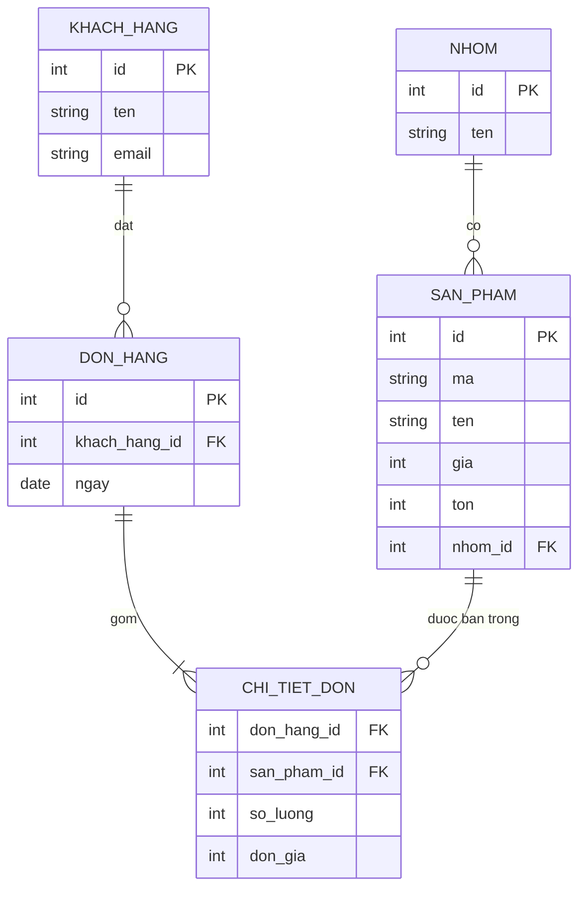

# Chương 11 — SQL cơ bản và SQLite

## Mục tiêu học

Sau chương này, bạn sẽ:

- Hiểu cơ sở dữ liệu **quan hệ**: bảng, khoá chính, khoá ngoại, ràng buộc, chỉ mục.
- Viết SQL cơ bản: `SELECT`, `WHERE`, `JOIN`, `GROUP BY`, `HAVING`, truy vấn con, `INSERT/UPDATE/DELETE`.
- Hiểu **giao dịch (transaction)** và vì sao ràng buộc bảo vệ dữ liệu.
- Biết **SQL injection** là gì và cách chặn bằng **truy vấn có tham số**.

Code mẫu: [`code/ch11-sql-sqlite/`](../../code/ch11-sql-sqlite/) — `schema.sql` (chạy được trong mọi công cụ SQLite) và chương trình console dùng `Microsoft.Data.Sqlite`.

## Vì sao học SQL khi đã có EF Core?

Chương 12–14 dùng **Entity Framework Core** để làm việc với CSDL bằng C#. EF Core chỉ là lớp phiên dịch: mọi LINQ cuối cùng thành **SQL**. Nếu không hiểu SQL bạn sẽ không đọc được câu lệnh EF sinh ra, không biết vì sao truy vấn chậm, không thiết kế được bảng đúng. Hiểu SQL là điều kiện để dùng EF hiệu quả.

## SQLite — CSDL để học

**SQLite** là CSDL nằm gọn trong **một file** (hoặc bộ nhớ), không cần cài server: hợp học tập, thử nghiệm, test, ứng dụng nhỏ. Sản phẩm thật nhiều người dùng thường chọn **PostgreSQL**, **SQL Server** hoặc **MySQL** — SQL căn bản giống nhau, khác ở chi tiết (kiểu dữ liệu, hàm ngày giờ, cú pháp phân trang). Sách dùng SQLite để mọi ví dụ chạy được ngay; các chỗ khác biệt sẽ được ghi chú.

Công cụ: `sqlite3` (dòng lệnh), **DB Browser for SQLite**, extension SQLite cho VS Code, hoặc chính chương trình mẫu.

## Mô hình quan hệ

Dữ liệu chia vào các **bảng**; mỗi bảng có **cột** (kiểu dữ liệu) và **dòng** (bản ghi). Bảng liên kết nhau bằng khoá:



- **Khoá chính (PK)**: định danh duy nhất một dòng (`id`).
- **Khoá ngoại (FK)**: cột trỏ tới khoá chính của bảng khác (`san_pham.nhom_id → nhom.id`), CSDL **bảo đảm** không trỏ vào chỗ không tồn tại.
- **Quan hệ**: 1–nhiều (một nhóm có nhiều sản phẩm), nhiều–nhiều (đơn hàng ↔ sản phẩm, qua bảng nối `chi_tiet_don` — bảng này còn mang dữ liệu riêng như số lượng, đơn giá).

**Chuẩn hoá**: mỗi sự thật chỉ lưu **một chỗ** (tên nhóm nằm ở bảng `nhom`, không lặp trên từng sản phẩm). Lưu ý `chi_tiet_don.don_gia`: **chụp lại** giá lúc bán, vì giá sản phẩm sẽ đổi mà hoá đơn cũ thì không được đổi.

## Định nghĩa bảng và ràng buộc

```sql
CREATE TABLE san_pham (
    id       INTEGER PRIMARY KEY AUTOINCREMENT,
    ma       TEXT    NOT NULL UNIQUE,
    ten      TEXT    NOT NULL,
    gia      INTEGER NOT NULL CHECK (gia >= 0),
    ton      INTEGER NOT NULL DEFAULT 0 CHECK (ton >= 0),
    nhom_id  INTEGER NOT NULL REFERENCES nhom(id)
);
CREATE INDEX ix_san_pham_nhom ON san_pham(nhom_id);
```

| Ràng buộc | Ý nghĩa |
|-----------|---------|
| `PRIMARY KEY` | định danh duy nhất, không NULL |
| `NOT NULL` | bắt buộc có giá trị |
| `UNIQUE` | không trùng (mã sản phẩm, email) |
| `CHECK (điều kiện)` | giá trị phải thoả điều kiện (giá ≥ 0) |
| `DEFAULT` | giá trị mặc định |
| `FOREIGN KEY / REFERENCES` | phải trỏ tới dòng tồn tại; `ON DELETE CASCADE/RESTRICT` quyết định khi xoá dòng cha |

**Ràng buộc là hàng phòng thủ cuối cùng.** Ứng dụng có validation (Chương 8) nhưng có bug, có nhiều ứng dụng cùng ghi vào một CSDL, có người sửa tay — chỉ CSDL mới bảo đảm dữ liệu không bao giờ sai. Chạy code mẫu, mục 9: chèn trùng mã, giá âm, nhóm không tồn tại đều bị từ chối:

```
UNIQUE constraint failed: san_pham.ma
CHECK constraint failed: gia >= 0
FOREIGN KEY constraint failed
```

(SQLite cần `PRAGMA foreign_keys = ON` cho mỗi kết nối để thực thi khoá ngoại; các CSDL khác luôn bật.)

**Kiểu tiền tệ:** đừng dùng số thực (`REAL/FLOAT`) cho tiền vì sai số (Tập 1, Chương 5). Dùng số nguyên (đồng) hoặc `DECIMAL(18,2)` ở CSDL hỗ trợ.

## Truy vấn dữ liệu

### `SELECT`, `WHERE`, `ORDER BY`, `LIMIT`

```sql
SELECT ma, ten, gia
FROM san_pham
WHERE gia >= 200000
ORDER BY gia DESC
LIMIT 3;
```

Thứ tự **xử lý** logic: `FROM` → `WHERE` → `GROUP BY` → `HAVING` → `SELECT` → `ORDER BY` → `LIMIT`. Toán tử: `= <> < > <= >=`, `AND OR NOT`, `IN (...)`, `BETWEEN a AND b`, `LIKE '%an%'`, `IS NULL` (không dùng `= NULL`). **`NULL` nghĩa là "không biết"**: `NULL = NULL` không phải đúng.

### `JOIN` — ghép bảng

```sql
SELECT sp.ma, sp.ten, n.ten AS nhom, sp.gia
FROM san_pham sp
JOIN nhom n ON n.id = sp.nhom_id        -- INNER JOIN: chỉ dòng có cặp khớp ở cả hai bảng
ORDER BY n.ten, sp.ten;
```

- **`INNER JOIN`**: chỉ giữ dòng khớp cả hai phía.
- **`LEFT JOIN`**: giữ **mọi dòng bảng trái**, phía phải không có thì `NULL`:

```sql
SELECT k.ten, COUNT(d.id) AS so_don
FROM khach_hang k
LEFT JOIN don_hang d ON d.khach_hang_id = k.id
GROUP BY k.id;
-- Le Chi: 0 don (INNER JOIN sẽ làm khách này biến mất)
```

### `GROUP BY` và hàm tổng hợp

```sql
SELECT k.ten, SUM(c.so_luong * c.don_gia) AS doanh_thu
FROM khach_hang k
JOIN don_hang d ON d.khach_hang_id = k.id
JOIN chi_tiet_don c ON c.don_hang_id = d.id
GROUP BY k.id
HAVING SUM(c.so_luong * c.don_gia) > 1000000     -- HAVING lọc SAU khi gom nhóm (WHERE lọc trước)
ORDER BY doanh_thu DESC;
```

Hàm: `COUNT`, `SUM`, `AVG`, `MIN`, `MAX`. Mọi cột trong `SELECT` không nằm trong hàm tổng hợp phải nằm trong `GROUP BY` (một số CSDL, như SQLite, nới lỏng — đừng dựa vào).

### Truy vấn con

```sql
SELECT ma, ten FROM san_pham sp
WHERE NOT EXISTS (SELECT 1 FROM chi_tiet_don c WHERE c.san_pham_id = sp.id);   -- sản phẩm chưa từng bán
```

### Ghi dữ liệu

```sql
INSERT INTO khach_hang (ten, email) VALUES ('Pham Dung', 'dung@example.com');
UPDATE san_pham SET ton = ton + 10 WHERE ma = 'TN001';
DELETE FROM khach_hang WHERE email = 'dung@example.com';
```

> **Nhớ `WHERE`!** `UPDATE`/`DELETE` thiếu `WHERE` tác động **cả bảng**. Thói quen: viết `SELECT` với cùng `WHERE` để kiểm tra trước, và thao tác quan trọng trong giao dịch.

## Chỉ mục (index)

Không có chỉ mục, tìm `WHERE ten = '...'` phải **quét toàn bộ bảng** (chậm dần theo số dòng). **Chỉ mục** là cấu trúc dữ liệu phụ (thường cây B-tree) giúp tìm nhanh, đổi lại tốn bộ nhớ và làm ghi chậm hơn một chút. `EXPLAIN QUERY PLAN` cho thấy CSDL định làm gì:

```
SEARCH san_pham USING INDEX ix_san_pham_nhom (nhom_id=?)     -- có chỉ mục: tìm nhanh
SCAN san_pham                                                -- không có: quét toàn bảng
```

Quy tắc: đặt chỉ mục trên **khoá ngoại** và các cột hay dùng trong `WHERE/JOIN/ORDER BY`; `PRIMARY KEY` và `UNIQUE` tự có chỉ mục. Đừng đặt bừa mọi cột.

## Giao dịch (transaction)

Một thao tác nghiệp vụ thường gồm nhiều lệnh (trừ kho **và** tạo đơn). Giao dịch bảo đảm **tất cả cùng thành công hoặc cùng huỷ** (nguyên tắc **ACID**: Atomicity, Consistency, Isolation, Durability):

```csharp
await using var tx = (SqliteTransaction)await conn.BeginTransactionAsync();
try
{
    await LenhTrongGiaoDichAsync(conn, tx, "UPDATE san_pham SET ton = ton - 1 WHERE ma = 'LT001'");
    await LenhTrongGiaoDichAsync(conn, tx, "INSERT INTO chi_tiet_don VALUES (999, 5, 1, 1)");  // lỗi khoá ngoại
    await tx.CommitAsync();
}
catch (SqliteException) { await tx.RollbackAsync(); }     // lệnh UPDATE trước đó cũng bị hoàn tác
```

Chạy mẫu: sau `ROLLBACK`, tồn kho `LT001` vẫn là `3`. Với EF Core (Chương 12), `SaveChanges()` tự bọc mọi thay đổi trong một giao dịch.

## SQL từ C#: truy vấn có tham số

Chương trình mẫu dùng `Microsoft.Data.Sqlite` (trình điều khiển SQLite hiện đại của .NET; các CSDL khác có `Npgsql` cho PostgreSQL, `Microsoft.Data.SqlClient` cho SQL Server — cùng mô hình):

```csharp
await using var cmd = conn.CreateCommand();
cmd.CommandText = "SELECT ten, gia FROM san_pham WHERE ten LIKE $tuKhoa AND gia <= $giaToiDa";
cmd.Parameters.AddWithValue("$tuKhoa", "%an%");
cmd.Parameters.AddWithValue("$giaToiDa", 1_000_000);
await using var r = await cmd.ExecuteReaderAsync();
while (await r.ReadAsync()) Console.WriteLine($"{r.GetString(0)} - {r.GetInt64(1):N0}");
```

Bạn sẽ hiếm khi viết mã như vậy khi đã có EF Core, nhưng cần hiểu nền tảng — và cần SQL thuần cho báo cáo phức tạp/tối ưu (Chương 13).

## SQL injection — lỗ hổng nguy hiểm bậc nhất

Khi **nối chuỗi** dữ liệu người dùng vào câu SQL, kẻ tấn công thay đổi ý nghĩa câu lệnh:

```csharp
string dauVao = "x' OR '1'='1";
string sql = $"SELECT COUNT(*) FROM khach_hang WHERE email = '{dauVao}'";     // ✘ NGUY HIỂM
// → SELECT COUNT(*) FROM khach_hang WHERE email = 'x' OR '1'='1'           → luôn đúng: trả TẤT CẢ (3 khách)
```

Ví dụ điển hình: form đăng nhập bị bypass mật khẩu; tệ hơn là `'; DROP TABLE khach_hang; --` xoá dữ liệu hoặc đánh cắp toàn bộ CSDL qua `UNION`. Nó nằm trong nhóm lỗ hổng phổ biến nhất của OWASP nhiều năm.

**Cách phòng duy nhất đáng tin: tham số hoá** — dữ liệu và lệnh đi **hai kênh riêng**, CSDL không bao giờ hiểu dữ liệu là mã:

```csharp
cmd.CommandText = "SELECT COUNT(*) FROM khach_hang WHERE email = $email";     // ✔
cmd.Parameters.AddWithValue("$email", dauVao);                                   // → 0 khách
```

Quy tắc bắt buộc:

1. **Không bao giờ** nối/nội suy dữ liệu bên ngoài vào SQL. Kể cả dữ liệu "có vẻ an toàn" (số, tham số sắp xếp).
2. Tên bảng/cột không tham số hoá được → dùng **whitelist** (chỉ chấp nhận `"gia"`, `"ten"` như Chương 14).
3. EF Core với LINQ tự tham số hoá; `FromSqlInterpolated($"... {x}")` cũng tham số hoá (khác `FromSqlRaw` với chuỗi nối — nguy hiểm).
4. Tài khoản CSDL của ứng dụng chỉ nên có quyền tối thiểu (không `DROP`).

## Lỗi thường gặp

- `UPDATE`/`DELETE` thiếu `WHERE`.
- Dùng `INNER JOIN` khi cần `LEFT JOIN` (mất dòng không có cặp), hoặc `JOIN` nhân đôi dòng rồi `SUM` sai.
- So sánh `= NULL` thay vì `IS NULL`.
- Lưu tiền bằng `REAL/FLOAT`.
- Thiếu chỉ mục trên khoá ngoại/cột lọc → chậm khi dữ liệu lớn; đặt chỉ mục thừa → ghi chậm.
- `SELECT *` trong code ứng dụng (lấy thừa cột, vỡ khi đổi schema).
- Nối chuỗi SQL với dữ liệu người dùng.
- Quên bật `foreign_keys` trên SQLite rồi thắc mắc vì sao khoá ngoại không có tác dụng.

## Bài tập

1. Viết truy vấn: 3 sản phẩm bán nhiều nhất (theo tổng số lượng) kèm tên nhóm.
2. Tìm khách hàng chưa mua sản phẩm nào thuộc nhóm "Thiet bi".
3. Thêm cột `ngay_tao` vào `san_pham` và chỉ mục cho `don_hang.ngay`; dùng `EXPLAIN QUERY PLAN` để so sánh trước/sau khi có chỉ mục khi lọc theo ngày.
4. Thử `ON DELETE CASCADE`: xoá một `don_hang` và kiểm tra `chi_tiet_don`; sau đó thử xoá một `nhom` đang có sản phẩm.
5. Viết lại đoạn "SQL injection" với dữ liệu đầu vào `'; DELETE FROM khach_hang; --` ở cả hai cách (nối chuỗi có thể chạy nhiều lệnh tuỳ trình điều khiển) và giải thích vì sao tham số hoá miễn nhiễm.
