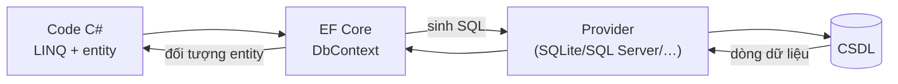

# Chương 12 — Entity Framework Core cơ bản

## Mục tiêu học

Sau chương này, bạn sẽ:

- Hiểu **ORM** và vai trò của EF Core: entity, `DbContext`, `DbSet`, **change tracking**.
- Thực hiện **CRUD** bằng LINQ; đọc được SQL mà EF sinh ra (`ToQueryString`).
- Cấu hình mô hình bằng quy ước, attribute và **Fluent API**; tạo/áp dụng **migration**.
- Phân biệt `AsNoTracking`, `ExecuteUpdate/ExecuteDelete`; hiểu `SaveChanges` là một giao dịch.

Code mẫu: [`code/ch12-efcore-co-ban/`](../../code/ch12-efcore-co-ban/) (có sẵn thư mục `Migrations/` sinh từ `dotnet ef`).

## ORM là gì?

Chương 11 bạn viết SQL và đọc từng cột bằng `r.GetString(0)` — dài dòng, dễ sai, không có kiểm tra kiểu lúc biên dịch. **ORM** (Object–Relational Mapper) ánh xạ **bảng ↔ class**, **dòng ↔ đối tượng**, **cột ↔ property**; bạn thao tác bằng C#/LINQ, ORM sinh SQL. **Entity Framework Core (EF Core)** là ORM chính thức, mã nguồn mở, đa nền tảng của .NET (hỗ trợ SQL Server, PostgreSQL, MySQL, SQLite, Cosmos DB…).



Lợi: năng suất, an toàn kiểu, tham số hoá tự động (chống SQL injection), migration, chuyển đổi CSDL dễ hơn. Cái giá: **trừu tượng che khuất SQL** — dùng bừa sẽ gây truy vấn chậm (N+1, Chương 13). Nguyên tắc: **dùng EF cho phần lớn công việc, và biết SQL để kiểm soát nó**.

## Cài đặt

```
dotnet add package Microsoft.EntityFrameworkCore.Sqlite          # provider (đổi provider = đổi CSDL)
dotnet add package Microsoft.EntityFrameworkCore.Design          # công cụ migration (PrivateAssets)
dotnet tool install --global dotnet-ef                            # lệnh dotnet ef
```

## Entity và DbContext

**Entity** là class C# thường (POCO) ứng với một bảng:

```csharp
public class SanPham
{
    public int Id { get; set; }              // quy ước: "Id" hoặc "<Tên>Id" là khoá chính
    public string Ma { get; set; } = "";
    public string Ten { get; set; } = "";
    public decimal Gia { get; set; }
    public int Ton { get; set; }
    public int NhomId { get; set; }          // khoá ngoại
    public Nhom? Nhom { get; set; }          // navigation property (Chương 13)
}
```

**`DbContext`** là đối tượng trung tâm: một **phiên làm việc** với CSDL (mẫu **Unit of Work + Repository**). Mỗi `DbSet<T>` đại diện một bảng:

```csharp
public class CuaHangDbContext : DbContext
{
    public DbSet<Nhom> Nhoms => Set<Nhom>();
    public DbSet<SanPham> SanPhams => Set<SanPham>();

    public CuaHangDbContext() { }
    public CuaHangDbContext(DbContextOptions<CuaHangDbContext> options) : base(options) { }   // dùng với DI ở web

    protected override void OnConfiguring(DbContextOptionsBuilder options)
    {
        if (!options.IsConfigured) options.UseSqlite("Data Source=cuahang.db");
    }

    protected override void OnModelCreating(ModelBuilder mb) { /* Fluent API */ }
}
```

Trong web, `DbContext` được **đăng ký DI** (`AddDbContext`, Chương 14) với vòng đời **Scoped** — một `DbContext` cho mỗi request. Trong console (như mẫu) tạo bằng `new` trong khối `await using`. **`DbContext` rẻ để tạo, ngắn để sống, và không thread-safe** — đừng dùng chung nhiều luồng, đừng giữ mãi trong Singleton.

## Cấu hình mô hình

Ba tầng, cái sau thắng cái trước:

1. **Quy ước** (mặc định): `Id` là khoá chính; `NhomId` + `Nhom` là quan hệ; `string?` cho phép NULL.
2. **Attribute** (`[Key]`, `[Required]`, `[MaxLength(100)]`, `[Column("ten")]`, `[Table("san_pham")]`, `[NotMapped]`).
3. **Fluent API** trong `OnModelCreating` — mạnh nhất, gom cấu hình ra khỏi entity (nên ưu tiên trong dự án lớn):

```csharp
mb.Entity<SanPham>(e =>
{
    e.ToTable("san_pham");
    e.HasIndex(s => s.Ma).IsUnique();
    e.Property(s => s.Ma).IsRequired().HasMaxLength(20);
    e.ToTable(t => t.HasCheckConstraint("ck_san_pham_gia", "Gia >= 0"));
    e.HasOne(s => s.Nhom).WithMany(n => n.SanPhams).HasForeignKey(s => s.NhomId)
     .OnDelete(DeleteBehavior.Restrict);               // không cho xoá nhóm còn sản phẩm
});

mb.Entity<Nhom>().HasData(new Nhom { Id = 1, Ten = "Phu kien" }, new Nhom { Id = 2, Ten = "Thiet bi" });   // dữ liệu khởi tạo
```

Ghi chú SQLite: nó không có kiểu `decimal` thật. Mẫu dùng `cfg.Properties<decimal>().HaveConversion<double>()` để `Gia` so sánh/sắp xếp/tổng được trong SQL. Với SQL Server/PostgreSQL dùng `.HasPrecision(18, 2)` và kiểu `decimal` gốc.

## Migration — quản lý phiên bản schema

Schema (bảng/cột) thay đổi theo thời gian. **Migration** là các file C# mô tả từng bước thay đổi, được sinh từ khác biệt giữa mô hình và snapshot trước đó:

```
dotnet ef migrations add KhoiTao           # sinh Migrations/2026..._KhoiTao.cs (+ Designer, Snapshot)
dotnet ef database update                  # áp dụng migration chưa chạy lên CSDL
dotnet ef migrations script                # xuất SQL để DBA xem/duyệt
dotnet ef migrations remove                # bỏ migration cuối (nếu chưa áp dụng)
```

```csharp
public partial class KhoiTao : Migration
{
    protected override void Up(MigrationBuilder mb)      // đi tới phiên bản này
    {
        mb.CreateTable(name: "san_pham", columns: table => new { ... }, constraints: table => { ... });
    }
    protected override void Down(MigrationBuilder mb) => ...   // quay lui
}
```

Quy trình: **sửa entity/cấu hình → `migrations add <Mô-tả>` → xem lại file sinh ra → `database update` → commit cả file migration vào Git**. Migration đã áp dụng lên môi trường chung **không sửa lại** — thêm migration mới. Trong code, `db.Database.Migrate()` áp dụng migration khi khởi động (thuận tiện cho dev/demo; production thường chạy bước migrate riêng trong pipeline triển khai để kiểm soát rủi ro). `EnsureCreated()` chỉ tạo bảng theo mô hình hiện tại **không** dùng migration — chỉ để thử nhanh/test, không trộn với migration.

## CRUD

### Create

```csharp
db.SanPhams.Add(new SanPham { Ma = "CH001", Ten = "Chuot khong day", Gia = 150_000, Ton = 30, NhomId = 1 });
db.SanPhams.AddRange(a, b, c);
int soDong = await db.SaveChangesAsync();      // ← MỚI ghi xuống CSDL, trong MỘT giao dịch
```

`Add` chỉ **đánh dấu** entity là "sẽ thêm" trong bộ nhớ. `SaveChanges` mới gửi SQL. Nhiều thay đổi gom lại được gửi theo **lô**, cùng một giao dịch.

### Read — LINQ thành SQL

```csharp
var truyVan = db.SanPhams
    .Where(s => s.Gia >= 200_000)
    .OrderByDescending(s => s.Gia)
    .Select(s => new { s.Ma, s.Ten, s.Gia });

Console.WriteLine(truyVan.ToQueryString());
```
```sql
SELECT "s"."Ma", "s"."Ten", "s"."Gia"
FROM "san_pham" AS "s"
WHERE "s"."Gia" >= 200000.0
ORDER BY "s"."Gia" DESC
```

`ToQueryString()` là công cụ học và gỡ lỗi quý giá. Truy vấn **chỉ chạy khi bạn duyệt/hiện thực hoá**: `ToListAsync`, `FirstOrDefaultAsync`, `SingleAsync`, `CountAsync`, `AnyAsync`, `SumAsync`… (thực thi trì hoãn, Tập 1, Chương 30 — `IQueryable` khác `IEnumerable` ở chỗ biểu thức được **dịch sang SQL** thay vì chạy trong bộ nhớ).

```csharp
await db.SanPhams.FindAsync(1);                              // theo khoá chính; kiểm tra bộ nhớ trước
await db.SanPhams.FirstOrDefaultAsync(s => s.Ma == "BP001");  // null nếu không có
await db.SanPhams.SingleAsync(s => s.Ma == "CH001");          // đúng 1 dòng, không thì ném lỗi
```

**Quan trọng:** trong `Where/Select/OrderBy` chỉ dùng thứ EF dịch được sang SQL. Gọi hàm C# tuỳ ý (`s.Ten.LamDep()`) sẽ lỗi (hoặc EF đành lấy dữ liệu về xử lý trong bộ nhớ). Với chuỗi, `Contains` dịch sang `instr`/`LIKE` **có thể phân biệt hoa/thường tuỳ CSDL** — dùng `EF.Functions.Like(...)` khi cần rõ ràng.

### Update — change tracking

```csharp
var sp = await db.SanPhams.SingleAsync(s => s.Ma == "CH001");   // "tracked": EF nhớ giá trị gốc
sp.Gia = 175_000;                                                // chỉ sửa đối tượng trong bộ nhớ
Console.WriteLine(db.Entry(sp).State);                           // Modified
await db.SaveChangesAsync();                                     // EF so sánh → UPDATE chỉ cột Gia
```

**Change tracker** theo dõi mọi entity nạp qua context. Trạng thái: `Detached`, `Unchanged`, `Added`, `Modified`, `Deleted`. `SaveChanges` sinh `INSERT/UPDATE/DELETE` tương ứng. Bạn không cần gọi "Update()" cho entity đã theo dõi.

### Delete

```csharp
var sp = await db.SanPhams.SingleAsync(s => s.Ma == "MH001");
db.SanPhams.Remove(sp);
await db.SaveChangesAsync();
```

## `AsNoTracking` — đọc thì đừng theo dõi

Với dữ liệu **chỉ để đọc/trả về API**, tracking là phí bộ nhớ và CPU:

```csharp
var ds = await db.SanPhams.AsNoTracking().ToListAsync();
// db.ChangeTracker.Entries().Count() == 0
```

Quy tắc: truy vấn **đọc** → `AsNoTracking()` (hoặc `Select` projection — không theo dõi tự nhiên); truy vấn để **sửa** → mặc định tracking.

## `ExecuteUpdate` / `ExecuteDelete` — thao tác hàng loạt

Với cập nhật/xoá nhiều dòng, nạp từng entity lên rồi sửa là lãng phí:

```csharp
int n = await db.SanPhams.Where(s => s.NhomId == 1)
    .ExecuteUpdateAsync(s => s.SetProperty(x => x.Ton, x => x.Ton + 10));     // MỘT câu UPDATE, không nạp dữ liệu
await db.SanPhams.Where(s => s.Ton == 0 && s.DaXoa).ExecuteDeleteAsync();
```

Chúng chạy **ngay** (không cần `SaveChanges`), **bỏ qua change tracker** và không kích hoạt logic của entity. Cũng là cách tăng `Ton = Ton + n` **nguyên tử** (tránh đọc-rồi-ghi gây mất cập nhật khi đồng thời).

## `SaveChanges` là một giao dịch

Mọi thay đổi trong một lần `SaveChanges` cùng thành công hoặc cùng huỷ. Mục 8 của code mẫu thêm hai sản phẩm, một hợp lệ và một trùng mã; kết quả: `DbUpdateException` và **cả hai** bị huỷ (`OK001` không tồn tại). Khi cần giao dịch bao nhiều lần `SaveChanges` hay lệnh SQL: `await using var tx = await db.Database.BeginTransactionAsync(); ... await tx.CommitAsync();`.

Vi phạm ràng buộc (UNIQUE, CHECK, FK) trở thành `DbUpdateException` với `InnerException` mang lỗi CSDL — nơi chuyển thành `409 Conflict`/`400` ở web (Chương 14).

## Xem SQL mà EF chạy

```csharp
options.LogTo(Console.WriteLine, LogLevel.Information);          // hoặc lọc theo sự kiện
options.EnableSensitiveDataLogging();                              // CHỈ dev: hiện cả giá trị tham số
```

Trong ASP.NET Core đặt mức log `Microsoft.EntityFrameworkCore.Database.Command` = `Information` trong `appsettings.json` (Chương 6). Luôn nhìn SQL khi truy vấn có vẻ chậm.

## Khi nào **không** dùng EF?

EF rất tốt cho CRUD và nghiệp vụ thông thường. Với báo cáo phức tạp, xử lý hàng triệu dòng, hoặc tối ưu tuyệt đối, dùng SQL thuần (`FromSql`, `Database.SqlQuery<T>`) hoặc micro-ORM **Dapper** cho đúng chỗ đó — có thể cùng tồn tại trong một dự án.

## Lỗi thường gặp

- Quên `SaveChanges` → "không thấy dữ liệu đâu".
- Quên `await` (hoặc dùng `.Result`) với phương thức `...Async`.
- Dùng `DbContext` dùng chung nhiều luồng (`InvalidOperationException: A second operation was started on this context`).
- `ToList()` quá sớm rồi lọc trong bộ nhớ — kéo cả bảng về (hãy `Where` trên `IQueryable`).
- Dùng hàm C# EF không dịch được trong truy vấn.
- Sửa migration đã áp dụng, hoặc quên commit file migration.
- `EnsureCreated` lẫn `Migrate` → schema không khớp.
- Lưu `decimal` trên SQLite mà không có converter → sắp xếp/tổng sai hoặc lỗi.
- `DbContext` Singleton ("captive dependency", Chương 5).

## Bài tập

1. Thêm entity `KhachHang` (Ten, Email unique), tạo migration `ThemKhachHang`, xem file sinh ra và áp dụng.
2. Viết truy vấn đếm sản phẩm theo nhóm (`GroupBy`); in SQL bằng `ToQueryString()`.
3. Viết hàm `GiamGiaNhom(int nhomId, decimal phanTram)` bằng `ExecuteUpdateAsync` và so với cách nạp-sửa-lưu; đếm số câu SQL bằng `LogTo`.
4. Cố tình `Add` hai entity, một vi phạm `CHECK` (giá âm); chứng minh bằng truy vấn rằng entity còn lại cũng không được lưu.
5. Chạy `dotnet ef migrations script` và đọc SQL của migration `KhoiTao`; đối chiếu với `schema.sql` của Chương 11.
