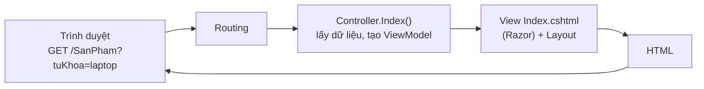

# Chương 15 — ASP.NET Core MVC

## Mục tiêu học

Sau chương này, bạn sẽ:

- Hiểu mô hình **MVC** (Model – View – Controller) và cách nó xử lý một request trả về **HTML**.
- Viết controller, action, **view Razor**, layout, partial view, **tag helper**.
- Dùng **ViewModel**, `ModelState`, `TempData`, pattern **Post–Redirect–Get** cho form.
- Biết khi nào chọn MVC, khi nào Razor Pages hay Blazor.

Code mẫu: [`code/ch15-mvc/`](../../code/ch15-mvc/) — ứng dụng quản lý sản phẩm (danh sách, tìm kiếm, phân trang, xem, thêm, sửa, xoá).

## Từ API JSON sang HTML phía server

Ở Phần 2–3 bạn trả **JSON** cho một client khác (app di động, JavaScript) lo giao diện. **MVC** cho phép server **tự dựng trang HTML** rồi gửi cho trình duyệt (*server-side rendering*). Ưu điểm: đơn giản, SEO tốt, trang hiển thị nhanh, không cần framework JavaScript nặng; hợp cho trang quản trị, website nội dung, ứng dụng nghiệp vụ nội bộ.



- **Model**: dữ liệu và nghiệp vụ (entity, dịch vụ).
- **View**: mẫu HTML (Razor `.cshtml`) — chỉ lo **hiển thị**.
- **Controller**: nhận request, gọi dịch vụ, chọn View, truyền dữ liệu — chỉ lo **điều phối**.

Tách ba phần giúp mỗi phần thay đổi/kiểm thử độc lập (đây là ứng dụng của SRP, Tập 1, Chương 42).

## Cài đặt

```csharp
builder.Services.AddControllersWithViews();                 // controller + view (khác AddControllers cho API)
...
app.UseStaticFiles();                                        // wwwroot: css, js, ảnh
app.UseRouting();
app.MapControllerRoute(name: "default", pattern: "{controller=Home}/{action=Index}/{id?}");
```

**Route quy ước** `{controller=Home}/{action=Index}/{id?}`: `/SanPham/Details/3` → `SanPhamController.Details(id: 3)`; `/` → `HomeController.Index`. (Khác Web API dùng attribute route.)

Cấu trúc thư mục:

```
ch15-mvc/
├── Controllers/HomeController.cs, SanPhamController.cs
├── Models/SanPham.cs                    # entity, ViewModel, form
├── Views/
│   ├── _ViewImports.cshtml              # @using + @addTagHelper cho mọi view
│   ├── _ViewStart.cshtml                # gán Layout mặc định
│   ├── Shared/_Layout.cshtml            # khung trang dùng chung
│   ├── Home/Index.cshtml, Loi.cshtml
│   └── SanPham/Index, Details, Form, Delete.cshtml
└── wwwroot/css/site.css
```

Quy ước: `View()` trong action `Details` của `SanPhamController` tìm `Views/SanPham/Details.cshtml`, nếu không có tìm `Views/Shared/Details.cshtml`.

## Controller và action

```csharp
public class SanPhamController(SanPhamStore store) : Controller      // DI qua primary constructor
{
    public IActionResult Index(string? tuKhoa, int trang = 1)
    {
        var (muc, tongSo) = store.Tim(tuKhoa, trang, KichThuocTrang);
        var vm = new DanhSachSanPhamViewModel { TuKhoa = tuKhoa, Trang = trang, TongTrang = ..., SanPhams = muc };
        return View(vm);                                              // truyền ViewModel làm Model của view
    }

    public IActionResult Details(int id) => store.Lay(id) is { } sp ? View(sp) : NotFound();
}
```

Tham số action được **model binding** từ route (`id`), query (`tuKhoa`, `trang`) hoặc form — như Chương 7. Kết quả `IActionResult` thường dùng: `View()`, `RedirectToAction()`, `NotFound()`, `RedirectToPage`, `Content()`, `Json()`, `File()`, `StatusCode()`.

## View Razor

Razor trộn HTML với C#: `@` đưa vào C#.

```cshtml
@model DanhSachSanPhamViewModel             @* kiểu của Model, kiểm tra lúc biên dịch *@

<h1>Sản phẩm</h1>

@foreach (var sp in Model.SanPhams)
{
    <tr class="@(sp.Ton == 0 ? "het-hang" : null)">
        <td>@sp.Ma</td>
        <td><a asp-action="Details" asp-route-id="@sp.Id">@sp.Ten</a></td>
        <td class="so">@sp.Gia.ToString("N0")</td>
    </tr>
}
@if (Model.Trang < Model.TongTrang) { <a asp-action="Index" asp-route-trang="@(Model.Trang + 1)">Sau »</a> }
```

Quy tắc cốt lõi:

- **`@expr`** *tự mã hoá HTML* (`<script>` trong dữ liệu thành `&lt;script&gt;`) — **chống XSS mặc định**. Chỉ dùng `@Html.Raw(...)` với nội dung bạn tin tưởng tuyệt đối (Chương 21).
- `@{ ... }` khối lệnh; `@if/@foreach/@switch`; `@(biểu thức phức tạp)`; `@* chú thích *@`.
- **Không nhồi logic nghiệp vụ vào view**. View chỉ định dạng dữ liệu đã chuẩn bị.
- Mã hoá Unicode: mặc định Razor mã hoá chữ tiếng Việt thành `&#x1ED9;` (trình duyệt vẫn hiển thị đúng). Để HTML nguồn đọc được, cấu hình `WebEncoderOptions` với `UnicodeRanges.All` (có trong `Program.cs` mẫu).

### Truyền dữ liệu Controller → View

| Cách | Khi nào |
|------|---------|
| **Model / ViewModel** (`@model`) | **mặc định**: kiểu mạnh, kiểm tra lúc biên dịch |
| `ViewData["Title"]` / `ViewBag.X` | mẩu dữ liệu nhỏ (tiêu đề trang) — không kiểm tra kiểu |
| `TempData` | tồn tại qua **đúng một redirect** (thông báo "Đã lưu") |

**ViewModel** là class dành riêng cho *một view*, chứa đúng những gì view cần (`DanhSachSanPhamViewModel` có từ khoá, trang, tổng trang, danh sách). Đừng đưa entity thô vào view: bạn sẽ bị kéo dính cấu trúc CSDL, và với form còn bị **over-posting** (Chương 17).

## Layout, partial view

`_Layout.cshtml` là **khung chung** (menu, footer); mỗi view chèn vào chỗ `@RenderBody()`:

```cshtml
<title>@ViewData["Title"] - Cửa hàng</title>
<nav><a asp-controller="SanPham" asp-action="Index">Sản phẩm</a> ...</nav>
<main>
    @if (TempData["ThongBao"] is string tb) { <p class="flash">@tb</p> }
    @RenderBody()
</main>
@await RenderSectionAsync("Scripts", required: false)      @* view tuỳ chọn thêm script bằng @section Scripts { ... } *@
```

`_ViewStart.cshtml` gán `Layout` cho mọi view; `_ViewImports.cshtml` khai báo `@using` và tag helper dùng chung.

**Partial view** (`<partial name="_Form" model="..." />`) là đoạn giao diện dùng lại (form dùng chung cho Thêm/Sửa). **View component** (`@await Component.InvokeAsync("GioHang")`) là partial có logic riêng (giỏ hàng trên header) nhưng vẫn tách khỏi controller.

## Tag helper

Thẻ HTML "thông minh" xử lý phía server, viết giống HTML thường:

```cshtml
<a asp-controller="SanPham" asp-action="Details" asp-route-id="@sp.Id">…</a>   @* tự sinh href /SanPham/Details/3 *@
<form method="post">…</form>                                                    @* tự thêm token chống CSRF *@
<label asp-for="Ten"></label>                                                   @* nhãn từ [Display] *@
<input asp-for="Ten" />                                                         @* name, id, value, data-val-* từ thuộc tính model *@
<span asp-validation-for="Ten"></span>                                          @* thông báo lỗi validation của Ten *@
<div asp-validation-summary="ModelOnly"></div>                                  @* lỗi chung (không gắn trường cụ thể) *@
<link rel="stylesheet" href="~/css/site.css" asp-append-version="true" />        @* thêm ?v=hash để cache bust *@
```

Ưu điểm so với tự viết `href="/SanPham/Details/3"`: **URL sinh từ routing** — đổi route không phải sửa mọi link; đúng dù ứng dụng chạy dưới thư mục con (`/app`).

## Form và validation

```csharp
// GET: hiện form rỗng
public IActionResult Create() => View("Form", new SanPhamForm());

// POST: xử lý
[HttpPost, ValidateAntiForgeryToken]
public IActionResult Create(SanPhamForm form)
{
    if (store.TonTaiMa(form.Ma ?? ""))
        ModelState.AddModelError(nameof(form.Ma), "Mã sản phẩm đã tồn tại");   // lỗi nghiệp vụ gắn vào ô "Ma"

    if (!ModelState.IsValid)
        return View("Form", form);                        // hiện lại form + lỗi + dữ liệu đã nhập

    var sp = store.Them(form);
    TempData["ThongBao"] = $"Đã thêm sản phẩm {sp.Ten}";
    return RedirectToAction(nameof(Details), new { id = sp.Id });    // Post-Redirect-Get
}
```

Thứ tự luôn là: **bind** → **validate** (DataAnnotations tự chạy, điền `ModelState`) → **kiểm tra nghiệp vụ** (thêm lỗi vào `ModelState`) → nếu sai **trả lại view** chứa form; nếu đúng **ghi dữ liệu rồi redirect**. Trong `Form.cshtml`, tag helper hiện lỗi cạnh từng ô.

Chạy code mẫu và thử `POST` thiếu token → `400`; sai dữ liệu → `200` kèm thông báo tiếng Việt và giá trị đã nhập; hợp lệ → `302` tới trang chi tiết. Chương 17 nói kỹ Post–Redirect–Get, chống CSRF, over-posting, tải file.

**Xoá luôn là `POST`** (không bao giờ `GET`): trình duyệt/crawler/bộ tải trước có thể gọi `GET` bất kỳ lúc nào (Chương 1). Mẫu có trang xác nhận (`GET /SanPham/Delete/3`) và `POST` thực hiện.

## Xử lý lỗi

Ở môi trường thường: `app.UseExceptionHandler("/Home/Loi")` — hiện trang lỗi thân thiện (kèm mã theo dõi), **không** lộ stack trace. `NotFound()` trả `404`; muốn trang 404 đẹp dùng `app.UseStatusCodePagesWithReExecute("/Home/Loi", "?ma={0}")`.

## Khi nào MVC, Razor Pages, Blazor?

| | MVC | Razor Pages | Blazor |
|---|-----|-------------|--------|
| Đơn vị | controller + action + view (tách 3 nơi) | **trang** = file `.cshtml` + PageModel | **component** |
| Hợp với | ứng dụng lớn nhiều hành vi, dùng chung logic nhiều view; trả cả HTML lẫn API | trang theo tính năng, form CRUD, nội dung | giao diện **tương tác** cao, viết bằng C# |
| Mức "nghi thức" | nhiều hơn | ít hơn, code gần giao diện | khác hẳn (Chương 18) |

Cả ba dùng chung nền tảng và có thể **cùng tồn tại trong một dự án**. Cho ứng dụng theo trang (đa số trang quản trị/CRUD), Microsoft khuyến nghị Razor Pages là điểm bắt đầu đơn giản; MVC vẫn phổ biến trong hệ thống có sẵn và nhiều đội yêu thích.

## Lỗi thường gặp

- `InvalidOperationException: The view 'X' was not found` — sai tên/thư mục view; view không nằm trong `Views/<Controller>/`.
- `InvalidOperationException: The model item passed into the ViewDataDictionary is of type 'A' but this ViewDataDictionary instance requires 'B'` — truyền sai kiểu model.
- `400` khi POST form: thiếu token chống CSRF (form viết tay không dùng tag helper) hoặc `ModelState` không hợp lệ.
- Quên `return` sau `ModelState` lỗi, hoặc quên redirect sau POST (F5 gửi lại form).
- `NullReferenceException` trong view vì model `null`.
- Nhồi logic truy vấn/nghiệp vụ vào view hoặc controller.
- Xoá/sửa bằng `GET`.
- Dùng entity làm model của form (over-posting).

## Bài tập

1. Thêm sắp xếp (`sapXep=gia|ten`) cho trang danh sách với liên kết trên tiêu đề cột.
2. Tách form thành partial view `_SanPhamForm` dùng lại ở nơi khác.
3. Viết view component `SanPhamSapHet` hiển thị 3 sản phẩm tồn thấp nhất ở thanh bên.
4. Thêm trang `/Home/Loi` khác nhau cho `404` bằng `UseStatusCodePagesWithReExecute`.
5. Thay `SanPhamStore` bằng EF Core + SQLite (Chương 12–14) mà **không sửa controller/view** — chỉ đổi cài đặt dịch vụ; ghi lại những gì phải đổi.
