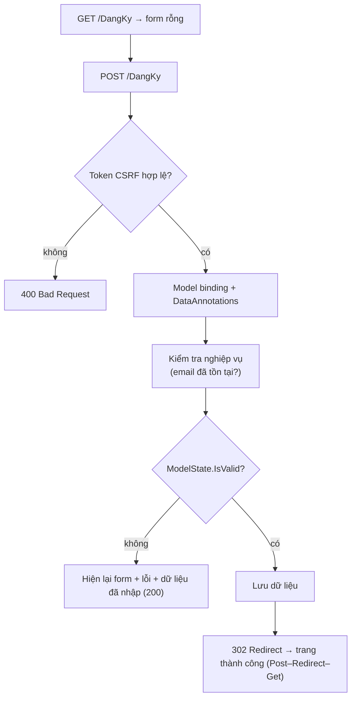

# Chương 17 — Form, validation phía server và chống CSRF

## Mục tiêu học

Sau chương này, bạn sẽ:

- Thiết kế form **đúng luồng**: bind → validate → nghiệp vụ → **Post–Redirect–Get**.
- Hiểu và chống **CSRF** bằng **antiforgery token** (cho form và cho Minimal API/JS).
- Phòng **over-posting**, xử lý **mật khẩu** đúng cách (băm, không lưu plaintext), **tải file lên** an toàn.
- Phân biệt validation phía client (UX) và phía server (bắt buộc).

Code mẫu: [`code/ch17-form-validation/`](../../code/ch17-form-validation/) — form đăng ký (Razor Pages) và API tải ảnh (Minimal API).

## Form là ranh giới không tin cậy

Mọi thứ đến từ form/query/header/file đều là **dữ liệu không tin cậy** — kẻ tấn công không dùng form của bạn, họ gửi request bằng `curl`. Vì vậy:

1. **Validate lại ở server** mọi thứ (client-side chỉ để tiện cho người dùng).
2. **Chỉ nhận đúng các trường** bạn cần.
3. **Mã hoá đầu ra** khi hiển thị (Razor tự làm).
4. **Không bao giờ dựa vào** phần tử ẩn, `disabled`, `maxlength` của HTML để bảo vệ.

## Luồng chuẩn xử lý form



### Post–Redirect–Get (PRG)

Nếu sau `POST` thành công bạn **trả luôn trang HTML**, trình duyệt ghi nhớ đó là kết quả của một `POST`; người dùng nhấn **F5 (tải lại)** → trình duyệt hỏi "gửi lại biểu mẫu?" → đăng ký **hai lần** / đặt hàng **hai lần**. Giải pháp: sau `POST` thành công **redirect (`302/303`)** tới một trang `GET`:

```csharp
return RedirectToPage("ThanhCong", new { id = nd.Id });     // 302 Location: /ThanhCong/1
```

`F5` giờ chỉ tải lại trang `GET` vô hại. Thông báo "đã lưu" đi qua redirect bằng `TempData` (Chương 15). Khi validation **thất bại** thì *không* redirect: trả lại form (`return Page()`) để giữ dữ liệu người dùng đã nhập.

## Validation phía server

```csharp
public class DangKyInput
{
    [Required(ErrorMessage = "Vui lòng nhập họ tên")]
    [StringLength(80, MinimumLength = 2)]
    public string? HoTen { get; set; }

    [Required, EmailAddress] public string? Email { get; set; }

    [Required, TuoiToiThieu(16), DataType(DataType.Date)]
    public DateOnly? NgaySinh { get; set; }

    [Required, StringLength(64, MinimumLength = 8)]
    [RegularExpression(@"^(?=.*[A-Za-z])(?=.*\d).+$", ErrorMessage = "Mật khẩu phải có cả chữ và số")]
    [DataType(DataType.Password)]
    public string? MatKhau { get; set; }

    [Compare(nameof(MatKhau), ErrorMessage = "Mật khẩu xác nhận không khớp")]
    public string? XacNhan { get; set; }

    [Range(typeof(bool), "true", "true", ErrorMessage = "Bạn phải đồng ý điều khoản")]   // checkbox bắt buộc tích
    public bool DongY { get; set; }
}
```

Điểm mới so với Chương 8:

- **`[Compare]`** đối chiếu hai trường (xác nhận mật khẩu).
- **Attribute tự viết có tham số** `[TuoiToiThieu(16)]`: tính tuổi từ `DateOnly` (chú ý cả tháng/ngày sinh chưa tới trong năm).
- **`bool` "phải tích"**: `[Range(typeof(bool), "true", "true")]`.
- `DateOnly?`/`DateTime?` nullable để phân biệt "chưa nhập" với giá trị mặc định.
- Checkbox HTML chỉ gửi khi được tích; tag helper thêm input ẩn `false` cùng tên nên bind về `bool` đúng (hai giá trị `true,false` khi tích).
- Thông báo lỗi tuỳ biến cả cho **lỗi bind kiểu** (chữ vào ô số) bằng localization (`ModelBindingMessageProvider`) — mặc định là tiếng Anh ("The field Giá must be a number").

Kết quả thực tế khi gửi form gần như rỗng:

```
Input.HoTen   → Vui lòng nhập họ tên
Input.Email   → Email không đúng định dạng
Input.NgaySinh→ Bạn phải từ 16 tuổi trở lên
Input.MatKhau → Mật khẩu phải có cả chữ và số
Input.XacNhan → Mật khẩu xác nhận không khớp
Input.DongY   → Bạn phải đồng ý điều khoản
```

### Kiểm tra nghiệp vụ

Chuyện cần dữ liệu ngoài (email đã dùng chưa) không hợp làm attribute. Viết trong handler và **gắn vào trường** để hiện cạnh ô:

```csharp
if (!string.IsNullOrWhiteSpace(Input.Email) && store.TonTaiEmail(Input.Email))
    ModelState.AddModelError("Input.Email", "Email này đã được đăng ký");
```

Tránh **user enumeration**: với form *đăng nhập/quên mật khẩu* đừng tiết lộ "email không tồn tại" — dùng thông báo chung. (Đăng ký bắt buộc phải báo trùng, nhưng nên giới hạn tốc độ — Chương 21.)

### Validation phía client

`asp-for` sinh thuộc tính `data-val-*` (xem HTML nguồn: `data-val-required`, `data-val-regex-pattern`...). Thư viện **jQuery Validation + Unobtrusive Validation** đọc chúng để báo lỗi **ngay trên trình duyệt**, không cần gửi lên server → trải nghiệm tốt hơn. Nó **tuỳ chọn** (thêm `<partial name="_ValidationScriptsPartial" />`), chỉ là tiện ích UX: server vẫn phải validate lại như trên. (Blazor có cơ chế riêng — Chương 18.)

## Chống CSRF

**CSRF** (Cross-Site Request Forgery): kẻ tấn công dụ người dùng *đã đăng nhập* vào bank.example mở trang `evil.example`, trang đó có form ẩn tự gửi `POST bank.example/chuyen-tien`. Trình duyệt **tự đính kèm cookie đăng nhập** của bank.example → server tưởng là người dùng thật.

**Antiforgery token** chặn điều này: server phát một token ngẫu nhiên vừa đặt trong **cookie**, vừa nhúng vào **form ẩn**; khi `POST`, phải gửi *cả hai* và chúng phải khớp. Trang của kẻ tấn công không đọc được token (same-origin policy) nên không giả mạo được.

- **Razor Pages**: tự động (kiểm tra mọi `POST/PUT/DELETE` mặc định). **MVC**: `[ValidateAntiForgeryToken]` hoặc filter toàn cục `AutoValidateAntiforgeryToken`.
- Tag helper `<form method="post">` **tự chèn** `<input type="hidden" name="__RequestVerificationToken" value="...">`. Form viết tay bằng HTML thuần thì **thiếu token → `400`** (thử `POST` thiếu token trong code mẫu).
- **Minimal API**: `app.UseAntiforgery()` (sau `UseRouting`, và sau xác thực nếu có); endpoint nhận `[FromForm]` **bắt buộc** token (mặc định). Cho JavaScript: lấy token qua `IAntiforgery.GetAndStoreTokens` và gửi trong header (mẫu dùng `X-CSRF-TOKEN`):

```csharp
builder.Services.AddAntiforgery(o => o.HeaderName = "X-CSRF-TOKEN");
app.MapGet("/api/csrf", (IAntiforgery af, HttpContext ctx) => new { token = af.GetAndStoreTokens(ctx).RequestToken });
```
```
curl -c jar http://localhost:5000/api/csrf            # nhận token + cookie
curl -b jar -X POST /api/tai-len -H "X-CSRF-TOKEN: <token>" -F tep=@anh.png
```

- **API xác thực bằng token trong header `Authorization: Bearer`** (JWT — Chương 20) **không** bị CSRF (trình duyệt không tự gắn header đó) nên tắt antiforgery được (`.DisableAntiforgery()`); nguy cơ chỉ có khi xác thực bằng **cookie**.
- Bổ sung: cookie `SameSite=Lax/Strict` (mặc định hiện đại), `POST` cho mọi thao tác đổi dữ liệu, không bao giờ để `GET` thay đổi trạng thái.

## Over-posting (mass assignment)

Nếu action nhận **entity** (`SanPham` có `GiaVon`, `IsAdmin`...), kẻ tấn công thêm `GiaVon=1` vào request và nó được gán. Quy tắc: **bind vào kiểu Input/ViewModel/DTO** chỉ chứa trường cho phép; hoặc dùng `[Bind("Ten,Gia")]` (whitelist, kém khuyến khích vì dễ sót). Khi sửa: tải entity thật và **chỉ gán các trường cho phép** từ Input.

## Mật khẩu

**Không bao giờ lưu mật khẩu dạng gốc, cũng không dùng SHA/MD5 thuần.** Dùng hàm băm **chậm, có muối**: PBKDF2/bcrypt/scrypt/Argon2. ASP.NET Core có sẵn `PasswordHasher<T>` (PBKDF2 + salt ngẫu nhiên + tham số lặp, tự nâng cấp về sau):

```csharp
var bam = new PasswordHasher<object>();
string luu = bam.HashPassword(new object(), matKhau);                             // lưu chuỗi này
var kq = bam.VerifyHashedPassword(new object(), luu, matKhauNhap);               // Success / Failed / SuccessRehashNeeded
```

Trong thực tế bạn dùng **ASP.NET Core Identity** (Chương 20) đã gói sẵn việc này. Ngoài ra: tránh dán lại mật khẩu vào form khi lỗi (`asp-for` với `type=password` không tự điền lại), đặt `autocomplete="new-password"`, luôn dùng HTTPS, giới hạn số lần thử.

## Tải file lên (upload)

```csharp
app.MapPost("/api/tai-len", async ([FromForm] IFormFile? tep, IWebHostEnvironment env, CancellationToken ct) =>
{
    if (tep is null || tep.Length == 0) return Results.BadRequest("Chua chon tep");
    if (tep.Length > 1_000_000) return Results.BadRequest("Tep toi da 1 MB");

    string duoi = Path.GetExtension(tep.FileName).ToLowerInvariant();
    if (duoi is not (".png" or ".jpg" or ".jpeg")) return Results.BadRequest("Chi nhan .png, .jpg");
    if (!KiemTraDauTep.LaAnh(tep)) return Results.BadRequest("Noi dung tep khong phai anh");     // magic bytes

    string tenLuu = $"{Guid.NewGuid():N}{duoi}";                        // tên MỚI do server đặt
    await using var fs = File.Create(Path.Combine(thuMuc, tenLuu));
    await tep.CopyToAsync(fs, ct);
    return Results.Ok(new { tenGoc = Path.GetFileName(tep.FileName), tenLuu });
});
```

Danh sách kiểm tra bảo mật (mỗi mục ứng với một kiểu tấn công thật):

| Rủi ro | Phòng |
|--------|-------|
| Tệp khổng lồ (DoS) | giới hạn `MaxRequestBodySize` của Kestrel + `tep.Length` |
| Tệp thực thi giả dạng ảnh (`x.exe`, `.php`, `.html`) | **whitelist** đuôi tệp |
| Đổi đuôi `.png` cho tệp độc hại | kiểm tra **nội dung** (magic bytes PNG `89 50 4E 47`, JPEG `FF D8 FF`), tốt nhất xử lý lại ảnh bằng thư viện |
| **Path traversal** (`../../evil`) | **không dùng tên client gửi**; đặt tên mới (GUID) và `Path.GetFileName` nếu phải hiển thị |
| Ghi đè tệp có sẵn | tên ngẫu nhiên |
| Chạy tệp đã tải | lưu **ngoài** thư mục web (`wwwroot`) hoặc ở blob storage; phục vụ qua endpoint có kiểm soát, đặt `Content-Type` cố định + `X-Content-Type-Options: nosniff` |
| Không tin `Content-Type`/tên tệp do client khai báo | như trên |
| Quét virus | với ứng dụng nhận tệp của người lạ |

Từ form HTML: `<form method="post" enctype="multipart/form-data"><input type="file" name="tep"></form>`; với nhiều tệp `IFormFileCollection`/`List<IFormFile>`. Tệp lớn: stream thẳng xuống đĩa/kho thay vì đệm bộ nhớ.

## Lỗi thường gặp

- Chỉ validate ở client.
- Trả trang HTML sau `POST` thành công (không PRG).
- Form tự viết thiếu token → `400`.
- Bind thẳng entity (over-posting).
- Lưu mật khẩu plaintext/hash thô; điền lại mật khẩu vào form khi có lỗi.
- Dùng `ModelState.AddModelError("Email", ...)` khi trường tên `Input.Email` — lỗi không hiện cạnh ô.
- Dùng tên tệp client gửi để lưu (path traversal); lưu tệp tải lên trong `wwwroot` cho phép chạy.
- Tiết lộ thông tin nhạy cảm qua thông báo lỗi ("email không tồn tại").
- Quên PRG khi validation thành công nhưng trả `Page()`.

## Bài tập

1. Thêm ô "Số điện thoại" chỉ chấp nhận số điện thoại Việt Nam bằng attribute tự viết `[SoDienThoaiVn]`.
2. Cho phép tải ảnh đại diện ngay trong form đăng ký (`IFormFile` trong `DangKyInput`, `enctype="multipart/form-data"`), áp dụng đầy đủ danh sách kiểm tra ở trên.
3. Viết test tích hợp (Chương 10) cho `DangKy`: lấy token từ HTML bằng regex, gửi form sai/đúng, kiểm tra `302` tới `ThanhCong` và `400` khi thiếu token.
4. Cố tình tắt `UseAntiforgery`/đổi form không có token, quan sát và giải thích thông báo.
5. Thêm trang "Đăng nhập" dùng `PasswordHasher.VerifyHashedPassword`, và thông báo lỗi chung "Email hoặc mật khẩu không đúng".
