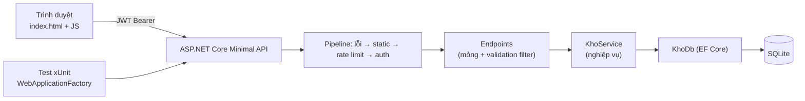

# Chương 22 — Dự án tổng hợp Tập 2: Web quản lý kho

## Mục tiêu học

Sau chương này, bạn sẽ:

- Ghép mọi kiến thức Tập 2 thành **một hệ thống web hoàn chỉnh**: API + CSDL + xác thực + giao diện + kiểm thử.
- Thấy cách **đưa quy tắc nghiệp vụ của Tập 1 lên web** và xử lý đúng bài toán **đồng thời**.
- Có bộ khung dự án để mở rộng và tái cấu trúc sang **kiến trúc sạch** ở Tập 3.

Code đầy đủ: [`code/ch22-du-an-tong-hop/`](../../code/ch22-du-an-tong-hop/) — `QuanLyKhoWeb` (ứng dụng) + `QuanLyKhoWeb.Tests` (**14 test tích hợp đều đạt**).

## Bài toán

Web hoá ứng dụng console *Quản lý kho* của Tập 1 (Chương 43) — nhiều nhân viên cùng thao tác:

| # | Yêu cầu |
|---|---------|
| 1 | Đăng nhập; vai trò **Admin** (thêm sản phẩm) và **NhanVien** (nhập/xuất kho) |
| 2 | Xem/tìm kiếm/phân trang sản phẩm; báo cáo theo nhóm; danh sách **sắp hết hàng**; lịch sử giao dịch |
| 3 | **Nhập kho** và **xuất kho** — tồn kho **không bao giờ âm** kể cả khi nhiều người xuất cùng lúc |
| 4 | Ghi lại **ai** thực hiện giao dịch nào, khi nào |
| 5 | Lỗi trả đúng chuẩn (ProblemDetails); tài liệu OpenAPI; health check; giới hạn tốc độ đăng nhập |
| 6 | Một trang web đơn giản gọi API |

## Kiến trúc



```
QuanLyKhoWeb/
├── Program.cs                 # cấu hình: options, EF, JWT, policy, rate limit, lỗi, OpenAPI
├── Data/KhoDb.cs              # entity SanPham, GiaoDich + DbContext + ràng buộc CHECK/UNIQUE
├── Services/
│   ├── KhoService.cs          # nghiệp vụ + DTO + lỗi nghiệp vụ
│   └── XacThuc.cs             # tài khoản, phát hành JWT
├── Endpoints/KhoEndpoints.cs  # route + phân quyền + validation
├── Migrations/                # từ `dotnet ef migrations add`
└── wwwroot/index.html         # giao diện đơn giản
```

Kiến thức của các chương được dùng ở đâu:

| Chương | Nơi dùng |
|--------|----------|
| 3 Middleware | thứ tự `UseExceptionHandler → UseStaticFiles → UseRateLimiter → UseAuthentication → UseAuthorization` |
| 4 Minimal API | `MapGroup("/api")`, `Results<...>`, endpoint filter |
| 5 DI | `KhoService` Scoped, `TaiKhoanService`/`PhatHanhToken` Singleton, `TimeProvider` |
| 6 Cấu hình | `JwtOptions` + `ValidateOnStart`; `MigrateOnStartup`; bí mật ngoài Git |
| 8, 9 | DTO, validation, `IExceptionHandler`, ProblemDetails, OpenAPI |
| 10, 14 | `WebApplicationFactory`, CSDL thật trong test |
| 11–14 EF Core | ràng buộc, `ExecuteUpdate`, projection, transaction, migration |
| 20, 21 | JWT, policy theo vai trò, `FallbackPolicy`, rate limiting, mã hoá đầu ra |
| Tập 1 | record, LINQ, async, exception nghiệp vụ, `TimeProvider`, SOLID |

## Những quyết định thiết kế đáng chú ý

### 1. An toàn theo mặc định

```csharp
builder.Services.AddAuthorizationBuilder()
    .SetFallbackPolicy(new AuthorizationPolicyBuilder().RequireAuthenticatedUser().Build())    // MẶC ĐỊNH: phải đăng nhập
    .AddPolicy("GhiKho", p => p.RequireRole(VaiTro.NhanVien, VaiTro.Admin))
    .AddPolicy("QuanTri", p => p.RequireRole(VaiTro.Admin));
```

Mọi endpoint **mới** tự động bị bảo vệ; muốn công khai phải `AllowAnonymous()` tường minh (đăng nhập, health, OpenAPI). Quên gắn `[Authorize]` không còn là lỗ hổng. Test `KhongDangNhap_MoiEndpointTra401` khoá hành vi này.

### 2. Cấu hình phải hợp lệ mới cho chạy

`Jwt:Khoa` ngắn hơn 32 ký tự → ứng dụng **từ chối khởi động** (`ValidateOnStart`). Khoá phát triển chỉ được điền tự động ở `Development`; production phải cấp bằng biến môi trường `Jwt__Khoa`. Tránh triển khai nhầm khoá mặc định.

### 3. Bài toán đồng thời — điểm quan trọng nhất

Ở Tập 1, `KhoService` giữ dữ liệu trong bộ nhớ của **một** tiến trình, một luồng. Trên web: nhiều request song song, có thể nhiều instance. Kiểu "đọc `TonKho` → kiểm tra đủ → trừ → ghi lại" có **race condition** (hai người cùng đọc `5`, cùng trừ `4` → âm kho). Giải pháp của dự án: đưa điều kiện **vào chính câu lệnh cập nhật**:

```csharp
await using var tx = await db.Database.BeginTransactionAsync(ct);
int n = await db.SanPhams.Where(s => s.Id == id && s.TonKho >= soLuong)               // điều kiện đủ hàng NẰM TRONG câu UPDATE
    .ExecuteUpdateAsync(s => s.SetProperty(x => x.TonKho, x => x.TonKho - soLuong), ct);

if (n == 0)                                                                            // không dòng nào được cập nhật → giải thích vì sao
{
    var sp = await db.SanPhams.AsNoTracking().FirstOrDefaultAsync(s => s.Id == id, ct)
        ?? throw new KhongTimThayException(...);
    throw new KhongDuHangException(sp.Ma, soLuong, sp.TonKho);
}
db.GiaoDichs.Add(new GiaoDich { ... });                                                // ghi lịch sử cùng giao dịch
await db.SaveChangesAsync(ct);
await tx.CommitAsync(ct);
```

`UPDATE san_pham SET TonKho = TonKho - @n WHERE Id = @id AND TonKho >= @n` là **nguyên tử** ở CSDL: không cần khoá ứng dụng, không cần token đồng thời, đúng ngay cả khi có nhiều instance. Ràng buộc `CHECK (TonKho >= 0)` là lưới an toàn thứ hai. Thử bằng test:

```csharp
// 20 yêu cầu xuất 1 đơn vị đồng thời cho sản phẩm chỉ còn 5
var ketQua = await Task.WhenAll(Enumerable.Range(0, 20).Select(_ => admin.PostAsJsonAsync($"/api/san-pham/{id}/xuat", new { soLuong = 1 })));
Assert.Equal(5, ketQua.Count(r => r.StatusCode == HttpStatusCode.OK));         // đúng 5 lần thành công
Assert.Equal(15, ketQua.Count(r => r.StatusCode == HttpStatusCode.Conflict));  // 15 lần 409
// tồn cuối = 0, không bao giờ âm
```

### 4. Bài học từ khi viết test (những lỗi thật đã gặp)

- **SQLite in-memory dùng chung một kết nối** (như Chương 14) không phản ánh đúng tình huống đồng thời: các transaction của nhiều request dẫm lên nhau trên cùng một kết nối và test cho kết quả sai (chỉ 3 thay vì 5 lần thành công). Với test đồng thời hãy dùng **file SQLite tạm** (mỗi request một kết nối như production) và `Default Timeout` để chờ khoá ghi thay vì lỗi "database is locked". Nguyên tắc: *môi trường test phải giữ đúng tính chất mà bạn đang kiểm thử*.
- **SQLite không `SUM` được biểu thức `decimal`** (`TonKho * DonGia`): endpoint báo cáo trả `500` cho đến khi tính bằng `double` trong SQL rồi đổi về `decimal`. Trên SQL Server/PostgreSQL viết thẳng. Lỗi này **chỉ lộ nhờ test tích hợp**, không phải unit test nghiệp vụ — minh hoạ giá trị của chương 10/14.

### 5. Ghi nhận người thực hiện

Tên người dùng lấy từ **claim của token** (`user.Identity.Name`) — *không* nhận từ body request (client có thể giả mạo). Lịch sử giao dịch (`GiaoDich.NguoiThucHien`) nhờ vậy đáng tin cậy để kiểm toán.

### 6. Giao diện đơn giản

`wwwroot/index.html` (HTML + JS thuần) đăng nhập, lấy JWT, gọi API bằng `fetch`, hiển thị danh sách, nhập/xuất kho. Cùng origin nên không cần CORS. Lưu ý ba điểm: dữ liệu chèn vào HTML đi qua hàm `esc()` (mã hoá, Chương 21); token giữ trong bộ nhớ trang (mất khi tải lại — đơn giản cho demo); ứng dụng thật dùng cookie `HttpOnly` hoặc OpenID Connect. Bạn hoàn toàn có thể thay bằng Blazor/Razor Pages/React gọi cùng API — đó là lợi thế của việc tách **API** khỏi **giao diện**.

## Chạy và thử

```
cd QuanLyKhoWeb
dotnet run                          # tự migrate + nạp dữ liệu mẫu; mở http://localhost:<cổng>/ và /scalar/v1
```

Tài khoản mẫu: `admin / Admin@123` (Admin), `nhanvien / NhanVien@123` (NhanVien). Thử bằng `curl`:

```
TOKEN=$(curl -s -X POST http://localhost:5000/api/dang-nhap -H "Content-Type: application/json" \
        -d '{"tenDangNhap":"nhanvien","matKhau":"NhanVien@123"}' | sed 's/.*"accessToken":"//;s/".*//')
curl -H "Authorization: Bearer $TOKEN" "http://localhost:5000/api/san-pham?tim=laptop"
curl -X POST -H "Authorization: Bearer $TOKEN" -H "Content-Type: application/json" \
     -d '{"soLuong":99}' http://localhost:5000/api/san-pham/1/xuat            # 409: không đủ hàng
dotnet test ../QuanLyKhoWeb.Tests
```

## Mở rộng (bài tập lớn)

1. **Xoá mềm** sản phẩm (Chương 13) và khôi phục; chỉ Admin.
2. **Nhiều kho** (`MaKho`): tồn kho theo từng kho, chuyển kho (một giao dịch trừ ở kho A, cộng ở kho B).
3. **Phiếu xuất/nhập nhiều dòng** (một phiếu gồm nhiều sản phẩm) — dùng transaction và xử lý thứ tự khoá tránh deadlock.
4. **Xuất báo cáo CSV/Excel** endpoint `GET /api/bao-cao/nhom.csv` (Tập 1, Chương 36).
5. Thay `TaiKhoanService` bằng **ASP.NET Core Identity** (+ refresh token) hoặc **OpenID Connect** (Chương 20).
6. Chuyển giao diện sang **Blazor** hoặc **Razor Pages**, giữ nguyên API (hoặc gọi thẳng dịch vụ).
7. **Phân trang keyset** cho lịch sử giao dịch; index `(SanPhamId, ThoiGian)` đã có sẵn.
8. Đổi provider sang **PostgreSQL** và ghi lại mọi thay đổi bạn phải làm (decimal, `Like`, migration).
9. **Idempotency-Key** cho `POST xuat` để gửi lại không trừ hai lần (Chương 19; Tập 3).

## Hướng tới Tập 3

Dự án này là **kiến trúc "một khối" đơn giản**: endpoint gọi thẳng `KhoService`, `KhoService` dùng thẳng `DbContext`. Với hệ thống lớn, Tập 3 sẽ **tái cấu trúc** theo **Clean Architecture** (Domain / Application / Infrastructure / Web), tách **CQRS** (lệnh và truy vấn), dùng **Result pattern**, sự kiện miền, hàng đợi/nền, cache, quan sát (OpenTelemetry), **Docker**, **CI/CD** và triển khai lên đám mây — trên chính bài toán này.

**Chúc mừng bạn đã hoàn thành Tập 2!** Bạn đã xây được ứng dụng web thực thụ với ASP.NET Core; sẵn sàng cho các vấn đề của hệ thống lớn ở Tập 3.
