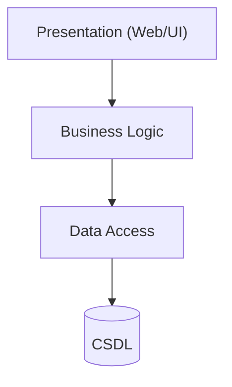
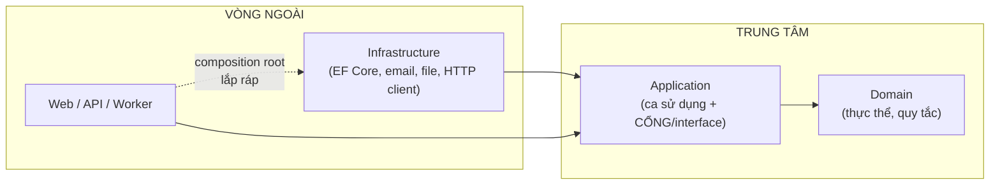

# Chương 1 — Từ khối đơn nhất đến kiến trúc phân lớp

## Mục tiêu học

Sau chương này, bạn sẽ:

- Nhận ra các dấu hiệu của **"quả cầu bùn" (big ball of mud)** và hiểu vì sao kiến trúc quan trọng khi hệ thống lớn dần.
- Nắm **Layered, Onion, Hexagonal (Ports & Adapters), Clean Architecture** và điểm chung: **quy tắc phụ thuộc**.
- Biết cách chia solution thành **Domain / Application / Infrastructure / Web**.
- Biến quy tắc kiến trúc thành **kiểm thử tự động**.

Code mẫu: [`code/ch01-kien-truc/`](../../code/ch01-kien-truc/) — bộ khung 4 tầng cực nhỏ kèm 6 **architecture test** (đều đạt).

> Tập 3 giả định bạn đã đọc Tập 1–2. Dự án Chương 22 (Tập 2) chính là "điểm xuất phát" ta sẽ tái cấu trúc.

## Vấn đề: hệ thống lớn lên

Dự án Chương 22 chạy tốt: endpoint gọi `KhoService`, `KhoService` dùng thẳng `DbContext`. Với 4 màn hình điều đó ổn. Nhưng sau hai năm, 40 đội tính năng, 300 endpoint:

- Logic nghiệp vụ **rải khắp**: một phần trong endpoint, một phần trong service, một phần trong câu SQL, một phần trong JavaScript.
- Thay đổi cách lưu trữ (đổi CSDL, thêm cache) làm **vỡ** nghiệp vụ; sửa nghiệp vụ lại đụng vào code truy cập dữ liệu.
- **Không test được** nghiệp vụ nếu không dựng cả CSDL và HTTP.
- Ai cũng gọi mọi thứ: `Controller → DbContext → Controller khác`... phụ thuộc chằng chịt (vòng tròn).
- Người mới mất vài tuần để hiểu "cái gì ở đâu".

Đó là **big ball of mud**: mọi thứ phụ thuộc mọi thứ. Kiến trúc là tập quy tắc **giới hạn ai được phụ thuộc ai** để thay đổi ở một nơi không lan ra khắp nơi.

> **Đừng vội "kiến trúc hoá".** Với ứng dụng CRUD nhỏ, kiến trúc một khối như Tập 2 là **lựa chọn đúng** (đơn giản hơn = ít lỗi hơn). Kiến trúc phân lớp trả giá bằng nhiều project, nhiều ánh xạ, nhiều "nghi thức" — chỉ đáng khi **độ phức tạp nghiệp vụ** hoặc **quy mô đội/vòng đời** đủ lớn. Hãy tiến hoá dần: bắt đầu đơn giản, tách khi cơn đau xuất hiện.

## Kiến trúc phân lớp truyền thống (N-tier)



Phụ thuộc đi **một chiều từ trên xuống**: giao diện → nghiệp vụ → truy cập dữ liệu. Đơn giản, quen thuộc. Vấn đề: **nghiệp vụ phụ thuộc vào tầng dữ liệu** (nó gọi `DbContext`/repository cụ thể) — nên kiểu CSDL, cấu trúc bảng, ORM "rò rỉ" vào nghiệp vụ; nghiệp vụ khó test và bị ràng buộc với công nghệ.

## Đảo ngược phụ thuộc: Onion / Hexagonal / Clean

Ba tên gọi (Jeffrey Palermo — *Onion*, Alistair Cockburn — *Hexagonal/Ports & Adapters*, Robert Martin — *Clean Architecture*) cùng một ý tưởng: **nghiệp vụ ở trung tâm, không phụ thuộc gì cả; mọi thứ kỹ thuật ở ngoài phụ thuộc vào nghiệp vụ.**



**Quy tắc phụ thuộc (Dependency Rule):** *mã nguồn chỉ được phụ thuộc vào vòng trong, không bao giờ vào vòng ngoài.* Mũi tên tham chiếu (`ProjectReference`) luôn chỉ **vào trung tâm**.

Làm sao nghiệp vụ dùng CSDL mà không phụ thuộc vào nó? Nhờ **Dependency Inversion** (Tập 1, Chương 42): tầng Application **định nghĩa interface** (cổng — *port*) `ISanPhamRepository`; tầng Infrastructure **cài đặt** (bộ điều hợp — *adapter*). Nghiệp vụ chỉ biết cổng.

```csharp
// Application/SanPhamService.cs — biết Domain, KHÔNG biết EF hay Web
public interface ISanPhamRepository { Task<SanPham?> LayAsync(int id, CancellationToken ct); ... }
public class SanPhamService(ISanPhamRepository repo) { ... }

// Infrastructure/... — cài đặt cổng bằng EF Core / in-memory / API ngoài
public class InMemorySanPhamRepository : ISanPhamRepository { ... }

// Web/Program.cs — COMPOSITION ROOT: nơi duy nhất biết tất cả và nối chúng lại
builder.Services.AddSingleton<ISanPhamRepository, InMemorySanPhamRepository>();
```

Lợi ích:

- **Test nghiệp vụ không cần hạ tầng**: thay repository bằng bản giả trong bộ nhớ.
- **Thay công nghệ dễ**: đổi SQL Server → PostgreSQL, thêm cache, gọi API thay vì CSDL — chỉ viết adapter mới.
- **Nghiệp vụ tập trung** một chỗ, đọc như "ngôn ngữ của doanh nghiệp".
- Framework (ASP.NET, EF) là **chi tiết**, không phải trung tâm ứng dụng — ứng dụng "sống" lâu hơn framework.

## Bốn tầng và trách nhiệm

| Tầng (project) | Chứa gì | Được tham chiếu tới |
|----------------|---------|--------------------|
| **Domain** | thực thể, value object, quy tắc nghiệp vụ, sự kiện miền, interface thuần miền | **không gì cả** |
| **Application** | ca sử dụng (command/query handler, service), **cổng** (`IRepository`, `IEmailSender`, `IClock`), DTO | Domain |
| **Infrastructure** | EF Core (`DbContext`, migration, repository), gửi email, gọi API ngoài, file, cache | Application (+ Domain) |
| **Web/API/Worker** | endpoint/controller, DI (composition root), middleware, cấu hình | Application, Infrastructure |

Cấu trúc solution mẫu (`ch01-kien-truc`):

```
KienTruc.slnx
├── KienTruc.Domain/           # SanPham — không tham chiếu gì
├── KienTruc.Application/      # ISanPhamRepository + SanPhamService — tham chiếu Domain
├── KienTruc.Infrastructure/   # InMemorySanPhamRepository — tham chiếu Application
├── KienTruc.Web/              # Program.cs (composition root) — tham chiếu Application + Infrastructure
└── KienTruc.Tests/            # kiểm thử kiến trúc
```

Lưu ý: `Infrastructure` **tham chiếu** `Application` (để cài đặt interface của nó) chứ **không** ngược lại. Đây là chỗ "đảo ngược" so với N-tier (ở đó nghiệp vụ tham chiếu dữ liệu).

## Biến quy tắc thành kiểm thử

Quy tắc kiến trúc chỉ tồn tại trên giấy nếu không có gì ngăn ai đó thêm `using Microsoft.EntityFrameworkCore;` vào Domain "cho tiện". **Architecture test** giải quyết:

```csharp
[Fact]
public void Domain_KhongPhuThuocBatKyThuGiGi()
{
    Assert.Empty(ThamChieuDuAn("KienTruc.Domain"));     // đọc <ProjectReference> trong .csproj
    Assert.Empty(GoiNuGet("KienTruc.Domain"));            // và <PackageReference>
}

[Fact] public void Application_ChiPhuThuocDomain() => Assert.Equal(["KienTruc.Domain"], ThamChieuDuAn("KienTruc.Application"));

[Fact]
public void Domain_KhongThamChieuAssemblyHaTang()
{
    var cam = new[] { "Microsoft.EntityFrameworkCore", "Microsoft.AspNetCore", "System.Data", "Newtonsoft" };
    var duocGoi = typeof(SanPham).Assembly.GetReferencedAssemblies().Select(a => a.Name!);
    Assert.DoesNotContain(duocGoi, ten => cam.Any(c => ten.StartsWith(c)));       // kiểm tra cả ở mức assembly
}
```

Trong CI, test hỏng ⇒ pull request bị chặn. Thư viện **NetArchTest.Rules** hoặc **ArchUnitNET** viết được quy tắc phong phú hơn (kiểu/namespace/thuộc tính): "mọi lớp `*Handler` nằm trong Application", "lớp trong Domain không `public set`"... Mẫu tự viết ở trên đủ cho bốn quy tắc nền tảng.

## Cách tổ chức trong mỗi tầng: theo chiều dọc

Trong Application, đừng gom mọi thứ theo *loại kỹ thuật* (`Services/`, `Dtos/`, `Validators/` — thư mục nào cũng phình to). Nhóm theo **tính năng** (vertical slice):

```
Application/
├── SanPham/
│   ├── ThemSanPham/      (Command, Handler, Validator, Result)
│   └── TimSanPham/       (Query, Handler, Dto)
└── DonHang/ ...
```

Mọi thứ cho một ca sử dụng nằm cạnh nhau: dễ tìm, dễ xoá, ít xung đột merge (Chương 5).

## Khi nào chọn gì?

| Tình huống | Gợi ý |
|-----------|-------|
| CRUD nhỏ, đội 1–3 người, vòng đời ngắn | một project, vertical slice đơn giản (như Tập 2) |
| Nghiệp vụ phức tạp, nhiều quy tắc, sống nhiều năm | **Clean Architecture / DDD** |
| Nhiều đội độc lập, cần deploy riêng | **Modular monolith** (mỗi module một bộ Domain/Application/Infra, giao tiếp qua hợp đồng) → cân nhắc **microservices** khi thật cần (Chương 17) |
| Cần thay CSDL/nhà cung cấp linh hoạt, test nghiệp vụ dày | Ports & Adapters |

**Modular monolith** (một ứng dụng triển khai một khối, nhưng chia module có ranh giới rõ, không truy cập bảng của nhau) là điểm khởi đầu thực dụng nhất cho đa số hệ thống lớn: hưởng lợi kiến trúc mà chưa phải trả chi phí phân tán.

## Chi phí và cạm bẫy

- **Nhiều "nghi thức"**: DTO ↔ entity ↔ view model; interface cho mọi thứ. Mỗi lớp thêm ma sát — chỉ đáng khi nó bảo vệ một ranh giới thật.
- **Anemic domain**: Domain chỉ là túi dữ liệu (`get/set`), mọi logic dồn vào service — mất hết lợi ích (Chương 3).
- **Đảo ngược quá mức**: interface cho thứ không bao giờ đổi (`IDateTimeWrapper` cho mọi hàm) — chỉ đảo ngược ở **ranh giới I/O** (CSDL, mạng, thời gian, file).
- **"Tầng Shared/Common" phình to**: thùng rác kéo mọi phụ thuộc lại với nhau.
- Kiến trúc đẹp trên giấy nhưng đội không tuân thủ → dùng architecture test và review.

## Lỗi thường gặp

- Domain tham chiếu `Microsoft.EntityFrameworkCore` (đặt attribute EF trong entity) — dùng Fluent API bên Infrastructure.
- Application gọi thẳng `DbContext` (chưa qua cổng) rồi vẫn gọi là "Clean".
- Infrastructure tham chiếu Web hoặc ngược lại tạo vòng.
- Đặt logic nghiệp vụ trong controller/endpoint hoặc trong Infrastructure (SQL/stored procedure).
- Chia project nhưng không có test kiến trúc → sau 6 tháng quy tắc bị phá.
- Áp Clean Architecture cho ứng dụng CRUD 5 bảng.

## Bài tập

1. Thêm `KienTruc.Infrastructure` một cài đặt thứ hai của `ISanPhamRepository` (đọc từ file JSON) và đổi bằng một dòng ở composition root.
2. Viết architecture test: mọi lớp trong `KienTruc.Domain` **không** có property `public set` (dùng reflection).
3. Cố tình thêm `using Microsoft.AspNetCore...;` và `<PackageReference>` vào Domain rồi xem test nào đỏ.
4. Vẽ sơ đồ các tầng cho dự án Chương 22 sau tái cấu trúc: `KhoService` đi về tầng nào? `KhoDb`? `JwtOptions`?
5. Liệt kê ba ràng buộc nghiệp vụ trong Chương 22 và quyết định chúng nằm ở Domain, Application hay Infrastructure.
