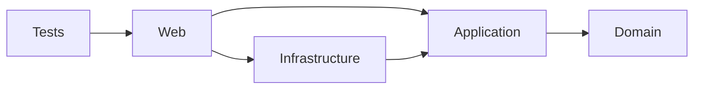
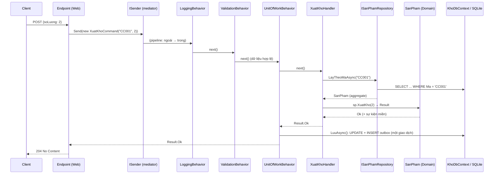

# Chương 2 — Clean Architecture thực hành

## Mục tiêu học

Sau chương này, bạn sẽ:

- Đọc hiểu một solution Clean Architecture hoàn chỉnh: **Domain / Application / Infrastructure / Web / Tests**.
- Theo dõi **một request** đi qua các tầng, từ HTTP đến CSDL và ngược lại.
- Hiểu vai trò của **composition root**, DI theo tầng, và **migration** trong kiến trúc nhiều project.
- Biết cấu trúc thư mục theo **tính năng (vertical slice)**.

Code: [`code/kho-clean/`](../../code/kho-clean/) — hệ thống kho của Tập 2 được **tái cấu trúc** (40 test đều đạt). Chương 2–8 và 13 lần lượt giải thích từng phần của cùng một solution.

## Bản đồ solution

```
kho-clean/
├── Kho.Domain/                    # KHÔNG tham chiếu gì
│   ├── Common/                    # Result, Loi, Entity, IDomainEvent
│   └── SanPhams/                  # SanPham (aggregate), MaSanPham, Tien (value object), sự kiện
├── Kho.Application/               # → Domain
│   ├── Abstractions/              # CỔNG: ISanPhamRepository, IUnitOfWork, IKhoDocDuLieu, IPhatHanhSuKien
│   ├── Messaging/                 # ICommand/IQuery/IRequestHandler + mediator tự viết
│   ├── Behaviors/                 # Logging, Validation, UnitOfWork
│   ├── SanPhams/                  # ca sử dụng: Thêm, Nhập, Xuất, Tìm, Lấy
│   └── DependencyInjection.cs     # services.AddApplication()
├── Kho.Infrastructure/            # → Application
│   ├── Persistence/               # KhoDbContext, Repositories, Migrations
│   ├── Outbox/                    # OutboxProcessor (BackgroundService)
│   └── DependencyInjection.cs     # services.AddInfrastructure(cfg)
├── Kho.Web/                       # → Application + Infrastructure (composition root)
│   ├── Endpoints/                 # Minimal API mỏng, dịch Result → HTTP
│   └── Program.cs
└── Kho.Tests/                     # Domain / Application / Architecture / Integration
```

Mũi tên `→` là `ProjectReference`; test kiến trúc (Chương 1) ép đúng chiều đó.



## Đi theo một request: `POST /api/san-pham/CC001/xuat`



Mỗi tầng chỉ làm đúng việc của nó:

| Tầng | Việc làm trong request này | Không làm |
|------|---------------------------|-----------|
| **Endpoint (Web)** | bind JSON → tạo `XuatKhoCommand`, gọi `sender.Send`, dịch `Result` → `204/404/422/409` | nghiệp vụ, truy cập CSDL |
| **Behavior** | log, validate đầu vào, lưu sau khi thành công | nghiệp vụ cụ thể |
| **Handler (Application)** | điều phối: tải aggregate, gọi phương thức nghiệp vụ | quy tắc "đủ hàng" (thuộc Domain), SQL |
| **Domain** | `XuatKho` kiểm tra đủ hàng, giảm tồn, phát sự kiện | biết CSDL, HTTP |
| **Infrastructure** | SQL, giao dịch, outbox | quyết định nghiệp vụ |

## Endpoint mỏng

```csharp
g.MapPost("/{ma}/xuat", async (string ma, SoLuongRequest r, ISender sender, CancellationToken ct)
    => (await sender.Send(new XuatKhoCommand(ma, r.SoLuong), ct)).ToHttp(noContent: true));
```

Toàn bộ endpoint là **một dòng**. Điểm dịch duy nhất từ ngôn ngữ nghiệp vụ sang HTTP:

```csharp
private static IResult LoiSangHttp(Loi loi) => Results.Problem(title: loi.Ma, detail: loi.MoTa, statusCode: loi.Loai switch
{
    LoaiLoi.DuLieuKhongHopLe => 400,
    LoaiLoi.KhongTimThay => 404,
    LoaiLoi.XungDot => 409,
    LoaiLoi.NghiepVu => 422,
    _ => 500,
});
```

Thay HTTP bằng gRPC, hàng đợi hay giao diện console: chỉ viết lại lớp dịch này; **Application và Domain không đổi**.

## Composition root và DI theo tầng

Mỗi tầng tự khai báo những gì nó cung cấp bằng một extension method; `Program.cs` chỉ ghép:

```csharp
builder.Services.AddApplication();                                  // mediator + behaviors + validators + handlers
builder.Services.AddInfrastructure(builder.Configuration);          // EF, repository, UoW, outbox
```

```csharp
// Infrastructure/DependencyInjection.cs
services.AddDbContext<KhoDbContext>(o => o.UseSqlite(cfg.GetConnectionString("Kho") ?? "Data Source=kho.db"));
services.AddScoped<IUnitOfWork>(sp => sp.GetRequiredService<KhoDbContext>());    // cùng MỘT DbContext cho repository và UoW
services.AddScoped<ISanPhamRepository, SanPhamRepository>();
services.AddScoped<IKhoDocDuLieu, KhoDocDuLieu>();
```

`IUnitOfWork` được ánh xạ về chính `KhoDbContext` để repository và UoW **chia sẻ một context** trong cùng request. Ứng dụng đổi công nghệ chỉ cần thay `AddInfrastructure`.

## Migration khi EF nằm ở tầng Infrastructure

`DbContext` và migration thuộc `Kho.Infrastructure`, nhưng công cụ `dotnet ef` cần một **startup project** chạy được (`Kho.Web`, chứa cấu hình):

```
cd Kho.Web
dotnet ef migrations add KhoiTao -p ../Kho.Infrastructure -s . -o Persistence/Migrations -- --MigrateOnStartup false
```

`-p` (project chứa DbContext), `-s` (startup project), `-o` (thư mục sinh), `--` truyền tham số cho ứng dụng (tắt migrate khi khởi động để công cụ không mở CSDL). Package `Microsoft.EntityFrameworkCore.Design` đặt ở `Kho.Web`.

## Tổ chức Application theo tính năng

`Application/SanPhams/CaSuDung.cs` gom **mọi thứ của một ca sử dụng cạnh nhau**: command, validator, handler:

```csharp
public sealed record XuatKhoCommand(string Ma, int SoLuong) : ICommand<Result>;
public sealed class XuatKhoValidator : AbstractValidator<XuatKhoCommand> { ... }
public sealed class XuatKhoHandler(ISanPhamRepository repo, TimeProvider dongHo) : IRequestHandler<XuatKhoCommand, Result> { ... }
```

Khi dự án lớn, mỗi ca sử dụng một thư mục/file (`SanPhams/XuatKho/...`). Thêm tính năng = thêm file mới, hầu như **không sửa file cũ** (Open/Closed).

## Kiểm thử theo tầng

| Loại test | Ví dụ trong `Kho.Tests` | Phụ thuộc | Tốc độ |
|-----------|--------------------------|-----------|--------|
| **Domain** | `XuatKho_KhongDuHang_ThatBaiVaTonKhongDoi`, `MaSanPham_ChiChapNhanDungDinhDang` | không gì cả | µs |
| **Application** | `ThemSanPham_SaiDinhDang_ValidationBehaviorChanTruocHandler` — repository, UoW **giả** | DI + fake | ms |
| **Architecture** | Domain không phụ thuộc gì; aggregate không có setter công khai | file csproj, reflection | ms |
| **Integration** | `XuatDongThoi_KhongBaoGioAm_...`, outbox — HTTP + SQLite thật | toàn bộ | chục ms |

Chiến lược đầy đủ ở Chương 9. Điểm mấu chốt: **phần lớn test rơi vào Domain/Application** (nhanh, ổn định); ít test tích hợp hơn nhưng phủ luồng chính và ghép nối.

## So sánh với Tập 2

| | Tập 2 (khối đơn giản) | Tập 3 (Clean) |
|---|-----------------------|---------------|
| Nghiệp vụ nằm ở | `KhoService` dùng thẳng `DbContext` | `SanPham` (Domain) + handler (Application) |
| Test nghiệp vụ cần | CSDL + HTTP | không cần gì (Domain) / bản giả (Application) |
| Đổi CSDL | sửa nhiều chỗ | thay `AddInfrastructure` |
| Số file | ít | nhiều hơn ~2–3 lần |
| Hợp với | CRUD, đội nhỏ, ít nghiệp vụ | nghiệp vụ phức tạp, nhiều người, sống lâu |

Chi phí có thật (nhiều file, nhiều ánh xạ). Hãy dùng kiến trúc này khi độ phức tạp nghiệp vụ **xứng đáng** với nó.

## Lỗi thường gặp

- Đặt `DbContext`/`DbSet` trong Application vì "tiện" — vi phạm quy tắc phụ thuộc.
- Quên `services.AddScoped<IUnitOfWork>(sp => sp.GetRequiredService<KhoDbContext>())` → repository và UoW dùng hai context khác nhau, `SaveChanges` không thấy thay đổi.
- Chạy `dotnet ef` ở thư mục sai (`-p`, `-s` thiếu) hoặc quên package `Design` ở startup project.
- Để endpoint chứa `if (sp.TonKho < n)` — nghiệp vụ rò ra Web.
- Application trả entity/aggregate ra ngoài thay vì DTO/`Result`.
- Quên test kiến trúc; sau vài tháng tầng Domain tham chiếu EF.

## Bài tập

1. Thêm ca sử dụng `DoiGiaCommand(string Ma, decimal GiaMoi)` (command + validator + handler) mà **không sửa** file nào hiện có ngoài đăng ký (assembly scan tự nhận).
2. Thêm endpoint `PUT /api/san-pham/{ma}/gia` gọi ca sử dụng ở trên; viết test tích hợp.
3. Vẽ sơ đồ tuần tự cho `POST /api/san-pham` (thêm sản phẩm) tương tự sơ đồ ở trên.
4. Thay `SanPhamRepository` bằng bản lưu file JSON (chỉ tạo class mới + đổi `AddInfrastructure`). Test Application có cần đổi không?
5. Liệt kê những chỗ trong solution mà đổi SQLite → PostgreSQL phải sửa (gợi ý: `ConfigureConventions`, `Like`, kiểu ngày giờ).
