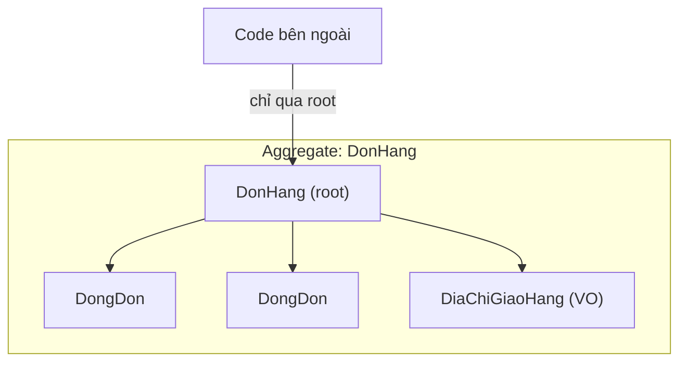

# Chương 3 — Mô hình hoá miền (DDD cơ bản)

## Mục tiêu học

Sau chương này, bạn sẽ:

- Phân biệt **Entity**, **Value Object**, **Aggregate**, **Domain Event** và biết khi nào dùng cái nào.
- Viết domain **giàu hành vi** (rich domain model) thay vì túi dữ liệu (anemic).
- Bảo vệ **bất biến (invariant)** ở chính lớp miền; dùng `Result` cho lỗi nghiệp vụ.
- Ánh xạ domain sang EF Core **mà không làm bẩn** domain.

Code: [`code/kho-clean/Kho.Domain/`](../../code/kho-clean/Kho.Domain/) và [`DomainTests.cs`](../../code/kho-clean/Kho.Tests/DomainTests.cs).

## Domain-Driven Design (DDD) là gì?

**DDD** (Eric Evans) là cách tiếp cận thiết kế cho **nghiệp vụ phức tạp**: mô hình phần mềm phản ánh **ngôn ngữ và quy tắc của doanh nghiệp**, do lập trình viên và chuyên gia nghiệp vụ cùng xây. Hai nhóm ý tưởng:

- **Chiến lược**: *ubiquitous language* (ngôn ngữ chung: "xuất kho", "sắp hết hàng" dùng thống nhất trong code, tài liệu, họp), *bounded context* (mỗi phần hệ thống có mô hình riêng; "Sản phẩm" trong Kho khác "Sản phẩm" trong Marketing).
- **Chiến thuật** (bộ khối xây dựng, chương này): entity, value object, aggregate, domain event, repository, domain service.

> Sách này dùng **DDD chiến thuật ở mức thực dụng**. DDD đầy đủ (event storming, context mapping) là một chủ đề lớn — xem Phụ lục B. Áp dụng khi nghiệp vụ *thật sự phức tạp*; CRUD thuần không cần.

## Anemic vs Rich domain model

```csharp
// ✘ ANEMIC: chỉ là túi dữ liệu; luật nằm ở service → ai cũng bỏ qua được luật
public class SanPham { public int TonKho { get; set; } }
class KhoService { void Xuat(SanPham sp, int n) { if (sp.TonKho >= n) sp.TonKho -= n; } }   // quên kiểm tra ở chỗ khác → âm kho

// ✔ RICH: dữ liệu + hành vi + luật ở CÙNG MỘT nơi
public Result XuatKho(int soLuong, DateTimeOffset bayGio)
{
    if (soLuong <= 0) return Result.Fail(...);
    if (soLuong > TonKho) return Result.Fail(Loi.NghiepVu("SanPham.KhongDuHang", ...));
    TonKho -= soLuong;
    ...
}
```

Trong domain giàu, **không có cách nào** làm `TonKho` âm ngoài phương thức này (setter `private`). Test kiến trúc khoá điều đó: `Aggregate_KhongCoSetterCongKhai`. Đây là tinh thần của *encapsulation* (Tập 1, Chương 14) nâng lên cấp kiến trúc: **object luôn ở trạng thái hợp lệ**.

## Value Object

**Value object** đại diện một **giá trị** — *không có danh tính*, **bất biến**, so sánh **theo giá trị**, tự bảo đảm hợp lệ. Ví dụ: mã sản phẩm, số tiền, địa chỉ, khoảng ngày.

```csharp
public sealed partial record MaSanPham
{
    public string GiaTri { get; }
    private MaSanPham(string giaTri) => GiaTri = giaTri;

    public static Result<MaSanPham> Tao(string? ma)
    {
        if (string.IsNullOrWhiteSpace(ma)) return Result<MaSanPham>.Fail(Loi.DuLieuKhongHopLe("SanPham.Ma.Rong", "..."));
        ma = ma.Trim().ToUpperInvariant();
        return DinhDang().IsMatch(ma) ? new MaSanPham(ma) : Result<MaSanPham>.Fail(Loi.DuLieuKhongHopLe("SanPham.Ma.SaiDinhDang", "..."));
    }
    [GeneratedRegex("^[A-Z]{2}[0-9]{3}$")] private static partial Regex DinhDang();
}
```

Lợi ích:

- **Không thể tồn tại "mã sản phẩm sai"** trong hệ thống: constructor `private`, chỉ có factory `Tao` trả `Result`. Kiểm tra đúng **một chỗ**, không rải rác.
- **Chống "primitive obsession"** (dùng `string`/`decimal` trần khắp nơi): `XuatKho(string ma, decimal gia)` dễ đảo nhầm tham số; `XuatKho(MaSanPham ma, Tien gia)` thì không.
- Hành vi gắn với giá trị: `Tien` có `+`, `*`, làm tròn VND.
- `record` cho sẵn so sánh theo giá trị (`MaSanPham.Tao("LT001") == MaSanPham.Tao("lt001")` — test `MaSanPham_SoSanhTheoGiaTri`).

Dùng `readonly record struct` cho VO nhỏ, thường xuyên tạo (`Tien`, `Toado`) nếu cần hiệu năng; `record class` khi có nhiều trường/logic.

## Entity và Aggregate

**Entity**: có **danh tính** (`Id`) tồn tại suốt vòng đời, hai entity bằng nhau nếu cùng `Id` dù thuộc tính khác. `SanPham` là entity.

**Aggregate**: cụm entity/value object được đối xử như **một đơn vị nhất quán**, có một **aggregate root** là cổng duy nhất để thay đổi:



Quy tắc aggregate (giúp giữ nhất quán và hiệu năng):

1. **Chỉ truy cập/sửa qua root**; không giữ tham chiếu tới entity con bên trong từ bên ngoài.
2. **Một giao dịch = một aggregate**: mỗi lần `SaveChanges` chỉ nên đổi một aggregate; nhất quán *giữa các aggregate* dùng **sự kiện** và nhất quán cuối cùng (Chương 8).
3. Aggregate **nhỏ**: chỉ chứa những gì cần nhất quán tức thời. `SanPham` không chứa danh sách hàng nghìn giao dịch — giao dịch là aggregate/bảng khác, sinh ra từ sự kiện.
4. Tham chiếu aggregate khác **bằng Id**, không bằng object.

Trong solution, `SanPham` là aggregate root độc lập (tồn kho là bất biến cần bảo vệ). Trong hệ thống có đơn hàng, `DonHang` tham chiếu `MaSanPham` (Id), không nhúng `SanPham`.

## Domain Event

**Sự kiện miền**: điều gì **đã xảy ra** trong nghiệp vụ, đặt tên thì **quá khứ**, bất biến.

```csharp
public sealed record TonKhoThayDoi(string Ma, int TonCu, int TonMoi, string LyDo, DateTimeOffset XayRaLuc) : IDomainEvent;
public sealed record SapHetHang(string Ma, int TonKho, int MucCanhBao, DateTimeOffset XayRaLuc) : IDomainEvent;

public Result XuatKho(int soLuong, DateTimeOffset bayGio)
{
    ...
    TonKho -= soLuong;
    PhatSuKien(new TonKhoThayDoi(Ma.GiaTri, cu, TonKho, "Xuat kho", bayGio));

    // Quy tắc nghiệp vụ: vừa CHẠM ngưỡng (từ trên xuống) thì phát sự kiện — chỉ một lần
    if (cu > MucCanhBao && TonKho <= MucCanhBao)
        PhatSuKien(new SapHetHang(Ma.GiaTri, TonKho, MucCanhBao, bayGio));
    return Result.Ok();
}
```

Aggregate **không biết** ai quan tâm (gửi email? báo mua hàng?) — chỉ ghi nhận sự kiện. Nhờ vậy domain giữ thuần và các hệ quả (tác dụng phụ) tách khỏi luật (Chương 8 xử lý bằng outbox). Test kiểm chứng thời điểm phát:

```csharp
sp.XuatKho(3, Gio);   // 7 -> 4: chạm ngưỡng 5
sp.XuatKho(1, Gio);   // 4 -> 3: đã dưới ngưỡng, KHÔNG phát lại
Assert.Single(sp.SuKienMien.OfType<SapHetHang>());
```

Lưu ý: sự kiện chỉ nên **phát sau khi thay đổi thành công** — `XuatKho` thất bại không phát gì (test `XuatKho_KhongDuHang_...`).

## Lỗi nghiệp vụ là *giá trị*

Vi phạm luật (hết hàng, dữ liệu sai) là **kết quả có thể đoán trước**, không phải "ngoại lệ". Domain trả `Result` (Chương 7) với `Loi` mang **mã ổn định** (`"SanPham.KhongDuHang"`) và **loại** (`LoaiLoi.NghiepVu`) — tầng ngoài dịch sang HTTP/log/UI tuỳ ý. Exception dành cho lỗi **lập trình** (truy cập `GiaTri` của Result thất bại, tham số null) và lỗi hạ tầng.

## Domain service

Logic nghiệp vụ **không thuộc riêng aggregate nào** (ví dụ tính phí ship dựa trên nhiều aggregate, chuyển kho giữa hai `Kho`) đặt trong **domain service** — lớp không trạng thái trong tầng Domain, nhận aggregate làm tham số. Đừng vội tạo `XxxService`: hầu hết logic nên nằm trong entity/VO; chỉ tách khi thật sự "không có nhà".

## Ánh xạ sang EF Core mà không làm bẩn domain

Domain **không** có attribute EF, không cần `virtual`. Mọi cấu hình nằm ở Infrastructure (Fluent API):

```csharp
mb.Entity<SanPham>(e =>
{
    e.Ignore(s => s.SuKienMien);                                                    // sự kiện không phải cột
    e.Property(s => s.Ma).HasConversion(m => m.GiaTri, v => MaSanPham.TuCsdl(v))    // value object <-> cột đơn giản
                         .HasMaxLength(20).IsRequired();
    e.Property(s => s.DonGia).HasConversion(t => (double)t.SoTien, v => Tien.TuCsdl((decimal)v));
    e.Property(s => s.TonKho).IsConcurrencyToken();
    e.HasIndex(s => s.Ma).IsUnique();
});
```

- **Constructor `private SanPham() { }`** cho EF tạo đối tượng rồi gán qua *backing field/private setter* — EF làm được với setter `private`.
- **Tái tạo từ CSDL**: `MaSanPham.TuCsdl(v)` bỏ qua kiểm tra (dữ liệu đã hợp lệ lúc ghi); factory `Tao` dành cho **đầu vào bên ngoài**. Đặt tên rõ để không dùng nhầm.
- `HasConversion` cho value object đơn giá trị. Với VO nhiều thuộc tính dùng **owned types/complex types** (Tập 2, Chương 13).
- **Bài học thực tế**: truy vấn LINQ *lọc trên value object đã chuyển đổi* (`s.Ma.GiaTri == ...`) không luôn dịch được sang SQL. Giải pháp của solution: phía **đọc** dùng *read model* riêng (`SanPhamDoc`, cột đơn giản — Chương 5) thay vì ép EF lọc trên aggregate; phía **ghi** chỉ so sánh nguyên value object (`s.Ma == MaSanPham.TuCsdl(ma)`) — EF áp bộ chuyển đổi cho tham số.

## Thiết kế tốt hơn nhờ câu hỏi

Khi mô hình hoá, hỏi:

1. **Bất biến nào** phải luôn đúng? (tồn ≥ 0, mã đúng định dạng) → phương thức nghiệp vụ + kiểm tra ở domain.
2. Khái niệm này có **danh tính** không? (có → entity; không → value object)
3. Những thứ nào phải **nhất quán trong cùng một giao dịch**? → cùng aggregate.
4. Chuyện gì **đã xảy ra** mà phần khác của hệ thống quan tâm? → domain event.
5. Chuyên gia nghiệp vụ gọi nó là gì? → dùng đúng tên đó (tiếng Việt cũng được).

## Lỗi thường gặp

- Domain "anemic": mọi property `public set`, logic ở service.
- Aggregate quá lớn (nhúng cả lịch sử giao dịch) → tải chậm, xung đột đồng thời liên tục.
- Value object có setter, hoặc dùng `string`/`decimal` trần thay vì tạo kiểu.
- Tham chiếu aggregate khác bằng object (kéo theo cả đồ thị) thay vì Id.
- Phát sự kiện **trước khi** thay đổi thành công, hoặc phát khi thao tác thất bại.
- Domain phụ thuộc EF/JSON (`[JsonIgnore]`, `[Key]`) vì "tiện".
- Ném exception cho lỗi nghiệp vụ dự đoán được rồi bắt ở khắp nơi.
- Đặt tên kỹ thuật (`SanPhamManager`, `Helper`) thay vì ngôn ngữ nghiệp vụ.

## Bài tập

1. Thêm value object `SoLuong` (int > 0) và dùng trong `NhapKho/XuatKho`; cập nhật test.
2. Thêm phương thức `DieuChinhTon(int tonMoi, string lyDo)` (kiểm kê) phát `TonKhoThayDoi` với lý do; viết test cả nhánh lỗi.
3. Thiết kế (giấy) aggregate `DonHang` gồm nhiều `DongDon` và giới hạn: tổng giá trị đơn ≤ 100 triệu. Nó tham chiếu sản phẩm thế nào?
4. Thêm sự kiện `GiaThayDoi` khi `DoiGia` thành công; đăng ký phát vào outbox (đọc Chương 8).
5. Tìm trong Tập 2 (Chương 22) ba chỗ đang là "anemic" và mô tả cách chuyển vào domain.
