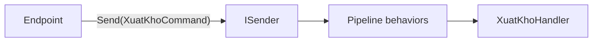

# Chương 5 — CQRS và Mediator

## Mục tiêu học

Sau chương này, bạn sẽ:

- Hiểu **CQRS** (Command Query Responsibility Segregation): tách **lệnh** (ghi) và **truy vấn** (đọc).
- Viết `ICommand`/`IQuery`, **handler**, và một **mediator** tự viết (~40 dòng) để kết nối chúng.
- Biết khi nào CQRS đáng dùng (và các mức độ: cùng CSDL → đọc/ghi tách biệt hoàn toàn).
- Hiểu ưu/nhược điểm mediator và các lựa chọn (MediatR, Wolverine, tự viết).

Code: [`Messaging/Mediator.cs`](../../code/kho-clean/Kho.Application/Messaging/Mediator.cs), [`SanPhams/CaSuDung.cs`](../../code/kho-clean/Kho.Application/SanPhams/CaSuDung.cs).

## Vấn đề: một `SanPhamService` phình to

```csharp
class KhoService   // Tập 2 - ban đầu vài phương thức, sau 1 năm...
{
    ThemAsync, NhapAsync, XuatAsync, DoiGiaAsync, XoaAsync, TimAsync, LayAsync,
    BaoCaoTheoNhomAsync, SapHetAsync, LichSuAsync, XuatExcelAsync, ...   // 40 phương thức, 15 phụ thuộc trong constructor
}
```

Lớp làm quá nhiều, phụ thuộc nhiều thứ không liên quan (báo cáo cần `IExcelWriter`, lệnh xuất cần `IEmailSender`), khó test (mock 15 thứ), mọi thay đổi đụng cùng một file (xung đột merge).

## CQRS

**CQRS** (Bertrand Meyer — *Command–Query Separation*; Greg Young — CQRS): phân biệt hai loại thao tác:

| | **Lệnh (Command)** | **Truy vấn (Query)** |
|---|--------------------|----------------------|
| Mục đích | **thay đổi** trạng thái | **đọc** dữ liệu |
| Tác dụng phụ | có | **không** |
| Trả về | kết quả thành công/lỗi (+ Id mới) | dữ liệu (DTO) |
| Đặt tên | mệnh lệnh: `XuatKhoCommand` | câu hỏi: `TimSanPhamQuery` |
| Mô hình | **aggregate** (bảo vệ bất biến) | **read model** phẳng, tối ưu hiển thị |
| Giao dịch | có (Unit of Work) | không cần |

Ba mức áp dụng:

1. **Tách trong code** (solution này): cùng một CSDL, nhưng lệnh đi qua aggregate, truy vấn đi qua read model riêng. Chi phí thấp, lợi ích lớn — điểm bắt đầu hợp lý.
2. **Tách lược đồ đọc**: bảng/view riêng cho đọc (denormalized), cập nhật bằng sự kiện.
3. **Tách hạ tầng**: CSDL ghi (quan hệ) + CSDL đọc (Elasticsearch, Redis, kho cột), đồng bộ bất đồng bộ — nhất quán cuối cùng. Chỉ khi quy mô đọc/ghi chênh lệch lớn.

CQRS **không** đồng nghĩa với Event Sourcing hay microservices, và không phải lúc nào cũng cần.

## Mỗi ca sử dụng một "thông điệp" + một handler

```csharp
// Lệnh: dữ liệu vào + kiểu kết quả
public sealed record XuatKhoCommand(string Ma, int SoLuong) : ICommand<Result>;

// Handler: MỘT lớp cho MỘT ca sử dụng
public sealed class XuatKhoHandler(ISanPhamRepository repo, TimeProvider dongHo) : IRequestHandler<XuatKhoCommand, Result>
{
    public async Task<Result> Handle(XuatKhoCommand cmd, CancellationToken ct)
    {
        var sp = await repo.LayTheoMaAsync(cmd.Ma, ct);
        return sp is null
            ? Result.Fail(Loi.KhongTimThay("SanPham.KhongTimThay", $"Khong tim thay san pham {cmd.Ma}"))
            : sp.XuatKho(cmd.SoLuong, dongHo.GetUtcNow());
    }
}

// Truy vấn: cũng một thông điệp + một handler, nhưng đi qua cổng ĐỌC
public sealed record TimSanPhamQuery(string? TuKhoa, string? Nhom, int Trang = 1, int KichThuoc = 10) : IQuery<Result<TrangKetQua<SanPhamDto>>>;
```

Mỗi handler chỉ có **những phụ thuộc nó thật sự cần** (xuất kho cần repository và đồng hồ; không cần Excel). Nhỏ, tập trung, dễ test (dựng handler với fake — hoặc gọi qua mediator như `ApplicationTests`), dễ tìm ("ca sử dụng nào? → file đó"), và **thêm tính năng = thêm file** (không sửa `KhoService`).

## Mediator

Ai gọi handler? Endpoint có thể inject trực tiếp `XuatKhoHandler`, nhưng khi đó:

- Endpoint phụ thuộc lớp cụ thể của Application;
- **Không có chỗ chung** để chèn hành vi xuyên suốt (log, validate, giao dịch, cache) — Chương 6.

**Mediator** đứng giữa: endpoint chỉ biết *thông điệp* và một cổng `ISender`; mediator tìm đúng handler và chạy qua **pipeline**.



### Hợp đồng

```csharp
public interface IRequest<TResponse> where TResponse : IKetQua<TResponse>;
public interface ICommand<TResponse> : IRequest<TResponse> where TResponse : IKetQua<TResponse>;
public interface IQuery<TResponse>   : IRequest<TResponse> where TResponse : IKetQua<TResponse>;

public interface IRequestHandler<TRequest, TResponse> where TRequest : IRequest<TResponse> where TResponse : IKetQua<TResponse>
{ Task<TResponse> Handle(TRequest request, CancellationToken ct); }

public interface ISender
{ Task<TResponse> Send<TResponse>(IRequest<TResponse> request, CancellationToken ct = default) where TResponse : IKetQua<TResponse>; }
```

`ICommand` và `IQuery` cùng kế thừa `IRequest`, khác nhau ở **ý nghĩa** — và cho phép behavior áp dụng **riêng cho lệnh** (giao dịch) hay **riêng cho truy vấn** (cache).

### Cài đặt tối giản

```csharp
internal sealed class Sender(IServiceProvider sp) : ISender
{
    private static readonly ConcurrentDictionary<Type, object> Wrappers = new();

    public Task<TResponse> Send<TResponse>(IRequest<TResponse> request, CancellationToken ct = default) where TResponse : IKetQua<TResponse>
    {
        var wrapper = (Boc<TResponse>)Wrappers.GetOrAdd(request.GetType(),
            t => Activator.CreateInstance(typeof(Boc<,>).MakeGenericType(t, typeof(TResponse)))!);
        return wrapper.Chay(request, sp, ct);
    }
    ...
}
```

Vấn đề kỹ thuật: `Send` chỉ biết kiểu **đối tượng lúc chạy** (`request.GetType()`), nhưng DI cần kiểu **generic đã đóng** `IRequestHandler<XuatKhoCommand, Result>`. Giải pháp: một lớp bọc generic `Boc<TRequest,TResponse>` được tạo **một lần** cho mỗi kiểu request bằng reflection và **cache** — về sau mỗi lần gọi là lời gọi có kiểu tĩnh, không reflection. Toàn bộ mediator ~40 dòng.

### Đăng ký

```csharp
public static IServiceCollection AddMediator(this IServiceCollection services, Assembly assembly, params Type[] behaviorMoRong)
{
    services.AddScoped<ISender, Sender>();
    foreach (var type in assembly.GetTypes().Where(t => t is { IsClass: true, IsAbstract: false }))
        foreach (var i in type.GetInterfaces().Where(i => i.IsGenericType && i.GetGenericTypeDefinition() == typeof(IRequestHandler<,>)))
            services.AddScoped(i, type);                                        // quét assembly: mỗi handler tự đăng ký
    foreach (var b in behaviorMoRong) services.AddScoped(typeof(IPipelineBehavior<,>), b);
    return services;
}
```

Thêm ca sử dụng mới = thêm command + handler; **không sửa** file đăng ký hay endpoint khác.

### Sử dụng ở endpoint

```csharp
g.MapPost("/{ma}/xuat", async (string ma, SoLuongRequest r, ISender sender, CancellationToken ct)
    => (await sender.Send(new XuatKhoCommand(ma, r.SoLuong), ct)).ToHttp(noContent: true));
```

## `static abstract` — chi tiết C# hiện đại làm nên sự gọn

Behavior generic cần **tạo kết quả lỗi** cho *bất kỳ* `TResponse` (`Result` hay `Result<T>`):

```csharp
public interface IKetQua<TSelf> where TSelf : IKetQua<TSelf>
{
    static abstract TSelf TuLoi(Loi loi);
    bool ThanhCong { get; }
    Loi? Loi { get; }
}

// Trong ValidationBehavior<TRequest, TResponse> where TResponse : IKetQua<TResponse>:
return TResponse.TuLoi(Loi.DuLieuKhongHopLe("Validation", moTa));     // gọi thành viên static trên tham số kiểu!
```

**Static abstract interface members** (C# 11) cho phép gọi `TResponse.TuLoi(...)` không cần reflection hay `dynamic`. (Nếu không có tính năng này, các thư viện phải dùng reflection hoặc ép kiểu.)

## Ưu và nhược điểm của mediator

**Ưu:**
- Endpoint mỏng, tách rời khỏi handler; thêm/xoá tính năng cục bộ.
- Một chỗ chung để gắn hành vi xuyên suốt (pipeline).
- Handler nhỏ, test độc lập.

**Nhược:**
- **Gián tiếp**: từ endpoint khó "nhảy tới định nghĩa" handler (IDE hỗ trợ tìm theo kiểu); luồng bị "ẩn" sau DI.
- Thêm một lớp trừu tượng và chi phí nhỏ mỗi lần gọi.
- Dễ lạm dụng: handler gọi handler khác qua mediator tạo dây phụ thuộc khó thấy — dùng dịch vụ miền/domain thay vì handler-gọi-handler.
- Không cần thiết nếu ứng dụng nhỏ (endpoint gọi thẳng dịch vụ là đủ).

## Thư viện hay tự viết?

- **MediatR** (Jimmy Bogard) là thư viện phổ biến nhất, API tương tự (`IRequest<T>`, `IRequestHandler`, `IPipelineBehavior`). Lưu ý: từ các bản gần đây MediatR chuyển sang **giấy phép thương mại** cho một số đối tượng dùng — hãy kiểm tra điều khoản hiện hành trước khi dùng trong dự án.
- **Wolverine**, **Mediator (martinothamar, source generator, nhanh)**, **Immediate.Handlers**: lựa chọn thay thế.
- **Tự viết** (như chương này): ~40 dòng, đủ cho nhu cầu phổ biến, không phụ thuộc bên ngoài, hiểu rõ bên trong. Đủ tốt để đi sản phẩm với đội nhỏ; chuyển sang thư viện nếu cần tính năng nâng cao (notification, streaming, generic behavior phức tạp).

API giữa các lựa chọn giống nhau nên đổi sau này rẻ.

## Khi nào dùng CQRS + mediator?

| Dấu hiệu | Gợi ý |
|----------|-------|
| CRUD đơn giản, ít quy tắc | **Không cần** (Tập 2) |
| Service phình to, mỗi tính năng đụng cùng file | Tách use case + handler |
| Cần hành vi xuyên suốt (log, validate, giao dịch, cache) áp đồng loạt | Mediator + pipeline |
| Đọc/ghi có yêu cầu hiệu năng, mô hình khác hẳn nhau | CQRS mức 2–3 |
| Nhiều đội cùng sửa một codebase | Vertical slice + CQRS giảm xung đột |

## Lỗi thường gặp

- Truy vấn có tác dụng phụ (ghi log nghiệp vụ, đổi trạng thái) — phá tính chất "không đổi trạng thái".
- Lệnh trả về cả đối tượng lớn để "tiện" — nên trả Id/`Result`, muốn dữ liệu thì gửi truy vấn.
- Handler gọi `ISender.Send` của handler khác (spaghetti).
- Quên đăng ký handler/behavior (không quét đúng assembly) → `InvalidOperationException: No service for type IRequestHandler<...>`.
- Bọc mọi thứ trong mediator kể cả nơi đơn giản — "nghi thức" thừa.
- Đặt logic nghiệp vụ trong handler thay vì domain (handler thành "transaction script" phình to).

## Bài tập

1. Thêm `LayLichSuQuery` (đọc từ bảng outbox) qua mediator; đọc bằng cổng đọc, không nạp aggregate.
2. Viết test kiểm chứng `ISender` ném lỗi rõ ràng khi thiếu handler; sửa thông báo lỗi cho dễ hiểu.
3. Thêm `INotification`/`IPublisher` (một sự kiện, nhiều handler) vào mediator tự viết (~20 dòng).
4. So sánh số dòng/độ phức tạp: viết lại `XuatKho` dưới dạng phương thức của `KhoService` (Tập 2) và dạng command+handler. Khi nào cách nào tốt hơn?
5. Đo chi phí mỗi lần `Send` với BenchmarkDotNet so với gọi handler trực tiếp.
