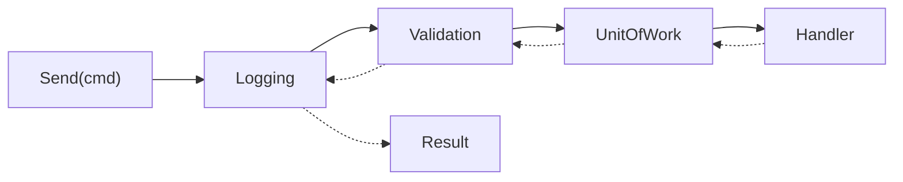

# Chương 6 — Pipeline behavior: validation, logging, transaction

## Mục tiêu học

Sau chương này, bạn sẽ:

- Dùng **pipeline behavior** (mẫu Decorator/Chain of Responsibility) để xử lý các mối quan tâm **xuyên suốt** ở một nơi.
- Đọc hiểu ba behavior của solution: **Logging**, **Validation**, **UnitOfWork** và **thứ tự** của chúng.
- Thêm behavior mới (cache, authorization, retry, timing) và giới hạn behavior theo **kiểu request** bằng generic constraint.
- Chọn giữa behavior, middleware và filter.

Code: [`Behaviors/Behaviors.cs`](../../code/kho-clean/Kho.Application/Behaviors/Behaviors.cs), [`ApplicationTests.cs`](../../code/kho-clean/Kho.Tests/ApplicationTests.cs).

## Cross-cutting concerns

Có việc **mọi** ca sử dụng đều cần: ghi log, kiểm tra dữ liệu đầu vào, mở/đóng giao dịch, kiểm tra quyền, đo thời gian, cache. Viết lặp trong từng handler:

```csharp
public async Task<Result> Handle(XuatKhoCommand cmd, CancellationToken ct)
{
    log.LogInformation("Bat dau xuat kho ...");                    // lặp ở 30 handler
    var loi = validator.Validate(cmd); if (!loi.IsValid) return ...; // lặp
    var sw = Stopwatch.StartNew();                                  // lặp
    ...nghiệp vụ thật (3 dòng)...
    await uow.SaveChangesAsync(ct);                                 // lặp, dễ quên
    log.LogInformation("Xong sau {Ms}", sw.ElapsedMilliseconds);    // lặp
}
```

Hậu quả: nghiệp vụ chìm giữa "rác hạ tầng", dễ **quên** ở một handler (không validate → dữ liệu xấu; không lưu → mất dữ liệu). Pipeline behavior đưa chúng ra một chỗ, **áp dụng đồng loạt và không thể quên**.

## Pipeline: vỏ hành xung quanh handler



Mỗi behavior nhận `next` (đoạn còn lại của chuỗi) — như middleware ASP.NET Core (Tập 2, Chương 3): làm việc **trước**, gọi `next()`, làm việc **sau**, hoặc **ngắn mạch** không gọi `next`.

```csharp
public interface IPipelineBehavior<TRequest, TResponse> where TRequest : IRequest<TResponse> where TResponse : IKetQua<TResponse>
{
    Task<TResponse> Handle(TRequest request, RequestHandlerDelegate<TResponse> next, CancellationToken ct);
}
```

## 1. Logging

```csharp
public sealed class LoggingBehavior<TRequest, TResponse>(ILogger<LoggingBehavior<TRequest, TResponse>> log) : IPipelineBehavior<TRequest, TResponse>
    where TRequest : IRequest<TResponse> where TResponse : IKetQua<TResponse>
{
    public async Task<TResponse> Handle(TRequest request, RequestHandlerDelegate<TResponse> next, CancellationToken ct)
    {
        var dong = Stopwatch.StartNew();
        var kq = await next();
        if (kq.ThanhCong) log.LogInformation("{Request} thanh cong sau {Ms} ms", typeof(TRequest).Name, dong.ElapsedMilliseconds);
        else log.LogWarning("{Request} that bai ({Ma}) sau {Ms} ms", typeof(TRequest).Name, kq.Loi!.Ma, dong.ElapsedMilliseconds);
        return kq;
    }
}
```

Vì kết quả là `Result` (có `ThanhCong`, `Loi.Ma`), behavior log được **thành công/thất bại và mã lỗi** mà không cần `try/catch` hay biết kiểu cụ thể. **Không log nội dung request** mặc định (có thể chứa dữ liệu nhạy cảm) — chỉ tên request và kết quả.

Đặt **ngoài cùng** để đo tổng thời gian của mọi behavior bên trong.

## 2. Validation

```csharp
public sealed class ValidationBehavior<TRequest, TResponse>(IEnumerable<IValidator<TRequest>> validators) : IPipelineBehavior<TRequest, TResponse>
    where TRequest : IRequest<TResponse> where TResponse : IKetQua<TResponse>
{
    public async Task<TResponse> Handle(TRequest request, RequestHandlerDelegate<TResponse> next, CancellationToken ct)
    {
        if (!validators.Any()) return await next();

        var ctx = new ValidationContext<TRequest>(request);
        var loi = (await Task.WhenAll(validators.Select(v => v.ValidateAsync(ctx, ct)))).SelectMany(r => r.Errors).ToList();
        if (loi.Count == 0) return await next();

        string moTa = string.Join("; ", loi.Select(e => $"{e.PropertyName}: {e.ErrorMessage}"));
        return TResponse.TuLoi(Loi.DuLieuKhongHopLe("Validation", moTa));         // ngắn mạch: handler KHÔNG chạy
    }
}
```

- Nhận `IEnumerable<IValidator<TRequest>>`: request nào **không có** validator thì danh sách rỗng, đi thẳng — không cần cấu hình gì.
- Validator viết bằng **FluentValidation** cạnh command (Chương 7):

```csharp
public sealed class XuatKhoValidator : AbstractValidator<XuatKhoCommand>
{
    public XuatKhoValidator() => RuleFor(x => x.SoLuong).InclusiveBetween(1, 100_000);
}
```

- Lỗi trả về như **giá trị** (`Result`), không ném exception — nhanh hơn và không phải bắt ở khắp nơi. Test `ThemSanPham_SaiDinhDang_ValidationBehaviorChanTruocHandler` chứng minh handler và Unit of Work không được gọi.

Phân biệt: **validation đầu vào** (định dạng, khoảng — behavior này) khác **luật nghiệp vụ** (đủ hàng — trong Domain). Domain vẫn tự bảo vệ bất biến; validator chặn sớm dữ liệu rác với thông báo tốt.

## 3. Unit of Work

```csharp
public sealed class UnitOfWorkBehavior<TRequest, TResponse>(IUnitOfWork uow) : IPipelineBehavior<TRequest, TResponse>
    where TRequest : ICommand<TResponse> where TResponse : IKetQua<TResponse>      // CHỈ áp cho LỆNH
{
    public async Task<TResponse> Handle(TRequest request, RequestHandlerDelegate<TResponse> next, CancellationToken ct)
    {
        var kq = await next();
        if (!kq.ThanhCong) return kq;                    // handler thất bại: không lưu gì

        try { await uow.LuuAsync(ct); }
        catch (ConcurrencyException) { return TResponse.TuLoi(Loi.XungDot("Kho.XungDotDongThoi", "Du lieu vua bi nguoi khac thay doi, vui long thu lai")); }
        catch (TrungLapException e)  { return TResponse.TuLoi(Loi.XungDot("Kho.TrungLap", e.Message)); }
        return kq;
    }
}
```

Điểm hay:

- **Constraint `where TRequest : ICommand<TResponse>`** giới hạn behavior này **chỉ cho lệnh**. Đăng ký mở `typeof(IPipelineBehavior<,>) → UnitOfWorkBehavior<,>`; với query (không thoả constraint) DI **tự bỏ qua** (test `TruyVan_KhongDiQuaUnitOfWorkBehavior`: truy vấn không bao giờ lưu).
- **Handler không bao giờ gọi `Save`** — không thể quên; luôn "một lệnh = một lần lưu = một giao dịch".
- **Dịch lỗi hạ tầng sang ngôn ngữ nghiệp vụ**: `ConcurrencyException`/`TrungLapException` do Infrastructure ném (từ `DbUpdateConcurrencyException`/UNIQUE) → `Loi.XungDot` → HTTP `409`. Test `XungDotDongThoi_...` mô phỏng bằng UoW giả nem exception.
- Lưu ý: nếu `LuuAsync` thành công thì aggregate và **outbox** (sự kiện miền) đã được ghi cùng giao dịch (Chương 8).

## Thứ tự quan trọng

```csharp
services.AddMediator(assembly, typeof(LoggingBehavior<,>), typeof(ValidationBehavior<,>), typeof(UnitOfWorkBehavior<,>));
//                             ngoài cùng  ───────────────────────────────────────────────────►  trong cùng
```

Thứ tự đăng ký = thứ tự **từ ngoài vào trong**. Lý do chọn:

1. **Logging** ngoài cùng: thấy cả những request bị validation chặn.
2. **Validation** trước UoW: dữ liệu sai thì khỏi mở giao dịch.
3. **UnitOfWork** trong cùng, sát handler: chỉ lưu khi handler đã xong.

Nếu thêm **Authorization** (kiểm tra quyền): đặt *trước* validation (từ chối sớm mà không tốn công); **Caching** (chỉ query): đặt trước handler, sau authorization; **Retry** (lỗi tạm thời): bọc quanh UoW.

Test `Pipeline_ChayTheoThuTuNgoaiVaoTrongRoiTrongRaNgoai` chứng minh bằng hai behavior ghi vết: `["A:vao","B:vao","B:ra","A:ra"]`.

## Thêm behavior: ví dụ cache cho truy vấn

```csharp
public interface ICachedQuery { string CacheKey { get; } TimeSpan ThoiGianSong { get; } }

public sealed class CachingBehavior<TRequest, TResponse>(IMemoryCache cache) : IPipelineBehavior<TRequest, TResponse>
    where TRequest : IQuery<TResponse>, ICachedQuery where TResponse : IKetQua<TResponse>
{
    public async Task<TResponse> Handle(TRequest request, RequestHandlerDelegate<TResponse> next, CancellationToken ct)
    {
        if (cache.TryGetValue(request.CacheKey, out TResponse? trongCache) && trongCache is not null) return trongCache;
        var kq = await next();
        if (kq.ThanhCong) cache.Set(request.CacheKey, kq, request.ThoiGianSong);       // chỉ cache kết quả THÀNH CÔNG
        return kq;
    }
}
```

Truy vấn nào muốn cache chỉ cần `implements ICachedQuery` — không sửa handler (Chương 10 nói kỹ về chiến lược cache và vô hiệu hoá).

## Behavior, middleware hay filter?

| | Middleware (ASP.NET) | Endpoint filter | **Pipeline behavior** |
|---|----------------------|-----------------|-----------------------|
| Tầng | HTTP, mọi request | endpoint HTTP | **Application** (ca sử dụng) |
| Biết HTTP? | có | có | **không** |
| Dùng cho | lỗi toàn cục, xác thực, CORS, nén | validation HTTP, ánh xạ tham số | log nghiệp vụ, validation lệnh, giao dịch, cache |
| Tái sử dụng khi đổi giao diện (gRPC, worker) | không | không | **có** |

Quy tắc: mối quan tâm **thuộc HTTP** → middleware/filter; **thuộc nghiệp vụ/ca sử dụng** → behavior (chạy được cả từ worker, message consumer, test).

## Lỗi thường gặp

- Đặt thứ tự sai (UoW ngoài validation → mở giao dịch cho dữ liệu rác; logging trong cùng → không thấy lỗi validation).
- Handler **vẫn** tự gọi `Save` (lưu hai lần hoặc lưu ngay cả khi behavior sau đó thất bại).
- Behavior cho query có tác dụng phụ (ghi DB) hoặc behavior giao dịch chạy cả với query (mở giao dịch vô ích).
- Ném exception thay vì trả `Result` trong behavior → phá luồng xử lý lỗi thống nhất.
- Cache theo khoá thiếu tham số (kết quả người này lộ cho người khác) hoặc cache cả kết quả lỗi.
- Log nội dung request chứa mật khẩu/thẻ.
- Behavior quá nhiều, mỗi request đi qua 10 lớp — cân nhắc lại.

## Bài tập

1. Viết `TimingBehavior` cảnh báo (`LogWarning`) khi ca sử dụng chậm hơn 500 ms; đặt ở vị trí hợp lý.
2. Viết `AuthorizationBehavior` với attribute `[YeuCauVaiTro("Admin")]` trên command và cổng `IUserContext` (Application) — Web cung cấp cài đặt từ `HttpContext`.
3. Viết `RetryBehavior` cho lỗi tạm thời (`TimeoutException`) tối đa 3 lần với backoff; chỉ áp dụng cho **query** hoặc lệnh idempotent.
4. Thêm `CachingBehavior` ở trên và test: lần gọi thứ hai không chạm handler.
5. Đổi thứ tự Validation và UnitOfWork; chạy bộ test và quan sát test nào đỏ. Giải thích.
