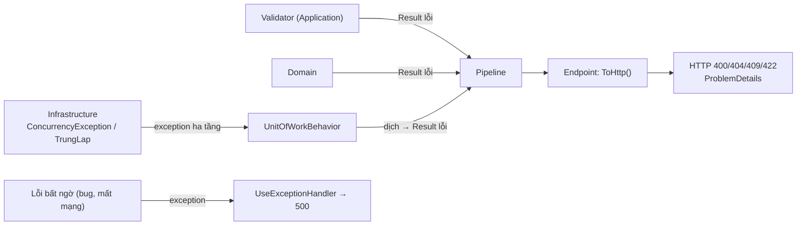

# Chương 7 — Result pattern và validation

## Mục tiêu học

Sau chương này, bạn sẽ:

- Dùng **Result pattern** để biểu diễn lỗi nghiệp vụ như **giá trị**, thay vì exception.
- Thiết kế `Loi` (mã ổn định + loại + mô tả) và dịch sang **HTTP** ở một chỗ.
- Viết validation bằng **FluentValidation**, phân biệt **validation đầu vào** với **luật nghiệp vụ**.
- Biết khi nào **nên** và **không nên** ném exception.

Code: [`Common/Result.cs`](../../code/kho-clean/Kho.Domain/Common/Result.cs), [`CaSuDung.cs`](../../code/kho-clean/Kho.Application/SanPhams/CaSuDung.cs), [`KhoEndpoints.cs`](../../code/kho-clean/Kho.Web/Endpoints/KhoEndpoints.cs).

## Exception hay Result?

Tập 1 (Chương 21) dạy exception. Tập 2 (Chương 9) dùng exception nghiệp vụ + `IExceptionHandler`. Cách đó ổn, nhưng có vấn đề khi lỗi là **kết quả bình thường, xảy ra thường xuyên**:

```csharp
// Exception cho "không đủ hàng" (xảy ra hàng ngày, không phải bất thường)
try { sp.XuatKho(n); }
catch (KhongDuHangException e) { ... }
```

- **Chi phí**: ném/bắt exception chậm hơn nhiều so với trả giá trị (đáng kể khi lặp/tải cao).
- **Luồng ẩn**: chữ ký `void XuatKho(int)` **không nói** nó có thể thất bại theo cách nào; người gọi dễ quên `try/catch`.
- **Goto vô hình**: exception nhảy qua nhiều tầng; khó đọc luồng.

**Result pattern**: hàm trả về **giá trị mô tả thành công hoặc lỗi**; chữ ký tự nói lên khả năng thất bại và trình biên dịch/IDE nhắc xử lý.

| Dùng **Result** cho | Dùng **exception** cho |
|---------------------|------------------------|
| lỗi nghiệp vụ dự đoán được (hết hàng, dữ liệu sai, không tìm thấy, xung đột) | lỗi lập trình (null, tham số sai, trạng thái không thể) |
| luồng bình thường mà "thất bại" là một kết quả | lỗi hạ tầng bất ngờ (mất mạng, đĩa đầy, bug) |
| cần cho người gọi xử lý từng trường hợp | lỗi mà tầng gần không thể xử lý → nổi lên tới handler toàn cục (`500`) |

Hai cách **bổ sung** nhau: lỗi *nghiệp vụ* qua `Result`, lỗi *bất thường* qua exception + `IExceptionHandler`.

## Thiết kế `Result` và `Loi`

```csharp
public enum LoaiLoi { DuLieuKhongHopLe, KhongTimThay, XungDot, NghiepVu }

public sealed record Loi(string Ma, string MoTa, LoaiLoi Loai)
{
    public static Loi DuLieuKhongHopLe(string ma, string moTa) => new(ma, moTa, LoaiLoi.DuLieuKhongHopLe);
    public static Loi KhongTimThay(string ma, string moTa) => new(ma, moTa, LoaiLoi.KhongTimThay);
    public static Loi XungDot(string ma, string moTa) => new(ma, moTa, LoaiLoi.XungDot);
    public static Loi NghiepVu(string ma, string moTa) => new(ma, moTa, LoaiLoi.NghiepVu);
}

public class Result : IKetQua<Result>
{
    public bool ThanhCong { get; }
    public Loi? Loi { get; }
    public static Result Ok() => new(true, null);
    public static Result Fail(Loi loi) => new(false, loi);
}

public sealed class Result<T> : Result, IKetQua<Result<T>>
{
    public T GiaTri => ThanhCong ? _giaTri! : throw new InvalidOperationException("Ket qua that bai khong co gia tri");
    public static Result<T> Ok(T giaTri) => new(giaTri, true, null);
    public static implicit operator Result<T>(T giaTri) => Ok(giaTri);       // return giaTri; tự thành Result<T>
    public Result<TOut> Map<TOut>(Func<T, TOut> f) => ThanhCong ? Result<TOut>.Ok(f(GiaTri)) : Result<TOut>.Fail(Loi!);
    public Result<TOut> Bind<TOut>(Func<T, Result<TOut>> f) => ThanhCong ? f(GiaTri) : Result<TOut>.Fail(Loi!);
}
```

Các quyết định:

- **`Loi.Ma` ổn định và có cấu trúc** (`"SanPham.KhongDuHang"`): client/log/i18n dựa vào **mã** (không đổi), còn `MoTa` là văn bản cho người đọc (có thể dịch/đổi).
- **`Loi.Loai`** là *phân loại nghiệp vụ*, không phải mã HTTP — domain không biết HTTP. Tầng Web ánh xạ một lần (`LoiSangHttp`, Chương 2).
- **Truy cập `GiaTri` khi thất bại ném `InvalidOperationException`**: đọc giá trị mà không kiểm tra là **bug lập trình** (đúng loại để dùng exception).
- **Không có `Result` "rỗng" mơ hồ**: hoặc thành công (có giá trị) hoặc thất bại (có lỗi).
- Có thể mở rộng thành **danh sách lỗi** (validation nhiều trường) — solution gộp thành một chuỗi cho đơn giản; thư viện như **ErrorOr**, **FluentResults**, **OneOf** làm phong phú hơn.

## Dùng Result

### Trong domain

```csharp
public static Result<SanPham> Tao(string? ma, string? ten, ...)
{
    var maKq = MaSanPham.Tao(ma);
    if (!maKq.ThanhCong) return Result<SanPham>.Fail(maKq.Loi!);        // dừng ngay, chuyển tiếp lỗi
    ...
    return sp;                                                            // conversion ngầm: T → Result<T>
}
```

### Trong handler: "đường ray" (railway-oriented)

```csharp
var kq = MaSanPham.Tao("LT001").Bind(m => Tien.Tao(-5).Map(_ => m));   // Bind/Map chỉ chạy tiếp khi thành công
```

`Map` biến đổi giá trị, `Bind` nối bước có thể lỗi khác; lỗi đầu tiên "trượt" thẳng ra cuối, các bước sau bị bỏ qua. Với chuỗi dài đọc gọn hơn `if (!x.ThanhCong) return ...` lồng nhau — nhưng với 2–3 bước, `if` tường minh cũng rõ ràng, đừng ép dùng `Bind`.

### Ở ranh giới HTTP

```csharp
public static IResult ToHttp<T>(this Result<T> kq) => kq.ThanhCong ? Results.Ok(kq.GiaTri) : LoiSangHttp(kq.Loi!);

private static IResult LoiSangHttp(Loi loi) => Results.Problem(title: loi.Ma, detail: loi.MoTa, statusCode: loi.Loai switch
{
    LoaiLoi.DuLieuKhongHopLe => 400, LoaiLoi.KhongTimThay => 404, LoaiLoi.XungDot => 409, LoaiLoi.NghiepVu => 422, _ => 500,
});
```

Kết quả `ProblemDetails` (RFC 9457) với `title = mã lỗi` giúp client xử lý theo mã. Muốn phong phú hơn: thêm `extensions` (danh sách lỗi theo trường).

## Validation với FluentValidation

Validator viết bằng code (tách khỏi DTO, dễ test, biểu đạt được điều kiện phức tạp):

```csharp
public sealed class ThemSanPhamValidator : AbstractValidator<ThemSanPhamCommand>
{
    public ThemSanPhamValidator()
    {
        RuleFor(x => x.Ma).NotEmpty().Matches("^[A-Za-z]{2}[0-9]{3}$").WithMessage("Ma gom 2 chu cai + 3 chu so");
        RuleFor(x => x.Ten).NotEmpty().Length(2, 200);
        RuleFor(x => x.Nhom).NotEmpty().MaximumLength(100);
        RuleFor(x => x.DonGia).GreaterThanOrEqualTo(0);
        RuleFor(x => x.TonDau).InclusiveBetween(0, 1_000_000);
    }
}
```

Các quy tắc hữu ích: `NotEmpty`, `NotNull`, `Length/MinimumLength/MaximumLength`, `Matches`, `EmailAddress`, `InclusiveBetween`, `GreaterThan`, `Must(x => ...)` (điều kiện tuỳ ý), `When/Unless` (điều kiện áp dụng), `RuleForEach` (phần tử danh sách), `SetValidator` (validator lồng), `MustAsync` (gọi CSDL — cẩn thận chi phí), `CascadeMode`.

Đăng ký tự động bằng quét assembly (trong `AddApplication`); `ValidationBehavior` (Chương 6) chạy mọi `IValidator<TRequest>` và trả `Result` lỗi.

### Ba tầng kiểm tra — mỗi tầng một việc

| Tầng | Kiểm tra gì | Công cụ | Lỗi |
|------|-------------|---------|-----|
| **Web/DTO** | JSON đúng cú pháp/kiểu | model binding | 400 |
| **Application (validator)** | **định dạng, phạm vi** của đầu vào lệnh | FluentValidation | 400 |
| **Domain** | **bất biến nghiệp vụ** (đủ hàng, mã hợp lệ, số tiền không âm) | factory/phương thức trả `Result` | 400/404/409/422 |
| **CSDL** | ràng buộc cuối cùng (UNIQUE, CHECK, FK) | schema | dịch thành `XungDot`... |

Đừng chỉ tin một tầng: **Domain tự bảo vệ** (đối tượng không bao giờ ở trạng thái sai dù ai gọi), validator cho **phản hồi sớm, đầy đủ, thân thiện**, CSDL là **lưới cuối**. Chúng có thể *trùng lặp* một phần (vd `TonDau >= 0`) — chấp nhận, vì mục đích khác nhau. Để tránh lệch, nhiều đội để validator gọi lại hàm của Domain (`MaSanPham.Tao(x).ThanhCong`) cho quy tắc quan trọng.

Ví dụ thực tế về trùng khoá: `ThemSanPhamHandler` kiểm tra `TonTaiMaAsync` trước (phản hồi tốt) **và** ràng buộc UNIQUE + `TrungLapException` xử lý trường hợp hai request đồng thời cùng qua bước kiểm tra — "kiểm tra rồi hành động" (check-then-act) luôn có khe race; CSDL là người phân xử.

## Tổng hợp luồng lỗi trong hệ thống



Một bảng duy nhất quyết định "lỗi nào thành mã nào" (`LoiSangHttp`), và mọi lỗi nghiệp vụ đều cùng hình dạng `ProblemDetails`.

## Lỗi thường gặp

- Trả `Result` nhưng vẫn ném exception cho cùng loại lỗi (hai luồng lỗi song song).
- `Loi` chỉ có chuỗi mô tả, không mã ổn định → client phải phân tích văn bản.
- Đưa `LoaiLoi.NghiepVu` thành mã HTTP trong Domain (rò rỉ HTTP vào miền).
- Truy cập `.GiaTri` mà không kiểm tra `ThanhCong`.
- Ép mọi thứ thành `Result` kể cả lỗi hạ tầng (nuốt lỗi 500 thành 4xx).
- Chỉ validate ở validator, Domain để `public set` — đường tắt qua code khác bỏ qua luật.
- Dùng `MustAsync` gọi CSDL cho mỗi rule, sinh nhiều truy vấn.
- Thông báo lỗi tiết lộ chi tiết nội bộ.

## Bài tập

1. Mở rộng `Loi` thành danh sách lỗi theo trường (`IReadOnlyList<LoiTruong>`); cập nhật `ValidationBehavior` và `LoiSangHttp` để trả `errors` như `ValidationProblem`.
2. Viết extension `Ensure(Func<T,bool> dieuKien, Loi loi)` cho `Result<T>` và dùng nó trong một chuỗi Bind.
3. Thêm rule FluentValidation `Must(BeUniqueMa)` gọi `ISanPhamRepository` — bàn về ưu/nhược so với kiểm tra trong handler.
4. Đổi endpoint xuất kho để trả **body** `{ tonMoi }` thay vì `204` — cần đổi gì ở command/handler (gợi ý: `Result<int>`)?
5. Viết test HTTP kiểm tra `title` (mã lỗi) trong `ProblemDetails` cho `404`, `409`, `422`, `400`.
