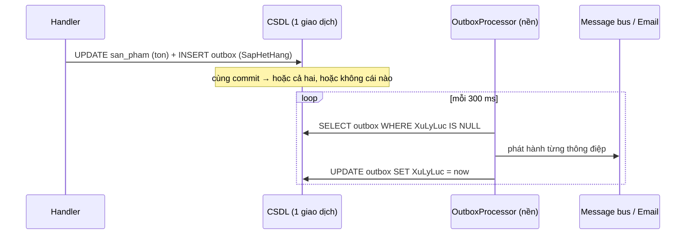

# Chương 8 — Sự kiện miền, xử lý nền và Outbox

## Mục tiêu học

Sau chương này, bạn sẽ:

- Phân biệt **sự kiện miền (domain event)** và **sự kiện tích hợp (integration event)**.
- Hiểu **vấn đề ghi kép (dual write)** và giải pháp **Transactional Outbox**.
- Cài đặt outbox + **`BackgroundService`** xử lý nền, đảm bảo **ít nhất một lần (at-least-once)**.
- Thiết kế bên nhận **idempotent**, và kiểm thử hệ thống bất đồng bộ một cách xác định.

Code: [`KhoDbContext.cs`](../../code/kho-clean/Kho.Infrastructure/Persistence/KhoDbContext.cs) (thu sự kiện → outbox), [`OutboxProcessor.cs`](../../code/kho-clean/Kho.Infrastructure/Outbox/OutboxProcessor.cs), [`IntegrationTests.cs`](../../code/kho-clean/Kho.Tests/IntegrationTests.cs).

## Bài toán

Khi tồn kho chạm ngưỡng cảnh báo (`SapHetHang`), hệ thống cần **báo cho bộ phận mua hàng**: gửi email, đẩy tin nhắn lên message bus, gọi webhook. Cách "ngây thơ":

```csharp
await uow.LuuAsync(ct);                 // 1) ghi CSDL
await emailSender.GuiAsync(...);        // 2) gửi email  ← nếu sập/lỗi ở đây?
```

## Vấn đề ghi kép (dual write)

Hai hệ thống (CSDL và email/message bus) **không thể chung một giao dịch**:

| Thứ tự | Sự cố | Hậu quả |
|--------|-------|---------|
| Lưu CSDL rồi gửi | tiến trình sập/mạng lỗi **giữa** hai bước | dữ liệu đã đổi nhưng **không ai được báo** (mất sự kiện) |
| Gửi rồi lưu CSDL | lưu thất bại (xung đột) | đã báo cho người khác về thay đổi **không hề xảy ra** |
| Bọc try/catch, thử lại | lặp lại, hay sập đúng lúc | gửi trùng hoặc bỏ sót |

Không có thứ tự nào an toàn. Cần một cơ chế bảo đảm: *"nếu dữ liệu đã đổi thì sự kiện chắc chắn sẽ được phát hành (ít nhất một lần)"*.

## Transactional Outbox

Ý tưởng: **ghi sự kiện vào một bảng `outbox` trong CÙNG giao dịch CSDL** với thay đổi nghiệp vụ. Một tiến trình nền **đọc bảng outbox và phát hành** ra bên ngoài, rồi đánh dấu đã xử lý.



Nhờ **atomicity** của giao dịch: sự kiện tồn tại **khi và chỉ khi** thay đổi nghiệp vụ được commit. Sập giữa chừng không mất gì: khi khởi động lại, tiến trình nền vẫn thấy dòng chưa xử lý.

### Từ sự kiện miền đến outbox

Domain chỉ **ghi nhận** sự kiện (Chương 3: `PhatSuKien`). Infrastructure thu chúng ngay trong `LuuAsync` (Unit of Work):

```csharp
public async Task<int> LuuAsync(CancellationToken ct)
{
    // 1) Thu sự kiện miền từ MỌI aggregate đang theo dõi → thông điệp outbox
    var aggregates = ChangeTracker.Entries<Entity<int>>().Select(e => e.Entity).Where(e => e.SuKienMien.Count > 0).ToList();
    foreach (var agg in aggregates)
    {
        foreach (var sk in agg.SuKienMien)
            Outbox.Add(new OutboxMessage { Loai = sk.GetType().Name, NoiDung = JsonSerializer.Serialize(sk, sk.GetType()), TaoLuc = sk.XayRaLuc });
        agg.XoaSuKien();
    }

    // 2) MỘT SaveChanges = dữ liệu nghiệp vụ + outbox, cùng một giao dịch
    try { return await SaveChangesAsync(ct); }
    catch (DbUpdateConcurrencyException) { throw new ConcurrencyException(); }
    ...
}
```

Handler và domain **không biết** outbox tồn tại — chỉ `PhatSuKien`. Mẫu này cũng chỉ ra vì sao tách sự kiện khỏi hành động: aggregate không cần biết *ai* nghe.

Test tích hợp `SuKienMien_DuocGhiVaoOutboxCungGiaoDich_...` kiểm chứng: sau `POST` tạo sản phẩm và xuất 3 (7 → 4, chạm ngưỡng 5), bảng `outbox` có `SanPhamDaTao` và `SapHetHang`.

## Tiến trình nền: `BackgroundService`

```csharp
public class OutboxProcessor(IServiceScopeFactory scopeFactory, TimeProvider dongHo, ILogger<OutboxProcessor> log) : BackgroundService
{
    protected override async Task ExecuteAsync(CancellationToken stoppingToken)
    {
        using var timer = new PeriodicTimer(TimeSpan.FromMilliseconds(300));
        while (await timer.WaitForNextTickAsync(stoppingToken))
            await XuLyMotLanAsync(stoppingToken);
    }

    public async Task<int> XuLyMotLanAsync(CancellationToken ct)
    {
        await using var scope = scopeFactory.CreateAsyncScope();              // DbContext Scoped → tự tạo scope (Tập 2, Ch. 5)
        var db = scope.ServiceProvider.GetRequiredService<KhoDbContext>();
        var phatHanh = scope.ServiceProvider.GetRequiredService<IPhatHanhSuKien>();

        var cho = await db.Outbox.Where(o => o.XuLyLuc == null && o.SoLanThu < ToiDaSoLanThu)
            .OrderBy(o => o.TaoLuc).Take(ToiDaMoiLan).ToListAsync(ct);

        foreach (var m in cho)
        {
            try { await phatHanh.PhatHanhAsync(m.Loai, m.NoiDung, ct); m.XuLyLuc = dongHo.GetUtcNow(); }
            catch (Exception e) { m.SoLanThu++; m.LoiCuoi = e.Message; log.LogWarning(e, "Phat hanh outbox {Id} that bai (lan {Lan})", m.Id, m.SoLanThu); }
        }
        if (cho.Count > 0) await db.SaveChangesAsync(ct);
        return cho.Count;
    }
}
```

Điểm cần chú ý:

- **`BackgroundService`** (từ `Microsoft.Extensions.Hosting`) chạy suốt vòng đời ứng dụng; `PeriodicTimer` là cách hiện đại để lặp định kỳ (không trôi thời gian như `Task.Delay` trong vòng lặp). Đăng ký: `services.AddHostedService(...)`.
- **Dịch vụ Scoped trong Singleton**: `BackgroundService` là Singleton; `DbContext` là Scoped ⇒ dùng `IServiceScopeFactory.CreateAsyncScope()` cho **mỗi lượt xử lý** (Tập 2, Chương 5 — captive dependency).
- **Tách `XuLyMotLanAsync` thành phương thức công khai** để test gọi trực tiếp, xác định, không chờ timer (mẫu quan trọng để kiểm thử xử lý nền).
- **Thứ tự** theo `TaoLuc` để giữ thứ tự tương đối; **giới hạn lô** (20) và **số lần thử** (5) tránh một thông điệp hỏng chặn cả hàng đợi ("poison message"): sau khi vượt số lần thử, để yên cho người vận hành xử lý (dead-letter).
- Nhiều instance chạy đồng thời? Cần **khoá** để tránh xử lý trùng (`SELECT ... FOR UPDATE SKIP LOCKED` trên PostgreSQL/SQL Server hint `READPAST`, hoặc chỉ chạy processor ở một instance). Với at-least-once, trùng vẫn an toàn nếu bên nhận idempotent.

### Bảo đảm **ít nhất một lần** (at-least-once)

Nếu tiến trình sập **sau khi** phát hành nhưng **trước khi** đánh dấu `XuLyLuc`, lần chạy sau **phát hành lại**. Vì vậy hệ thống phân phối là **at-least-once**, *không phải* exactly-once (gần như không thể trong hệ phân tán). Điều đó **đẩy trách nhiệm** sang bên nhận: phải **idempotent** — xử lý cùng một thông điệp hai lần cho kết quả như một lần. Cách làm:

- Mỗi thông điệp có **Id duy nhất** (`OutboxMessage.Id`); bên nhận lưu Id đã xử lý (bảng `da_xu_ly`) và bỏ qua trùng.
- Hoặc thao tác tự nhiên idempotent (đặt trạng thái = X thay vì "cộng thêm 1").
- Chương 13 đi sâu vào idempotency.

## Sự kiện miền hay sự kiện tích hợp?

| | **Domain event** | **Integration event** |
|---|------------------|-----------------------|
| Phạm vi | **trong** một bounded context/ứng dụng | **giữa** các hệ thống/dịch vụ |
| Ví dụ | `SapHetHang(Ma, TonKho...)` | `SanPhamSapHet` gửi cho dịch vụ Mua hàng |
| Truyền | đồng bộ trong tiến trình (handler cục bộ) hoặc outbox | qua message bus (RabbitMQ, Azure Service Bus, Kafka) |
| Hợp đồng | tự do thay đổi | **ổn định, có phiên bản** (người khác phụ thuộc) |

Solution dùng một bảng outbox cho cả hai để đơn giản: **sự kiện miền được phát hành thẳng làm thông điệp**. Trong hệ thống lớn, thường **ánh xạ** sự kiện miền → integration event (DTO ổn định) trước khi phát hành, để thay đổi nội bộ không làm vỡ bên ngoài.

## Xử lý sự kiện miền *trong tiến trình* (tuỳ chọn)

Đôi khi cần phản ứng **ngay trong cùng giao dịch** (ví dụ cập nhật một aggregate khác — cần nhất quán mạnh). Mẫu: trong `LuuAsync`, trước `SaveChangesAsync`, gọi `IDomainEventHandler<T>` cho từng sự kiện. Cẩn thận: handler chạy trong giao dịch, lỗi làm hỏng cả lệnh; và làm mờ ranh giới "một aggregate mỗi giao dịch". Ưu tiên **bất đồng bộ qua outbox** với nhất quán cuối cùng trừ khi nghiệp vụ đòi hỏi khác.

## `IPhatHanhSuKien` — cổng phát hành

```csharp
public interface IPhatHanhSuKien { Task PhatHanhAsync(string loai, string noiDungJson, CancellationToken ct); }
```

Mặc định ghi log (`LogPhatHanhSuKien`); thực tế thay bằng: gửi lên Azure Service Bus/RabbitMQ (qua **MassTransit**, **Wolverine**, **NServiceBus**, **Rebus**), gọi webhook, gửi email. Vì là cổng ở Application, đổi cài đặt **không đổi** domain/handler; test dùng `PhatHanhGia` gom vào danh sách.

## Kiểm thử bất đồng bộ một cách xác định

Test **không** `Thread.Sleep` chờ timer. Cách làm trong solution:

1. Tắt tiến trình nền khi test: `builder.UseSetting("Outbox:Bat", "false")`.
2. Lấy `OutboxProcessor` từ DI và **gọi `XuLyMotLanAsync`** đúng lúc cần.
3. Thay `IPhatHanhSuKien` bằng bản giả ghi lại.
4. Kiểm chứng: sau **hai** lần chạy, mỗi sự kiện chỉ được phát hành **một** lần (đã đánh dấu).

```csharp
await bxl.XuLyMotLanAsync(CancellationToken.None);
await bxl.XuLyMotLanAsync(CancellationToken.None);          // lần hai: không phát hành lại
Assert.Single(cuaEE, p => p.Loai == "SapHetHang");
```

## Dọn dẹp và vận hành

- **Xoá/lưu trữ** dòng outbox cũ đã xử lý (job định kỳ) để bảng không phình.
- **Giám sát**: số dòng chờ, tuổi dòng cũ nhất, số dòng vượt số lần thử — cảnh báo khi tăng (Chương 11).
- **Thứ tự**: outbox đảm bảo thứ tự *cục bộ* theo aggregate chứ không phải toàn cục; thiết kế bên nhận chịu được sự kiện đến lệch thứ tự (dùng số phiên bản/`XayRaLuc`).
- Chọn **khoảng quét**: ngắn (300 ms) = độ trễ thấp nhưng tải CSDL; dài = trễ cao. Hoặc "đánh thức" processor ngay sau commit (`Channel<T>`) và quét dự phòng chậm.

## Lỗi thường gặp

- Vẫn gọi email/bus **trong handler** (dual write, mất sự kiện khi sập).
- Ghi outbox trong **giao dịch khác** với thay đổi nghiệp vụ (mất ý nghĩa của outbox).
- Bên nhận không idempotent → xử lý trùng gây hậu quả (gửi email hai lần, trừ tiền hai lần).
- Thông điệp hỏng lặp mãi (không giới hạn số lần thử) chặn hàng đợi.
- `DbContext` Scoped bị tiêm thẳng vào `BackgroundService` (captive dependency).
- `Thread.Sleep` trong test chờ tiến trình nền → test chậm và bấp bênh.
- Phát sự kiện miền cả khi thao tác thất bại (Chương 3).
- Không dọn dẹp outbox, bảng phình vô hạn.

## Bài tập

1. Thêm sự kiện `GiaThayDoi` và đảm bảo nó vào outbox khi `DoiGia` thành công; viết test.
2. Viết `IPhatHanhSuKien` gửi HTTP `POST` tới webhook (dùng `HttpClient` + resilience — Tập 2, Chương 19); xử lý lỗi bằng `SoLanThu`.
3. Thêm bảng `da_xu_ly` phía nhận và một consumer idempotent bỏ qua thông điệp trùng Id.
4. Viết job dọn outbox xoá dòng `XuLyLuc` cũ hơn 7 ngày (một `BackgroundService` khác hoặc `ExecuteDeleteAsync`).
5. Cố tình làm `PhatHanhAsync` ném lỗi 3 lần rồi thành công; quan sát `SoLanThu`, `LoiCuoi` và viết test.
