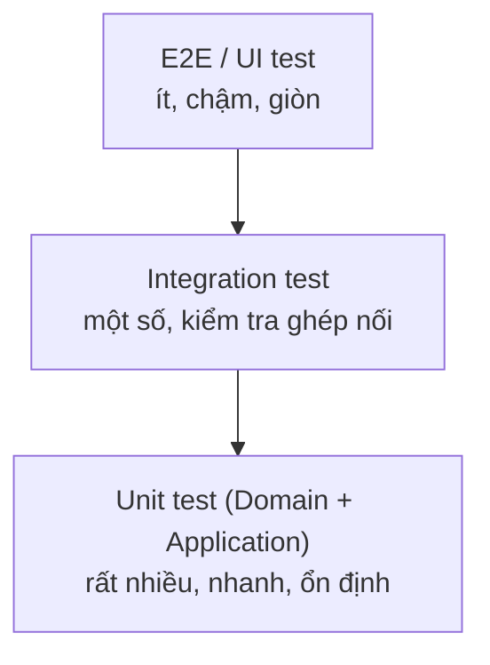

# Chương 9 — Chiến lược kiểm thử

## Mục tiêu học

Sau chương này, bạn sẽ:

- Thiết kế **chiến lược kiểm thử tổng thể**: kim tự tháp, các loại test và **cái gì test ở tầng nào**.
- Viết test **Domain / Application / Architecture / Integration** như trong `kho-clean` và hiểu vì sao mỗi loại tồn tại.
- Dùng **test data builder**, fake vs mock, **CSDL thật** trong test (SQLite file, Testcontainers).
- Kiểm thử **đồng thời (concurrency)** và **bất đồng bộ** một cách xác định; đo độ phủ có ý nghĩa.

Code: [`code/kho-clean/Kho.Tests/`](../../code/kho-clean/Kho.Tests/) — **40 test** (đã đạt) chia thành `DomainTests`, `ApplicationTests`, `ArchitectureTests`, `IntegrationTests` (mỗi `Theory` tính nhiều ca).

## Vì sao cần "chiến lược"?

Không có chiến lược, đội thường rơi vào một trong hai cực: **quá ít test** (sợ sửa code) hoặc **quá nhiều test giòn** (mỗi refactor làm đỏ 200 test, không ai tin test). Chiến lược trả lời: *test cái gì, ở tầng nào, bằng công cụ gì, để đạt độ tin cậy cao với chi phí bảo trì thấp?*

## Kim tự tháp kiểm thử



| Tầng test | Kiểm chứng | Phụ thuộc | Số lượng | Ví dụ trong solution |
|-----------|-----------|-----------|----------|----------------------|
| **Domain unit** | luật nghiệp vụ, bất biến, sự kiện | không | **nhiều nhất** | `XuatKho_ChamNguongCanhBao_PhatSapHetHangMotLan` |
| **Application** | điều phối ca sử dụng, pipeline | fake cho cổng | nhiều | `ThemSanPham_SaiDinhDang_ValidationBehaviorChanTruocHandler` |
| **Architecture** | quy tắc phụ thuộc, quy ước | file/reflection | ít, rẻ | `Domain_KhongPhuThuocGi` |
| **Integration** | HTTP + DI + EF + CSDL thật ghép đúng | môi trường thật (SQLite file) | vừa | `XuatDongThoi_KhongBaoGioAm_...`, outbox |
| **E2E/UI** | luồng người dùng qua giao diện | toàn hệ thống | **rất ít** | (ngoài phạm vi; Playwright) |

Kiến trúc sạch **làm kim tự tháp khả thi**: vì nghiệp vụ nằm ở Domain/Application không phụ thuộc hạ tầng, phần lớn test chạy trong **micro-giây/mili-giây**. Ở kiến trúc "khối" (Tập 2), muốn test nghiệp vụ phải dựng CSDL và HTTP → toàn integration test, chậm, nên ít khi chạy.

## 1. Domain test — nhanh nhất, giá trị nhất

```csharp
[Fact]
public void XuatKho_KhongDuHang_ThatBaiVaTonKhongDoi()
{
    var sp = Tao(ton: 2);
    sp.XoaSuKien();

    var kq = sp.XuatKho(5, Gio);

    Assert.False(kq.ThanhCong);
    Assert.Equal("SanPham.KhongDuHang", kq.Loi!.Ma);
    Assert.Equal(2, sp.TonKho);
    Assert.Empty(sp.SuKienMien);                     // thất bại thì KHÔNG có sự kiện
}
```

Không DI, không mock, không I/O. **Kiểm tra hành vi quan sát được** (kết quả, trạng thái, sự kiện) chứ không kiểm tra cài đặt bên trong. Thời gian truyền vào (`Gio`) thay vì `DateTime.Now` để test **xác định**. Dùng `[Theory]` cho biên (mã hợp lệ/không, giá âm, tồn đầu âm).

## 2. Application test — với bản giả (fake) cho cổng

```csharp
class RepoGia : ISanPhamRepository { public List<SanPham> Ds { get; } = []; ... }
class UowGia : IUnitOfWork { public int SoLanLuu { get; private set; } public Exception? Nem { get; set; } ... }

var s = new ServiceCollection();
s.AddSingleton<ISanPhamRepository>(_repo).AddSingleton<IUnitOfWork>(_uow).AddSingleton<IKhoDocDuLieu>(new DocGia());
s.AddLogging(); s.AddApplication();                                    // pipeline THẬT + handler THẬT
_sender = s.BuildServiceProvider().CreateScope().ServiceProvider.GetRequiredService<ISender>();
```

Test đi qua **mediator và toàn bộ behavior thật** (`_sender.Send(...)`), chỉ thay hạ tầng. Nhờ vậy kiểm chứng cả **hợp tác** giữa handler–behavior: validation chặn trước handler; UoW chỉ lưu khi thành công; lỗi hạ tầng thành `409`; truy vấn không bao giờ lưu.

**Fake hay mock?**

- **Fake**: cài đặt đơn giản, hoạt động thật (repository trong `List`). Test đọc như mô tả **hành vi**, bền qua refactor.
- **Mock** (NSubstitute/Moq): thiết lập kỳ vọng lời gọi (`Received(1).LuuAsync()`). Hợp để kiểm tra **tác dụng phụ ra ngoài** (gửi email), nhưng dùng quá đà làm test **dính chặt vào cài đặt** (đổi cách gọi là đỏ dù hành vi vẫn đúng).
- Quy tắc: **fake cho thứ có trạng thái** (repository, đồng hồ), **mock/spy cho thứ chỉ "gửi đi"** (email, message bus); ưu tiên kiểm tra **kết quả** hơn kiểm tra **lời gọi**.

## 3. Architecture test

Đã có từ Chương 1 (đọc csproj/reflection). Thêm quy ước dễ vi phạm: aggregate không có setter công khai, handler `sealed`, tên kết thúc `Handler`... Rẻ, chạy tức thì, ngăn xói mòn kiến trúc.

## 4. Integration test — môi trường thật, ít nhưng chắc

```csharp
public class KhoFactory : WebApplicationFactory<Program>
{
    private readonly string _file = Path.Combine(Path.GetTempPath(), $"kho-clean-test-{Guid.NewGuid():N}.db");
    protected override void ConfigureWebHost(IWebHostBuilder builder)
    {
        builder.UseSetting("Outbox:Bat", "false");                    // tắt tiến trình nền → test chủ động gọi
        builder.ConfigureServices(s =>
        {
            s.RemoveAll<DbContextOptions<KhoDbContext>>();
            s.AddDbContext<KhoDbContext>(o => o.UseSqlite($"Data Source={_file};Default Timeout=30"));
            s.RemoveAll<IPhatHanhSuKien>(); s.AddSingleton<IPhatHanhSuKien>(PhatHanh);
        });
    }
}
```

Nguyên tắc chọn **CSDL trong integration test**:

| Lựa chọn | Đánh giá |
|----------|----------|
| EF **InMemory** provider | ✘ không có ràng buộc/giao dịch/SQL thật → "xanh giả" |
| **SQLite `:memory:`** (một kết nối chung) | ổn cho test đơn luồng; **sai lệch với test đồng thời** (Tập 2, Chương 22) |
| **SQLite file tạm** (mỗi request một kết nối) | tốt, nhanh, không cần cài; khác CSDL production ở SQL dialect |
| **Testcontainers** (CSDL thật trong Docker: PostgreSQL/SQL Server) | **trung thực nhất** — chậm hơn, cần Docker; nên chạy trong CI cho luồng chính |

Nếu production dùng PostgreSQL thì nên có **ít nhất một bộ integration test chạy trên PostgreSQL thật** (Testcontainers) vì SQLite bỏ sót khác biệt (kiểu `decimal`, phân biệt hoa/thường, khoá, `DateTimeOffset`). Kinh nghiệm thật khi viết solution này: SQLite bắt được lỗi `ORDER BY DateTimeOffset` và `SUM(decimal)` mà unit test không thấy — chính là loại lỗi "ghép nối" mà integration test tồn tại để bắt.

### Test đồng thời

```csharp
var kq = await Task.WhenAll(Enumerable.Range(0, 15).Select(_ => _c.PostAsJsonAsync("/api/san-pham/DD001/xuat", new { soLuong = 1 })));
int ok = kq.Count(r => r.StatusCode == HttpStatusCode.NoContent);
int tonCuoi = (await _c.GetFromJsonAsync<SanPhamDto>("/api/san-pham/DD001"))!.TonKho;
Assert.True(tonCuoi >= 0);            // BẤT BIẾN: không bao giờ âm
Assert.Equal(5 - ok, tonCuoi);         // mỗi lần thành công trừ đúng 1
```

Điều kiện để test đồng thời **có ý nghĩa**: (1) cùng lúc thật sự (`Task.WhenAll`); (2) môi trường giữ đúng tính chất (kết nối riêng cho từng request); (3) **khẳng định bất biến** (tồn ≥ 0, tổng thành công + từ chối = tổng yêu cầu), *không* khẳng định thứ tự hay số lượng chính xác khi kết quả hợp lệ có thể khác nhau tuỳ lịch chạy. Chạy vài lần/nhân lên để tăng xác suất lộ lỗi.

### Test bất đồng bộ/nền

Đã thấy ở Chương 8: tắt timer, gọi `XuLyMotLanAsync` trực tiếp, dùng cổng phát hành giả. **Không `Thread.Sleep`.** Nếu bắt buộc chờ điều kiện, dùng vòng thăm dò có **thời hạn** (`await Poll(() => cond, timeout)`), không ngủ cố định.

## Test data builder

Khi tạo dữ liệu test dài dòng, dùng **builder** có giá trị mặc định hợp lệ, chỉ ghi đè cái liên quan:

```csharp
public class SanPhamBuilder
{
    private string _ma = "LT001"; private int _ton = 10; private int _canhBao = 5;
    public SanPhamBuilder Ma(string m) { _ma = m; return this; }
    public SanPhamBuilder Ton(int t) { _ton = t; return this; }
    public SanPhamBuilder CanhBao(int c) { _canhBao = c; return this; }
    public SanPham Build() => SanPham.Tao(_ma, "Laptop", "Thiet bi", 1000, _ton, Gio, _canhBao).GiaTri;
}
var sp = new SanPhamBuilder().Ton(7).CanhBao(5).Build();      // test đọc như văn xuôi, đổi hàm Tao không sửa 50 test
```

Trong mã mẫu, hàm trợ giúp `Tao(ton, canhBao)` trong `DomainTests` là dạng rút gọn của ý này. Thư viện **Bogus**/**AutoFixture** sinh dữ liệu ngẫu nhiên hợp lệ khi cần.

## Đặt tên, cấu trúc, độ tin cậy

- **Tên** mô tả *tình huống → kết quả*: `XuatKho_KhongDuHang_ThatBaiVaTonKhongDoi`. Khi đỏ, tên đã nói "hỏng cái gì".
- **Arrange–Act–Assert**, một hành vi mỗi test; ít điều kiện/vòng lặp.
- **Độc lập & lặp lại được**: không phụ thuộc thứ tự, giờ hệ thống, dữ liệu chung; dùng `TimeProvider` (`FakeTimeProvider` từ `Microsoft.Extensions.TimeProvider.Testing`).
- **Nhanh**: bộ Domain+Application chạy dưới 1 giây; tách integration ra (`[Trait("Loai","Integration")]`) để chạy khi cần.
- **Xoá test flaky** ngay hoặc sửa gốc rễ; test không tin cậy còn tệ hơn không test.
- Đừng test **framework/thư viện** (EF có lưu được không?) — test **quyết định của bạn**.

## Độ phủ và mutation testing

Độ phủ (coverage) đo dòng được chạy qua, **không** đo chất lượng assert. Dùng như **đèn đỏ** (vùng nghiệp vụ quan trọng phủ thấp = rủi ro) chứ không như **mục tiêu** (đuổi 100% sinh test vô nghĩa). Công cụ mạnh hơn: **mutation testing** (Stryker.NET) — tự sửa code (đổi `<` thành `<=`) và kiểm tra test có **bắt được** không; điểm mutation phản ánh sức mạnh thật của bộ test.

```
dotnet test --collect:"XPlat Code Coverage"
dotnet tool install -g dotnet-stryker   &&   dotnet stryker      # mutation testing
```

## Kiểm thử hợp đồng và bảo mật

- **Contract test** (schema OpenAPI/Pact): đảm bảo client và server đồng ý hình dạng request/response — quan trọng khi nhiều đội/dịch vụ (Chương 17). Có thể snapshot OpenAPI trong CI và so sánh để **phát hiện breaking change**.
- **Test bảo mật**: `401/403` cho mọi endpoint nhạy cảm (Tập 2, Chương 22 có `KhongDangNhap_MoiEndpointTra401`), IDOR, rate limit, header.
- **Test hiệu năng/tải** (k6, NBomber): trước khi ra sản phẩm, đo độ trễ p95 và tải tối đa (Chương 11).

## Quy trình gợi ý

1. Viết Domain test cho luật trước (TDD khi luật khó).
2. Handler + Application test với fake.
3. Vài integration test cho luồng chính và các lỗi ghép nối hay gặp (JSON, route, DI, migration, đồng thời).
4. Architecture test trong CI.
5. Test chạy trên **mỗi commit** (Chương 15); integration nặng (Testcontainers) chạy trên PR/đêm.
6. Khi có bug production: **viết test tái hiện trước**, rồi sửa.

## Lỗi thường gặp

- Chỉ có E2E/integration test → chậm, giòn, không dám chạy thường xuyên.
- Test kiểm tra cài đặt (số lần gọi, thứ tự nội bộ) thay vì hành vi.
- Dùng EF InMemory và tin rằng CSDL "đã được test".
- `Thread.Sleep` chờ tiến trình nền.
- Test phụ thuộc thứ tự/dữ liệu chung → lúc xanh lúc đỏ.
- Mock mọi thứ, kể cả Domain.
- Đuổi độ phủ 100% bằng test không có assert.
- Không có test kiến trúc/hợp đồng: ranh giới bị phá dần mà không ai biết.

## Bài tập

1. Viết `SanPhamBuilder` và chuyển ba test Domain sang dùng nó.
2. Thêm integration test: `POST` thêm sản phẩm hai lần **đồng thời** cùng mã; đúng một `201`, còn lại `409`; không có `500`.
3. Chạy `dotnet stryker` (hoặc tự "đột biến" một điều kiện trong `XuatKho`) và xem test nào bắt được.
4. Thêm test kiến trúc: không lớp nào trong Application dùng `System.Net.Http`; hoặc mọi `IRequestHandler` nằm trong namespace `Kho.Application.*`.
5. (Cần Docker) Thay SQLite bằng PostgreSQL trong Testcontainers cho một test; ghi lại điều gì khác biệt.
