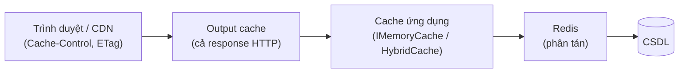

# Chương 10 — Caching

## Mục tiêu học

Sau chương này, bạn sẽ:

- Hiểu **caching** giải quyết gì và những **rủi ro** đi kèm ("hai vấn đề khó: đặt tên và vô hiệu hoá cache").
- Dùng **`IMemoryCache`**, **`HybridCache`** (.NET 9+), **Output Caching**, và biết khi nào cần cache phân tán (Redis).
- Nhận ra và chặn **cache stampede**; thiết kế **chiến lược vô hiệu hoá**.
- Áp dụng cache đúng chỗ (pipeline behavior cho query) và tránh cache dữ liệu sai đối tượng/người dùng.

Code: [`code/ch10-caching/`](../../code/ch10-caching/) — nguồn dữ liệu "chậm 300 ms" có bộ đếm lời gọi để **thấy** hiệu quả bằng số.

## Cache là gì, để làm gì?

**Cache** lưu kết quả đắt (truy vấn CSDL, gọi API, tính toán) ở nơi **rẻ và gần** để lần sau dùng lại. Lợi: **giảm độ trễ**, **giảm tải** CSDL/dịch vụ ngoài, **tăng thông lượng**. Cái giá: **dữ liệu có thể cũ** (staleness), độ phức tạp vô hiệu hoá, thêm điểm lỗi, tốn bộ nhớ.

Khi nào đáng cache: dữ liệu **đọc nhiều, ghi ít**, tính toán **đắt**, chấp nhận **cũ vài giây–phút** (danh mục sản phẩm, cấu hình, báo cáo, kết quả API ngoài). Không cache: dữ liệu cần **luôn chính xác tuyệt đối** (số dư, tồn kho khi đặt hàng), dữ liệu riêng từng người dùng mà không tách khoá, thứ rẻ sẵn.

> **Quy tắc**: đo trước khi cache. Cache che giấu vấn đề (truy vấn chậm cần chỉ mục) thay vì sửa. Cache là *tối ưu*, không phải *thiết kế*.

## Các tầng cache



| Tầng | Cache gì | Công cụ | Khi nào |
|------|----------|---------|---------|
| Client/CDN | response HTTP tĩnh/công khai | `Cache-Control`, `ETag`, CDN | tài nguyên tĩnh, API công khai |
| **Output cache** | toàn bộ response endpoint | `AddOutputCache` | trang/báo cáo giống nhau cho nhiều người |
| **Cache ứng dụng** | đối tượng/DTO/kết quả truy vấn | `IMemoryCache`, `HybridCache` | dữ liệu dùng lại giữa nhiều endpoint |
| **Cache phân tán** | như trên, chia sẻ giữa các instance | Redis, SQL Server | nhiều instance, cần chung một bộ nhớ đệm |

## 1. `IMemoryCache` — cache-aside thủ công

```csharp
app.MapGet("/memory/{id:int}", async (int id, IMemoryCache cache, NguonDuLieuCham nguon) =>
{
    if (cache.TryGetValue($"sp:{id}", out SanPhamCache? co)) return co!;      // có trong cache
    var moi = await nguon.LayAsync(id);                                        // không có: đi lấy
    cache.Set($"sp:{id}", moi, TimeSpan.FromSeconds(30));
    return moi;
});
```

Mẫu **cache-aside**: kiểm tra cache → thiếu thì lấy nguồn → ghi vào cache. Đơn giản, nhưng có ba vấn đề:

1. **Chỉ trong một tiến trình** (mỗi instance một cache riêng, không nhất quán khi scale ngang).
2. **Không chống stampede** (xem dưới).
3. Phải tự quản thời hạn, khoá, kích thước (`SizeLimit`), vô hiệu hoá.

### Cache stampede (thundering herd)

Khi mục hết hạn/chưa có, **nhiều request đồng thời** cùng thấy "thiếu" và **cùng chạy** truy vấn đắt. Chạy code mẫu, 20 request đồng thời tới `/memory/2` (nguồn 300 ms):

```
soLanGoiNguon: 20      ← 20 lần truy vấn thật, dù chỉ cần 1
```

Với dữ liệu nóng và nguồn đắt, một mục hết hạn có thể đánh sập CSDL. Cần **hợp nhất** các lần tính đồng thời (single-flight): request đầu tiên tính, các request khác **chờ kết quả đó**.

## 2. `HybridCache` — khuyến nghị cho ứng dụng mới

`Microsoft.Extensions.Caching.Hybrid` (GA từ .NET 9) kết hợp **L1 (bộ nhớ cục bộ, cực nhanh)** và **L2 (cache phân tán như Redis, tuỳ chọn)**, **chống stampede sẵn**, **tag** để vô hiệu hoá theo nhóm:

```csharp
builder.Services.AddHybridCache(o => o.DefaultEntryOptions = new HybridCacheEntryOptions
{
    Expiration = TimeSpan.FromSeconds(30),                 // hạn tổng thể (L2)
    LocalCacheExpiration = TimeSpan.FromSeconds(10),       // hạn ở L1 (cục bộ)
});

app.MapGet("/hybrid/{id:int}", async (int id, HybridCache cache, NguonDuLieuCham nguon, CancellationToken ct) =>
    await cache.GetOrCreateAsync($"sp:{id}",
        async token => await nguon.LayAsync(id),            // factory: chỉ CHẠY MỘT LẦN dù nhiều request đồng thời
        tags: ["san-pham", $"sp:{id}"],
        cancellationToken: ct));
```

Kết quả thật với 20 request đồng thời:

```
IMemoryCache thủ công  → soLanGoiNguon: 20
HybridCache            → soLanGoiNguon: 1      ← các request đợi chung kết quả của request đầu
```

Cách hoạt động: `GetOrCreateAsync` tra L1 → L2 → gọi factory; nếu một khoá đang được tạo, request khác **chờ cùng `Task`**. Kết quả được **tuần tự hoá** khi lưu vào L2 (nên kiểu dữ liệu phải serialize được; mặc định `System.Text.Json`).

Nếu **không cấu hình L2**, `HybridCache` chỉ dùng L1 nhưng vẫn có chống stampede và API thống nhất — dễ dàng **nâng lên Redis** sau này bằng `AddStackExchangeRedisCache(...)` (đăng ký `IDistributedCache`) mà không đổi code gọi.

### Vô hiệu hoá theo tag

```csharp
app.MapPost("/hybrid/{id:int}/cap-nhat", async (int id, HybridCache cache, NguonDuLieuCham nguon) =>
{
    nguon.Sua(id);                                    // 1) ghi vào nguồn thật
    await cache.RemoveByTagAsync($"sp:{id}");         // 2) vô hiệu hoá mọi mục gắn thẻ này
    return Results.NoContent();
});
```

Chạy thử: lấy `/hybrid/3` → `phienBan: 1`; gọi cập nhật; lấy lại → `phienBan: 2` (cache đã bị xoá đúng lúc).

## 3. Output caching

Cache **cả response HTTP** của endpoint theo chính sách:

```csharp
builder.Services.AddOutputCache(o => o.AddPolicy("BaoCao", p => p.Expire(TimeSpan.FromSeconds(15)).Tag("bao-cao")));
app.UseOutputCache();

app.MapGet("/bao-cao", ...).CacheOutput("BaoCao");
app.MapPost("/bao-cao/lam-moi", async (IOutputCacheStore store, CancellationToken ct) => { await store.EvictByTagAsync("bao-cao", ct); return Results.NoContent(); });
```

Kết quả thử: hai lần `GET /bao-cao` trả **cùng `taoLuc` và `soLanChayThat: 1`** (handler chỉ chạy một lần); sau `POST /bao-cao/lam-moi` lần kế tiếp chạy lại (`soLanChayThat: 2`). Mặc định output cache **chỉ cache `GET/HEAD` trả `200`, không có `Authorization`/cookie** (an toàn: tránh cache dữ liệu riêng tư); có thể `VaryByQuery`, `VaryByHeader`, `VaryByValue`. Response caching (`Cache-Control`) khác: dựa vào header để **client/proxy** cache; output caching cache **phía server** và **bạn điều khiển** vô hiệu hoá.

## 4. Cache phân tán (Redis)

Nhiều instance ⇒ cache cục bộ mỗi nơi một khác (người dùng thấy dữ liệu khác nhau tuỳ gặp instance nào) và mỗi instance "làm nóng" riêng. **Redis** là bộ nhớ đệm chung:

```
dotnet add package Microsoft.Extensions.Caching.StackExchangeRedis
builder.Services.AddStackExchangeRedisCache(o => o.Configuration = builder.Configuration.GetConnectionString("Redis"));
builder.Services.AddHybridCache();            // tự dùng IDistributedCache làm L2
```

Redis còn dùng làm kho phiên, khoá phân tán, hàng đợi nhẹ, rate limit phân tán (Tập 2, Chương 21). Chi phí: thêm hạ tầng và một điểm lỗi; mỗi truy cập là một lượt mạng — vì vậy L1 vẫn có giá trị. **Thiết kế cho cache hỏng**: khi Redis không sẵn sàng, ứng dụng nên **vẫn chạy** (chậm hơn, chạm CSDL) chứ không sập.

## Vô hiệu hoá cache — phần khó nhất

| Chiến lược | Cách làm | Ưu/nhược |
|-----------|----------|----------|
| **Hết hạn theo thời gian (TTL)** | đặt `Expiration` ngắn | đơn giản; chấp nhận dữ liệu cũ tối đa TTL |
| **Xoá khi ghi** | sau khi cập nhật gọi `RemoveByTag/Remove` | dữ liệu mới ngay; phải nhớ gọi ở **mọi** đường ghi |
| **Theo sự kiện** | handler sự kiện miền (`GiaThayDoi`) xoá cache | tách rời (ghi không biết cache); xem outbox Chương 8 |
| **Khoá có phiên bản** | khoá chứa `version` (`sp:3:v7`) | tự "vô hiệu" khi version đổi; cache cũ chết theo TTL |

Quy tắc:

1. **Cache chỉ thứ có thể cũ**; với dữ liệu cần chính xác, đọc thẳng nguồn.
2. **Xoá sau khi ghi nguồn** (nếu xoá trước, một request xen giữa có thể nạp lại giá trị cũ vào cache).
3. Luôn đặt **TTL** như lưới an toàn dù có xoá chủ động — nếu quên xoá ở đâu đó, dữ liệu cũ tự hết.
4. Đặt tag theo **thực thể và theo nhóm** (`sp:3`, `san-pham`) để xoá tinh hoặc rộng.

## Cache và bảo mật/đúng đắn

- **Khoá phải chứa mọi yếu tố ảnh hưởng kết quả**: người dùng/tenant/ngôn ngữ/quyền. Quên `TenantId` ⇒ **người này thấy dữ liệu người khác** (lỗ hổng nghiêm trọng).
- **Không cache lỗi** (hoặc TTL cực ngắn) — lỗi tạm thời không nên "dính" 30 giây; solution đề xuất chỉ cache `Result` thành công.
- **Không cache dữ liệu nhạy cảm** không mã hoá ở Redis dùng chung; cân nhắc mã hoá/TTL ngắn.
- Cache đối tượng **bất biến** (DTO/record); nếu cache tham chiếu tới đối tượng có thể sửa, một chỗ sửa làm hỏng mọi người.
- **Cache penetration**: khoá không tồn tại bị gọi liên tục → lần nào cũng chạm CSDL. Cache cả kết quả "không có" trong thời gian ngắn.

## Cache trong kiến trúc sạch: behavior cho query

Đặt cache thành **pipeline behavior** chỉ cho truy vấn (Chương 6) — handler không biết về cache:

```csharp
public interface ICachedQuery { string CacheKey { get; } string[] Tags { get; } TimeSpan ThoiGianSong { get; } }

public sealed class CachingBehavior<TRequest, TResponse>(HybridCache cache) : IPipelineBehavior<TRequest, TResponse>
    where TRequest : IQuery<TResponse>, ICachedQuery where TResponse : IKetQua<TResponse>
{
    public async Task<TResponse> Handle(TRequest request, RequestHandlerDelegate<TResponse> next, CancellationToken ct)
        => await cache.GetOrCreateAsync(request.CacheKey, async _ => await next(),
            new HybridCacheEntryOptions { Expiration = request.ThoiGianSong }, request.Tags, cancellationToken: ct);
}

public sealed record LaySanPhamQuery(string Ma) : IQuery<Result<SanPhamDto>>, ICachedQuery
{
    public string CacheKey => $"sp:{Ma.ToUpperInvariant()}";
    public string[] Tags => ["san-pham", CacheKey];
    public TimeSpan ThoiGianSong => TimeSpan.FromSeconds(30);
}
```

Và **lệnh** vô hiệu hoá: `UnitOfWorkBehavior` (hoặc handler sự kiện) gọi `cache.RemoveByTagAsync(...)` sau khi lưu thành công. Kiểu `Result` phải serialize được để lưu L2 (hoặc chỉ cache DTO, không cache `Result`).

## Lỗi thường gặp

- Cache trước khi đo; cache để "che" truy vấn thiếu chỉ mục.
- Không chống stampede → sập CSDL khi mục nóng hết hạn.
- Khoá cache thiếu người dùng/tenant → rò rỉ dữ liệu.
- Xoá cache **trước** khi ghi nguồn; hoặc quên xoá ở một đường ghi.
- Không có TTL → dữ liệu cũ vĩnh viễn khi lỡ quên vô hiệu hoá.
- Cache đối tượng có thể thay đổi (entity EF đang theo dõi) — cache DTO bất biến.
- Cache lỗi; cache dữ liệu cần chính xác (tồn kho khi đặt hàng).
- Redis là điểm lỗi duy nhất — ứng dụng sập khi Redis sập.
- Tuần tự hoá kiểu không hỗ trợ khi dùng L2 (chỉ lộ ra khi bật Redis).

## Bài tập

1. Thêm `Cache-Control: public, max-age=60` cho `/khong-cache/{id}` và quan sát bằng `curl -i`; so sánh với output cache phía server.
2. Cache "không tìm thấy" 5 giây trong endpoint hybrid để chống penetration; đo số lần gọi nguồn khi bị tấn công bằng id ngẫu nhiên.
3. Viết `CachingBehavior` ở trên vào `kho-clean` cho `LaySanPhamQuery` và test: lần gọi thứ hai không chạm repository; sau `NhapKhoCommand` cache bị xoá.
4. (Cần Docker) Chạy Redis, cấu hình L2 cho `HybridCache`, chạy hai instance ứng dụng trên hai cổng và xác nhận cập nhật ở instance A làm mất cache ở instance B.
5. Đo (`Stopwatch`) độ trễ p50/p95 của `/khong-cache`, `/memory`, `/hybrid` với 200 request và vẽ nhận xét.
