# Chương 11 — Quan sát và hiệu năng

## Mục tiêu học

Sau chương này, bạn sẽ:

- Hiểu **observability** (khả năng quan sát) và ba trụ cột: **logs, metrics, traces**.
- Cấu hình **OpenTelemetry** cho ASP.NET Core: tracing, metrics, logs, và **truyền ngữ cảnh** giữa các dịch vụ.
- Tự tạo **span** và **metric** nghiệp vụ; phân biệt **liveness** và **readiness** health check.
- Có phương pháp **đo → tìm nút thắt → tối ưu** hiệu năng, kèm danh sách kiểm tra cho EF Core và ASP.NET Core.

Code: [`code/ch11-quan-sat/`](../../code/ch11-quan-sat/) — luồng đặt hàng nhiều bước, in trace/metric/log ra console.

## Từ "giám sát" đến "quan sát"

**Giám sát (monitoring)** trả lời các câu hỏi *đã biết trước* ("CPU bao nhiêu? có lỗi không?"). **Quan sát (observability)** cho phép hỏi *câu hỏi chưa lường trước* ("vì sao đơn hàng của khách X chậm lúc 14:03?") bằng cách **phát dữ liệu đủ giàu từ bên trong**. Ba trụ cột:

| Trụ cột | Là gì | Trả lời | Ví dụ |
|---------|-------|---------|-------|
| **Logs** | sự kiện rời rạc có thời điểm | *chuyện gì đã xảy ra?* | "Dat hang LT001 that bai: vuot han muc" |
| **Metrics** | số đo tổng hợp theo thời gian (rẻ, đếm/đo) | *hệ thống đang thế nào? xu hướng?* | số đơn/giây, p95 độ trễ, tỉ lệ lỗi |
| **Traces** | đường đi **một request** xuyên qua các thành phần/dịch vụ | *thời gian đi đâu? ai gọi ai?* | request → `KiemTraTon` → `ThanhToan` → dịch vụ ngoài |

Ba thứ **bổ sung nhau**: metric báo *có vấn đề*, trace chỉ *ở đâu*, log giải thích *vì sao*. Chìa khoá: chúng được **liên kết bằng TraceId**.

## OpenTelemetry

**OpenTelemetry (OTel)** là chuẩn mở (CNCF) cho việc **tạo và xuất** telemetry, độc lập nhà cung cấp: code của bạn phát dữ liệu theo một chuẩn (OTLP); đích là **Jaeger, Grafana Tempo/Loki/Prometheus, Azure Monitor/Application Insights, Datadog, New Relic, Elastic**... Đổi đích không đổi code ứng dụng. Trong .NET, OTel dựa trên API có sẵn: **`ActivitySource`/`Activity`** (trace), **`Meter`** (metrics), **`ILogger`** (logs).

```csharp
builder.Services.AddOpenTelemetry()
    .ConfigureResource(r => r.AddService("kho-dat-hang", serviceVersion: "1.0.0"))          // "ai phát": tên + phiên bản dịch vụ
    .WithTracing(t => t
        .AddAspNetCoreInstrumentation()                       // tự động: span cho mỗi request đến
        .AddHttpClientInstrumentation()                       // tự động: span cho request đi + gắn header traceparent
        .AddSource(DatHangTelemetry.TenNguon)                 // nguồn span TỰ VIẾT
        .AddConsoleExporter())                                // demo. Thực tế: .AddOtlpExporter()
    .WithMetrics(m => m
        .AddAspNetCoreInstrumentation()
        .AddMeter(DatHangTelemetry.TenNguon)
        .AddConsoleExporter());

builder.Logging.AddOpenTelemetry(o => { o.IncludeFormattedMessage = true; o.ParseStateValues = true; });
```

Thực tế production: `.AddOtlpExporter()` gửi tới **OpenTelemetry Collector** (một tiến trình trung gian nhận, xử lý, chuyển tiếp tới nhiều đích); cấu hình endpoint bằng biến môi trường chuẩn `OTEL_EXPORTER_OTLP_ENDPOINT`, `OTEL_SERVICE_NAME`. **.NET Aspire** dashboard nhận OTLP sẵn, rất tiện khi phát triển (Chương 17).

## Trace và span

```mermaid
gantt
    dateFormat x
    axisFormat %L
    section Trace b0fbc416...
    POST /dat-hang/{ma} (ASP.NET Core)   :0, 100
    DatHang (span tự viết)               :2, 98
    KiemTraTon                           :3, 20
    ThanhToan                            :22, 90
    POST (HttpClient → ngoài)            :23, 89
    POST /ngoai/thanh-toan (server bên kia) :25, 70
```

Một **trace** là cây các **span** (mỗi span = một đoạn công việc có bắt đầu/kết thúc/tag). Trace chạy qua **nhiều tiến trình** nhờ header **`traceparent`** (chuẩn W3C Trace Context): `00-<traceId>-<spanId>-<flags>`; `HttpClient` tự thêm, ASP.NET Core tự đọc.



Chạy code mẫu, console in **sáu span chung một TraceId** cho một lần đặt hàng: `POST /dat-hang/{ma}` → `DatHang` → `KiemTraTon`, `ThanhToan` → `POST` (client) → `POST /ngoai/thanh-toan` (server). Trong hệ thống nhiều dịch vụ, cửa sổ trace cho thấy **toàn bộ hành trình** và cột nào chậm.

### Tự tạo span

```csharp
public sealed class DatHangTelemetry : IDisposable
{
    public const string TenNguon = "Kho.DatHang";
    public ActivitySource Nguon { get; } = new(TenNguon);
    ...
}

using var span = tele.Nguon.StartActivity("DatHang");            // trả null nếu chưa có ai lắng nghe → luôn dùng span?.
span?.SetTag("san_pham.ma", ma);
using (tele.Nguon.StartActivity("KiemTraTon")) await Task.Delay(15);

catch (Exception e)
{
    span?.SetStatus(ActivityStatusCode.Error, e.Message);       // đánh dấu span LỖI (hiện đỏ trong công cụ trace)
    span?.AddException(e);
}
```

Quy ước: tên span mô tả **thao tác** (không chứa giá trị thay đổi như id — dùng `SetTag`); tag theo **semantic conventions** của OTel khi có (`http.request.method`, `db.system`). **Đừng ghi dữ liệu nhạy cảm** vào tag/log (mật khẩu, token, thông tin cá nhân). Đăng ký `AddSource("Kho.DatHang")` — nếu quên, span tự viết không được xuất.

## Metrics

```csharp
private readonly Meter _meter = new("Kho.DatHang");
DonHang  = _meter.CreateCounter<long>("don_hang_dat", unit: "{don}", description: "So don hang da xu ly, theo ket qua");
ThoiGian = _meter.CreateHistogram<double>("thoi_gian_dat_hang", unit: "ms");

tele.DonHang.Add(1, new KeyValuePair<string, object?>("ket_qua", ketQua));
tele.ThoiGian.Record(dong.Elapsed.TotalMilliseconds, new KeyValuePair<string, object?>("ket_qua", ketQua));
```

| Công cụ | Đo gì |
|---------|-------|
| `Counter<T>` | đại lượng chỉ tăng (số đơn, số lỗi) |
| `UpDownCounter<T>` | tăng/giảm (số kết nối đang mở) |
| `Histogram<T>` | phân phối (độ trễ) → tính **p50/p95/p99** |
| `ObservableGauge<T>` | giá trị tức thời đọc khi cần (dung lượng hàng đợi, bộ nhớ) |

**Nhãn (tag)** cho phép cắt lát (`ket_qua=that_bai`) nhưng **độ đa dạng (cardinality) phải thấp**: tuyệt đối không gắn `UserId`/`OrderId` làm nhãn metric — hàng triệu tổ hợp làm sập hệ thống lưu trữ. Dùng trace/log cho dữ liệu chi tiết từng đơn.

ASP.NET Core sẵn có metric hạ tầng (`http.server.request.duration`, số kết nối, `kestrel.*`) và runtime (`dotnet.gc.*`, `dotnet.thread_pool.*`). Bốn "tín hiệu vàng" (Google SRE) nên theo dõi cho mỗi dịch vụ: **độ trễ (latency), lưu lượng (traffic), lỗi (errors), độ bão hoà (saturation)**.

## Logs kết nối với trace

Khi `ILogger` đi qua OTel, mỗi bản ghi log **tự mang `TraceId` và `SpanId`** của span hiện tại. Trong công cụ (Grafana/Kibana/App Insights) bạn nhảy từ một dòng log lỗi tới **toàn bộ trace** chứa nó và ngược lại. Kết hợp với **structured logging** (tham số đặt tên — Tập 1, Chương 39) để lọc theo `{Ma}`, `{KetQua}`. Trả `traceId` trong `ProblemDetails` (Tập 2, Chương 9) để người dùng báo lại và bạn tra ngay.

Chính sách: mức log theo môi trường; log **sự kiện nghiệp vụ quan trọng** và **lỗi**; lấy mẫu (sampling) trace khi lưu lượng lớn (ví dụ 5–10%, nhưng giữ **100% trace lỗi/chậm** — *tail-based sampling* ở Collector).

## Health checks: sống hay sẵn sàng?

```csharp
builder.Services.AddHealthChecks()
    .AddCheck("tien-trinh", () => HealthCheckResult.Healthy(), tags: ["live"])
    .AddCheck("csdl", () => HealthCheckResult.Healthy("Ket noi CSDL on"), tags: ["ready"])
    .AddCheck("hang-doi", () => HealthCheckResult.Degraded("Hang doi dang day"), tags: ["ready"]);

app.MapHealthChecks("/health/live",  new() { Predicate = c => c.Tags.Contains("live") });
app.MapHealthChecks("/health/ready", new() { Predicate = c => c.Tags.Contains("ready") });
```

| | **Liveness** (`/health/live`) | **Readiness** (`/health/ready`) |
|---|------------------------------|---------------------------------|
| Câu hỏi | tiến trình còn **sống** (không treo)? | sẵn sàng **nhận tải** (phụ thuộc ổn)? |
| Kiểm tra | tối thiểu, **không** chạm phụ thuộc | CSDL, cache, dịch vụ cần thiết |
| Nếu fail | orchestrator **khởi động lại** container | load balancer **ngừng gửi lưu lượng** (không restart) |

Sai lầm kinh điển: gắn kiểm tra CSDL vào liveness → CSDL chậm ⇒ orchestrator **restart hàng loạt** dịch vụ khoẻ mạnh, làm sự cố tệ hơn. Kết quả có 3 mức: `Healthy` (200), `Degraded` (200 — chạy được nhưng cảnh báo), `Unhealthy` (503). Thư viện `AspNetCore.HealthChecks.*` có sẵn kiểm tra SQL Server, PostgreSQL, Redis, RabbitMQ...

## Hiệu năng: quy trình

> "Premature optimization is the root of all evil" — nhưng đo trước thì không.

1. **Xác định mục tiêu** (SLO): "p95 < 300 ms ở 200 req/s".
2. **Đo** ở điều kiện gần thực tế (dữ liệu và tải thật): công cụ tải **k6**, **NBomber**, `wrk`, `bombardier`.
3. **Tìm nút thắt** bằng trace/metric: thời gian đi vào **CSDL? mạng ngoài? CPU? khoá? GC?** Đừng đoán.
4. **Sửa một thứ**, đo lại, so sánh. Lặp lại.
5. Dừng khi đạt mục tiêu.

Công cụ chẩn đoán .NET: `dotnet-counters` (metric trực tiếp), `dotnet-trace` (profile CPU), `dotnet-dump`/`dotnet-gcdump` (bộ nhớ), **BenchmarkDotNet** (vi mô: so sánh hai cài đặt một hàm), profiler của Visual Studio/Rider/PerfView.

## Danh sách kiểm tra hiệu năng (ASP.NET Core + EF Core)

**Truy cập dữ liệu (thường là nút thắt số 1):**

- Số câu SQL mỗi request là hằng số nhỏ? (không **N+1** — Tập 2, Chương 13)
- Truy vấn đọc dùng **projection** + `AsNoTracking`; chỉ nạp cột cần; **phân trang** có giới hạn.
- Có **chỉ mục** phù hợp; đọc `EXPLAIN`/ kế hoạch thực thi; tránh hàm trên cột trong `WHERE` (làm mất chỉ mục).
- **Cập nhật hàng loạt** bằng `ExecuteUpdate/Delete`; **batch** `SaveChanges` (EF tự gom); tránh `SaveChanges` trong vòng lặp.
- Khoá/giao dịch **ngắn**; tránh giữ giao dịch mở khi gọi mạng.
- **Compiled queries** cho truy vấn nóng; pooling `AddDbContextPool`.

**Ứng dụng:**

- **Async đến tận cùng**; không chặn luồng (`.Result`); không tạo `Task.Run` thừa (Tập 1, Chương 33).
- **Cache** dữ liệu đọc nhiều (Chương 10); nén response (`UseResponseCompression`, Brotli).
- `HttpClient` qua factory; giới hạn **kích thước response**, phân trang API; `System.Text.Json` **source generator** giảm chi phí.
- Tránh cấp phát thừa trong đường nóng (`Span<T>`, `ArrayPool<T>`, `StringBuilder`); nhưng **đo trước** khi làm phức tạp code.
- **Thread pool starvation**: nhiều request chặn luồng chờ I/O → dùng async; theo dõi `dotnet.thread_pool.queue.length`.
- **Native AOT/ReadyToRun** cho giảm thời gian khởi động (serverless, container mở rộng nhanh).

**Hạ tầng:** HTTP/2/3, reverse proxy nén và giữ kết nối, CDN cho tài nguyên tĩnh, đặt ứng dụng gần CSDL (độ trễ mạng), kích thước pool kết nối CSDL phù hợp số instance.

## Cảnh báo và runbook

Telemetry vô nghĩa nếu không ai nhìn. **Cảnh báo (alert)** nên bắt **triệu chứng ảnh hưởng người dùng** (tỉ lệ lỗi 5xx > 2% trong 5 phút; p95 > mục tiêu), không phải mọi biến động CPU. Mỗi cảnh báo có **runbook**: kiểm tra gì, ai xử lý, cách khắc phục. Sau sự cố làm **post-mortem không đổ lỗi**, sửa gốc rễ và thêm telemetry/cảnh báo còn thiếu.

## Lỗi thường gặp

- Quên `AddSource`/`AddMeter` cho nguồn tự viết → span/metric không xuất hiện.
- `StartActivity` trả `null` (chưa có listener) mà gọi `.SetTag` không dùng `?.`.
- Nhãn metric có cardinality cao (`UserId`, đường dẫn với id).
- Log/tag chứa dữ liệu nhạy cảm; log ở mức `Debug` trong production.
- Gắn kiểm tra phụ thuộc vào **liveness** → restart dây chuyền.
- Ghi telemetry đồng bộ chặn request; không cấu hình sampling khi lưu lượng lớn.
- Tối ưu theo cảm tính, không đo; hoặc đo trên máy dev với dữ liệu nhỏ.
- Cảnh báo quá nhiều ("mù cảnh báo") hoặc không có runbook.

## Bài tập

1. Thêm `UpDownCounter` "so_don_dang_xu_ly" (tăng khi vào, giảm khi ra) vào luồng đặt hàng và quan sát khi bắn tải song song.
2. Cấu hình `AddOtlpExporter()` và chạy **.NET Aspire dashboard** hoặc Jaeger (Docker) để xem trace dạng đồ thị.
3. Viết `DelegatingHandler` thêm header `X-Correlation-Id` = `Activity.Current.TraceId` cho `HttpClient` (và giải thích vì sao `traceparent` thường đã đủ).
4. Dùng k6 bắn 200 req/s vào `/dat-hang` và đọc histogram `thoi_gian_dat_hang`; tính p95.
5. Thêm health check "ready" thật kiểm tra kết nối SQLite của `kho-clean` (dùng `CanConnectAsync`) và một check `Degraded` khi outbox chờ > 100 dòng.
