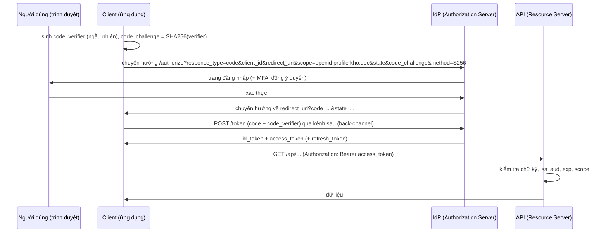

# Chương 12 — OpenID Connect và OAuth 2.0

## Mục tiêu học

Sau chương này, bạn sẽ:

- Phân biệt **xác thực (authentication)** với **uỷ quyền (authorization)** và biết **OAuth 2.0** và **OpenID Connect (OIDC)** giải quyết phần nào.
- Nắm các vai trò (client, resource owner, authorization server, resource server) và **luồng Authorization Code + PKCE** — luồng chuẩn hiện nay.
- Biến API ASP.NET Core thành **resource server** kiểm tra JWT do IdP cấp: issuer, audience, chữ ký, hạn dùng; phân quyền theo **scope** và **role**.
- Biết chọn: tự xây đăng nhập hay dùng **IdP** (Keycloak, Microsoft Entra ID, Auth0, Duende IdentityServer...).

Code: [`code/ch12-oidc/`](../../code/ch12-oidc/) — resource server chạy được cả khi không có IdP (chế độ demo) và với IdP thật qua cấu hình.

> **Lưu ý trung thực:** ví dụ chạy với "IdP giả" tự ký token để bạn thử được ngay. Phần tích hợp với IdP thật (Keycloak/Entra/Auth0) chỉ khác ở **cấu hình `Authority`/`Audience`** — chương này chỉ ra cách làm, nhưng máy tác giả không có IdP thật để chạy thử end-to-end; hãy kiểm tra theo tài liệu của IdP bạn dùng.

## Vì sao không tự viết đăng nhập?

Ở Tập 2 (Chương 20) bạn tự làm đăng nhập bằng cookie và JWT. Với một ứng dụng đơn, điều đó ổn. Nhưng khi có **nhiều ứng dụng/dịch vụ**, mỗi nơi tự lưu mật khẩu là thảm hoạ: nhiều nơi rò rỉ, khó thêm MFA, đăng nhập một lần (SSO) bất khả thi. Giải pháp: **tập trung xác thực vào một dịch vụ chuyên trách (Identity Provider — IdP)**; các ứng dụng chỉ **tin token** do IdP cấp. Đó là điều OAuth 2.0/OIDC chuẩn hoá.

## OAuth 2.0 và OIDC: hai lớp, hai câu hỏi

| | Trả lời | Cho ra |
|--|---------|--------|
| **OAuth 2.0** | "Ứng dụng này **được phép làm gì** thay mặt người dùng?" (uỷ quyền, uỷ thác quyền truy cập) | **access token** (kèm scope) |
| **OpenID Connect** (OIDC, lớp trên OAuth 2.0) | "Người dùng **là ai**?" (xác thực) | **ID token** (JWT chứa `sub`, `name`, `email`...) + endpoint `userinfo` |

Sai lầm kinh điển: dùng **access token** để chứng minh "người này đã đăng nhập" ở phía client. Access token dành cho **API** (audience là API); danh tính cho ứng dụng nằm ở **ID token**.

### Các vai trò

- **Resource Owner**: người dùng.
- **Client**: ứng dụng muốn truy cập (SPA, Blazor, mobile, web MVC, hay một dịch vụ khác).
- **Authorization Server / IdP**: xác thực người dùng, cấp token (Keycloak, Entra ID...).
- **Resource Server**: API bảo vệ tài nguyên, **kiểm tra access token** (chính là API của bạn).

### Loại client

- **Confidential** (giữ được bí mật: ứng dụng web server-side) — có `client_secret`.
- **Public** (không giữ được bí mật: SPA, mobile, desktop) — **không** có secret; bắt buộc **PKCE**.

## Luồng Authorization Code + PKCE

Đây là luồng khuyến nghị cho mọi client tương tác (OAuth 2.1 gộp PKCE vào bắt buộc). *Implicit* và *Resource Owner Password* đã **bị loại bỏ** — đừng dùng.



Vì sao an toàn?

- **`code`** ngắn hạn, một lần, đi qua trình duyệt (có thể bị đánh cắp), nhưng **vô dụng nếu thiếu `code_verifier`** — bí mật chỉ client giữ và gửi qua kênh trực tiếp tới IdP. Đó là **PKCE** (Proof Key for Code Exchange): chặn tấn công *chặn authorization code*.
- **`state`** ngẫu nhiên chống CSRF trên bước chuyển hướng; **`nonce`** (OIDC) gắn ID token với phiên, chống replay.
- **`redirect_uri`** phải khớp **chính xác** danh sách đăng ký trước — chống chuyển hướng token về kẻ tấn công.

Tính PKCE chỉ là băm — code mẫu có endpoint `/pkce` cho đúng vector kiểm thử của RFC 7636: `verifier = dBjftJeZ4CVP-mB92K27uhbUJU1p1r_wW1gFWFOEjXk` → `challenge = E9Melhoa2OwvFrEMTJguCHaoeK1t8URWbuGJSstw-cM` (đã chạy và khớp).

```csharp
string verifier  = Base64Url(RandomNumberGenerator.GetBytes(32));
string challenge = Base64Url(SHA256.HashData(Encoding.ASCII.GetBytes(verifier)));
static string Base64Url(byte[] b) => Convert.ToBase64String(b).TrimEnd('=').Replace('+', '-').Replace('/', '_');
```

Trong thực tế bạn **không tự cài** luồng này: middleware `AddOpenIdConnect` (web server-side) hoặc thư viện của SPA (`oidc-client-ts`, MSAL) làm hộ. Điều bạn cần hiểu là *nó làm gì* để cấu hình và gỡ lỗi đúng.

### Các loại token

| | Access token | ID token | Refresh token |
|--|--------------|----------|---------------|
| Dành cho | **API** (resource server) | **client** (biết người dùng là ai) | **IdP** (đổi lấy token mới) |
| Thời hạn | ngắn (5–60 phút) | ngắn | dài (ngày–tuần), có thể **xoay vòng** |
| Định dạng | thường JWT (hoặc opaque) | luôn JWT | opaque |
| Lưu ở | bộ nhớ client | — | nơi an toàn nhất có thể (BFF/cookie httpOnly) |

Mẫu **BFF (Backend-for-Frontend)**: với SPA, đặt một backend ASP.NET Core giữ token và trao cho trình duyệt **cookie httpOnly**, thay vì để token trong JavaScript (`localStorage` bị đánh cắp qua XSS). Blazor Server và MVC vốn đã hoạt động như vậy.

## API là Resource Server

Nhiệm vụ của API rất hẹp: **với mỗi request, quyết định tin token hay không**, rồi dùng claim để phân quyền.

```csharp
builder.Services.AddAuthentication(JwtBearerDefaults.AuthenticationScheme)
    .AddJwtBearer(o =>
    {
        o.Authority = "https://login.example.com/realms/kho";   // IdP: tự tải discovery (.well-known/openid-configuration) và JWKS (khoá công khai)
        o.Audience  = "kho-api";                                 // token phải DÀNH CHO API này
        o.MapInboundClaims = false;                              // giữ tên claim gốc: "sub", "scope"
    });
```

`Authority` làm phần khó: tải **JWKS** (bộ khoá công khai) từ IdP, **cache và tự cập nhật khi IdP xoay khoá**. Với mỗi token, thư viện kiểm tra:

1. **Chữ ký** đúng khoá của IdP (không thể giả mạo nếu không có khoá riêng).
2. **`iss`** (issuer) là IdP bạn tin.
3. **`aud`** (audience) là API của bạn — chặn dùng token cấp cho API khác.
4. **`exp`/`nbf`**: còn hạn (có `ClockSkew` để bù lệch đồng hồ; mặc định 5 phút, nên giảm).

Chạy code mẫu ở chế độ demo (IdP giả ký bằng khoá đối xứng nhưng vẫn kiểm tra đủ issuer, audience, hạn), kết quả thật:

| Tình huống | Kết quả |
|-----------|---------|
| Không có token | 401 |
| Token `scope=kho.doc` gọi `GET` | 200 |
| Token `kho.doc` gọi `POST` (cần `kho.ghi`) | **403** |
| Token `kho.doc kho.ghi` gọi `POST` | 201 |
| `DELETE` không có role `quan-tri` | 403 |
| `DELETE` với role `quan-tri` | 204 |
| Token hết hạn | 401 |
| Token bị sửa chữ ký | 401 |

**401** = chưa xác thực được (không/sai token); **403** = biết bạn là ai nhưng không đủ quyền. Đừng nhầm hai mã này.

### Scope và role

- **Scope**: quyền **ứng dụng client** được người dùng/IdP uỷ quyền ("ứng dụng này được đọc kho"). Nằm trong claim `scope` (chuỗi cách nhau dấu cách).
- **Role/nhóm**: **vai trò của người dùng** trong tổ chức ("quản trị"). Nằm trong claim `roles`/`groups`, cấu hình ở IdP.

Quyền thực sự = **cả hai**: client phải có scope *và* người dùng phải có vai trò. Trong code:

```csharp
builder.Services.AddAuthorizationBuilder()
    .AddPolicy("DocKho", p => p.RequireAuthenticatedUser().RequireAssertion(c => CoScope(c.User, "kho.doc")))
    .AddPolicy("QuanTri", p => p.RequireRole("quan-tri"));

app.MapGet("/api/san-pham", ...).RequireAuthorization("DocKho");
```

Với dữ liệu theo từng người (ví dụ "chỉ xem đơn của mình") dùng **`sub`** làm khoá chủ sở hữu và kiểm tra **resource-based authorization** (Tập 2, Chương 20). Scope/role không thay thế được kiểm tra "đối tượng này của ai".

## Ứng dụng web đăng nhập bằng OIDC

Với MVC/Razor Pages/Blazor Server, dùng cookie cho phiên cục bộ và OIDC cho đăng nhập:

```csharp
builder.Services.AddAuthentication(o =>
{
    o.DefaultScheme = CookieAuthenticationDefaults.AuthenticationScheme;
    o.DefaultChallengeScheme = OpenIdConnectDefaults.AuthenticationScheme;     // chưa đăng nhập -> chuyển tới IdP
})
.AddCookie()
.AddOpenIdConnect(o =>
{
    o.Authority = builder.Configuration["Oidc:Authority"];
    o.ClientId = builder.Configuration["Oidc:ClientId"];
    o.ClientSecret = builder.Configuration["Oidc:ClientSecret"];               // từ user-secrets / biến môi trường / Key Vault, KHÔNG commit
    o.ResponseType = "code";                                                   // Authorization Code (PKCE bật mặc định)
    o.SaveTokens = true;                                                       // lưu token vào cookie phiên để gọi API thay mặt người dùng
    o.Scope.Add("kho.doc");
    o.GetClaimsFromUserInfoEndpoint = true;
});
```

Web app rồi gọi API bằng `HttpClient` gắn access token (`GetTokenAsync("access_token")`), hoặc dùng thư viện quản lý làm mới token (`Duende.AccessTokenManagement`, `Microsoft.Identity.Web`).

## Giữa các dịch vụ: client credentials

Dịch vụ gọi dịch vụ **không có người dùng**: dùng luồng **Client Credentials** — dịch vụ đổi `client_id` + `client_secret` (hoặc chứng chỉ/managed identity) lấy access token với scope máy-với-máy. Trên đám mây ưu tiên **managed identity** (Azure) / **workload identity** (Kubernetes) để không phải quản lý secret.

## Chọn giải pháp

| Lựa chọn | Khi nào |
|----------|---------|
| **Dịch vụ đám mây** (Microsoft Entra ID / External ID, Auth0, Okta, Cognito...) | ít vận hành, cần MFA/SSO/nhà cung cấp xã hội, sẵn sàng trả phí |
| **Keycloak** (mã nguồn mở, tự chạy) | tự chủ dữ liệu, muốn miễn phí bản quyền, có năng lực vận hành |
| **Duende IdentityServer / OpenIddict** (framework .NET) | cần tuỳ biến sâu, đội .NET mạnh (Duende có giấy phép thương mại) |
| **ASP.NET Core Identity** riêng | ứng dụng đơn, không cần liên kết nhiều hệ thống |

Nguyên tắc: **đừng tự phát minh giao thức xác thực**, và đừng tự lưu/băm mật khẩu nếu có thể uỷ cho IdP.

## Lỗi thường gặp

- Dùng luồng **Implicit**/**Password**; SPA lưu token trong `localStorage`.
- Không kiểm tra **audience** → token của API khác dùng được.
- Không đặt `ClockSkew` hợp lý; token sống hàng ngày; không xoay refresh token.
- Quên PKCE cho public client; `redirect_uri` dùng ký tự đại diện.
- `MapInboundClaims` mặc định đổi tên claim (`sub` → URI dài) khiến `FindFirst("sub")` trả `null` — đặt `false` hoặc dùng đúng tên.
- Chấp nhận token chỉ dựa vào **chữ ký** mà bỏ qua `iss`/`aud`; tắt `ValidateIssuer` "cho nhanh".
- Nhầm **401 với 403**; phân quyền chỉ bằng role mà bỏ qua kiểm tra quyền sở hữu.
- Commit `client_secret`; log ra token (token là mật khẩu tạm thời).

## Bài tập

1. Chạy `ch12-oidc`, lấy token `kho.doc` rồi giải mã phần payload (base64url) để xem `iss`, `aud`, `exp`, `scope`. Dùng `jwt.io` chỉ với **token demo**, không bao giờ dán token thật.
2. Thêm policy `"DonCuaToi"`: endpoint `GET /api/don/{maNguoiDung}` chỉ cho phép khi `sub` khớp (hoặc role `quan-tri`), viết bằng `IAuthorizationHandler`.
3. Chạy **Keycloak** bằng Docker (`quay.io/keycloak/keycloak`), tạo realm/client/scope `kho.doc`, đặt `Oidc:Authority` và lấy token thật từ endpoint `/token`; gọi API. (Cần Docker — chương này chưa chạy được ở máy tác giả.)
4. Thêm test tích hợp cho `kho-clean` dùng token demo (giữ `WebApplicationFactory` cấp token cục bộ) để kiểm tra 401/403/200.
5. Vẽ luồng Client Credentials của một dịch vụ báo cáo gọi API kho bằng sơ đồ tuần tự.
