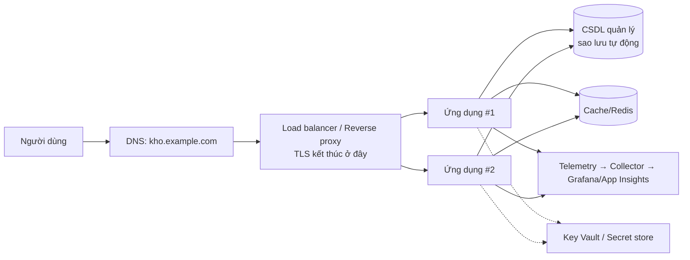

# Chương 16 — Triển khai lên máy chủ và đám mây

## Mục tiêu học

Sau chương này, bạn sẽ:

- Có **bản đồ các lựa chọn hosting** cho ứng dụng ASP.NET Core: máy chủ ảo (VPS), PaaS, container serverless, Kubernetes — và tiêu chí chọn.
- Triển khai kiểu **truyền thống**: Linux + Kestrel + reverse proxy + systemd + TLS.
- Cấu hình ứng dụng đứng **sau proxy/load balancer** đúng cách (forwarded headers, health probe, tắt êm).
- Nắm các thành phần **sản xuất** cần có: CSDL quản lý, secret, sao lưu, tên miền và TLS, giám sát, hạ tầng dưới dạng mã (IaC), chi phí.

> **Lưu ý trung thực:** chương này là **hướng dẫn và mẫu cấu hình**; tác giả không triển khai lên đám mây thật trong lúc viết sách nên các file mẫu (nginx, systemd, Kubernetes) chưa được chạy thử. Chúng theo tài liệu chính thức; hãy kiểm tra trên môi trường của bạn, bắt đầu ở quy mô nhỏ. Tên dịch vụ và giá thay đổi — đối chiếu tài liệu mới nhất của nhà cung cấp.

## Bức tranh: ứng dụng của bạn cần những gì để "lên mạng"



Đây là hình mẫu chung cho hầu hết hệ thống web: **DNS → TLS/proxy → nhiều bản ứng dụng không trạng thái → CSDL riêng → cache, telemetry, secret**. "Không trạng thái" là điều kiện để nhân bản: phiên đăng nhập, cache, tệp tải lên phải ở **kho ngoài** (CSDL, Redis, blob storage), không ở bộ nhớ/đĩa của một instance.

## Các lựa chọn hosting

| Lựa chọn | Ví dụ | Bạn quản lý | Hợp khi |
|----------|-------|-------------|---------|
| **VPS / máy ảo** | DigitalOcean, Vultr, Linode, EC2, Azure VM, VPS Việt Nam | HĐH, cập nhật, proxy, TLS, giám sát, sao lưu | học, dự án nhỏ, kiểm soát tối đa, chi phí cố định thấp |
| **PaaS** (Platform-as-a-Service) | Azure App Service, AWS Elastic Beanstalk/App Runner, Google App Engine, Render, Railway, Fly.io | ứng dụng và cấu hình | đội nhỏ, muốn ít vận hành, mở rộng đơn giản |
| **Container serverless** | Azure Container Apps, Google Cloud Run, AWS ECS Fargate | image + cấu hình mở rộng | chạy container mà không quản máy chủ; **mở rộng về 0**, trả theo dùng |
| **Kubernetes** | AKS, EKS, GKE, tự dựng (k3s) | rất nhiều (nhưng cực linh hoạt) | nhiều dịch vụ, đội có năng lực vận hành nền tảng |
| **Serverless hàm** | Azure Functions, AWS Lambda | mã hàm | tác vụ theo sự kiện, tải thất thường |

Lời khuyên thực dụng: **bắt đầu đơn giản nhất phù hợp** — thường là PaaS hoặc container serverless (một image, HTTP, giám sát sẵn). Kubernetes mạnh nhưng có **chi phí vận hành lớn**; chọn khi thực sự cần (nhiều dịch vụ, yêu cầu tuỳ biến mạng/lập lịch), đừng chọn vì "thời thượng". Tránh khoá chặt: nếu ứng dụng đã là container + cấu hình bằng biến môi trường (Chương 14), chuyển giữa các nền tảng khá dễ.

## Cách 1: Linux + Kestrel + reverse proxy (truyền thống)

**Kestrel** là máy chủ web nhanh, sẵn có trong ASP.NET Core, nhưng **đặt sau reverse proxy** (nginx, Caddy, YARP, hoặc load balancer đám mây) để: kết thúc TLS, nén, giới hạn tốc độ/kích thước, phục vụ tệp tĩnh, đệm client chậm, cân bằng tải.

**1. Publish** (hoặc chạy container):

```bash
dotnet publish Kho.Web -c Release -o /srv/kho -p:UseAppHost=false
```

**2. systemd** giữ tiến trình sống, khởi động cùng máy, tự khởi động lại khi chết:

```ini
# /etc/systemd/system/kho.service
[Unit]
Description=Kho web
After=network.target

[Service]
WorkingDirectory=/srv/kho
ExecStart=/usr/bin/dotnet /srv/kho/Kho.Web.dll
Restart=always
RestartSec=5
KillSignal=SIGINT                                  # tắt êm; TimeoutStopSec đủ để hoàn tất request
TimeoutStopSec=30
User=kho                                           # người dùng riêng, KHÔNG root
Environment=ASPNETCORE_ENVIRONMENT=Production
Environment=ASPNETCORE_URLS=http://127.0.0.1:5000  # chỉ nghe nội bộ, proxy đứng trước
EnvironmentFile=/etc/kho/kho.env                   # chứa ConnectionStrings__... (quyền 600, chủ kho)
NoNewPrivileges=true
ProtectSystem=strict
ReadWritePaths=/var/lib/kho

[Install]
WantedBy=multi-user.target
```

```bash
sudo systemctl enable --now kho
journalctl -u kho -f          # log (stdout của ứng dụng)
```

**3. Reverse proxy** — **Caddy** (TLS Let's Encrypt tự động) là cách ngắn nhất:

```
kho.example.com {
    reverse_proxy 127.0.0.1:5000
    encode zstd gzip
}
```

Hoặc **nginx**:

```nginx
server {
    listen 443 ssl http2;
    server_name kho.example.com;
    ssl_certificate     /etc/letsencrypt/live/kho.example.com/fullchain.pem;
    ssl_certificate_key /etc/letsencrypt/live/kho.example.com/privkey.pem;
    client_max_body_size 10m;

    location / {
        proxy_pass         http://127.0.0.1:5000;
        proxy_http_version 1.1;
        proxy_set_header   Host              $host;
        proxy_set_header   X-Forwarded-For   $proxy_add_x_forwarded_for;
        proxy_set_header   X-Forwarded-Proto $scheme;
        proxy_set_header   Upgrade           $http_upgrade;    # WebSocket/SignalR/Blazor Server
        proxy_set_header   Connection        $connection_upgrade;
    }
}
```

Ngoài ra: **tường lửa** chỉ mở 80/443 (và SSH có khoá, tắt đăng nhập bằng mật khẩu), **cập nhật bảo mật tự động**, **fail2ban**, **sao lưu** cơ sở dữ liệu ra nơi khác và **thử khôi phục**.

## Đứng sau proxy: các cấu hình bắt buộc

Khi có proxy/load balancer, ứng dụng thấy kết nối từ **proxy** (HTTP, IP của proxy), không phải từ người dùng. Hậu quả nếu bỏ qua: `Request.IsHttps` sai (cookie `Secure`, chuyển hướng HTTPS, OIDC `redirect_uri` sai scheme), IP client sai (giới hạn tốc độ, audit, log). Sửa bằng **Forwarded Headers**:

```csharp
builder.Services.Configure<ForwardedHeadersOptions>(o =>
{
    o.ForwardedHeaders = ForwardedHeaders.XForwardedFor | ForwardedHeaders.XForwardedProto;
    // Mặc định CHỈ tin proxy ở loopback. Trong container/đám mây, proxy có IP khác:
    // khai báo mạng tin cậy CỤ THỂ, đừng tin tất cả.
    o.KnownIPNetworks.Add(System.Net.IPNetwork.Parse("10.0.0.0/8"));
});

var app = builder.Build();
app.UseForwardedHeaders();          // ĐẶT ĐẦU TIÊN trong pipeline (trước HTTPS redirect, auth, rate limiting)
```

Chỉ tin `X-Forwarded-*` **từ proxy của bạn**: nếu tin từ bất kỳ nguồn, kẻ tấn công tự gửi header giả `X-Forwarded-For: 1.2.3.4` để **giả IP** và qua mặt giới hạn tốc độ/danh sách IP. (Nhiều nền tảng đám mây/Kubernetes đã hỗ trợ đặt biến `ASPNETCORE_FORWARDEDHEADERS_ENABLED=true` — bật cả hai header, chỉ dùng khi chắc chắn ứng dụng chỉ nhận lưu lượng qua proxy tin cậy.)

Các điểm khác:

- **`UseHttpsRedirection`** thường bỏ ở phía ứng dụng khi TLS kết thúc ở proxy (proxy làm chuyển hướng) — hoặc bật cùng forwarded headers đúng.
- **HSTS** (`UseHsts`) trong production.
- **Health probe**: proxy/orchestrator gọi `/health/live` và `/health/ready` (Chương 11).
- **Tắt êm**: nhận SIGTERM → ngừng nhận request mới, hoàn tất request đang chạy, dừng `BackgroundService` (outbox); đặt `HostOptions.ShutdownTimeout` phù hợp thời gian nền tảng chờ.
- **Data Protection keys** (cookie xác thực, antiforgery): khi nhiều bản, phải **chia sẻ chung** (lưu vào CSDL/Redis/blob + bảo vệ bằng khoá ở Key Vault); nếu không, cookie tạo ở bản A không giải mã được ở bản B → người dùng bị "đăng xuất ngẫu nhiên".
- **Đồng hồ và múi giờ**: máy chủ dùng UTC; lưu `DateTimeOffset` UTC, hiển thị múi giờ người dùng.

## Cách 2: PaaS và container serverless

Với container (Chương 14) bạn thường chỉ cần: **đẩy image lên registry → tạo dịch vụ trỏ tới image → đặt biến môi trường/secret → mở cổng 8080 → cấu hình probe và mở rộng**. Ví dụ với Azure Container Apps:

```bash
az containerapp up --name kho-web --resource-group rg-kho \
    --image ghcr.io/owner/kho-web:1.0.0 --target-port 8080 --ingress external \
    --env-vars ASPNETCORE_ENVIRONMENT=Production ConnectionStrings__Kho=secretref:kho-conn
az containerapp update --name kho-web --resource-group rg-kho --min-replicas 1 --max-replicas 5 \
    --scale-rule-name http --scale-rule-type http --scale-rule-http-concurrency 50
```

(Cú pháp dùng để minh hoạ; tham số chính xác xem `az containerapp --help`.) Google Cloud Run, AWS App Runner/ECS Fargate tương tự: **image + cổng + biến môi trường + giới hạn CPU/RAM + số bản tối thiểu/tối đa**. Ưu điểm: TLS, DNS tuỳ chọn, mở rộng, health probe và log/metric **có sẵn**. Lưu ý **khởi động lạnh** khi mở rộng về 0 (đặt `min-replicas` ≥ 1 cho dịch vụ nhạy độ trễ; **ReadyToRun/Native AOT** giảm thời gian khởi động).

## Cách 3: Kubernetes (cái nhìn nhập môn)

Kubernetes (K8s) chạy và quản **hàng loạt container** theo trạng thái mong muốn bạn khai báo: tự khởi động lại, mở rộng, cập nhật cuốn chiếu, cân bằng tải. Mẫu tối thiểu:

```yaml
apiVersion: apps/v1
kind: Deployment
metadata: { name: kho-web }
spec:
  replicas: 3
  selector: { matchLabels: { app: kho-web } }
  strategy:
    type: RollingUpdate
    rollingUpdate: { maxUnavailable: 0, maxSurge: 1 }        # không giảm năng lực khi cập nhật
  template:
    metadata: { labels: { app: kho-web } }
    spec:
      containers:
        - name: web
          image: ghcr.io/owner/kho-web:1.0.0                 # ghim tag/digest, không dùng latest
          ports: [{ containerPort: 8080 }]
          env:
            - { name: ASPNETCORE_ENVIRONMENT, value: Production }
            - name: ConnectionStrings__Kho
              valueFrom: { secretKeyRef: { name: kho-secret, key: conn } }
          resources:
            requests: { cpu: 100m, memory: 128Mi }
            limits:   { memory: 256Mi }
          startupProbe:   { httpGet: { path: /health/live,  port: 8080 }, failureThreshold: 30, periodSeconds: 2 }
          livenessProbe:  { httpGet: { path: /health/live,  port: 8080 }, periodSeconds: 10 }
          readinessProbe: { httpGet: { path: /health/ready, port: 8080 }, periodSeconds: 5 }
          securityContext: { runAsNonRoot: true, allowPrivilegeEscalation: false, readOnlyRootFilesystem: true }
---
apiVersion: v1
kind: Service
metadata: { name: kho-web }
spec:
  selector: { app: kho-web }
  ports: [{ port: 80, targetPort: 8080 }]
---
apiVersion: autoscaling/v2
kind: HorizontalPodAutoscaler
metadata: { name: kho-web }
spec:
  scaleTargetRef: { apiVersion: apps/v1, kind: Deployment, name: kho-web }
  minReplicas: 3
  maxReplicas: 10
  metrics:
    - type: Resource
      resource: { name: cpu, target: { type: Utilization, averageUtilization: 70 } }
```

Đây chính là nơi **liveness vs readiness** (Chương 11) thể hiện: liveness fail → K8s **khởi động lại** container; readiness fail → K8s **rút khỏi Service** (không nhận lưu lượng) mà không restart. `Ingress`/`Gateway` cung cấp định tuyến HTTP và TLS ngoài cụm. **Helm/Kustomize** đóng gói/tham số hoá manifest; **GitOps** (Argo CD, Flux) đồng bộ trạng thái cụm từ Git.

## Thành phần sản xuất khác

### Cơ sở dữ liệu

- Dùng **dịch vụ CSDL quản lý** (Azure SQL/PostgreSQL Flexible Server, AWS RDS, Cloud SQL): sao lưu tự động, vá lỗi, sao chép/HA. **Đừng** tự chạy CSDL production trong container không có kế hoạch sao lưu.
- **Sao lưu ≠ khôi phục được**: định kỳ **thử khôi phục** và đo thời gian (RTO) và lượng dữ liệu tối đa mất (RPO).
- Kết nối tới CSDL trong mạng riêng, không mở ra Internet; người dùng CSDL của ứng dụng **quyền tối thiểu** (không phải admin).
- Migration: Chương 15 (bundle, expand/contract).

### Secret và cấu hình

**Key Vault / Secrets Manager**, đọc bằng **managed identity**; ứng dụng dùng `builder.Configuration.AddAzureKeyVault(...)` hoặc nền tảng tiêm biến môi trường. Xoay vòng định kỳ; không commit (Chương 13).

### Tên miền, TLS, CDN

DNS trỏ tên miền vào load balancer; **chứng chỉ TLS tự động** (Let's Encrypt/nhà cung cấp quản lý) và tự gia hạn; **CDN/WAF** (Cloudflare, Azure Front Door) đứng trước để cache tài nguyên tĩnh, chống DDoS và các tấn công web phổ biến.

### Giám sát và cảnh báo

Bật thu thập **log + metric + trace** (Chương 11) tới nền tảng quan sát; đặt cảnh báo trên triệu chứng người dùng; có runbook và người trực.

### Hạ tầng dưới dạng mã (IaC)

Đừng bấm chuột dựng hạ tầng: khai báo bằng **Bicep/ARM** (Azure), **Terraform/OpenTofu** (đa đám mây), **Pulumi** (dùng C#!), **AWS CDK**. Lợi ích: tái lập môi trường (dev/staging/prod giống nhau), review qua PR, lịch sử thay đổi, khôi phục sau thảm hoạ.

```csharp
// Pulumi (C#): hạ tầng cũng là mã C#
var app = new Pulumi.AzureNative.App.ContainerApp("kho-web", new() { /* ... */ });
```

### Chi phí

Đặt **ngân sách và cảnh báo chi phí** ngay từ đầu; gắn thẻ (tag) tài nguyên; tắt môi trường dev ngoài giờ; chọn kích cỡ theo **số đo thật**, không đoán. Chi phí băng thông ra (egress) và log/telemetry thường bất ngờ nhất.

## Danh sách kiểm tra "sẵn sàng production"

- [ ] HTTPS mọi nơi; HSTS; forwarded headers cấu hình đúng.
- [ ] Không có secret trong mã/image; xoay vòng được.
- [ ] Health probe live/ready; tắt êm; ít nhất 2 bản nếu cần sẵn sàng cao.
- [ ] CSDL quản lý, sao lưu, **đã thử khôi phục**; migration có kế hoạch.
- [ ] Log/metric/trace về một nơi; cảnh báo và runbook.
- [ ] Giới hạn tốc độ, kích thước request, timeout (Tập 2, Chương 9 và 19).
- [ ] Data Protection keys chia sẻ khi nhiều bản; không lưu trạng thái cục bộ.
- [ ] CI/CD tự động, có rollback đã diễn tập.
- [ ] Cập nhật bảo mật base image/phụ thuộc thường xuyên; quét lỗ hổng.
- [ ] Đã kiểm thử tải ở quy mô dự kiến (Chương 11).
- [ ] Ngân sách và cảnh báo chi phí.

## Lỗi thường gặp

- Bỏ forwarded headers → redirect vòng lặp, cookie `Secure` không gửi, IP client toàn là IP proxy; hoặc tin mọi `X-Forwarded-For`.
- Cho Kestrel nghe trực tiếp ra Internet không có proxy/TLS đúng.
- Lưu phiên/tệp tải lên/cache trên đĩa hoặc RAM của một instance rồi mở rộng ngang.
- Chạy nhiều bản với **Data Protection keys riêng** → đăng xuất ngẫu nhiên, lỗi antiforgery.
- Không có sao lưu, hoặc sao lưu nhưng chưa từng khôi phục.
- Mở cổng CSDL/Redis ra Internet công cộng.
- Không giới hạn tài nguyên; container OOM-kill mà không có cảnh báo.
- Triển khai thủ công bằng `scp` và sửa tay trên máy chủ ("máy chủ tuyết"): không tái lập được.
- Không đặt ngân sách → hoá đơn bất ngờ.

## Bài tập

1. Thuê VPS nhỏ (hoặc dùng máy ảo cục bộ), triển khai `kho-clean` bằng systemd + Caddy có TLS thật; kiểm tra `journalctl` và thử `systemctl kill -s SIGTERM` để xem tắt êm.
2. Thêm `UseForwardedHeaders` cho `kho-clean`; dùng `curl -H "X-Forwarded-Proto: https"` để chứng minh `Request.Scheme` đổi khi gọi từ proxy tin cậy nhưng **không** đổi khi từ nguồn khác.
3. Triển khai image lên một dịch vụ container serverless (Cloud Run/Container Apps free tier), đặt secret chuỗi kết nối, thử mở rộng 1→3 bản.
4. Với `minikube`/`kind`, áp dụng các manifest mẫu; bắn tải và quan sát HPA; làm `readiness` fail và xem Pod bị rút khỏi Service.
5. Viết Bicep/Terraform tối thiểu cho một Container App + Log Analytics; đưa vào repo và chạy `plan`/`what-if`.
6. Lập kế hoạch **RTO/RPO** cho hệ thống kho: nếu CSDL hỏng lúc 10:00, khôi phục thế nào, mất tối đa bao nhiêu dữ liệu?
