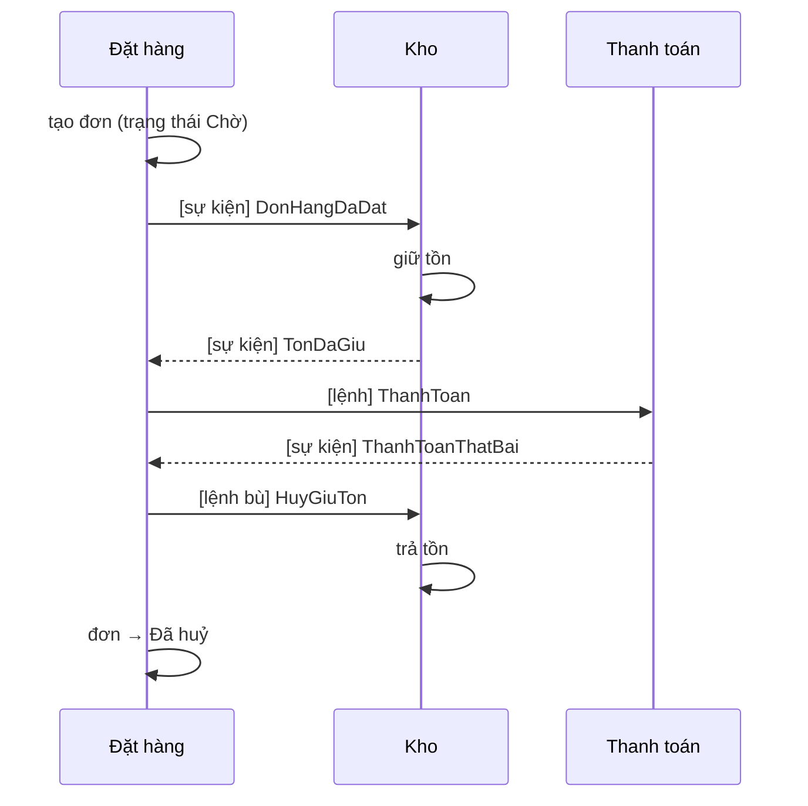

# Chương 17 — Microservices và giao tiếp giữa dịch vụ

## Mục tiêu học

Sau chương này, bạn sẽ:

- Hiểu **microservices** là gì, cái giá của nó, và **khi nào KHÔNG nên dùng** (đa số dự án nên bắt đầu bằng **modular monolith**).
- Xác định **ranh giới dịch vụ** theo bounded context; hiểu nguyên tắc **mỗi dịch vụ sở hữu dữ liệu của mình**.
- Chọn cách giao tiếp: **đồng bộ** (HTTP/gRPC) hay **bất đồng bộ** (thông điệp/sự kiện qua broker); nắm **saga** thay cho giao dịch phân tán.
- Biết các thành phần nền: **API gateway (YARP)**, service discovery, resilience, quan sát phân tán, **.NET Aspire**.

> **Lưu ý trung thực:** chương này thiên về **tư duy thiết kế** và mẫu mã ngắn theo tài liệu chính thức; dự án của sách (`kho-clean`) cố ý là **một monolith có mô-đun rõ ràng**, và các đoạn YARP/gRPC/MassTransit dưới đây **chưa được chạy** ở máy tác giả. Mục đích là giúp bạn đưa ra quyết định sáng suốt, không phải bán microservices.

## Monolith, modular monolith, microservices

| | Monolith "spaghetti" | **Modular monolith** | **Microservices** |
|--|---------------------|---------------------|-------------------|
| Triển khai | một khối | **một khối** | nhiều dịch vụ độc lập |
| Ranh giới | không rõ | **rõ ràng trong mã** (mô-đun/assembly, chỉ giao tiếp qua hợp đồng) | rõ ràng, **ép bởi mạng** |
| Dữ liệu | một CSDL, ai cũng đụng | một CSDL, **mỗi mô-đun một schema/bảng riêng** | **mỗi dịch vụ một CSDL** |
| Độ phức tạp vận hành | thấp | thấp | **cao** |
| Đội | nhỏ | nhỏ–vừa | nhiều đội độc lập |

Cấu trúc ở Chương 1–2 (Clean Architecture + ranh giới rõ) chính là bước đầu của **modular monolith**: nếu ranh giới giữa các mô-đun đã sạch, việc **tách thành dịch vụ khi thực sự cần** sau này chỉ là chuyện di chuyển, không phải viết lại. Ngược lại, chia nhỏ quá sớm khi ranh giới chưa hiểu rõ tạo ra **"distributed monolith"** — tệ nhất của cả hai thế giới: chậm, dễ hỏng, khó thay đổi như monolith nhưng vận hành phức tạp như microservices.

### Microservices mang lại gì — và giá phải trả

**Lợi ích:** đội triển khai độc lập, mở rộng từng phần theo tải, chọn công nghệ riêng cho từng dịch vụ, cô lập lỗi (một dịch vụ chết không nhất thiết kéo cả hệ thống).

**Cái giá (đừng xem nhẹ):**

- **Mạng không đáng tin**: mọi lời gọi có thể chậm/lỗi/trùng (Chương 13 idempotency; Tập 2 Chương 19 resilience). Cái từng là lời gọi hàm nay là lời gọi mạng.
- **Nhất quán dữ liệu**: không còn giao dịch ACID xuyên dịch vụ → saga, nhất quán cuối cùng.
- **Vận hành**: mỗi dịch vụ cần CI/CD, giám sát, cấu hình, bảo mật, phiên bản riêng. Cần đội nền tảng.
- **Gỡ lỗi**: một request đi qua chục dịch vụ → bắt buộc có **trace phân tán** (Chương 11).
- **Kiểm thử**: test tích hợp/hợp đồng phức tạp hơn nhiều.
- **Thay đổi xuyên dịch vụ** đắt: sửa hợp đồng cần phối hợp nhiều đội.

**Quy tắc kinh nghiệm:** *đừng dùng microservices trừ khi bạn có vấn đề mà nó giải quyết* — nhiều đội cần triển khai độc lập, các phần có nhu cầu mở rộng rất khác nhau, hoặc ranh giới miền đã ổn định và được hiểu rõ. Đội nhỏ/sản phẩm mới: **modular monolith trước**.

## Xác định ranh giới: bounded context

Dùng **bounded context** của DDD (Chương 3): mỗi ngữ cảnh có mô hình và ngôn ngữ riêng. Ví dụ hệ thống thương mại: **Danh mục** (sản phẩm, giá), **Kho** (tồn, nhập/xuất), **Đặt hàng**, **Thanh toán**, **Giao hàng**, **Khách hàng**. Chữ "Sản phẩm" trong Kho (mã, tồn, vị trí) khác "Sản phẩm" trong Danh mục (mô tả, ảnh, giá). Đó là dấu hiệu ranh giới.

Tiêu chí ranh giới tốt:

- **Gắn kết cao** bên trong, **liên kết lỏng** giữa các dịch vụ.
- Một thay đổi nghiệp vụ thường chỉ chạm **một** dịch vụ.
- Sở hữu **dữ liệu của chính mình**; dịch vụ khác **không truy cập thẳng CSDL** của nó — chỉ qua API/sự kiện.
- Khớp cấu trúc đội (định luật Conway).

Dấu hiệu chia sai: hai dịch vụ luôn phải đổi cùng nhau; một hành động người dùng cần 8 lời gọi đồng bộ nối đuôi; dịch vụ dùng chung một bảng.

## Giao tiếp giữa các dịch vụ

### Đồng bộ: yêu cầu/đáp ứng

**HTTP/REST (JSON)** — quen thuộc, dễ gỡ lỗi, tương thích rộng. **gRPC** — nhị phân (Protocol Buffers) trên HTTP/2: nhanh, hợp đồng chặt (`.proto`), sinh mã client/server, hỗ trợ streaming; tốt cho **gọi nội bộ giữa dịch vụ**, khó dùng trực tiếp từ trình duyệt.

```protobuf
// kho.proto — hợp đồng là nguồn sự thật, sinh mã C# cho cả hai phía
service KhoService {
  rpc LayTon (LayTonRequest) returns (LayTonReply);
}
message LayTonRequest { string ma = 1; }
message LayTonReply   { int32 ton = 1; }
```

Cách gọi đồng bộ tạo **ghép nối tạm thời (temporal coupling)**: dịch vụ A chỉ chạy khi B đang chạy. Chuỗi A→B→C nhân độ trễ và **nhân xác suất lỗi** (ba dịch vụ 99,9% → còn ≈ 99,7%). Bắt buộc có: **timeout, retry có backoff + jitter, circuit breaker, bulkhead** (`Microsoft.Extensions.Http.Resilience` — Tập 2, Chương 19) và **idempotency** cho lời gọi ghi.

### Bất đồng bộ: thông điệp và sự kiện

Dịch vụ giao tiếp qua **message broker** (RabbitMQ, Azure Service Bus, Kafka, AWS SQS/SNS). Người gửi không chờ; người nhận xử lý khi sẵn sàng.

| Loại | Ý nghĩa | Ví dụ |
|------|---------|-------|
| **Lệnh (command)** | "hãy làm X" — gửi tới **một** người nhận | `TruTonKho` |
| **Sự kiện (event)** | "X đã xảy ra" — **nhiều** người có thể quan tâm; người gửi không biết ai nghe | `DonHangDaDat` |

**Sự kiện** giảm ghép nối nhất: dịch vụ Đặt hàng phát `DonHangDaDat`; Kho, Thanh toán, Thông báo tự đăng ký lắng nghe — thêm người nghe mới **không sửa** dịch vụ Đặt hàng. Đây là hướng đi của **sự kiện tích hợp (integration event)**, phát qua **Transactional Outbox** (Chương 8) để không mất và không phát khi giao dịch thất bại.

Kèm theo là các sự thật cần chấp nhận:

- Giao **ít nhất một lần** → người nhận phải **idempotent** (inbox/khoá duy nhất — Chương 13).
- **Thứ tự** không đảm bảo toàn cục (Kafka đảm bảo theo partition/khoá; Service Bus theo session).
- **Nhất quán cuối cùng**: dữ liệu ở dịch vụ khác cập nhật sau một khoảng trễ → giao diện/nghiệp vụ phải chịu được.
- **Thư chết (dead-letter queue)** cho thông điệp xử lý mãi không được; cảnh báo và quy trình xử lý.
- Phiên bản hoá hợp đồng sự kiện (thêm trường tương thích, không đổi nghĩa trường cũ).

Thư viện .NET: **MassTransit**, **Wolverine**, **NServiceBus** (thương mại), hoặc SDK gốc của broker (`Azure.Messaging.ServiceBus`, `RabbitMQ.Client`). Ví dụ MassTransit (theo tài liệu):

```csharp
public record DonHangDaDat(Guid DonHangId, string MaSanPham, int SoLuong);

public class DonHangDaDatConsumer(IKhoService kho) : IConsumer<DonHangDaDat>
{
    public async Task Consume(ConsumeContext<DonHangDaDat> ctx)
        => await kho.TruTonAsync(ctx.Message.MaSanPham, ctx.Message.SoLuong, ctx.MessageId!.Value);   // idempotent theo MessageId
}

services.AddMassTransit(x =>
{
    x.AddConsumer<DonHangDaDatConsumer>();
    x.UsingRabbitMq((ctx, cfg) => { cfg.Host("rabbitmq"); cfg.ConfigureEndpoints(ctx); });
});
```

**Chọn đồng bộ hay bất đồng bộ?** *Truy vấn cần câu trả lời ngay* (xem giá hiện tại) → đồng bộ. *Thông báo một việc đã xảy ra / cần làm mà người dùng không chờ* → bất đồng bộ. Thường kết hợp cả hai; ưu tiên bất đồng bộ để giảm ghép nối cho luồng nghiệp vụ chính.

## Dữ liệu và giao dịch phân tán

**Mỗi dịch vụ một CSDL** nghĩa là **không còn `JOIN` xuyên dịch vụ** và **không còn một giao dịch cho toàn nghiệp vụ**. Hệ quả và cách xử lý:

- **Đọc dữ liệu của dịch vụ khác**: gọi API; hoặc **sao chép cục bộ** bản chiếu chỉ đọc (read model) cập nhật bằng sự kiện (ví dụ Đặt hàng giữ bản sao tên/giá sản phẩm tại thời điểm đặt).
- **Nghiệp vụ nhiều bước** → **Saga**: chuỗi giao dịch cục bộ, mỗi bước có **hành động bù trừ (compensation)** nếu bước sau thất bại.

### Saga: đặt hàng



Hai kiểu điều phối:

- **Choreography** (tự phối hợp): mỗi dịch vụ nghe sự kiện và tự phản ứng; không có trung tâm. Đơn giản với ít bước, khó theo dõi khi nhiều bước.
- **Orchestration** (nhạc trưởng): một **state machine/saga orchestrator** ra lệnh từng bước và quản lý bù trừ (MassTransit *state machine*, Wolverine, Temporal, Durable Functions). Dễ hiểu luồng hơn, có điểm tập trung.

Hành động bù trừ **không phải "hoàn tác"**: gửi email rồi không thu hồi được; bù trừ là hành động nghiệp vụ mới (gửi email đính chính). Thiết kế trạng thái trung gian (`Chờ`, `DangGiuTon`) hiển thị được cho người dùng.

## API Gateway và BFF

Client không nên gọi trực tiếp hàng chục dịch vụ. **API Gateway** là điểm vào duy nhất: định tuyến, xác thực, giới hạn tốc độ, gộp/chuyển đổi, TLS. Trong .NET dùng **YARP** (Yet Another Reverse Proxy, của Microsoft):

```csharp
builder.Services.AddReverseProxy().LoadFromConfig(builder.Configuration.GetSection("ReverseProxy"));
app.MapReverseProxy();
```

```json
"ReverseProxy": {
  "Routes": {
    "kho":   { "ClusterId": "kho",   "Match": { "Path": "/api/kho/{**catch-all}" },   "Transforms": [ { "PathRemovePrefix": "/api/kho" } ] },
    "don":   { "ClusterId": "don",   "Match": { "Path": "/api/don/{**catch-all}" },   "Transforms": [ { "PathRemovePrefix": "/api/don" } ] }
  },
  "Clusters": {
    "kho": { "Destinations": { "d1": { "Address": "http://kho-web:8080/" } } },
    "don": { "Destinations": { "d1": { "Address": "http://don-web:8080/" } } }
  }
}
```

**BFF (Backend-for-Frontend)**: một gateway/backend riêng cho **từng loại client** (web, mobile) gộp dữ liệu phù hợp màn hình đó (giảm số lời gọi của client) và giữ token an toàn (Chương 12). Đừng nhồi nghiệp vụ vào gateway — nó chỉ là "ống dẫn thông minh".

## Các mối quan tâm xuyên suốt

- **Service discovery**: dịch vụ tìm nhau bằng **tên** (DNS của compose/Kubernetes; `Microsoft.Extensions.ServiceDiscovery`), không hard-code địa chỉ IP.
- **Cấu hình và secret tập trung** (Chương 16).
- **Xác thực giữa dịch vụ**: token dịch vụ (client credentials — Chương 12), mTLS trong service mesh; **không tin** mạng nội bộ chỉ vì "bên trong" (zero trust).
- **Quan sát phân tán**: propagation `traceparent`, correlation, metric theo dịch vụ, dashboard, cảnh báo (Chương 11). Không có nó, microservices là "hộp đen".
- **Hợp đồng và kiểm thử**: **consumer-driven contract test** (Pact) — bên tiêu thụ khai báo kỳ vọng, bên cung cấp kiểm tra được; test tích hợp trong CI với các thành phần thật (Testcontainers).
- **Phiên bản hoá API**: `Asp.Versioning`; tương thích ngược; loại bỏ dần (deprecation).
- **Chống lỗi dây chuyền**: timeout ngắn, circuit breaker, bulkhead, *load shedding*, hạ cấp có kiểm soát (degrade).

## .NET Aspire

**.NET Aspire** là bộ công cụ/khung của Microsoft cho ứng dụng **phân tán, "cloud-native"**: khai báo cả hệ thống (dịch vụ, CSDL, cache, broker) trong **một dự án `AppHost` bằng C#**, tự cấu hình **service discovery**, **health check**, **OpenTelemetry** (dashboard xem log/trace/metric cục bộ), khởi chạy container phụ thuộc, rồi xuất manifest để triển khai (Container Apps, Kubernetes). Phù hợp để phát triển và chạy thử nhiều dịch vụ trên máy dev mà không phải viết compose bằng tay:

```csharp
var builder = DistributedApplication.CreateBuilder(args);
var csdl = builder.AddPostgres("csdl").AddDatabase("kho");
var kho  = builder.AddProject<Projects.Kho_Web>("kho-web").WithReference(csdl);
builder.AddProject<Projects.Don_Web>("don-web").WithReference(kho);
builder.Build().Run();
```

(Mã minh hoạ theo tài liệu; Aspire tiến hoá nhanh, xem tài liệu phiên bản hiện hành.)

## Con đường thực tế: từ monolith tới dịch vụ

1. Bắt đầu **modular monolith** với ranh giới sạch (mô-đun giao tiếp qua giao diện/sự kiện nội bộ; **kiểm tra bằng architecture test** như Chương 1 và 9).
2. Đo, tìm phần **thực sự** cần độc lập (mở rộng khác biệt, đội riêng, nhịp phát hành riêng).
3. **Strangler Fig**: dựng dịch vụ mới bên cạnh, dùng gateway chuyển dần lưu lượng từng chức năng, gỡ phần cũ khi xong.
4. Tách **dữ liệu** trước rồi mới tách **mã** (khó nhất là dữ liệu).
5. Đầu tư **nền tảng** (CI/CD, quan sát, cấu hình) **trước** khi có nhiều dịch vụ.

## Lỗi thường gặp

- **Distributed monolith**: dịch vụ gọi nhau đồng bộ theo chuỗi, chung CSDL, phải triển khai cùng nhau.
- Chia theo **tầng kỹ thuật** (dịch vụ "Controller", "Repository") thay vì theo **nghiệp vụ**.
- Chia quá nhỏ ("nano-service") khi đội chỉ có vài người.
- Dùng chung CSDL/bảng giữa các dịch vụ; truy cập thẳng bảng của dịch vụ khác.
- Không xử lý trùng/thất bại khi dùng thông điệp; không có dead-letter; mất/không phát sự kiện vì thiếu outbox.
- Cố duy trì giao dịch ACID phân tán (2PC) xuyên dịch vụ.
- Không có trace phân tán/giám sát; gỡ lỗi bằng cách "SSH vào từng máy".
- Coi microservices là mục tiêu thay vì phương tiện; theo thời thượng khi chưa có nhu cầu.
- Thiếu phiên bản hoá hợp đồng → sửa một dịch vụ phá vỡ các dịch vụ khác.

## Bài tập

1. Vẽ bounded context và bản đồ ngữ cảnh (context map) cho hệ thống bán hàng gồm Danh mục, Kho, Đặt hàng, Thanh toán, Giao hàng; ghi rõ **sự kiện** giữa các ngữ cảnh.
2. Trong `kho-clean`, xác định các "điểm nối" nếu sau này tách Kho thành dịch vụ: giao diện nào đã sẵn (`ISanPhamRepository`, sự kiện outbox `TonKhoThayDoi`)? Cái gì còn thiếu?
3. Thiết kế saga đặt hàng: liệt kê trạng thái, sự kiện, lệnh và **hành động bù trừ** cho từng lỗi có thể (hết hàng, thanh toán thất bại, giao hàng lỗi). So sánh choreography với orchestration.
4. Tính xác suất khả dụng của chuỗi 4 dịch vụ mỗi cái 99,9%; giải thích vì sao gọi bất đồng bộ cải thiện được.
5. Viết cấu hình YARP cho hai dịch vụ giả (chạy hai bản `kho-clean` ở hai cổng) và xác minh định tuyến theo tiền tố đường dẫn.
6. (Nâng cao) Thêm **MassTransit + RabbitMQ** (Docker) vào `kho-clean`: `OutboxProcessor` phát `TonKhoThayDoi` lên RabbitMQ, một consumer console in ra và xử lý idempotent.
