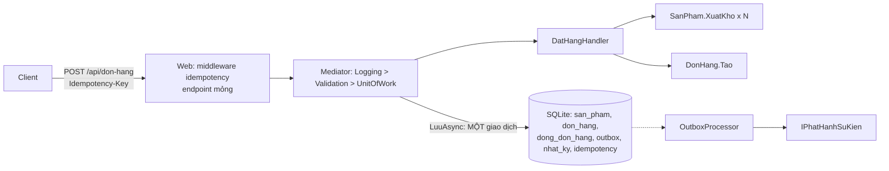

# Chương 18 — Dự án tổng hợp Tập 3: Hệ thống đặt hàng

## Mục tiêu học

Chương này gom mọi thứ của Tập 3 vào **một hệ thống**: mở rộng `kho-clean` bằng mô-đun **Đơn hàng** (đặt hàng nhiều dòng, huỷ đơn), rồi rà soát nó qua từng chương: kiến trúc, miền, CQRS, Result, outbox, idempotency, audit, kiểm thử, quan sát, đóng gói và triển khai.

Code: [`code/kho-clean/`](../../code/kho-clean/) — thư mục `Kho.Domain/DonHangs`, `Kho.Application/DonHangs`, `Kho.Web/Endpoints/DonHangEndpoints.cs`, `Kho.Tests/DonHangTests.cs`.

> **Trạng thái kiểm chứng (đọc kỹ):** mã Đơn hàng **biên dịch được**, migration đã sinh, và các test **domain** của nó chạy được. Nhưng các test **tích hợp** (đặt hàng, huỷ đơn, đặt đồng thời, idempotency, outbox) **chưa chạy được ở máy tác giả**: Windows chặn nạp `Kho.Infrastructure.dll` bằng chính sách Application Control (lỗi `0x800711C7`), dù trước đó 45 test cũ đều đạt trên cùng thiết lập. Vì vậy các khẳng định về hành vi end-to-end dưới đây là **thiết kế và kỳ vọng của test**, chưa phải kết quả đã quan sát. Hãy chạy `dotnet test` ở máy bạn; nếu có test đỏ, coi đó là một phần của bài tập gỡ lỗi.

## Yêu cầu

1. Đặt hàng gồm **nhiều dòng** (mã sản phẩm + số lượng). Mỗi dòng trừ kho.
2. **Tất cả hoặc không gì cả**: một dòng thiếu hàng thì không dòng nào bị trừ.
3. Đơn lưu **bản chụp đơn giá** lúc đặt (giá đổi sau này không đổi đơn cũ).
4. **Huỷ đơn** trả lại tồn, và không huỷ được hai lần.
5. Nhiều người đặt cùng lúc món cuối cùng: **tồn không bao giờ âm**.
6. Gửi lại request (mạng rớt) với `Idempotency-Key` **không tạo đơn thứ hai**.
7. Sự kiện `DonHangDaDat`/`DonHangDaHuy` đi qua **outbox** để hệ thống khác (thanh toán, thông báo) tiêu thụ.

## Thiết kế



**Hai aggregate, một use case.** `SanPham` và `DonHang` là hai aggregate riêng (Chương 3): `DonHang` chỉ giữ **mã** sản phẩm và bản chụp giá, không giữ đối tượng `SanPham`. Use case đặt hàng (tầng Application) **điều phối** cả hai trong **một giao dịch** — chấp nhận được khi cùng một CSDL. Nếu sau này Kho và Đơn hàng thành hai dịch vụ, chỗ này biến thành **saga** (Chương 17): giữ tồn → tạo đơn → bù trừ khi lỗi.

### Miền: `DonHang`

```csharp
public static Result<DonHang> Tao(string ma, string? khachHang, IEnumerable<DongDon> dong, DateTimeOffset bayGio)
{
    // kiểm tra: có khách, 1..50 dòng, không trùng sản phẩm, số lượng > 0  → Result.Fail(Loi.DuLieuKhongHopLe(...))
    var don = new DonHang { Ma = ma, KhachHang = khachHang.Trim(), TrangThai = TrangThaiDon.DaDat, DatLuc = bayGio };
    don._dong.AddRange(ds);
    don.TongTien = ds.Aggregate(Tien.Khong, (tong, d) => tong + d.ThanhTien);
    don.PhatSuKien(new DonHangDaDat(ma, don.KhachHang, don.TongTien.SoTien, ds.Count, bayGio));
    return don;
}

public Result Huy(string? lyDo, DateTimeOffset bayGio)
{
    if (TrangThai == TrangThaiDon.DaHuy) return Result.Fail(Loi.NghiepVu("DonHang.DaHuy", ...));   // quy tắc ở ĐÚNG chỗ
    TrangThai = TrangThaiDon.DaHuy;
    PhatSuKien(new DonHangDaHuy(Ma, ..., bayGio));
    return Result.Ok();
}
```

Bất biến do chính aggregate giữ; trạng thái đổi qua phương thức nghiệp vụ; `DongDon` là thực thể con (owned) sống và chết cùng đơn.

### Ứng dụng: đặt hàng tất-cả-hoặc-không

```csharp
foreach (var d in cmd.Dong)
{
    var sp = await sanPhams.LayTheoMaAsync(d.MaSanPham, ct);
    if (sp is null) return Result<string>.Fail(Loi.KhongTimThay(...));
    var xuat = sp.XuatKho(d.SoLuong, bayGio);
    if (!xuat.ThanhCong) return Result<string>.Fail(xuat.Loi!);        // trả lỗi NGAY
    dong.Add(new DongDon(sp.Ma.GiaTri, d.SoLuong, sp.DonGia));          // bản chụp giá
}
var don = DonHang.Tao(ma, cmd.KhachHang, dong, bayGio);
donHangs.Them(don.GiaTri);
return ma;
```

Tính nguyên tử đến từ **hai thứ phối hợp** (Chương 6 và 7): handler trả `Result` thất bại → `UnitOfWorkBehavior` **không gọi `LuuAsync`** nên các thay đổi trong bộ nhớ bị bỏ; còn khi thành công, mọi thay đổi (tồn nhiều sản phẩm, đơn, dòng đơn, outbox, audit) được ghi trong **một giao dịch**. Cạnh tranh đồng thời do **concurrency token** `TonKho` xử lý: người thua nhận `DbUpdateConcurrencyException` → `ConcurrencyException` → `409` (Chương 8).

Huỷ đơn: đổi trạng thái rồi `NhapKho` lại từng dòng, cùng giao dịch — một **hành động bù trừ** nội bộ.

### Hạ tầng: ánh xạ

`DonHang` ↔ bảng `don_hang`, `DongDon` ↔ `dong_don_hang` qua `OwnsMany` (khoá ngoài + cascade); `Tien` chuyển `double` cho SQLite (đã gặp ở Chương 4); trạng thái lưu chuỗi; `Ma` có chỉ mục duy nhất. `KhoDbContext.LuuAsync` vẫn **là chỗ duy nhất** gom sự kiện miền vào outbox — mô-đun mới không cần viết thêm dòng nào cho outbox, vì nó dựa trên `Entity<int>` chung. Đó là lợi ích của việc thiết kế tổng quát ở Chương 8.

### Web

```http
POST /api/don-hang
Idempotency-Key: dat-hang-7d2c
X-Nguoi: an
{ "khachHang": "An", "dong": [ { "maSanPham": "LT001", "soLuong": 2 }, { "maSanPham": "CH002", "soLuong": 4 } ] }
→ 201 { "ma": "DH-3F9A0C51B2E7" }
```

Endpoint mỏng: dựng lệnh, gửi qua mediator, dịch `Result` → HTTP (400/404/409/422) bằng `ToHttp()` có sẵn. Middleware idempotency (Chương 13) bảo vệ nó **mà không sửa một dòng nghiệp vụ**.

## Bản đồ: mỗi chương của Tập 3 hiện diện ở đâu

| Chương | Trong hệ thống |
|--------|----------------|
| 1–2 Phân lớp, Clean Architecture | 4 dự án, quy tắc phụ thuộc, architecture test |
| 3 Domain modeling | `SanPham`, `DonHang`, value object `Tien`/`MaSanPham`, sự kiện miền |
| 4 Repository/Specification | `ISanPhamRepository`, `IDonHangRepository`, read model `SanPhamDoc` |
| 5–6 CQRS, Pipeline | `DatHangCommand`, `LayDonHangQuery`, Logging>Validation>UnitOfWork |
| 7 Result/Validation | `Result<string>`, FluentValidation cho lệnh đặt hàng, `ToHttp()` |
| 8 Sự kiện & Outbox | `DonHangDaDat` → bảng `outbox` → `OutboxProcessor` |
| 9 Kiểm thử | domain test, integration test với SQLite tệp tạm |
| 10–11 Cache, quan sát | (mở rộng) cache đọc đơn/sản phẩm; span cho `DatHang` |
| 12 OIDC | thay `X-Nguoi` bằng claim `sub` của JWT |
| 13 Idempotency/Audit | `Idempotency-Key`, `nhat_ky_kiem_toan` |
| 14–16 Docker, CI/CD, cloud | `Dockerfile`, `docker-compose.yml`, `.github/workflows/kho-clean.yml` |
| 17 Microservices | ranh giới Kho/Đơn hàng sẵn sàng tách khi cần |

## Các test được thiết kế (cần chạy ở máy bạn)

| Test | Ý định |
|------|--------|
| `Tao_TinhTongTien_VaPhatSuKienDonHangDaDat` (domain) | tổng tiền và sự kiện đúng |
| `Tao_KhongDong_HoacTrungSanPham_...` (domain) | các bất biến |
| `Huy_HaiLan_LanHaiLoiNghiepVu` (domain) | không huỷ hai lần |
| `DatHang_TruKhoTatCaCacDong_...` | trừ kho mọi dòng, đọc lại đơn |
| `DatHang_MotDongThieuHang_422_VaKhongDongNaoBiTru` | tính nguyên tử |
| `HuyDon_TraLaiTon_VaKhongHuyDuocLanHai` | bù trừ tồn |
| `DatHangDongThoi_ChiDatDuocDungSoLuongCon...` | 12 request tranh 5 món → đúng 5 thành công, tồn 0 |
| `DatHang_CoIdempotencyKey_...VaSuKienDiQuaOutbox` | một đơn, một sự kiện phát hành |

## Bài tập (phần chính của chương)

1. **Chạy và sửa.** Chạy `dotnet test` ở máy bạn. Test nào đỏ? Đọc lỗi, tìm nguyên nhân (gợi ý các điểm nhạy cảm: ánh xạ `OwnsMany` với field `_dong`, chuyển `decimal` sang `double`, thứ tự ràng buộc khoá ngoài) và sửa. Ghi lại nguyên nhân.
2. **Nhập thanh toán.** Thêm trạng thái `DaThanhToan` và lệnh `ThanhToanDonHang` (quy tắc: chỉ đơn `DaDat` mới thanh toán; không huỷ được đơn đã thanh toán, hoặc huỷ kèm hoàn tiền). Viết domain test trước.
3. **Đọc hiệu quả.** Thêm read model `DonHangDoc` + truy vấn phân trang danh sách đơn của một khách (không nạp aggregate), kèm test.
4. **Quan sát.** Thêm `ActivitySource`/`Meter` như Chương 11: đếm `don_hang_dat` theo kết quả, span `DatHang` với tag số dòng.
5. **Bảo mật.** Áp Chương 12: yêu cầu JWT; đơn thuộc `sub` của người đặt; chỉ chủ đơn hoặc `quan-tri` mới huỷ/xem.
6. **Tách dịch vụ (thiết kế).** Vẽ saga khi Đơn hàng tách khỏi Kho: sự kiện, lệnh, bù trừ, và ba điều bạn phải đổi trong code hiện tại.
7. **Triển khai.** Build image, chạy compose, đưa lên một dịch vụ container, và bật pipeline CI của Chương 15.

## Lỗi thường gặp

- Để handler `SaveChanges` riêng → mất tính nguyên tử và bỏ qua behavior.
- Giữ tham chiếu đối tượng giữa hai aggregate, kéo theo nạp/khoá lan rộng.
- Quên bản chụp giá: đổi giá sản phẩm làm đổi lịch sử đơn.
- Tin vào chuỗi các thử nghiệm "chắc là đúng" khi chưa chạy — như chương này đã nói thẳng, kết quả chưa quan sát không được gọi là đã kiểm chứng.
