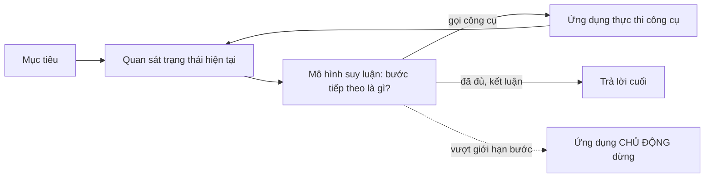

# Chương 8 — Agent: vòng lặp suy luận và hành động

## Mục tiêu học

Sau chương này, bạn sẽ:

- Hiểu **agent** là gì trong ngữ cảnh LLM: không phải một API mới, mà là **cách dùng** tool calling (Chương 5) lặp nhiều bước để đạt một mục tiêu.
- Tự viết một **vòng lặp agent** tối thiểu: quan sát → suy luận → hành động → lặp, với **giới hạn bước bắt buộc**.
- Phân biệt hành động **chỉ đọc/đề xuất** (agent tự làm) với hành động **có tác dụng phụ thật** (cần người duyệt).
- Biết khi nào agent là công cụ đúng, và khi nào một **quy trình tất định** vẫn tốt hơn.

Code: [`code/ch08-agent/`](../../code/ch08-agent/) — mô hình giả mô phỏng một chuỗi quyết định hợp lý; agent tự viết bằng vòng lặp thường (không dùng framework).

> **Trung thực về kiểm chứng:** mô hình giả trong ví dụ **được lập trình sẵn** để đưa ra đúng chuỗi hành động hợp lý (tìm → tra từng mã → đề xuất nhập). Nó chứng minh **cơ chế vòng lặp, giới hạn bước, và ranh giới đề xuất/hành động thật** hoạt động đúng. Nó **không** chứng minh một LLM thật sẽ luôn suy luận đúng chuỗi bước cho một nhiệm vụ mở — đó là năng lực suy luận nhiều bước của mô hình, khác nhau rất nhiều giữa các mô hình, và phải được đo bằng đánh giá thật (Chương 9). Đây cũng là lý do sách không dùng framework agent (Semantic Kernel, Microsoft Agent Framework) làm ví dụ chính: bạn cần hiểu vòng lặp trần trụi trước khi tin tưởng một framework che nó đi.

## Agent là gì (và không phải là gì)

Ở Chương 5, mỗi lượt gọi mô hình có thể **yêu cầu một hoặc vài công cụ**, ứng dụng chạy, gửi kết quả lại, xong. Đó là "single-turn tool use". **Agent** khác ở chỗ: mô hình được cho quyền **lặp lại nhiều lượt**, tự quyết định **bước tiếp theo dựa trên kết quả bước trước**, cho tới khi (theo đánh giá của chính nó) đạt được mục tiêu — hoặc cho tới khi **ứng dụng chặn nó lại**.



**Agent không phải là một API hay framework cụ thể** — nó là một **mẫu hình sử dụng** LLM + tool calling + vòng lặp. Framework (Semantic Kernel, Microsoft Agent Framework, LangGraph...) cung cấp sẵn cấu trúc cho mẫu hình này (quản lý trạng thái, nhiều agent phối hợp, bộ nhớ dài hạn) — hữu ích khi hệ thống phức tạp, nhưng **vòng lặp cốt lõi rất đơn giản** và đáng để tự viết một lần cho hiểu, như chương này làm.

## Vòng lặp agent tối thiểu

```csharp
public async Task<KetQuaAgent> ChayAsync(string nhiemVu, CancellationToken ct = default)
{
    var lichSu = new List<ChatMessage> { new(ChatRole.System, HeThong), new(ChatRole.User, nhiemVu) };
    var opt = new ChatOptions { Tools = congCu, Temperature = 0 };

    for (int i = 1; i <= toiDaBuoc; i++)                                   // GIỚI HẠN BƯỚC — không phải tuỳ chọn
    {
        var res = await client.GetResponseAsync(lichSu, opt, ct);
        lichSu.AddRange(res.Messages);

        var goiTool = res.Messages.SelectMany(m => m.Contents).OfType<FunctionCallContent>().ToList();
        if (goiTool.Count == 0)                                            // không còn yêu cầu công cụ nào -> coi là "xong"
            return new(res.Text, i, "hoan thanh", buoc);
    }
    return new("(dừng do vượt giới hạn)", toiDaBuoc, "vuot gioi han buoc toi da", buoc);
}
```

(`UseFunctionInvocation` từ Chương 5 tự chạy công cụ **trong một lượt gọi**; ở đây agent tự quản **nhiều lượt gọi**, mỗi lượt có thể chứa một hoặc nhiều lần gọi công cụ do middleware xử lý.) Điều mô hình "quyết định" chỉ là: gọi tiếp công cụ, hay dừng và trả lời bằng văn bản. Ứng dụng đọc tín hiệu đó (`goiTool.Count == 0`) để biết khi nào kết luận.

## Chạy thử: nhiệm vụ nhiều bước

Nhiệm vụ: *"Kiểm tra tồn kho nhóm 'điện tử' và đề xuất nhập thêm cho sản phẩm nào sắp hết (tồn ≤ 5)."* — không thể trả lời bằng một lần gọi công cụ, vì **số lượng sản phẩm cần tra chưa biết trước** (phải tìm danh sách trước, rồi tra từng mã).

```
--- Vet (trace) tung buoc suy luan - hanh dong ---
  [CongCu] goi tim_san_pham(nhom=dien tu)
  [CongCu] goi tra_ton_kho(ma=LT001)
  [CongCu] goi tra_ton_kho(ma=DT002)
  [CongCu] goi tra_ton_kho(ma=TV003)
  [CongCu] goi de_xuat_nhap_hang(ma=LT001, soLuongDeXuat=20)
  [CongCu] goi de_xuat_nhap_hang(ma=TV003, soLuongDeXuat=20)
  [SuyNghi] khong con hanh dong nao can lam, ket luan

--- Ket qua cuoi (2 buoc, dung vi: hoan thanh) ---
Da kiem tra 3 san pham nhom dien tu. Da de xuat nhap hang cho: LT001 (ton 3); TV003 (ton 2).
```

Agent tự: tìm 3 mã trong nhóm, tra tồn **từng mã một**, nhận ra 2 mã dưới ngưỡng, gọi công cụ đề xuất cho đúng 2 mã đó, rồi **tự dừng** khi không còn gì cần làm — tất cả trong 2 lượt gọi mô hình (nhiều lệnh gọi công cụ có thể dồn vào ít lượt nhờ `UseFunctionInvocation`). **Vết (trace) đầy đủ từng bước** là thứ bạn cần lưu lại trong production — nó là bằng chứng để gỡ lỗi và kiểm toán khi agent làm sai.

## Giới hạn bước là bắt buộc, không phải tuỳ chọn

```
=== Kich ban 2: nhiem vu khong bao gio 'xong' ===
Dung sau 4 buoc vi: vuot gioi han buoc toi da
```

Với một mô hình cố tình (trong ví dụ) hoặc lỡ hiểu sai nhiệm vụ và **cứ gọi mãi một công cụ**, vòng lặp sẽ **không bao giờ tự dừng** nếu không có giới hạn phía ứng dụng. Đây không phải tình huống hiếm: mô hình thật cũng có thể "kẹt" khi công cụ trả kết quả không như mong đợi, khi nhiệm vụ mơ hồ, hoặc khi có lỗi logic. Không giống một bug thông thường (chạy vô hạn nhưng miễn phí CPU), **mỗi vòng lặp agent tốn tiền thật** (một lượt gọi LLM). Do đó:

- **Luôn đặt trần số bước** phù hợp độ phức tạp nhiệm vụ (không phải một hằng số vạn năng).
- **Luôn đặt trần thời gian chạy tổng** (timeout) độc lập với số bước.
- **Luôn đặt trần chi phí/token tổng** cho một lần chạy agent.
- Khi chạm giới hạn, **trả về trạng thái dở dang một cách rõ ràng** (như ví dụ: liệt kê những gì đã làm được), không phải lỗi mù mờ.
- Cân nhắc phát hiện **lặp y hệt** (cùng công cụ, cùng tham số nhiều lần liên tiếp) để dừng sớm hơn giới hạn cứng.

## Ranh giới đề xuất và hành động thật

Công cụ `de_xuat_nhap_hang` trong ví dụ **không ghi gì vào hệ thống thật** — nó chỉ tạo một bản ghi `{"trangThai":"cho_duyet"}`. Đây là **thiết kế an toàn cố ý**, nối tiếp nguyên tắc phân loại rủi ro công cụ ở Chương 5:

| Cấp độ tự chủ | Agent được phép | Ví dụ trong hệ thống kho |
|---------------|------------------|--------------------------|
| **Chỉ đọc** | tự làm, không giới hạn thêm | tra tồn, tìm sản phẩm, tổng hợp báo cáo |
| **Đề xuất** | tự tạo đề xuất, **không tự thực thi** | "đề xuất nhập hàng", "đề xuất huỷ đơn nghi ngờ gian lận" |
| **Thực thi có xác nhận** | thực thi sau khi **người cụ thể** duyệt từng đề xuất | nhập kho thật, gửi email cho nhà cung cấp |
| **Tự chủ hoàn toàn** | agent tự thực thi không cần duyệt | chỉ với hành động **rẻ, đảo ngược được, đã kiểm chứng độ tin cậy qua thời gian** |

Bắt đầu ở cấp thấp và **tăng dần cùng bằng chứng**: chạy agent ở chế độ "chỉ đề xuất" trong sản xuất một thời gian, đo tỉ lệ đề xuất đúng (Chương 9), rồi mới cân nhắc tự động hoá thêm cho các hành động rủi ro thấp cụ thể. Không có agent nào nên được cấp quyền "tự chủ hoàn toàn" cho hành động tài chính/không đảo ngược chỉ vì demo chạy tốt vài lần.

## Khi nào dùng agent — và khi nào không

Agent (nhiều bước, mô hình tự quyết định trình tự) phù hợp khi:

- Trình tự thao tác **không biết trước** (phụ thuộc dữ liệu thực tế, như ví dụ trên).
- Số bước/tham số **thay đổi theo từng trường hợp**.
- Chấp nhận được đôi khi cần **nhiều lượt gọi mô hình hơn** (chi phí, độ trễ) để đổi lấy tính linh hoạt.

**Đừng dùng agent** khi trình tự đã biết trước và cố định — đó là lúc **quy trình tất định** (mã thường, hoặc pipeline/mediator của Tập 3) làm tốt hơn: nhanh hơn, rẻ hơn, kiểm thử được 100%, không có rủi ro "mô hình chọn sai bước". Câu hỏi kiểm tra: *"Nếu tôi biết trước chính xác các bước, tại sao lại để mô hình quyết định chúng?"* Nếu không trả lời được, quay lại mã tất định.

## Quan sát và kiểm soát agent trong sản xuất

- Ghi lại **toàn bộ vết** (mọi lượt gọi mô hình, mọi công cụ, mọi tham số, mọi kết quả) — không chỉ câu trả lời cuối. Đây là dữ liệu để gỡ lỗi *và* để đánh giá (Chương 9).
- Mỗi lượt/công cụ là một **span** (Tập 3, Chương 11); toàn bộ phiên chạy agent là một trace.
- Đặt **ngân sách theo phiên** (số bước, token, tiền) và **cảnh báo** khi agent chạm giới hạn thường xuyên (dấu hiệu prompt/mô hình có vấn đề).
- Cho phép **con người can thiệp giữa chừng** (tạm dừng, huỷ) với agent chạy dài.

## Lỗi thường gặp

- Không đặt giới hạn bước/thời gian/chi phí → agent kẹt chạy tới khi hết ngân sách API hoặc mãi mãi.
- Cho agent hành động ghi có tác dụng phụ **thật** ngay từ đầu, không qua giai đoạn "chỉ đề xuất".
- Không log vết từng bước → không thể điều tra khi agent làm sai.
- Dùng agent cho quy trình vốn đã tất định — tốn kém và kém tin cậy hơn mã thường.
- Đo "agent chạy xong không lỗi" mà không đo **agent có làm đúng việc không** (Chương 9).
- Quên rằng công cụ vẫn phải tự kiểm chứng đầu vào (Chương 5) — agent không miễn trừ nguyên tắc đó.

## Bài tập

1. Thêm phát hiện **lặp y hệt**: nếu agent gọi cùng công cụ với cùng tham số 2 lần liên tiếp, dừng sớm và báo "agent bị kẹt" thay vì chờ hết giới hạn bước.
2. Thêm ngân sách **token** cho một phiên agent (cộng dồn `Usage` mỗi lượt như Chương 3) và dừng khi vượt trần, độc lập với số bước.
3. Thiết kế bước "xác nhận": sửa `AgentKho` để khi gặp `de_xuat_nhap_hang`, dừng vòng lặp, trả danh sách đề xuất cho người dùng, và chỉ tiếp tục (gọi công cụ thực thi thật) sau khi nhận được danh sách đã duyệt.
4. Viết một nhiệm vụ mới ("tìm sản phẩm nhóm X, so sánh với nhóm Y, đề xuất sản phẩm nên ngừng bán nếu tồn > 3 lần mức cảnh báo") và một mô hình giả tương ứng; xác nhận agent tự suy ra đúng trình tự bước.
5. So sánh bằng lời: với nhiệm vụ "xuất kho 5 sản phẩm theo danh sách cho trước", giải thích vì sao dùng agent ở đây là lựa chọn tệ hơn gọi thẳng usecase `DatHangCommand` (Tập 3, Chương 18) trong vòng lặp `foreach` thông thường.
